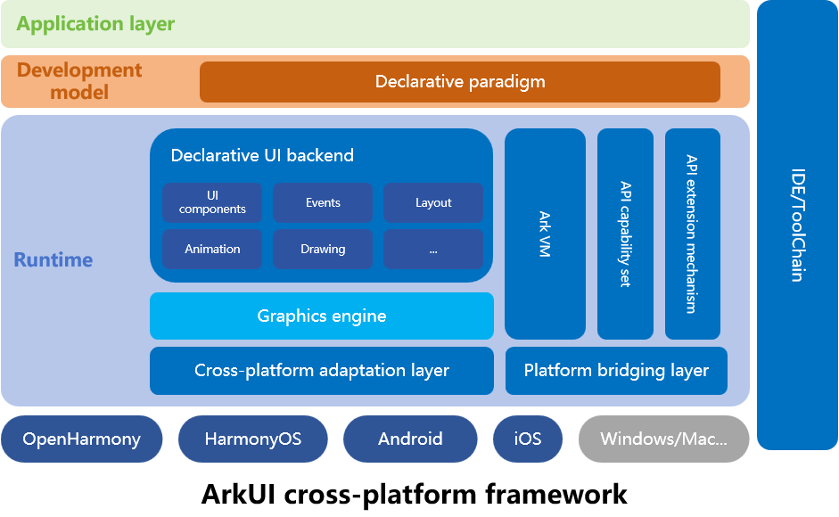

# ArkUI-X Overview

## Introduction

ArkUI is a declarative UI development framework for building distributed applications. It provides simple and natural UI syntax, diverse UI components, multi-dimensional status management, and real-time UI preview capabilities, helping you improve application development efficiency and achieve vivid and smooth user experience across devices. For details, see [ArkUI Overview](https://gitcode.com/openharmony/docs/blob/master/en/application-dev/ui/arkui-overview.md).

ArkUI-X further extends the ArkUI framework to multiple OS platforms. Currently, it supports OpenHarmony, HarmonyOS, Android, and iOS. More OS platforms will be supported in the future. With ArkUI-X, you can use a set of main code to develop high-performance applications supporting multiple platforms.

## Key Features

The ArkUI-X framework has the following key features:

- Concise and natural declarative syntax.
- Efficient rendering pipeline and platform-consistent rendering mechanism.
- Efficient ArkCompiler and Runtime.
- Unified cross-platform API capability set and extension mechanism.

## Technical Architecture

The figure below shows the overall architecture of the ArkUI-X framework. For details about the design, see [ArkUI Cross-Platform Design](./framework-dev/design/design-overview.md).

## Evolution Roadmap

[2023 Roadmap](roadmap/ArkUI-X-roadmap-2023.md)

## Getting Started

* [Getting Started for Application Development](application-dev/quick-start/start-overview.md)

* [Getting Started for Framework Development](framework-dev/quick-start/start-overview.md)

## Code Repository Address

ArkUI-X project: https://gitcode.com/arkui-x

## ArkUI-X Documentation

[Chinese version](../zh-cn/README.md)

[English version](README.md)

## Source Code

For details about how to obtain the source code of ArkUI-X, see [ArkUI-X Source Code](https://gitcode.com/arkui-x/manifest/blob/master/README-EN.md).

## Hands-On Tutorials

[Samples](https://gitcode.com/arkui-x/samples)

## How to Participate

For details about how to join the ArkUI-X community, see [ArkUI-X Community](https://gitcode.com/arkui-x/community).

For details about how to contribute, see [Contribution Guide](contribute/README.md).

## License Agreement

ArkUI-X complies with Apache License Version 2.0. For details, see the LICENSE in each repository.

Third-party open-source software referenced by ArkUI-X complies with their respective original license.

## Contact Information

For details, see [Communication in Community](contribute/communication-in-community.md).
