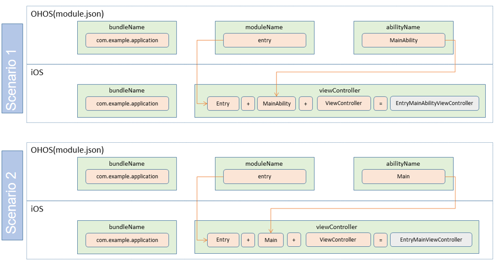

# Developing an Android Application in Stage Model

## Overview

This topic describes the classes required for extending the ArkUI framework to the Android platform and their usages. This way, you can reuse most code (such as lifecycle code) of an OpenHarmony application and deploy the code on the Android platform.

## Android Studio Configuration

The value of **packageName** of the project created on Android Studio must be the same as that of **bundleName** of the OpenHarmony project.

Android Studio is the tool for developing Android applications.

## Key Classes Used for ArkUI-X and Android Integration

### StageApplication of the Android Logic Part

The application part must inherit **StageApplication** provided by the **arkui_android_adapter.jar** package. **StageApplication** is used to initialize resource paths and load the configuration. The code snippet is as follows:

```
package com.example.myapplication;
import ohos.stage.ability.adapter.StageApplication;

public class HiStageApplication extends StageApplication {

}
```

### StageActivity of the Android Logic Part

The activity part must inherit **StageActivity** provided by the **arkui_android_adapter.jar** package. **StageActivity** is used to map the lifecycle of an activity in Android to that of an ability in OpenHarmony. The code snippet is as follows:

```
package com.example.myapplication;
import ohos.stage.ability.adapter.StageActivity;

public class EntryMainAbilityActivity extends StageActivity {
    @Override
    protected void onCreate(Bundle savedInstanceState) {
        super.setInstanceName("com.example.myapplication:entry:MainAbility:");
        super.onCreate(savedInstanceState);
    }
}
```

To associate an activity with an ability, override the **onCreate** event in **StageActivity** and set **instanceName** in the following format before **super.onCreate(savedInstanceState)** is invoked:

```
bundleName:moduleName:abilityName:
```

The value of **bundleName** is obtained from the **app.json5** file of the OpenHarmony application, and the values of **moduleName** and **abilityName** are obtained from the **module.json5** file.

## Mappings Between Abilities and Activities

**packageName** of an activity in the Android application must be the same as **bundleName** of an ability in the OpenHarmony application.

The format of **activityName** in the Android application is as follows: moduleName of the ability + abilityName of the ability + "Activity".

A configuration example is as follows.
  