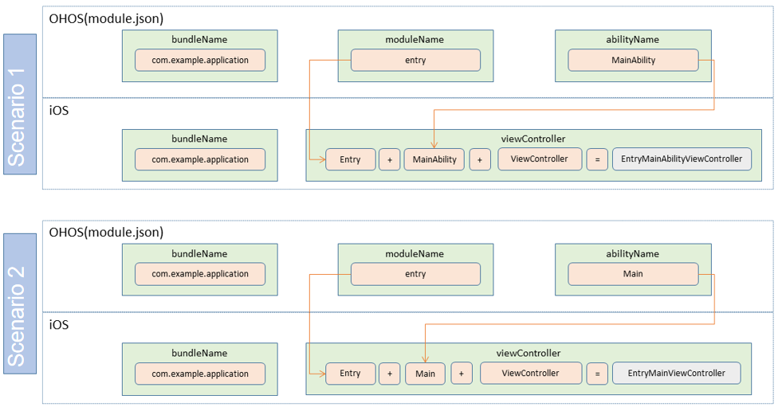

# Developing an iOS Application in Stage Model

## Overview

This topic describes the classes required for extending the ArkUI framework to the iOS platform and their usages. This way, you can reuse most code (such as lifecycle code) of an OpenHarmony application and deploy the code on the iOS platform.

## Key Classes Used for ArkUI-X and iOS Integration

### StageViewController

**StageViewController** is the base class of the iOS view controller of the stage model. To implement cross-platform basic capabilities and trigger ability lifecycle events, all iOS application-level view controllers must inherit from **StageViewController**.

#### Common Attributes

* **instanceName**: unique ID of the StageViewController. **instanceName** must be set to a value in the format of **bundleName:moduleName:abilityName**, where the value **bundleName** is obtained from the **app.json5** file of the OpenHarmony application, and the values of **moduleName** and **abilityName** are obtained from the **module.json5** file.

  ```objc
  @property (nonatomic, readonly) NSString *instanceName;
  ```

* **params**: external attribute of the StageViewController, which maps to the **want** parameter passed in **startAbility**.

  ```objc
  @property (nonatomic, strong) NSString *params;
  ```

#### Initialization Method

```objc
- (instancetype)initWithInstanceName:(NSString *_Nonnull)instanceName;
```

### StageApplication

**StageApplication** is essentially a scheduling class. It is used to trigger internal classes to implement path parsing and configuration, register application-related configuration, and trigger ability lifecycle events.

#### Public Methods

* Configure the local HAP file path.

  ```objc
  + (void)configModuleWithBundleDirectory:(NSString *_Nonnull)bundleDirectory;
  ```

* Trigger the calling of **StartAbility** and configure the process ID, localization information, and configuration.

  ```objc
  + (void)launchApplication;
  ```

* Trigger the ability to switch to the foreground.

  ```objc
  + (void)callCurrentAbilityOnForeground;
  ```

* Trigger the ability to switch to the background.

  ```objc
  + (void)callCurrentAbilityOnBackground;
  ```

* Process a singleton or multiton ability.

  ```objc
  + (BOOL)handleSingleton:(NSString *)bundleName moduleName:(NSString *)moduleName abilityName:(NSString *)abilityName;
  ```

* Release all view controllers in the navigation view stack and trigger the **OnDestory** event.

  ```objc
  + (void)releaseViewControllers;
  ```

* Obtain the top view controller of the navigation view stack.

  ```objc
  + (StageViewController *)getApplicationTopViewController;
  ```

## Key Implementation Reference in AppDelegate

### Starting and Initializing the ArkUI Application
```objc
- (BOOL)application:(UIApplication *)application didFinishLaunchingWithOptions:(NSDictionary *)launchOptions {

    // Configure the HAP file path.
    [StageApplication configModuleWithBundleDirectory:@"arkui-x"];
    // Start the ability.
    [StageApplication launchApplication];
    
    // The application automatically starts. Initialize the StageViewController child class VC and set it as the root view controller of the application.
    if (!launchOptions.count) { 
        NSString *instanceName = [NSString stringWithFormat:@"%@:%@:%@",@"com.example.iosabilitystage", @"entry", @"MainAbility"];
        EntryMainViewController *mainView = [[EntryMainViewController alloc] initWithInstanceName:instanceName];
    UINavigationController *navi = [[UINavigationController alloc]initWithRootViewController:mainView];
        self.window = [[UIWindow alloc] initWithFrame:[UIScreen mainScreen].bounds];
        self.window.rootViewController = navi;
        [self.window makeKeyAndVisible];
    }
    return YES;
}
```

### Implementing Page Redirection of the ArkUI Application
You can use either of the following ways to use [startAbility](../reference/apis/js-apis-inner-application-uiAbilityContext.md#uiabilitycontextstartability) to implement page redirection on the iOS platform.

- Use openURL to implement the iOS application page redirection callback to obtain passed parameters.

```objc
- (BOOL)application:(UIApplication *)app openURL:(NSURL *)url options:(NSDictionary<NSString *,id> *)options {

    // Truncate the URL based on rules.
    NSString *bundleName = url.scheme;
    NSString *moduleName = url.host;
    NSString *abilityName, *params;

    NSURLComponents *urlComponents = [NSURLComponents componentsWithString:url.absoluteString];
    NSArray <NSURLQueryItem *> *array = urlComponents.queryItems;
    for (NSURLQueryItem * item in array) {
        if ([item.name isEqualToString:@"abilityName"]) {
            abilityName = item.value;
        } else if ([item.name isEqualToString:@"params"]) {
            params = item.value;
        }
    }
    // Process a singleton ability.
    if ([StageApplication handleSingleton:bundleName moduleName:moduleName abilityName:abilityName] == YES) {
        return YES;
    }
    [self handleOpenUrlWithBundleName:bundleName
                           moduleName:moduleName
                          abilityName:abilityName
                               params:params, nil];
    return YES;
}
```
- Use the parameters parsed from the URL to map the view controller for an ability.

```objc
- (BOOL)handleOpenUrlWithBundleName:(NSString *)bundleName
                         moduleName:(NSString *)moduleName
                        abilityName:(NSString *)abilityName
                             params:(NSString *)params, ...NS_REQUIRES_NIL_TERMINATION {
                                               
    NSString *instanceName = [NSString stringWithFormat:@"%@:%@:%@",bundleName, moduleName, abilityName];
    
    // Map the view controller based on moduleName and abilityName.
    // Note: An incorrect moduleName or abilityName will cause a failure in finding the view controller and opening the page.
    if ([moduleName isEqualToString:@"entry"] && [abilityName isEqualToString:@"MainAbility"]) {
        EntryMainAbilityViewController *entryMainVC = [[EntryMainAbilityViewController alloc] initWithInstanceName:instanceName];
        entryMainVC.params = params;
    } else if ([moduleName isEqualToString:@"entry"] && [abilityName isEqualToString:@"Other"]) {
        EntryOtherViewController *entryOtherVC = [[EntryOtherViewController alloc] initWithInstanceName:instanceName];
        entryOtherVC.params = params;
    }

    return YES;
}
```

### Processing Lifecycle Callbacks for the ArkUI Application

* Trigger a lifecycle event when the ArkUI application switches to the background.

  ```objc
  - (void)applicationDidEnterBackground:(UIApplication *)application {
      [StageApplication callCurrentAbilityOnBackground];
  }
  ```

* Trigger a lifecycle event when the ArkUI application switches to the foreground.

  ```objc
  - (void)applicationWillEnterForeground:(UIApplication *)application {
      [StageApplication callCurrentAbilityOnForeground];
  }
  ```

* Terminate the ArkUI application process.

  ```objc
  - (void)applicationWillTerminate:(UIApplication *)application {
      [StageApplication releaseViewControllers];
  }
  ```

**NOTE**: For the complete code, see the samples.

## Mappings Between Abilities and View Controllers

The value of **bundleName** in **info** of the iOS application must be the same as that of **bundleName** in the ability.

The format of **viewControllerName** in the iOS application is as follows: moduleName of the ability + abilityName of the ability + "ViewController". 

