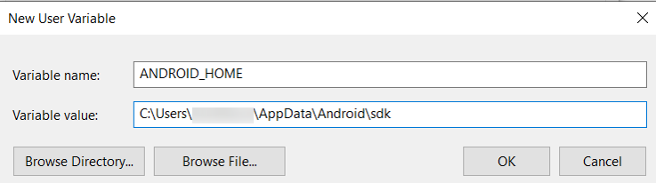

# Setting Up the Development Environment

## Constraints on ArkUI-X Development in DevEco Studio

- DevEco Studio supports development and debugging of only ArkUI-X source code. To write, run, or debug platform-specific native code, use the IDE of the corresponding platform.

- You can run and debug ArkUI-X source code on real Android and iOS devices and emulators.

- Platform version and build tool requirements:
  - OpenHarmony: API version 10 or later
  - Android: Android 8 or later, API Level 26, version code of O, codename of Oreo
  - iOS: iOS 10 or later

## Preparation

To prepare for application development, make sure your computer meets the following requirements.

  **Table 1** Environment requirements for the Windows platform

| Item| Description|
| -------- | -------- |
| OpenHarmony&nbsp;SDK | OpenHarmony SDK.|
| ArkUI-X&nbsp;SDK | ArkUI-X SDK.|
| Android&nbsp;SDK | Android SDK.|

  **Table 2** Environment requirements for the macOS platform

| Item| Description|
| -------- | -------- |
| OpenHarmony&nbsp;SDK | OpenHarmony SDK.|
| ArkUI-X&nbsp;SDK | ArkUI-X SDK.|
| Android&nbsp;SDK | Android SDK.|
| Xcode | IDE for iOS application development. For details, see the official environment setup guide.|


## Installing the OpenHarmony SDK

1. In DevEco Studio, choose **File** > **Settings** > **SDK** (**DevEco Studio** > **Preferences** > **SDK** on macOS), click **Edit** on the right of **Location**, and select a save path for the SDK.

2. On the **SDK Setup** page, confirm the save path and click **Next** until the installation is complete. Then click **Finish**.

   


## Installing the ArkUI-X SDK

1. In DevEco Studio, choose **File** > **Settings** > **ArkUI-X** (**DevEco Studio** > **Preferences** > **ArkUI-X** on macOS), click **Edit** on the right of **Location**, and select a save path for the SDK.

2. On the **SDK Setup** page, confirm the save path and click **Next** until the installation is complete. Then click **Finish**.

   


## Setting the Environment Variable of the Android SDK Installation Directory

Add the **ANDROID_HOME** variable to point to where the Android SDK is installed.

- On Windows:
  Right-click **This PC** and choose **Properties** > **Advanced system settings** > **Advanced** > **Environment Variables**. Under **System variables**, click the **New** button to add a new environment variable. Set the variable name to **ANDROID_HOME** and the variable value to the Android SDK installation directory.

  

  After the environment variable is set, restart DevEco Studio.

- On macOS:
  1. Start the terminal tool and run the following command to open the **.bash_profile** file.
     
      ```
      vi ~/.bash_profile
      ```
  2. Press **i** to enter Insert mode.
  3. Enter the following content to add the environment variable for the Android SDK installation directory:
     
      ```
      export ANDROID_HOME=/Users/xxx/Library/Android/sdk
      ```
  4. Press **Esc** to exit edit mode, enter **:wq**, and press **Enter** to save the settings.
  5. Run the following command for the environment variable to take effect.
     
      ```
      source ~/.bash_profile
      ```
  6. After the environment variable is set, restart DevEco Studio.
