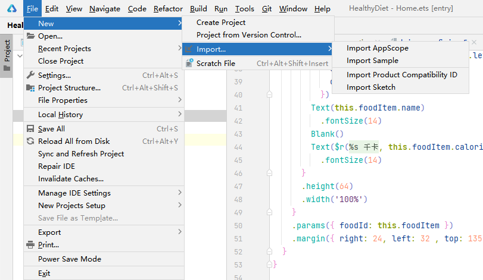

# Getting Started with ArkUI-X

## Developing a Cross-Platform Application

### Creating a Project

Import the ArkUI-X sample to DevEco Studio to quickly create a cross-platform project.

1. Choose **File > New > Import > Import Sample**.
   

   
2. Select **OpenHarmony** from the drop-down list box in the upper left corner, select **ArkUI-X/HelloWorld**, and click **Next**.

3. On the project configuration page, set **Project name** and **Project location**, click **Finish**, and wait until the sample project is imported.

### Building Your Application

DevEco Studio can generate platform-specific application packages.

On the menu bar of DevEco Studio, choose **Build &gt; Build Hap(s)/APP(s) &gt; Build APP(s)**.

The compiled ArkTS code, resources, and platform glue code are in the generated application package. Depending on the target platform, you can then install, run, and debug the application using Android Studio or Xcode. Alternatively, you can also use [ACE Tools](start-with-ace-tools.md#running-your-application).
