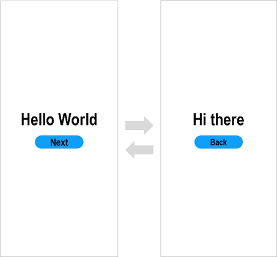

# Getting Started with ArkTS in FA Model

>  **NOTE**
>
>  This document is prepared based on the **ArkUI-X 0.1.0 Beta** version.

## Creating an ArkTS Cross-Platform Application Project

### 1. Check the development environment.

   ```shell
   ace check
   ```

Run the `ace check` command to check the local development environment. Mandatory items must pass the check. Otherwise, you are not allowed to continue the subsequent operations.

Note: The development environment check focuses on the default installation and download paths of the SDK and IDE. If the SDK is downloaded through SDK Manager, the system checks whether the default environment variables **ANDROID_HOME** and **OpenHarmony_HOME** are properly configured.

### 2. Check the device connection.

   ```shell
   ace devices
   ```

The command output contains a list of currently connected devices and device IDs. Take a record of the information as you need to specify a device ID as the input parameter of subsequent commands.

Note: This command has been integrated in `ace check` and can be skipped.

### 3. Configure the development environment path.

   ```shell
   ace config
   ```

If the IDE and SDK are not downloaded to or installed in the default paths, you can run this command to change the paths.

### 4. Create a project.

   The following describes how to create a project named **demo**:

   ```shell
   ace create project
   ? Please enter the project name: demo
   ? Please enter the packages (com.example.demo):com.example.demo
   ? Please enter the ACE version (1: ArkTS-based declarative development paradigm, 2: JS-compatible web-like development paradigm): 1
   ```

Run the `ace create project` command (**project** can be omitted). Then, enter the project name **demo** and press **Enter** to retain the default bundle name. Enter **1** to create a cross-platform application project using the ArkTS-based declarative development paradigm.

A project named **demo** is thus created.

The key structure of the project is as follows:

```shell
demo/
├── android		// Android project for the cross-platform application
│   ├── app
│   │   ├── libs
│   │   └── src
│   │       ├── androidTest
│   │       ├── main
│   │       │   ├── AndroidManifest.xml
│   │       │   ├── assets	// Resource files generated from building of the cross-platform application
│   │       │   ├── java
│   │       │   │   └── com
│   │       │   │       └── example
│   │       │   │           └── demo
│   │       │   │               ├── MainActivity.java	// Inherited from the AceActivity base class provided by ArkUI
│   │       │   │               └── MyApplication.java	// Inherited from the AceApplication base class provided by ArkUI
│   │       │   └── res
│   │       └── test
│   └── settings.gradle
├── ios		// iOS project for the cross-platform application
│   ├── etsapp
│   │   ├── AppDelegate.h
│   │   ├── AppDelegate.mm	// Instantiate AceViewController and load the ArkUI page.
│   │   ├── Info.plist
│   │   └── main.m
│   ├── etsapp.xcodeproj
│   ├── frameworks
│   └── js
│   └── res
├── ohos	// OpenHarmony project for the cross-platform application
│   ├── build-profile.json5
│   ├── entry
│   │   └── src
│   │       └── main
│   │           ├── config.json
│   │           └── resources
└── source	// Source code for the cross-platform application
    └── entry
        └── src
            ├── main
            │   ├── ets
            │   │   └── MainAbility
            │   │       ├── app.ets
            │   │       ├── manifest.json	// Project configuration 
            │   │       └── pages
            │   │           └── index
            │   │               └── index.ets
            │   └── resources
            └── ohosTest

```

## Editing Code

After the project is created, you can develop code in the **source** directory of the project.

### Creating the First Page

1. Create the first page using the template, which contains the **\<Text>** and **\<Button>** components.

   After the project synchronization is complete, go to **entry** > **src** > **main** > **ets** > **MainAbility** > **pages** > **index** in the **source** directory and open the **index.ets** template file. This file contains the **\<Text>** and **\<Button>** components, as shown below.
   
    ```ts
    // index.ets
    @Entry
    @Component
    struct Index {
        @State message:string = 'World'
        build() {
          Row() {
            Column() {
              Text('Hello ' + this.message)
                .fontSize(50)
                .fontWeight(FontWeight.Bold)
              Button() {
                Text(' Click me ')
                    .fontSize(25)
              }
              .type(ButtonType.Capsule)
              .margin({
                top: 25
              })
              .backgroundColor(Color.Yellow)
              .width('35%')
              .height(50)
              .onClick(() => {
                this.message = 'ArkUI'
              })
            }
            .width('100%')
          }
          .height('100%')
        }
    }
    ```

### Building the Second Page

1. Create the second page.

   - Create the second page file: Go to **entry** > **src** > **main** > **ets** > **MainAbility** > **pages** > **index** in the **source** directory, right-click the **pages** folder, and add a directory named **second** and an ArkTS file named **second.ets**.
   - Configure the route for the second page: Open the **manifest.json** file and add the **pages/second/second.ets** route for the second page under **js - pages**. The code snippet is as follows:
     
    ```json
    {
      "js": [
        {
          "pages": [
              "pages/index/index",
              "pages/second/second"
          ]
        }
      ]
    }
      ```

2. Add **\<Text>** and **\<Button>** components.

   Add **\<Text>** and **\<Button>** components and set their styles, by referring to the first page. The sample code in the **second.ets** file is shown below:
   
    ```ts
    // second.ets
    @Entry
    @Component
    struct Index {
        @State message:string = 'there'
        build() {
          Row() {
            Column() {
              Text('Hi ' + this.message)
                .fontSize(50)
                .fontWeight(FontWeight.Bold)
              Button() {
                Text(' Click me ')
                    .fontSize(25)
              }
              .type(ButtonType.Capsule)
              .margin({
                top: 25
              })
              .backgroundColor(Color.Yellow)
              .width('35%')
              .height(50)
              .onClick(() => {
                this.message = 'ArkUI'
              })
            }
            .width('100%')
          }
          .height('100%')
        }
    }
    ```

## Implementing Page Redirection

You can implement page redirection through **@ohos.router**, which finds the target page based on the page URL. Import the **router** module and then perform the steps below:

1. Implement redirection from the first page to the second page.

   In the **index.ets** file of the first page, bind the **onClick** event to the **Next** button so that clicking the button redirects the user to the second page. The sample code in the **index.ets** file is shown below:
   
    ```ts
    // index.ets
    // Import the router module.
    import router from '@ohos.router';

    @Entry
    @Component
    struct Index {
        @State message:string = 'World'
        build() {
          Row() {
            Column() {
              Text('Hello ' + this.message)
                .fontSize(50)
                .fontWeight(FontWeight.Bold)
              Button() {
                Text(' Click me ')
                    .fontSize(25)
                }
              .type(ButtonType.Capsule)
              .margin({
                top: 25
              })
              .backgroundColor(Color.Yellow)
              .width('35%')
              .height(50)
              // Bind the onClick event to the button so that clicking the button redirects the user to the second page.
              .onClick(() => {
                  router.push({ url: 'pages/second/second' })
              })
            }
            .width('100%')
          }
          .height('100%')
        }
    }
    ```

2. Implement redirection from the second page to the first page.

   In the **second.ets** file of the second page, bind the **onClick** event to the **Back** button so that clicking the button redirects the user back to the first page. The sample code in the **second.ets** file is shown below:
   
    ```ts
    // second.ets
    // Import the router module.
    import router from '@ohos.router';

    @Entry
    @Component
    struct Index {
        @State message:string = 'there'
        build() {
          Row() {
            Column() {
              Text('Hi ' + this.message)
                .fontSize(50)
                .fontWeight(FontWeight.Bold)
              Button() {
                Text(' Click me ')
                  .fontSize(25)
              }
              .type(ButtonType.Capsule)
              .margin({
                top: 25
              })
              .backgroundColor(Color.Yellow)
              .width('35%')
              .height(50)
              // Bind the onClick event to the button so that clicking the button redirects the user back to the first page.
              .onClick(() => {
                router.back()
              })
            }
            .width('100%')
          }
          .height('100%')
        }
    }
    ```

## Building the Project

Start building the **demo** project. This includes three parts: HAP, APK, and app.

   ```shell
   cd demo
   ```

1. Build the HAP. By default, this applies to all modules.

   ```shell
   ace build hap
   ```

   A HAP is generated and saved to **demo/ohos/entry/build/default/outputs/default/** by default.

2. Build the APK. By default, this applies to the **app** module.

   ```shell
   ace build apk
   ```

   An APK is generated and saved to **demo/android/app/build/outputs/apk/debug/** by default.

3. Build the app. By default, this applies to the **app** module.

   ```shell
   ace build app
   ```
   
   An app file is generated and saved to **demo/ios/build/outputs/app/** by default.


## Running the Application on a Real Device

The display effect is shown in the figure below.

   

Congratulations! You have finished developing your ArkTS application in the FA model. To learn more about ArkUI-X application development, see [Application Development Overview](../application-dev-guide.md).
