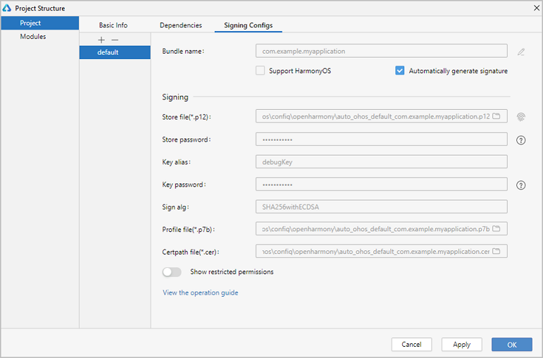

# Getting Started with ArkTS in Stage Model


>  **NOTE**
>
>  To use ArkTS, your DevEco Studio must be 4.0 Beta2 or later. The GUI and operations may vary according to the DevEco Studio version.


## Introduction

This topic will walk you through a simple, stripped-down example – building two pages and implementing redirection between them, to help you get a quick understanding of the application development process, covering resource creation and reference, route code writing, and UI layout compilation.

## Importing an Application Template
Click **Import Samples** to import the **helloworld** project.

### ArkTS Project Directory Structure (Stage Model)


- **AppScope > app.json5**: application-level configuration information.

- **entry**: OpenHarmony project module, which can be built into an ability package (HAP).
   - **build**: HAP generated through module building.
   - **src > main > ets**: a collection of ArkTS source code.

   - **src > main > ets > entryability**: entry to your application/service.

   - **src > main > ets > pages**: pages included in your application/service.

   - **src > main > resources**: a collection of resource files used by your application/service, such as graphics, multimedia, character strings, and layout files. For details about resource files, see [Resource Categories and Access](resource-categories-and-access.md#resource-categories).

   - **src > main > module.json5**: module configuration file. This file describes the global configuration information of the application/service, the device-specific configuration information, and the configuration information of the HAP file.

   - **build-profile.json5**: current module information and build configuration options, including **buildOption** and **targets**.

   - **hvigorfile.ts**: module-level build script. You can customize related tasks and code implementation in this file.

- **oh_modules**: third-party library dependency information.
- **build-profile.json5**: application-level configuration options, including **signingConfigs** and **products**.
- **hvigorfile.ts**: application-level build script.


## Writing Code

After the project is created, you can develop code in the **entry** directory of the project.

### Building the First Page

Add components on the first page and set their styles.

After the project synchronization is complete, choose **entry** > **src** > **main** > **ets** > **pages** in the **Project** window and open the **Index.ets** file. You can see that the file contains **\<Image>** and **\<Button>** components. The sample code in the **index.ets** file is shown below:


   ```ts
    // index.ets
    @Entry
    @Component
    struct Index {
      build() {
        Row() {
          Column() {
            Text()
              .fontSize(50)
              .fontWeight(FontWeight.Bold)
            // Add a button to respond to user clicks.
            Button() {
              Text()
                .fontSize(30)
                .fontWeight(FontWeight.Bold)
            }
            .type(ButtonType.Capsule)
            .margin({
              top: 20
            })
            .backgroundColor()
            .width('40%')
            .height('5%')
          }
          .width('100%')
        }
        .height('100%')
      }
    }

   ```

### Building the Second Page

1. Create the second page.

   1. Create the second page file: In the **Project** window, choose **entry** > **src** > **main** > **ets**. Right-click the **pages** folder (or any file within, as shown below) and choose **New** > **Page**.

     

   2. the displayed dialog box, name the page **Second**, and click **Finish**.

     

   Below is the structure of the **Second** folder.

     

2. Add **\<Text>** and **\<Button>** components.

   Add **\<Text>** and **\<Button>** components and set their styles, by referring to the first page. The sample code in the **second.ets** file is shown below:

   ```ts
     // second.ets
    @Entry
    @Component
    struct Second {
        build() {
          Row() {
            Column() {
              Text()
                .fontSize(50)
                .fontWeight(FontWeight.Bold)
              Button() {
                Text()
                  .fontSize(25)
                  .fontWeight(FontWeight.Bold)
              }
              .type(ButtonType.Capsule)
              .margin({
                top: 20
              })
              .backgroundColor()
              .width('40%')
              .height('5%')
            }
            .width('100%')
          }
          .height('100%')
        }
    }
   
   ```
## Referencing Resources

1. Define the text resources to be referenced.
   1. In the **Project** window, choose **entry** > **src** > **main** > **resources** > **base** > **element** > **string.json**. In the open **string.json** file, add the text resources shown in the blue frame below.

   

   2. Reference text resources: In **Text()**, use **$r('app.string.xx')** to reference the text resources.

2. Define the color resources to be referenced.
   1. In the **Project** window, choose **entry** > **src** > **main** > **resources** > **base** > **element** > **color.json**. In the open **color.json** file, add the color resources shown in the blue frame below.

   

   2. Reference color resources: In **Button(){}.backgroundColor()**, use **$r('app.color.xx')** to reference the color resources.

3. The sample code in the **index.ets** file is shown below:

   ```ts
    // index.ets
    @Entry
    @Component
    struct Index {
        build() {
          Row() {
            Column() {
              // Reference text resources.
              Text($r('app.string.homePage_Text'))
                .fontSize(50)
                .fontWeight(FontWeight.Bold)
              Button() {
                // Reference text resources.
                Text($r('app.string.homeClick_value'))
                    .fontSize(30)
                    .fontWeight(FontWeight.Bold)
              }
              .type(ButtonType.Capsule)
              .margin({
                top: 20
              })
              // Reference color resources.
              .backgroundColor($r('app.color.btn_background'))
              .width('40%')
              .height('5%')
            }
            .width('100%')
          }
          .height('100%')
        }
    }
   ```


4. The sample code in the **second.ets** file is shown below:

   ```ts
    // second.ets
    @Entry
    @Component
    struct Second {
        build() {
          Row() {
            Column() {
              // Reference text resources.
              Text($r('app.string.secondPage_Text'))
                .fontSize(50)
                .fontWeight(FontWeight.Bold)
              Button() {
                // Reference text resources.
                Text($r('app.string.secondClick_value'))
                  .fontSize(25)
                  .fontWeight(FontWeight.Bold)
              }
              .type(ButtonType.Capsule)
              .margin({
                top: 20
              })
              // Reference color resources.
              .backgroundColor($r('app.color.btn_background'))
              .width('40%')
              .height('5%')
            }
            .width('100%')
          }
          .height('100%')
        }
    }
   ```


## Implementing Page Redirection

You can implement page redirection through the [page router](../reference/apis/js-apis-router.md), which finds the target page based on the page URL. Import the **router** module and then perform the steps below:

1. Implement redirection from the first page to the second page.

   In the **index.ets** file of the first page, bind the **onClick** event to the **Next** button so that clicking the button redirects the user to the second page. The sample code in the **index.ets** file is shown below:

    ```ts
    // index.ets
    import router from '@ohos.router';
    
    @Entry
    @Component
    struct Index {
      build() {
        Row() {
          Column() {
            Text($r('app.string.homePage_Text'))
              .fontSize(50)
              .fontWeight(FontWeight.Bold)
            // Add a button to respond to user clicks.
            Button() {
              Text($r('app.string.homeClick_value'))
                .fontSize(30)
                .fontWeight(FontWeight.Bold)
            }
            .type(ButtonType.Capsule)
            .margin({
              top: 20
            })
            .backgroundColor($r('app.color.btn_background'))
            .width('40%')
            .height('5%')
            // Bind the onClick event to the Next button so that clicking the button redirects the user to the second page.
            .onClick(() => {
              router.pushUrl({ url: 'pages/Second' })
            })
          }
          .width('100%')
        }
        .height('100%')
      }
    }

    ```

2. Implement redirection from the second page to the first page.

   In the **Second.ets** file of the second page, bind the **onClick** event to the **Back** button so that clicking the button redirects the user back to the first page. The sample code in the **second.ets** file is shown below:

    ```ts
    // second.ets
    import router from '@ohos.router';

    @Entry
    @Component
    struct Second {
        build() {
          Row() {
            Column() {
              Text($r('app.string.secondPage_Text'))
                .fontSize(50)
                .fontWeight(FontWeight.Bold)
              Button() {
                Text($r('app.string.secondClick_value'))
                  .fontSize(25)
                  .fontWeight(FontWeight.Bold)
              }
              .type(ButtonType.Capsule)
              .margin({
                top: 20
              })
              .backgroundColor($r('app.color.btn_background'))
              .width('40%')
              .height('5%')
              // Bind the onClick event to the button so that clicking the button redirects the user back to the first page.
              .onClick(() => {
                router.back()
              })
            }
            .width('100%')
          }
          .height('100%')
        }
    }
   
    ```
3. As the second page was created by choosing **New** > **Page**, the routing to this page is automatically configured in the routing table. 
To check the page routing, from the **Project** window, choose **entry** > **src** > **main** > **resources** > **base** > **profile**, open the **main_pages.json** file, and locate **"pages/Second"** under **"src"**.

   ```json
      {
        "src": [
          "pages/Index",
          "pages/Second"
        ]
      }
   ```


## Running the Application on a Real Device

1. Connect the development board running the OpenHarmony standard system to the computer.

2. Choose **File** > **Project Structure...** > **Project** > **SigningConfigs**, and select **Automatically generate signature**. Wait until the automatic signing is complete, and click **OK**. See the following figure.

   
3. Complete the [build process](start-with-deveco-studio.md).
4. Check the display effect.

* On Android

| Home                                         | Page displayed after redirection                           |
|---------------------------------------------|------------------------------------------|
|  |  |

* On iOS

| Home                       | Page displayed after redirection                                |
|---------------------------|-----------------------------------------|
|  |  |

* On OpenHarmomy

| Home                                    | Page displayed after redirection                           |
|----------------------------------------|------------------------------------------|
|  | |

Congratulations! You have finished developing your ArkUI-X application with ArkTS in the stage model. To learn more about ArkUI-X application development, see [ArkUI-X Overview](../application-dev-guide.md).
