# rom size Usage

## What is rom size?

rom size is an application tool that helps you analyze the total size of application installation packages. It stores size information in JSON files and, combined with a browser, allows you to check the size information in a single JSON file or compare sizes of versions in different JSON files.

## Preparation
- rom size is built in the ACE Tools command line tool. Therefore, before using rom size, you must set up the environment where ACE Tools can run.
- For details the environment setup, see [ACE Tools Quick Start](./start-with-ace-tools.md).

## Usage

rom size works by you adding the **--analyze** parameter to the **ace build apk**/**hap**/**ios** command.

- Example 1: Open the CLI in a cross-platform project and run the **ace build apk --analyze** command. If the command is successfully executed, information similar to the following is displayed:

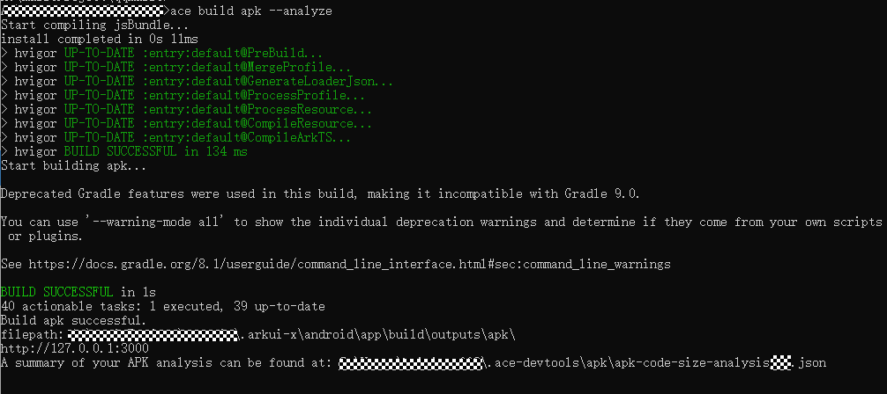

A JSON file that contains size information of the target APK is generated in the **.ace-devtools\apk** folder in the current user folder in drive C.

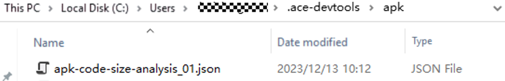

A browser window is displayed, showing the size information in the generated JSON file.

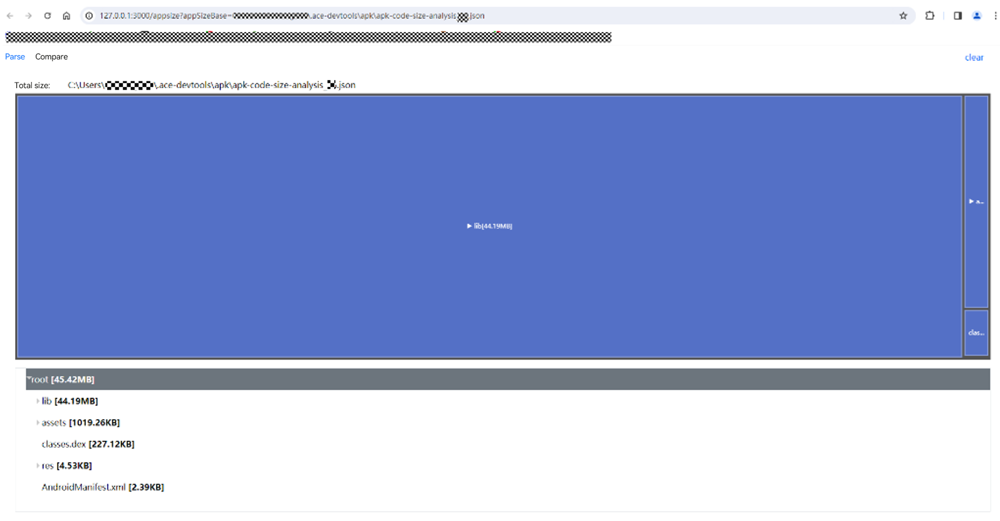

- Example 2: Open the CLI in a cross-platform project and run the **ace build hap --analyze** command. If the command is successfully executed, information similar to the following is displayed:

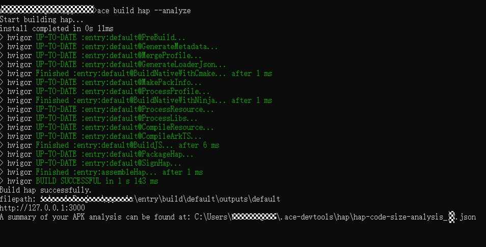

A JSON file that contains size information of the target HAP is generated in the **.ace-devtools\hap** folder in the current user folder in drive C.

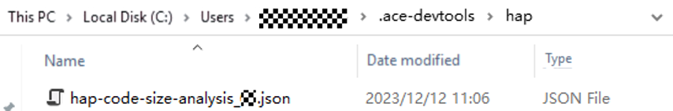

A browser window is displayed, showing the size information in the generated JSON file.

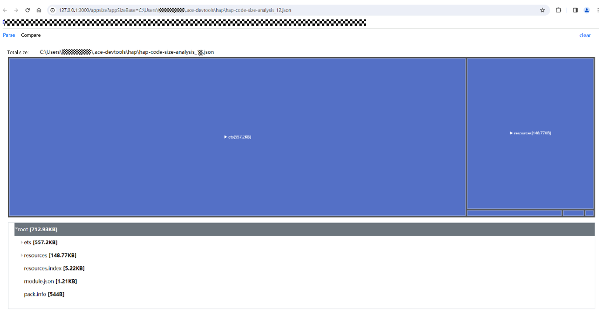

- Example 3: Open the CLI in a cross-platform project and run the **ace build ios --analyze** command. If the command is successfully executed, information similar to the following is displayed:

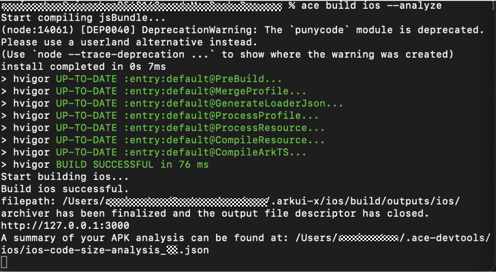

A JSON file that contains size information of the target iOS installation package is generated in the **.ace-devtools\hap** folder in the current user folder in drive C.

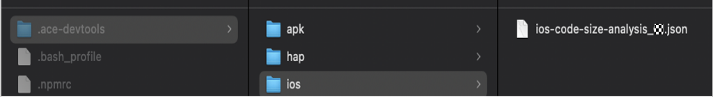

A browser window is displayed, showing the size information in the generated JSON file.

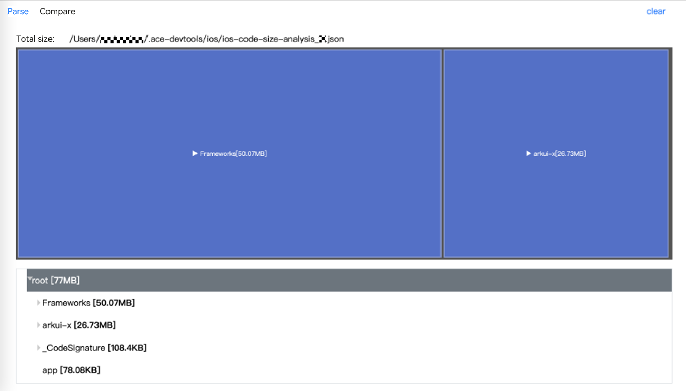

## Parse Tab in the Open Browser Window

On the **Parse** tab, you can view the size information of an installation package in a proportional area chart and directory structure diagram.

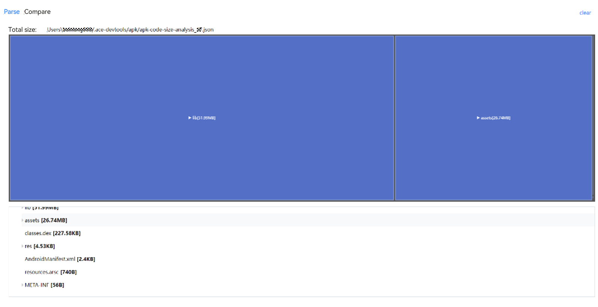

The preceding figure shows the JSON file of an APK as an example. As shown, this file covers the following modules:
   - 1. **lib**: contains .so library dependencies required for running the application.
   - 2. **assets**: contains resource files, such as images, videos, and audios, used by the application.
   - 3. **res**: contains compiled resource files.
   - 4. **META-INF**: contains the signature files of the application.
   - 5. **AndroidManifest.xml**: declares the bundle name, application name, permissions, four types of application components, and version.
In the proportional area chart, the size of each file or folder is represented by a rectangle, whose area is proportional to the size of the file it represents. Inside a rectangle there may be smaller rectangles indicating the subfiles and folders in the current file or folder.
To view the size details of files in a folder, click the rectangle representing the folder. A new chart is then displayed, with the clicked rectangle as the root node.

For example, below you can see what displays when you click the rectangle representing the **ets** folder: a proportional area chart with **ets** as the root node and the expanded **ets** folder in the directory tree.
Alternatively, you can also click a folder node in the directory tree to make it the root node of the proportional area chart.

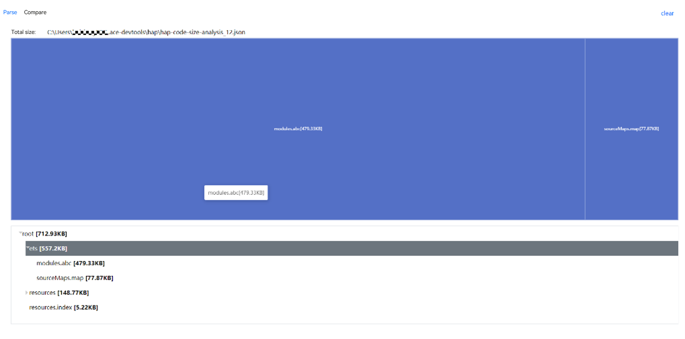

For example, click the **resources** node in the directory tree. The proportional area chart for the **resources** folder is then displayed, as shown below.

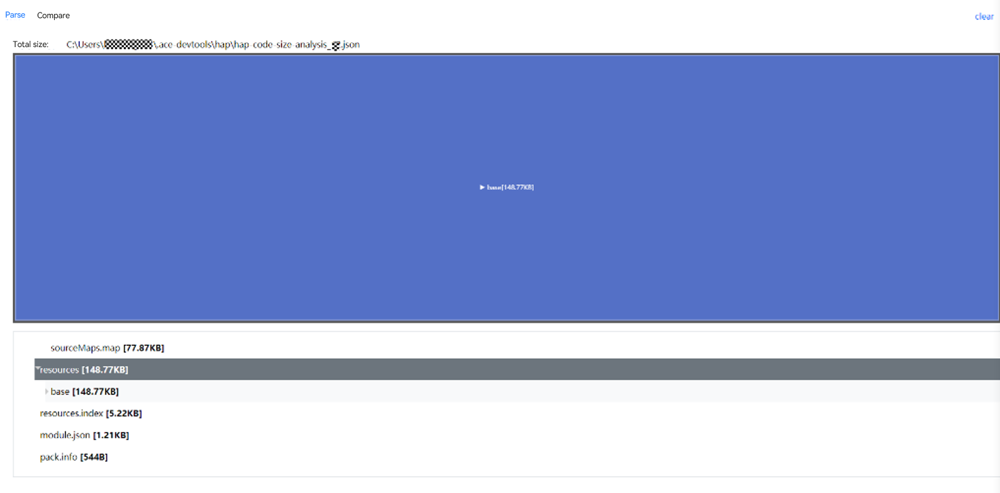

Clicking **clear** in the upper right corner of the **Parse** tab page clears the content on the page and enables you to upload a new JSON file for parsing.

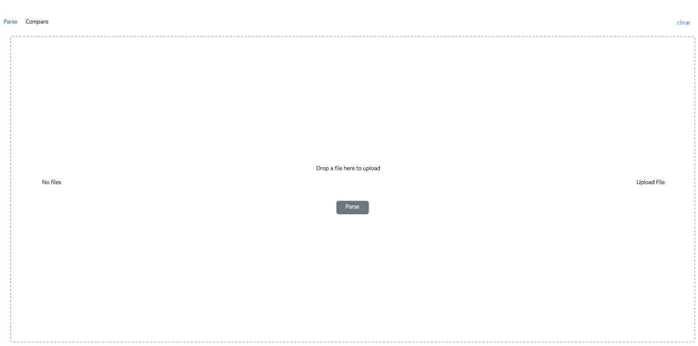

To upload a JSON file, drag it to the designated area or click the upload button. After a file is uploaded successfully, the file name is displayed.

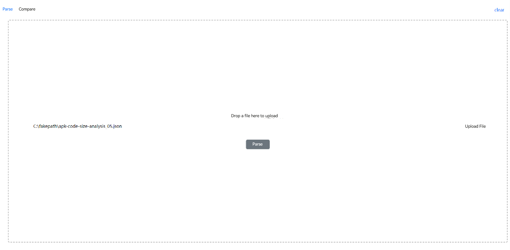

To change the file, click **clear** in the upper right corner again and upload the new file.
If no JSON file is uploaded, clicking the parse button will display a dialog box, prompting you to upload a file first.

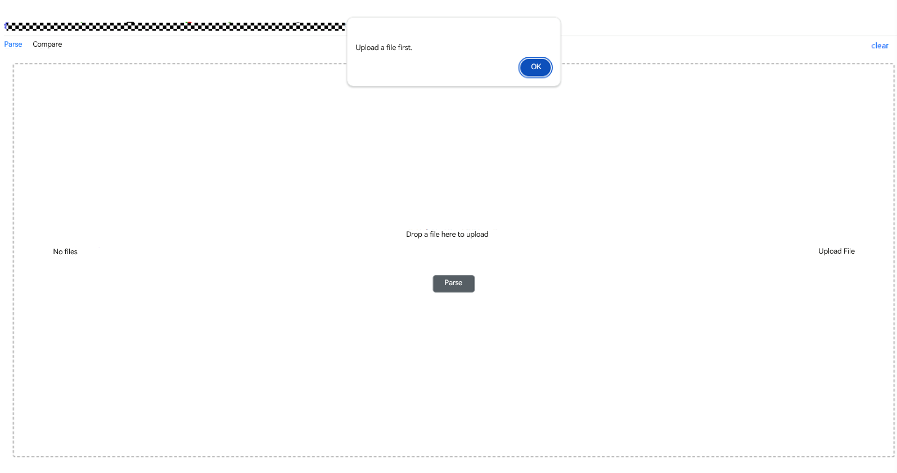

With a JSON file successfully uploaded, clicking the parse button will display the size information of the corresponding application installation package.

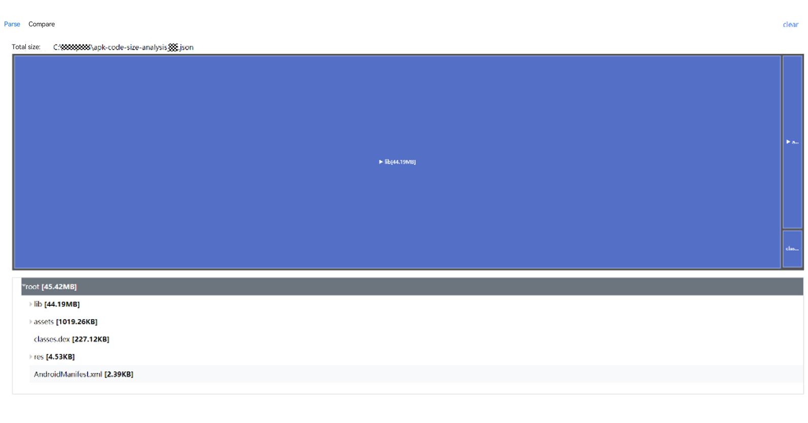

## Comparison Tab in the Open Browser Window

On the **Comparison** tab, you can compare the size of application installation packages of the same type in different versions.
Below shows the **Comparison** tab when no file is uploaded.

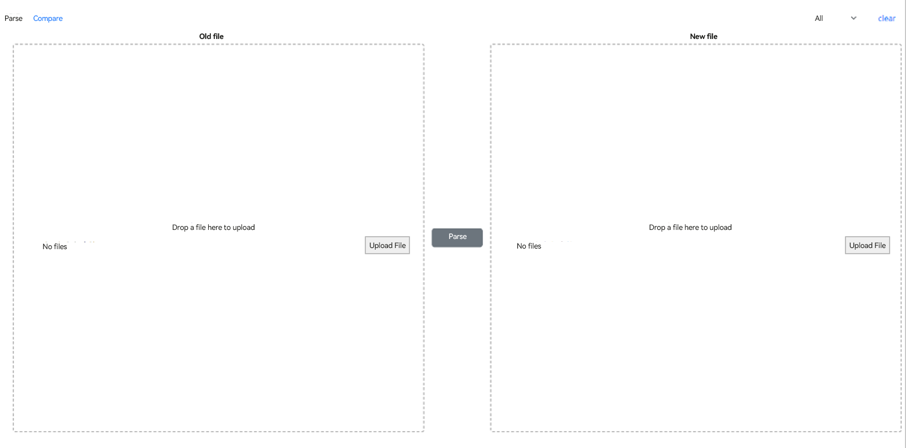

You need two JSON files for comparison.
To upload a JSON file, drag it to the designated area or click the upload button. After a file is uploaded successfully, the file name is displayed.

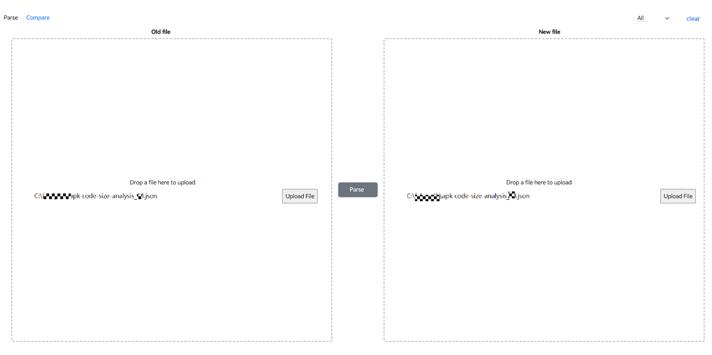

To change the files, click **clear** in the upper right corner again and upload the new files.
If only one or no JSON file is uploaded, clicking the parse button will display a dialog box, prompting you to upload files first.

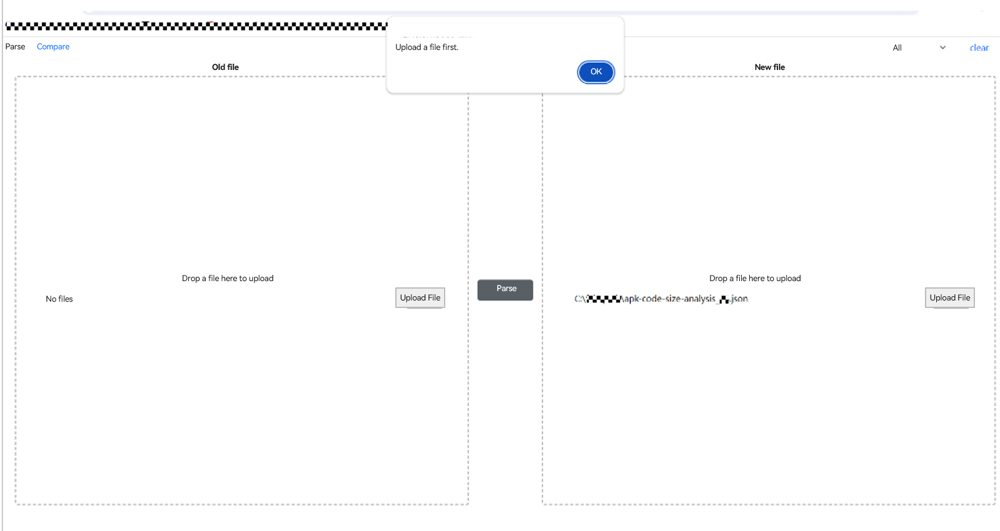

If the uploaded JSON files are of different types, a dialog box is displayed to indicate the error.

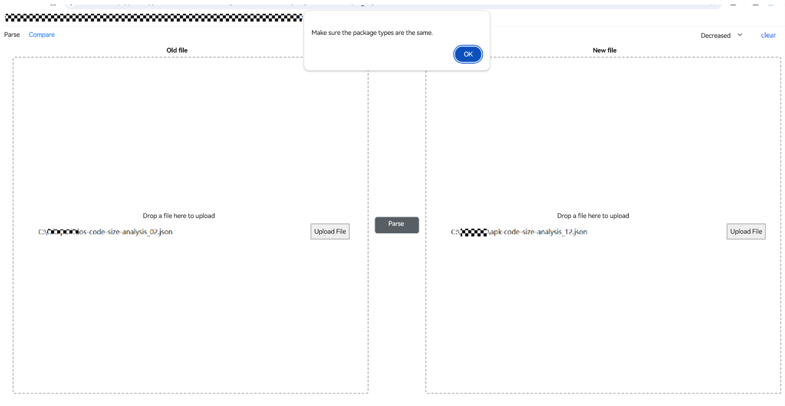

For example, if a JSON file of an APK and a JSON file of an iOS installation package are uploaded at once, the dialog box shown below is displayed.

With two JSON files of the same type successfully uploaded, clicking the parse button will compare the sizes of the corresponding application installation packages and display the differences in an intuitive manner.

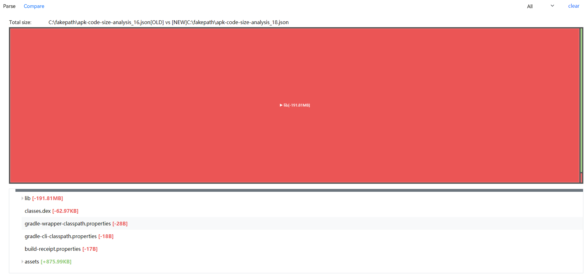

A module whose file size decreases is marked in red, and one whose file size increases is marked in green.
To view only files with an increased or decreased size, use the drop-down list filter in the upper right corner.

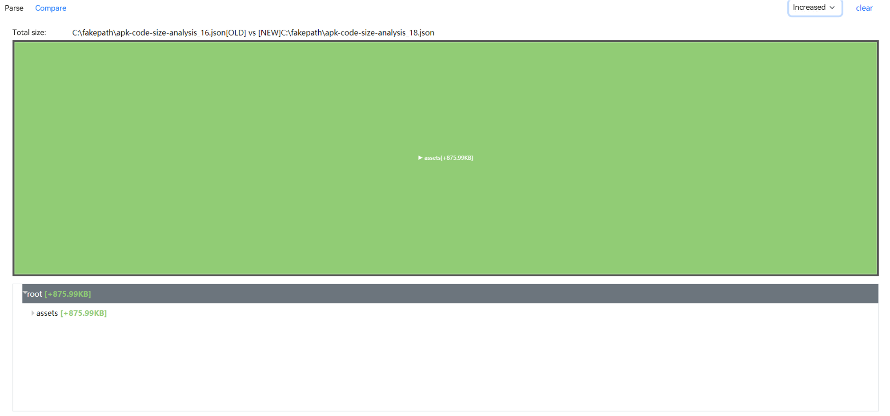

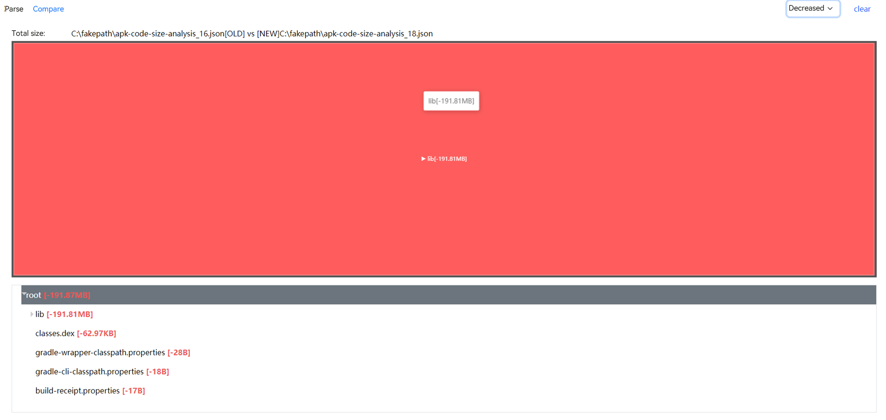

Clicking **clear** in the upper right corner of the tab page clears the content on the page and enables you to upload new JSON files for parsing.
