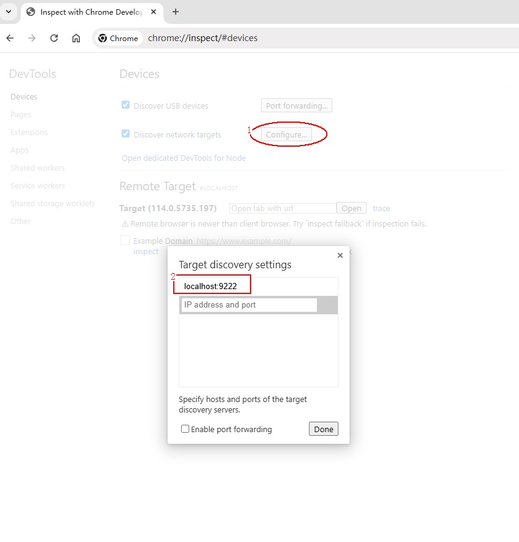
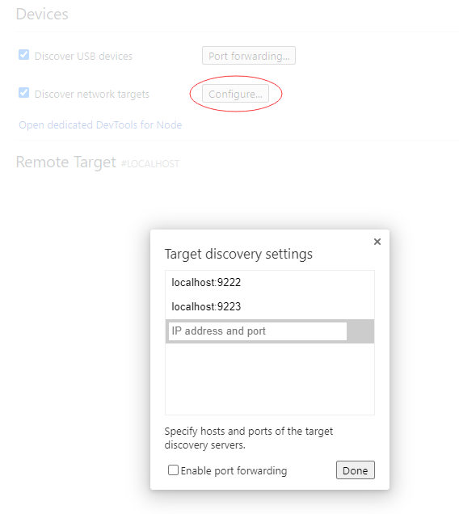
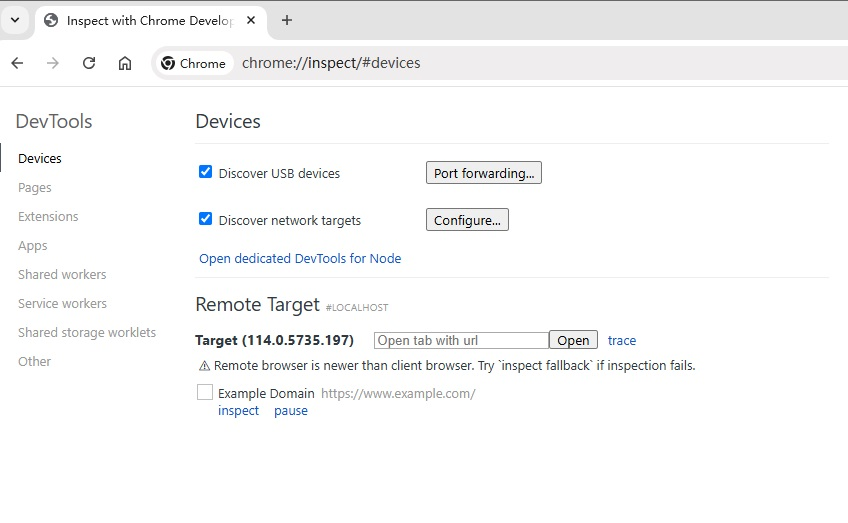
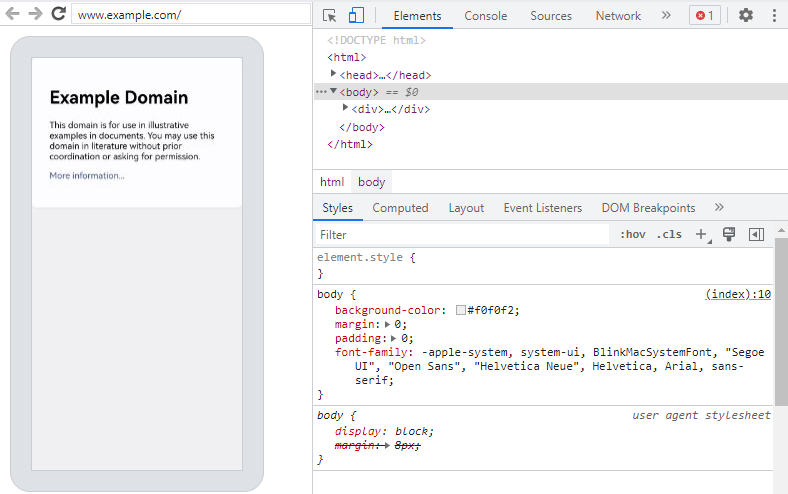

# Use the DevTools tool to debug the front-end page


The Web component supports the use of DevTools to debug front-end pages。DevTools is a Web front-end development debugging tool that provides the ability to debug mobile device front-end pages on a computer. The developer uses [setWebDebuggingAccess()](./js-apis-webview.md#setwebdebuggingaccess16) interface enables front-end page debugging of Web components. DevTools can be used to debug front-end web pages on mobile devices. The device version must be 4.1.0 or later。


## Debugging procedure

### Application code Enables Web debugging

Before debugging a web page, the application side code calls [setWebDebuggingAccess()](./js-apis-webview.md#setwebdebuggingaccess16) interface Enables Web debugging。  
If Web debugging is not enabled, DevTools cannot discover the debugged Web page。

1. Enable the Web debugging function in the application code, as follows：

   ```ts
   // xxx.ets
   import { webview } from '@kit.ArkWeb';
   
   @Entry
   @Component
   struct WebComponent {
     controller: webview.WebviewController = new webview.WebviewController();
   
     aboutToAppear() {
       // Configure Web to enable the debugging mode
       webview.WebviewController.setWebDebuggingAccess(true);
     }
   
     build() {
       Column() {
         Web({ src: 'www.example.com', controller: this.controller })
       }
     }
   }
   ```
2. To enable the debugging function, add the following permissions to the Module. json5 file of the hap module in DevEco Studio. For details about how to add permissions, see [Declaring Permissions in the Configuration File](https://gitee.com/openharmony/docs/blob/master/en/application-dev/security/AccessToken/declare-permissions.md).

   ```
   "requestPermissions":[
      {
        "name" : "ohos.permission.INTERNET"
      }
    ]
   ```

### Connect the device to your computer

Connect your device to your computer and turn on developer mode to prepare for port forwarding。

1. Please enable Developer mode on your device and enable USB debugging。  

   (1) On the terminal system, check whether Developer Option exists in Settings > System. If it does not exist, choose Settings > About this Device and click Version Number seven times until "Enable Developer Mode" is displayed. Click "Confirm Enable" and enter the PIN code (if it has been set) to automatically restart the device。

   (2) Connect the terminal and computer with a USB data cable. In "Settings > System > Developer Options", open the "USB debugging" switch, and the pop-up box "Allow USB debugging" is displayed. Click "Allow"。

### Open the debugging tool page in Chrome
  1. Enter the debugging tool address chrome://inspect/\#devices in the address bar of the chrome browser on the PC and open the page。  
  2. Modify the configuration of the Chrome debugging tool。  
     You need to Discover the debugged pages from the local TCP 9222 port, so ensure that Discover network targets is checked. Then configure the network。  
     (1) Click the "Configure" button。  
     (2) Add the local port localhost:9222 to listen on in the Target discovery settings。

     

  3. To debug multiple applications at the same time, on the debugging tools page of Chrome, add multiple port numbers in the configure section of the Devices option。

     

### Wait to discover the debugged page

  If the previous steps were successful, Chrome's debug page will display the page you want to debug later。  
  

### Start web debugging

  
