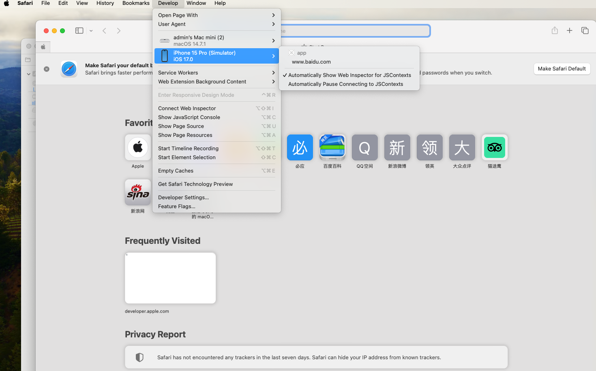

# Use the Safari browser to debug the front page


Web components support front-end page debugging in Safari. DevTools is a Web front-end development debugging tool that provides the ability to debug mobile device front-end pages on a computer. The developer uses [setWebDebuggingAccess()](./js-apis-webview.md#setwebdebuggingaccess16)interface enables front-end page debugging of Web components. You can use the development function of Safari browser to debug front-end web pages on mobile devices. The device must be ios16.4 or later.


## Debugging procedure

### Application code Enables Web debugging

Before debugging a web page, the application side code calls [setWebDebuggingAccess()](./js-apis-webview.md#setwebdebuggingaccess16)  interface Enables Web debugging.
If the Web debugging function is disabled, Safari cannot discover the web page that is being debugged.

1. Enable the Web debugging function in the application code, as follows：

   ```ts
   // xxx.ets
   import { webview } from '@kit.ArkWeb';
   
   @Entry
   @Component
   struct WebComponent {
     controller: webview.WebviewController = new webview.WebviewController();
   
     aboutToAppear() {
       // Configure Web to enable the debugging mode
       webview.WebviewController.setWebDebuggingAccess(true);
     }
   
     build() {
       Column() {
         Web({ src: 'www.example.com', controller: this.controller })
       }
     }
   }
   ```
2. To enable the debugging function, add the following permissions to the Module. json5 file of the hap module in DevEco Studio. For details about how to add permissions,see [Declaring Permissions in the Configuration File](https://gitee.com/openharmony/docs/blob/master/en/application-dev/security/AccessToken/declare-permissions.md).

   ```
   "requestPermissions":[
      {
        "name" : "ohos.permission.INTERNET"
      }
    ]
   ```

### Connect the device to your computer

Connect your device to your computer and turn on developer mode to prepare for port forwarding.

1. Please enable developer mode on the device: Open "Settings">"Safari Browser">"Advanced" in the mobile system, and turn on the "Javascript" and "Web Inspector" switches.


### Open the debugging tool page in Safari

  1. Open Safari on your Mac, then go to Safari -> Preferences -> Advanced and check "Show 'Develop' menu in menu bar".
  1. In the "Develop" menu, select the name of your device and then check "Safari - [your device name]".

### Wait to discover the debugged page

  If the previous steps were successful, Safari's debug page will display the web page to be debugged later.  
  

### Start web debugging

  

