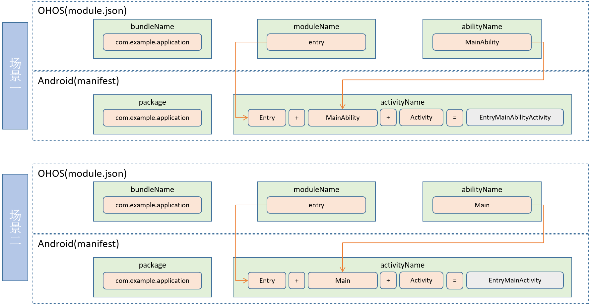

## StageActivity

```
java.lang.Object
    └── android.content.Context
        └── android.content.ContextWrapper
            └── android.view.ContextThemeWrapper
                └── android.app.Activity
                    └── ohos.ace.adapter.StageActivity
```

```
public class StageActivity
    extends Activity
```

**StageActivity** is a child class of **Activity** and is the entry of lifecycle management for Android activities. When developing a stage-model ability of an ArkUI-X application that can run on Android devices, you must inherit **StageActivity** and set the **JsBundle** instance name in this child class.

### Method Summary

| Type| Method                        | Description                    |
| ---- | ---------------------------- | ------------------------ |
| void | setInstanceName(String name) | Sets the ArkUI **JSBundle** instance name.|

### Method Description

- setInstanceName

  ```
  /**
  * Sets the instance name. This method should be called before super.onCreate() is called.
  * 
  * @param name Instance name to set.
  */
  public void setInstanceName(String name);
  ```

### Naming Rules for Mappings Between StageActivity and Ability

