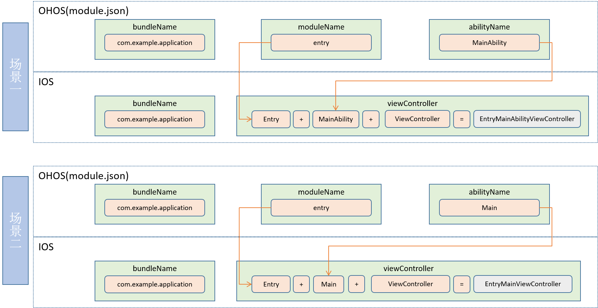

## StageViewController

```
UIResponder
    └── UIViewController
        └── StageViewController
```

```
@interface StageViewController : UIViewController
```

**StageViewController** is a child class of **UIViewController** and is the entry of lifecycle management for iOS applications When developing an ArkUI-X application that can run on iOS devices, you must instantiate a StageViewController and load the JS bundle.

## Method Summary

| Type        | Method                | Description  |
| ------------ | -------------------- | ------ |
| instancetype | initWithInstanceName | Initializes this StageViewController.|

## Method Description

- initWithInstanceName

  ```
  /**
  * Initializes this StageViewController with the specified instance name.
   *
   *  instanceName(bundleName:moduleName:abilityName)
   *  This is used for stage-model applications. It will combine the instanceName as the
   *  abilityDirectory.
   *
   * @param instanceName Instance name.
   */- (instancetype)initWithInstanceName:(NSString *_Nonnull)instanceName;
  ```

### Naming Rules for Mappings Between StageViewController and Ability

