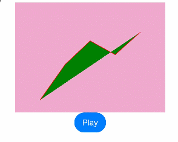

# \@AnimatableExtend Decorator: Definition of Animatable Attributes

The @AnimatableExtend decorator is used to define an attribute method for animating a non-animatable attribute of a component. During animation execution, the frame-by-frame callback is used to change the value of the non-animatable attribute so that an animation effect can be applied to the attribute.

- Animatable attribute: If an attribute method is called before the **animation** attribute, and changing the value of this attribute can make the animation effect specified by the **animation** attribute take effect, then this attribute is called animatable attribute. Examples of animatable attributes are **height**, **width**, **backgroundColor**, and **translate**.

- Non-animatable attribute: If an attribute method is called before the **animation** attribute, and changing the value of this attribute cannot make the animation effect specified by the **animation** attribute take effect, then this attribute is called non-animatable attribute. Examples of non-animatable attributes are **fontSize** of the **\<Text>** component and **points** of the **\<Polyline>** component.

>  **NOTE**
>
>  This decorator is supported since API version 10. Updates will be marked with a superscript to indicate their earliest API version.

## Rules of Use


### Syntax


```ts
@AnimatableExtend(UIComponentName) function functionName(value: typeName) { 
  .propertyName(value)
}
```

- \@AnimatableExtend can be defined only globally.
- The parameter of the \@AnimatableExtend decorated function must be of the number type or a custom type that implements the **AnimtableArithmetic\<T\>** API.
- In the \@AnimatableExtend decorated function body, only the attribute methods of the component specified in brackets immediately following \@AnimatableExtend can be called.

### AnimtableArithmetic\<T\> Description
To perform animation on complex data types, you must implement the addition, subtraction, multiplication, and equivalence judgment functions in the **AnimtableArithmetic\<T\>** API.
| Name| Input Parameter Type| Return Value Type| Description|
| -------- | -------- |-------- |-------- |
| plus | AnimtableArithmetic\<T\> | AnimtableArithmetic\<T\> | Addition function.|
| subtract | AnimtableArithmetic\<T\> | AnimtableArithmetic\<T\> | Subtraction function.|
| multiply | number | AnimtableArithmetic\<T\> | Multiplication function.|
| equals | AnimtableArithmetic\<T\> | boolean | Equivalence judgment function.|

## Example

The following example applies an animation to the font size attribute.


```ts
@AnimatableExtend(Text) function animatableFontSize(size: number) {
  .fontSize(size)
}

@Entry
@Component
struct AnimatablePropertyExample {
  @State fontSize: number = 20
  build() {
    Column() {
      Text("AnimatableProperty")
        .animatableFontSize(this.fontSize)
        .animation({duration: 1000, curve: "ease"})
      Button("Play")
        .onClick(() => {
          this.fontSize = this.fontSize == 20 ? 36 : 20
        })
    }.width("100%")
    .padding(10)
  }
}
```


The following example implements a polyline animation effect. 


```ts
class Point {
  x: number
  y: number

  constructor(x: number, y: number) {
    this.x = x
    this.y = y
  }
  plus(rhs: Point): Point {
    return new Point(this.x + rhs.x, this.y + rhs.y)
  }
  subtract(rhs: Point): Point {
    return new Point(this.x - rhs.x, this.y - rhs.y)
  }
  multiply(scale: number): Point {
    return new Point(this.x * scale, this.y * scale)
  }
  equals(rhs: Point): boolean {
    return this.x === rhs.x && this.y === rhs.y
  }
}

class PointVector extends Array<Point> implements AnimatableArithmetic<PointVector> {
  constructor(value: Array<Point>) {
    super();
    value.forEach(p => this.push(p))
  }
  plus(rhs: PointVector): PointVector {
    let result = new PointVector([])
    const len = Math.min(this.length, rhs.length)
    for (let i = 0; i < len; i++) {
      result.push(this[i].plus(rhs[i]))
    }
    return result
  }
  subtract(rhs: PointVector): PointVector {
    let result = new PointVector([])
    const len = Math.min(this.length, rhs.length)
    for (let i = 0; i < len; i++) {
      result.push(this[i].subtract(rhs[i]))
    }
    return result
  }
  multiply(scale: number): PointVector {
    let result = new PointVector([])
    for (let i = 0; i < this.length; i++) {
      result.push(this[i].multiply(scale))
    }
    return result
  }
  equals(rhs: PointVector): boolean {
    if (this.length != rhs.length) {
      return false
    }
    for (let i = 0; i < this.length; i++) {
      if (!this[i].equals(rhs[i])) {
        return false
      }
    }
    return true
  }
  get():Array<[x: number, y: number]> {
    let result = []
    this.forEach(p => result.push([p.x, p.y]))
    return result
  }
}

@AnimatableExtend(Polyline) function animatablePoints(points: PointVector) {
  .points(points.get())
}

@Entry
@Component
struct AnimatablePropertyExample {
  @State points: PointVector = new PointVector([
    new Point(50, Math.random() * 200),
    new Point(100, Math.random() * 200),
    new Point(150, Math.random() * 200),
    new Point(200, Math.random() * 200),
    new Point(250, Math.random() * 200),
  ])
  build() {
    Column() {
      Polyline()
        .animatablePoints(this.points)
        .animation({duration: 1000, curve: "ease"})
        .size({height:220, width:300})
        .fill(Color.Green)
        .stroke(Color.Red)
        .backgroundColor('#eeaacc')
      Button("Play")
        .onClick(() => {
          this.points = new PointVector([
            new Point(50, Math.random() * 200),
            new Point(100, Math.random() * 200),
            new Point(150, Math.random() * 200),
            new Point(200, Math.random() * 200),
            new Point(250, Math.random() * 200),
          ])
        })
    }.width("100%")
    .padding(10)
  }
}
```

