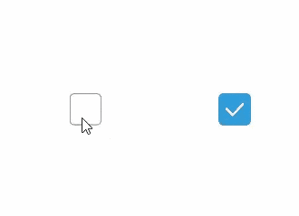

# Checkbox

The **\<Checkbox>** component is used to enable or disable an option.

>  **NOTE**
>
>  This component is supported since API version 8. Updates will be marked with a superscript to indicate their earliest API version.

## Child Components

Not supported

## APIs

Checkbox(options?: {name?: string,  group?: string })

Since API version 9, this API is supported in ArkTS widgets.

**Parameters**

| Name | Type| Mandatory | Description|
| --------| --------| ------ | -------- |
| name    | string | No| Name of the check box.|
| group   | string | No| Group name of the check box.<br>**NOTE**<br>If not used with the **\<CheckboxGroup>** component, this parameter is invalid.|

## Attributes

In addition to the [universal attributes](ts-universal-attributes-size.md), the following attributes are supported.


| Name         | Type| Description|
| ------------- | ------- | -------- |
| select        | boolean | Whether the check box is selected.<br>Default value: **false**<br>Since API version 9, this API is supported in ArkTS widgets.<br>Since API version 10, this attribute supports [$$](../../quick-start/arkts-two-way-sync.md) for two-way binding of variables.|
| selectedColor | [ResourceColor](ts-types.md#resourcecolor) | Color of the check box when it is selected.<br>Since API version 9, this API is supported in ArkTS widgets.|
| unselectedColor<sup>10+</sup> | [ResourceColor](ts-types.md#resourcecolor) | Border color of the check box when it is not selected.|
| mark<sup>10+</sup> | [MarkStyle](#markstyle10) | Internal icon style of the check box.|

## Events

In addition to the [universal events](ts-universal-events-click.md), the following attributes are supported.

| Name                                         | Description                                                  |
| -------------------------------------------- | ------------------------------------------------------------ |
| onChange(callback: (value: boolean) => void) | Triggered when the selected status of the check box changes.<br>- The value **true** means that the check box is selected.<br>- The value **false** means that the check box is not selected.<br>Since API version 9, this API is supported in ArkTS widgets. |

## MarkStyle<sup>10+</sup>

| Name       | Type                                      | Mandatory| Default Value     | Description                                                        |
| ----------- | ------------------------------------------ | ---- | ----------- | ------------------------------------------------------------ |
| strokeColor | [ResourceColor](ts-types.md#resourcecolor) | No  | Color.White | Color of the internal mark.                                              |
| size        | number \| string                 | No  | -           | Size of the internal mark, in vp. The default size is the same as the width of the check box.<br>This parameter cannot be set in percentage. If it is set to an invalid value, the default value is used.|
| strokeWidth | number \| string                 | No  | 2           | Stroke width of the internal mark, in vp. This parameter cannot be set in percentage. If it is set to an invalid value, the default value is used.|

## Example

```ts
// xxx.ets
@Entry
@Component
struct CheckboxExample {

  build() {
    Row() {
      Checkbox({name: 'checkbox1',  group: 'checkboxGroup'})
        .select(true)
        .selectedColor(0xed6f21)
        .onChange((value: boolean) => {
          console.info('Checkbox1 change is'+ value)
        })
      Checkbox({name: 'checkbox2',  group: 'checkboxGroup'})
        .select(false)
        .selectedColor(0x39a2db)
        .onChange((value: boolean) => {
          console.info('Checkbox2 change is'+ value)
        })
    }
  }
}
```



