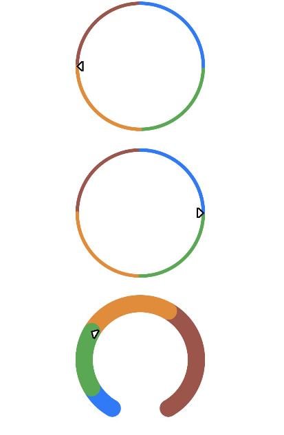

# Gauge

The **\<Gauge>** component is used to display data in a ring chart.


>  **NOTE**
>
>  This component is supported since API version 8. Updates will be marked with a superscript to indicate their earliest API version.


## Child Components

Not supported


## APIs

Gauge(options:{value: number, min?: number, max?: number})

Since API version 9, this API is supported in ArkTS widgets.

**Parameters**

| Name| Type| Mandatory| Description|
| -------- | -------- | -------- | -------- |
| value | number | Yes| Current value of the chart, that is, the position to which the pointer points in the chart. It is used as the initial value of the chart when the component is created.<br>**NOTE**<br>If the value is not within the range defined by the **min** and **max** parameters, the value of **min** is used.|
| min | number | No| Minimum value of the current data segment.<br>Default value: **0**|
| max | number | No| Maximum value of the current data segment.<br>Default value: **100**<br>**NOTE**<br>If the value of **max** is less than that of **min**, the default values **0** and **100** are used.<br>The values of **max** and **min** can be negative numbers.|

## Attributes

In addition to the [universal attributes](ts-universal-attributes-size.md), the following attributes are supported.

| Name| Type| Description|
| -------- | -------- | -------- |
| value | number | Value of the chart. It can be dynamically changed.<br>Default value: **0**<br>Since API version 9, this API is supported in ArkTS widgets.|
| startAngle | number | Start angle of the chart. The value **0** indicates 0 degrees, and a positive value indicates the clockwise direction.<br>Default value: **0**<br>Since API version 9, this API is supported in ArkTS widgets.|
| endAngle | number | End angle of the chart. The value **0** indicates 0 degrees, and a positive value indicates the clockwise direction.<br>Default value: **360**<br>Since API version 9, this API is supported in ArkTS widgets.|
| colors | Array&lt;[ColorStop](#colorstop)&gt; | Colors of the chart. Colors can be set for individual segments.<br>Default value: **Color.Black**<br>Since API version 9, this API is supported in ArkTS widgets.|
| strokeWidth | Length | Stroke width of the chart.<br>Default value: **4**<br>Unit: vp<br>Since API version 9, this API is supported in ArkTS widgets.<br>**NOTE**<br>A value less than 0 evaluates to the default value.<br>The value cannot be in percentage.|

## ColorStop

Describes a gradient stop.

Since API version 9, this API is supported in ArkTS widgets.

| Name     | Type            | Description                                                        |
| --------- | -------------------- | ------------------------------------------------------------ |
| ColorStop | [[ResourceColor](ts-types.md#resourcecolor), number] | Type of the gradient stop. The first parameter indicates the color value. If it is set to a non-color value, the black color is used. The second parameter indicates the color weight. If it is set to a negative number or a non-numeric value, the color weight is 0.|


## Example


```ts
// xxx.ets
@Entry
@Component
struct GaugeExample {
  build() {
    Column({ space: 20 }) {
      // Use the default value of min and max, which is 0-100, and the default values of startAngle and endAngle, which are 0 and 360, respectively.
      // Set the current value to 75.
      Gauge({ value: 75 })
        .width(200).height(200)
        .colors([[0x317AF7, 1], [0x5BA854, 1], [0xE08C3A, 1], [0x9C554B, 1]])
      
      // Set the value parameter to 75 and the value attribute to 25. The attribute setting is used.
      Gauge({ value: 75 })
        .value(25) // If both the attribute and parameter are set, the attribute setting is used.
        .width(200).height(200)
        .colors([[0x317AF7, 1], [0x5BA854, 1], [0xE08C3A, 1], [0x9C554B, 1]])
      
      // A ring chart of 210 to 150 degrees
      Gauge({ value: 30, min: 0, max: 100 })
        .startAngle(210)
        .endAngle(150)
        .colors([[0x317AF7, 0.1], [0x5BA854, 0.2], [0xE08C3A, 0.3], [0x9C554B, 0.4]])
        .strokeWidth(20)
        .width(200)
        .height(200)
    }.width('100%').margin({ top: 5 })
  }
}
```


