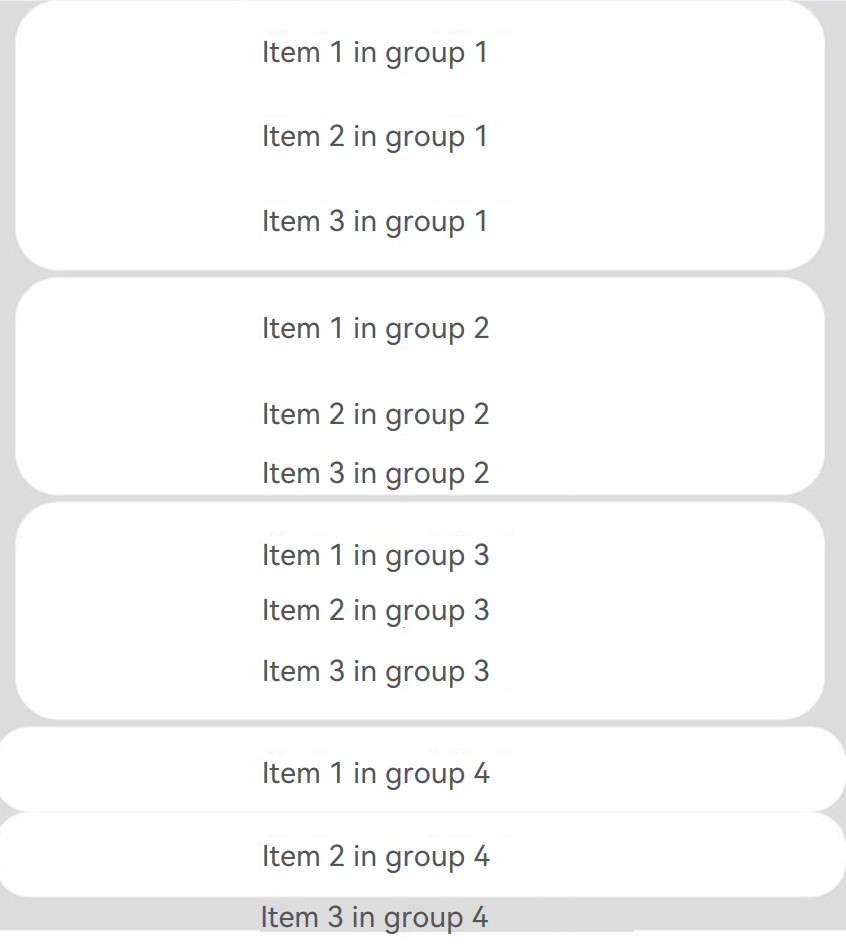

# ListItemGroup

The **\<ListItemGroup>** component is used to display list item groups. It must be used with the **[\<List>](ts-container-list.md)** component and, if not otherwise specified, takes up the entire width of the **\<List>**.

> **NOTE**
>
> - This component is supported since API version 9. Updates will be marked with a superscript to indicate their earliest API version.
> - This component can be used only as a child of [\<List>](ts-container-list.md).

## Usage Guidelines

If the **listDirection** attribute of the parent **\<List>** component is set to **Axis.Vertical**, the **height** attribute of the **\<ListItemGroup>** component is fixed at the sum of the component's header height, footer height, and total height of the list items. If the **listDirection** attribute of the parent **\<List>** component is set to **Axis.Horizontal**, the **width** attribute of the **\<ListItemGroup>** component is fixed at the sum of the component's header width, footer width, and total width of the list items.

The list items in the **\<ListItemGroup>** component cannot be edited or dragged. That is, their **editable** attribute does not take effect.

## Child Components

This component supports the **[\<ListItem>](ts-container-listitem.md)** child component.


## APIs

ListItemGroup(options?: {header?: CustomBuilder, footer?: CustomBuilder, space?: number | string, style?: ListItemGroupStyle})

**Parameters**

| Name             | Type                                           | Mandatory| Description                                                    |
| ------------------- | --------------------------------------------------- | ---- | ------------------------------------------------------------ |
| header              | [CustomBuilder](ts-types.md#custombuilder8)         | No  | Header of the list item group.                                 |
| footer              | [CustomBuilder](ts-types.md#custombuilder8)         | No  | Footer of the list item group.                                 |
| space               | number \| string                          | No  | Spacing between list items. This parameter is valid only between list items, but not between the header and list item or between the footer and list item.|
| style<sup>10+</sup> | [ListItemGroupStyle](#listitemgroupstyle10) | No  | Style of the list item group.<br>Default value: **ListItemGroupStyle.NONE**<br>If this parameter is set to **ListItemGroupStyle.NONE**, no style is applied.<br>If this parameter is set to **ListItemGroupStyle.CARD**, the default card style is applied, but only when **ListItemStyle.CARD** is set for [\<ListItem>](ts-container-listitem.md).<br>In the default card style, list items can be in focus, hover, press, selected, or disable style depending on their state.<br>**NOTE**<br>In the default card style, the parent **\<List>** component has its **listDirection** attribute fixed at **Axis.Vertical** and its **alignListItem** attribute defaulted at **ListItemAlign.Center**; the **header** and **footer** parameters cannot be set for the list item group.<br>If **ListItemGroupStyle.CARD** is set and **ListItemStyle.CARD** is not, only some card styles and functions are available.|

## Attributes

| Name| Type|  Description|
| -------- | -------- | -------- |
| divider | {<br>strokeWidth: [Length](ts-types.md#length),<br>color?: [ResourceColor](ts-types.md#resourcecolor),<br>startMargin?: [Length](ts-types.md#length),<br>endMargin?: [Length](ts-types.md#length)<br>} \| null | Style of the divider for the list items. By default, there is no divider.<br>- **strokeWidth**: stroke width of the divider.<br>- **color**: color of the divider.<br>- **startMargin**: distance between the divider and the start of the list.<br>- **endMargin**: distance between the divider and the end of the list.|

## ListItemGroupStyle<sup>10+</sup>

| Name| Description              |
| ---- | ------------------ |
| NONE | No style.          |
| CARD | Default card style.|

> **NOTE**
>
> The **\<ListItemGroup>** component does not support the universal attribute [aspectRatio](ts-universal-attributes-layout-constraints.md).
>
> If the main axis of **\<ListItemGroup>** runs in the vertical direction, the [height](ts-universal-attributes-size.md) setting does not take effect.
>
> If the main axis of **\<ListItemGroup>** runs in the horizontal direction, the [width](ts-universal-attributes-size.md) setting does not take effect.


## Example

### Example 1

```ts
// xxx.ets
@Entry
@Component
struct ListItemGroupExample {
  private timetable: TimeTable[] = [
    {
      title: 'Monday',
      projects: ['Language', 'Math', 'English']
    },
    {
      title: 'Tuesday',
      projects: ['Physics', 'Chemistry', 'Biologics']
    },
    {
      title: 'Wednesday',
      projects: ['History', 'Geography', 'Politics']
    },
    {
      title: 'Thursday',
      projects: ['Art', 'Music', 'Sports']
    }
  ]

  @Builder
  itemHead(text: string) {
    Text(text)
      .fontSize(20)
      .backgroundColor(0xAABBCC)
      .width("100%")
      .padding(10)
  }

  @Builder
  itemFoot(num: number) {
    Text('Total lessons:'+ num)
      .fontSize(16)
      .backgroundColor(0xAABBCC)
      .width("100%")
      .padding(5)
  }

  build() {
    Column() {
      List({ space: 20 }) {
        ForEach(this.timetable, (item: TimeTable) => {
          ListItemGroup({ header: this.itemHead(item.title), footer: this.itemFoot(item.projects.length) }) {
            ForEach(item.projects, (project: string) => {
              ListItem() {
                Text(project)
                  .width("100%")
                  .height(100)
                  .fontSize(20)
                  .textAlign(TextAlign.Center)
                  .backgroundColor(0xFFFFFF)
              }
            }, (item: string) => item)
          }
          .divider ({ strokeWidth: 1,color:Color.Blue }) // Divider between lines
        })
      }
      .width('90%')
      .sticky(StickyStyle.Header | StickyStyle.Footer)
      .scrollBar(BarState.Off)
    }.width('100%').height('100%').backgroundColor(0xDCDCDC).padding({ top: 5 })
  }
}

interface TimeTable {
  title: string;
  projects: string[];
}
```


### Example 2

```ts
// xxx.ets
@Entry
@Component
struct ListItemGroupExample2 {
  private arr: ArrObject[] = [
    {
      style: ListItemGroupStyle.CARD,
      itemStyles: [ListItemStyle.CARD, ListItemStyle.CARD, ListItemStyle.CARD]
    },
    {
      style: ListItemGroupStyle.CARD,
      itemStyles: [ListItemStyle.CARD, ListItemStyle.CARD, ListItemStyle.NONE]
    },
    {
      style: ListItemGroupStyle.CARD,
      itemStyles: [ListItemStyle.CARD, ListItemStyle.NONE, ListItemStyle.CARD]
    },
    {
      style: ListItemGroupStyle.NONE,
      itemStyles: [ListItemStyle.CARD, ListItemStyle.CARD, ListItemStyle.NONE]
    }
  ]

  build() {
    Column() {
      List({ space: "4vp", initialIndex: 0 }) {
        ForEach(this.arr, (item: ArrObject, index?: number) => {
          ListItemGroup({ style: item.style }) {
            ForEach(item.itemStyles, (itemStyle: number, itemIndex?: number) => {
              ListItem({ style: itemStyle }) {
                if (index != undefined && itemIndex != undefined) {
                  Text("Item" + (itemIndex + 1) +" in group" + (index + 1) +" ")
                    .width("100%")
                    .textAlign(TextAlign.Center)
                }
              }
            }, (item: string) => item)
          }
        })
      }
      .width('100%')
      .multiSelectable(true)
      .backgroundColor(0xDCDCDC) // List in light blue
    }
    .width('100%')
    .padding({ top: 5 })
  }
}

interface ArrObject {
  style: number;
  itemStyles: number[];
}
```

