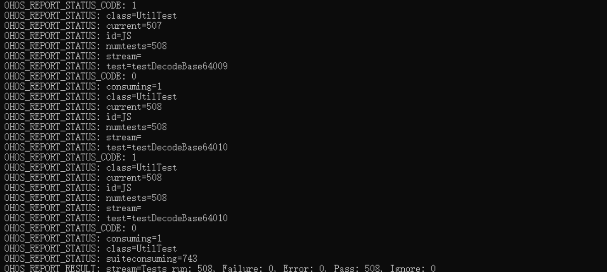
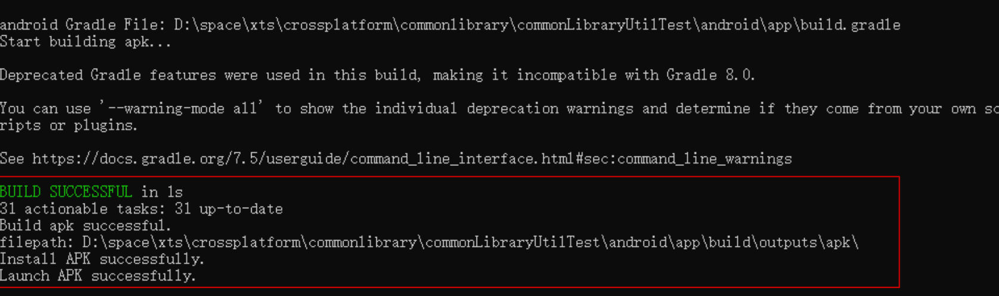
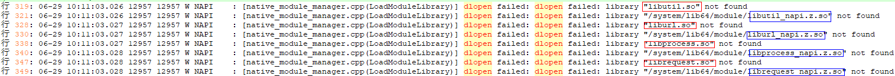

# Cross-Platform Unit Test Script Development

## Creating a Cross-Platform Project
Create a cross-platform project.

- Run the **ace create** command to create a cross-platform project. For details about how to use ACE Tools, see [Quick Start Guide](../quick-start/start-with-ace-tools.md#how-to-use).

```
Directory structure of the ArkUI-X application project
  ├── .arkui-x
  │   ├── android                 // Android-related code
  │   └── ios                     // iOS-related code
  ├── AppScope
  ├── entry
  ├── hvigor
  ├── build-profile.json5
  ├── hvigorfile.ts
  ├── hvigorw
  ├── hvigorw.bat
  ├── local.properties
  └── oh-package.json5
```

## Writing Test Code
### Creating a Test Code File

- Create the **demo.test.ets** file in the **entry\src\ohosTest\ets\test** directory. For details about how to write test code, see the **Ability.test.ets** file generated when the project is created.

```js
import hilog from '@ohos.hilog';
import { describe, beforeAll, beforeEach, afterEach, afterAll, it, expect } from '@ohos/hypium';

export default function abilityTest() {
  describe('ActsAbilityTest', () => {
    // Defines a test suite. Two parameters are supported: test suite name and test suite function.
    beforeAll(() => {
      // Presets an action, which is performed only once before all test cases of the test suite start.
      // This API supports only one parameter: preset action function.
    })
    beforeEach(() => {
      // Presets an action, which is performed before each unit test case starts.
      // The number of execution times is the same as the number of test cases defined by **it**.
      // This API supports only one parameter: preset action function.
    })
    afterEach(() => {
      // Presets a clear action, which is performed after each unit test case ends.
      // The number of execution times is the same as the number of test cases defined by **it**.
      // This API supports only one parameter: clear action function.
    })
    afterAll(() => {
      // Presets a clear action, which is performed after all test cases of the test suite end.
      // This API supports only one parameter: clear action function.
    })
    it('assertContain', 0, () => {
      // Defines a test case. This API supports three parameters: test case name, filter parameter, and test case function.
      hilog.info(0x0000, 'testTag', '%{public}s', 'it begin');
      let a = 'abc';
      let b = 'b';
      // Defines a variety of assertion methods, which are used to declare expected boolean conditions.
      expect(a).assertContain(b);
      expect(a).assertEqual(a);
    })
  })
}
```

Write test cases in general syntax. Use **describe** to define a test suite and **it** to define a test case.

| No.  | API        | Description                                                    |
| ---- | ---------- | ------------------------------------------------------------ |
| 1    | describe   | Defines a test suite. This API supports two parameters: test suite name and test suite function.      |
| 2    | beforeAll  | Presets an action, which is performed only once before all test cases of the test suite start. This API supports only one parameter: preset action function.|
| 3    | beforeEach | Presets an action, which is performed before each unit test case starts. The number of execution times is the same as the number of test cases defined by **it**. This API supports only one parameter: preset action function.|
| 4    | afterEach  | Presets a clear action, which is performed after each unit test case ends. The number of execution times is the same as the number of test cases defined by **it**. This API supports only one parameter: clear action function.|
| 5    | afterAll   | Presets a clear action, which is performed after all test cases of the test suite end. This API supports only one parameter: clear action function.|
| 6    | it         | Defines a test case. This API supports three parameters: test case name, filter parameter, and test case function.|
| 7    | expect     | Defines a variety of assertion methods, which are used to declare expected Boolean conditions.                            |

### Importing the Dependent Module

Import the dependent module, such as the tested module or util module, to the test file. The following uses **ohos.util** as an example.

```js
import { describe, beforeAll, beforeEach, afterEach, afterAll, it, expect } from '@ohos/hypium';
import util from '@ohos.util';

export default function abilityTest() {
  describe('ActsDemoTest', function () {
    ...
  })
}
```

### Writing Test Code

```js
import { describe, beforeAll, beforeEach, afterEach, afterAll, it, expect } from '@ohos/hypium';
import util from '@ohos.util';
export default function UtilFunTest() {
  describe('UtilTest', function () {
    it('testIsNumberObject001', 0, () => {
      let proc = new util.types();
      let result = proc.isNumberObject(new Number(0));
      expect(result).assertEqual(true);
    });

    it('testIsNumberObject002', 0, () => {
      let proc = new util.types();
      let result = proc.isNumberObject(new Number(10));
      expect(result).assertEqual(true);
    });

    it('testIsNumberObject003', 0, () => {
      let proc = new util.types();
      let result = proc.isNumberObject(15);
      expect(result).assertEqual(false);
    });
  })
}
```

| Test Case No.      |   Test API | Verify                                             |
| ---- | ---------- | ------------------------------------------------------------ |
|testIsNumberObject001    | isNumberObject   | When **new Number(0)** of the Number object type is passed in, **true** is returned.   |
|testIsNumberObject002    | isNumberObject  | When **new Number(10)** of the Number object type is passed in, **true** is returned.   |
| testIsNumberObject003   | isNumberObject | When **15** of the Number type is passed in, **false** is returns.  |

### Using Assertion

```js
import { describe, it, expect } from '@ohos/hypium';
export default function UtilFunTest() {
  describe('UtilTest', () => {
    it('testIsNumberObject001', 0, () => {
      let proc = new util.types();
      let result = proc.isNumberObject(new Number(0));
      expect(result).assertEqual(true);
    });
  })
}
```

| Test Case No.      |   Test API | Test Assertion                           |
| ---- | ---------- | ------------------------------------------------------------ |
|testIsNumberObject001    | isNumberObject   | When **new Number(0)** of the Number object type is passed in, **isNumberObject()** returns **true**. Use **expect** to assert that the value of **result** is **true**.|

- For details about how to use assertions, see [Unit Test Framework Assertion Description](https://gitcode.com/openharmony/testfwk_arkxtest#assertion-library).

### Modifying List.test.ets

- Import the test file to **entry\src\ohosTest\ets\test\List.test.ets**.


```js
import abilityTest from './Ability.test';

export default function testsuite() {
  abilityTest();
}
```

### Executing Test Code

You can run test cases on Android and iOS. The following lists the commands for running the test code:   


| Platform   | Command                                                |
| ------- | ------------------------------------------------------------ |
| Android | ace test **apk** --b `bundle name` --m `entry_test` --unittest OpenHarmonyTestRunner  --timeout 10000 |
| ios     | ace test **app** --b `bundle name` --m `entry_test` --unittest OpenHarmonyTestRunner  --timeout 10000 |

Go to the **cmd** command line in the project directory and run the preceding command. The command triggers the compilation, packaging, installation, and running of the test cases. In the commands, **bundle name** is the **bundleName** in the **ohos\AppScope\app.json5** file, and **entry_test** is the **name** defined under **module** in the **ohosTest\module.json5** file.

### Viewing the Test Result

- When the test cases are executed, the window in which the test cases are executed displays the test execution information.
- After the test is complete, the test results are displayed in the window.



As shown in the preceding figure, **Tests run** indicates the total number of test cases; **Failure** indicates the number of failed test cases; **Error** indicates the number of test case errors; **Pass** indicates the number of passed test cases; **Ignore** indicates the number of ignored test cases.

##  Troubleshooting

Exception Caused by Lack of so Files

**Symptom**

The ace test stops unexpectedly and the final result cannot be obtained, as shown in the following figure.



**Possible Causes**

The .so files are missing.

**Solution**

Run the **adb logcat > E:/xxx.txt** command to capture the log generated when the **ace test** command is run. Search for **dlopen** in the log and determine the missing .so files. 

As shown in the following figure, the **xxx.so** files are missing files and the **xxx.z.so** files are not. Add the missing files to the **demotest\android\app\libs\arm64-v8a** and **demotest\android\app\libs\armeabi-v7a** directories and perform the test again.

	
