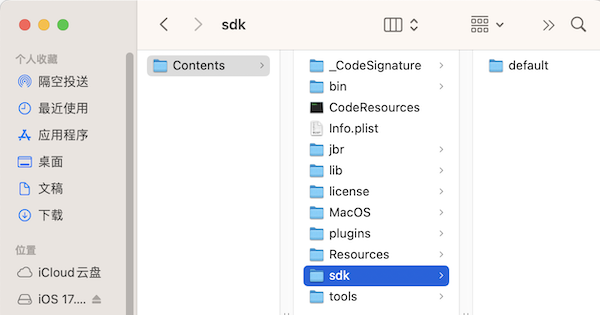
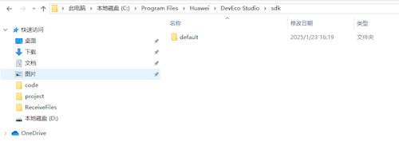

# Checking Path Validity

## Overview

This topic describes how to check the validity of a path configured in **config**. It provides the following information:

- Methods for checking path validity
- Mappings between configuration items and environment variables
- Path related configuration items

## Methods for Checking Path Validity

####  SDK

| Configuration Item         | Check Method                                                    |
| ----------------- | ------------------------------------------------------------ |
| --android-sdk     | 1. Check whether the configured path exists. 2. Check whether the configured path is available. (In Windows, the path cannot be a drive letter. In macOS and Linux, the path cannot be the system root directory.) 3. Check whether the **build-tools** and **platform-tools** folders exist in the configured path.|
| --arkui-x-sdk     | 1. Check whether the configured path exists. 2. Check whether the configured path is available. (In Windows, the path cannot be a drive letter. In macOS and Linux, the path cannot be the system root directory.) 3. Check whether the **versioncode** folder exists in the configured path. 4. Check whether the **versioncode** folder contains the **arkui-x** folder. 5. Check whether the **licenses** folder exists in the configured path.|
| --harmonyos-sdk   | 1. Check whether the configured path exists. 2. Check whether the configured path is available. (In Windows, the path cannot be a drive letter. In macOS and Linux, the path cannot be the system root directory.) New version: 1. Check whether the name of any folder in the configured path contains **HarmonyOS** or **default**. 2. Check whether the **sdk-pkg.json** file exists in a folder of the configured path. If the file exists and the data.platformVersion version number in the file is greater than or equal to 5.0.0, the path is considered valid. Otherwise, go to step 3 3. Check whether the **licenses** folder exists in the configured path. If a folder whose name contains **HarmonyOS** or **default** does not exist in the path or the **sdk-pkg.json** file does not exist in the folder, follow the method used in the old version. Old version: 1. Check whether the **hmscore** and **openharmony** folders exist in the configured path. 2. Check whether the **openharmony** folder contains the **versioncode** folder. 3. Check whether the **versioncode** folder contains the **toolchains** folder. 4. Check whether the **licenses** folder exists in the configured path.|
| --openharmony-sdk | 1. Check whether the configured path exists. 2. Check whether the configured path is available. (In Windows, the path cannot be a drive letter. In macOS and Linux, the path cannot be the system root directory.) 3. Check whether the **versioncode** folder exists in the configured path. 4. Check whether the **versioncode** folder contains the **toolchains** folder. 5. Check whether the **licenses** folder exists in the configured path.|

####  Special Note

- openharmony-sdk: The openharmony-sdk configuration must be the same as the address configured in the OpenHarmony SDK in the DevEco settings, as shown in the following figure.
Note: The value cannot be set to the openharmony path in the sdk directory contained in the DevEco.

- harmonyos-sdk: If the harmonyos-sdk is configured in the DevEco version that is greater than or equal to 5.0.0, The value must be set to the sdk directory contained in the DevEco.

   Mac：Find the installed DevEco tool in the application, right-click and choose Show Package Contents. In the package content, find the Contents/sdk directory, and configure it in the directory. For example:/Applications/DevEco-Studio.app/Contents/sdk
   

   Windows：Find the sdk directory in the application installation directory, and configure the directory. For example:C:\Program Files\Huawei\DevEco Studio\sdk
   

####  DevEco Studio

| Configuration Item             | Check Method                                                    |
| --------------------- | ------------------------------------------------------------ |
| --android-studio-path | 1. Check whether the configured path exists. 2. For Windows, check whether the executable file **studio.exe** or **studio64.exe** exists in the **bin** directory or in the configured path. For Linux, check whether the executable file **studio.sh** or **studio64.sh** exists in the **bin** directory or in the configured path. For macOS, check whether the executable file **studio** or **studio64** exists in the **Contents/MacOS** directory or in the configured path.|
| --deveco-studio-path  | 1. Check whether the path exists. 2. For Windows, check whether the executable file **devecostudio.exe** or **devecostudio64.exe** exists in the **bin** directory or in the configured path. For macOS, check whether the executable file **devecostudio** or **devecostudio64** exists in the **Contents/MacOS** directory or in the configured path.|

####  CMD

| Configuration Item    | Check Method                                                    |
| ------------ | ------------------------------------------------------------ |
| --java-sdk   | 1. Check whether the configured path exists. 2. For Windows, check whether the executable file **java.exe** exists in the configured path. For Linux or macOS, check whether the executable file **java** exists in the **bin** directory.|
| --nodejs-dir | 1. Check whether the configured path exists. 2. For Windows, check whether the executable file **node.exe** exists in the configured path. For Linux or macOS, check whether the executable file **node** exists in the **bin** directory.|
| --ohpm-dir   | 1. Check whether the configured path exists. 2. Check whether the executable file **ohpm** exists in the **bin** directory.|
| --build-dir  | 1. Check whether the configured path exists.                                          |

## Mappings Between Configuration Items and Environment Variables

| Configuration Item             | Environment Variable      |
| --------------------- | ---------------- |
| --android-sdk         | ANDROID_HOME     |
| --arkui-x-sdk         | ARKUIX_SDK_HOME  |
| --harmonyos-sdk       | HarmonyOS_HOME   |
| --openharmony-sdk     | OpenHarmony_HOME |
| --java-sdk            | JAVA_HOME        |
| --android-studio-path | Android Studio   |
| --deveco-studio-path  | DevEco Studio    |
| --nodejs-dir          | NODE_HOME        |
| --ohpm-dir            | OHPM_HOME        |

## Path Related Configuration Items

- --java-sdk

- --nodejs-dir

- --ohpm-dir
