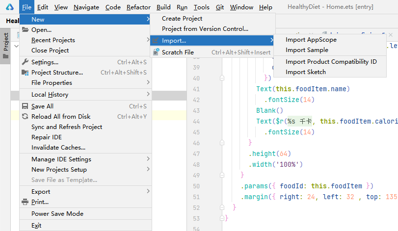
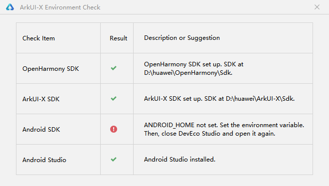
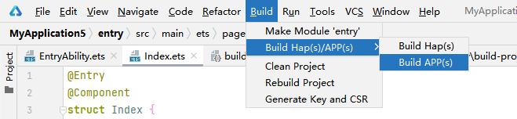
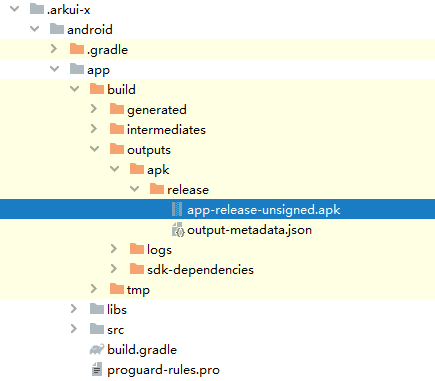
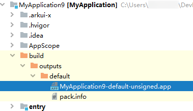
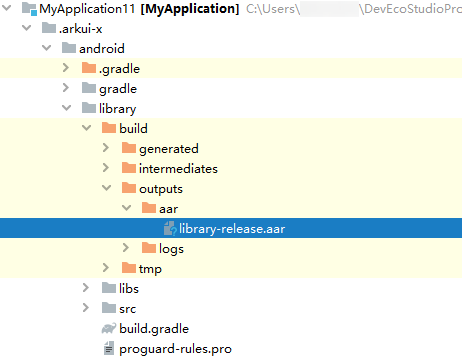

# Using DevEco Studio to Develop a Cross-Platform Application

## Developing a Cross-Platform Application

### Creating a Project

Import the ArkUI-X sample to DevEco Studio to quickly create a cross-platform project.

1. Choose **File > New > Import > Import Sample**.

   

2. Select **OpenHarmony** from the drop-down list box in the upper left corner, select **ArkUI-X/HelloWorld**, and click **Next**.

3. On the project configuration page, set **Project name** and **Project location**, click **Finish**, and wait until the sample project is imported.

To get the most out of DevEco Studio, run a diagnostic test on your development environment and fix the failed items based on the provided suggestions.

If a dialog box indicating a failed Android SDK check is displayed, check the configuration of the environment variables.

### Building a Cross-Platform Application

DevEco Studio can generate application packages for different platforms. Specifically, DevEco Studio running on Windows generates .apk packages that can run on Android devices in addition to application packages that can run on OpenHarmony devices. DevEco Studio running on iOS generates application packages that can run on iOS devices in addition to the preceding two types of packages.

1. On the menu bar of DevEco Studio, choose **Build &gt; Build Hap(s)/APP(s) &gt; Build APP(s)**.

   

   After the build is complete, an .apk file that can run on Android devices is generated in the **.arkui-x &gt; android &gt; app &gt; build &gt; outputs** directory. If macOS is in use, an application package that can run on iOS devices is generated in the **ios** directory.

   

   An application package that can run on OpenHarmony devices is generated in the **build** directory.

   

2. Open the **android** directory in Android Studio, push the build product package to a real Android device through Android Studio, and check the application running effect.

## Developing a Cross-Platform Dependency Package

You can build dependency packages for Android and iOS applications based on an OpenHarmony application. The dependency packages can be added to existing Android and iOS applications.

### Creating a Library

Import the ArkUI-X sample to DevEco Studio to quickly create a cross-platform project.

1. Choose **File > New > Import > Import Sample**.

   

2. Select **OpenHarmony** from the drop-down list box in the upper left corner, select **ArkUI-X/ArkUI-X_Library**, and click **Next**.

3. On the project configuration page, set **Project name** and **Project location**, click **Finish**, and wait until the sample project is imported.

### Building a Cross-platform Dependency Package

Based on an OpenHarmony application, DevEco Studio can generate dependency packages for different platforms. Specifically, DevEco Studio running on Windows generates an .aar package that can be integrated with Android applications. DevEco Studio running on iOS generates an .xcframework package that can be integrated with iOS applications in addition to the .aar package.

On the menu bar, choose **Build &gt; Build Hap(s)/APP(s) &gt; Build APP(s)**.

After the build is complete, the .aar package that can be integrated with Android applications is generated in the **.arkui-x &gt; android &gt; library &gt; build &gt; outputs** directory. If macOS is in use, an .xcframework package that can be integrated with iOS applications is generated in the **ios** directory.

