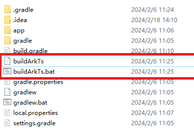

# How to Use Linkage Build on Android

## Overview

You can run the **ace create project** command on the CLI to create a project and generate scripts that can be built in a linkage manner. When you use Android Studio to develop an Android application, the ArkTS source code can be built in a linkage manner and the ArkTS products can be automatically copied to the Android project.

To use linkage build, perform the following steps:

- Manually configuring the ArkTS source code build switch
- Manually configuring the module to be built
- Manually configuring the file output path


## Compilation Configuration Description
#### Configuring the ArkTS Script Build Switch


Set **configBuildFlag** in the **.arkui-x/android/app/build.gradle** file to trigger linkage build of the ArkTS source code. The default value of **configBuildFlag** is **false**, indicating that the ArkTS script is not built.
```
// Linkage build switch.
def configBuildFlag = false

task ArkTSBuildTask {
  preBuild.dependsOn ArkTSBuildTask
  doLast {
    if (configBuildFlag) {
      def os = System.getProperty("os.name").toLowerCase()
      if (os.contains("win")) {
        exec {
          // Run this command on Windows to trigger linkage build.
          commandLine 'cmd', '/c', '.\\\\buildArkTs'
          workingDir file( project.projectDir.getAbsolutePath() + '\\\\..' )
        }
      } else {
        exec {
          // Run this command on Linux or macOS to trigger linkage build.
          commandLine 'sh', '-c', 'chmod +x ./buildArkTs && ./buildArkTs'
          workingDir file( project.projectDir.getAbsolutePath() + '/..' )
        }
      }
    }
  }
}
```

#### Configuring the Module to Be Built

Add a cross-platform module (module to build) to the **buildArkts** script in the Android project. By default, **entry** is built.

Example: moduleLists=entry,testmodule

```
moduleLists=entry
```

#### Configuring the Output Path of arkuix

Change the output path of the module in the **buildArkts** script of the Android project.
```
android_arkuix_path="$project_path/.arkui-x/android/app/src/main/assets/arkui-x"
```
#### Configuring the Output Path of systemRes

Change the output path of **systemRes** in the **buildArkts** script of the Android project.
```
android_systemRes_path="$project_path/.arkui-x/android/app/src/main/assets/arkui-x/systemres"
```
## Build Script Directory
Add the ArkTS build scripts to the **.arkui-x/android** directory.


