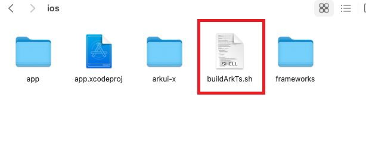

# How to Use Linkage Build on iOS


## Overview

You can run the **ace create project** command on the CLI to create a project and generate scripts that can be built in a linkage manner. When you use Xcode to develop an iOS application, the ArkTS source code can be built in a linkage manner and the ArkTS products can be automatically copied to the iOS project.

To use linkage build, perform the following steps:

- Manually configuring the ArkTS source code build switch
- Manually configuring the module to be built
- Manually configuring the file output path

## Compilation Configuration Description

#### Configuring the ArkTS Script Build Switch


Set **configBuildFlag** in the **Build Phases→Run My Script** file of Xcode to trigger linkage build of the ArkTS source code. The default value of **configBuildFlag** is **false**, indicating that the ArkTS script is not built.
```
# Linkage build switch.
configBuildFlag=false
if [ "$configBuildFlag" = "false" ]; then
    exit 0
fi
sh ${SRCROOT}/buildArkTs.sh
```

#### Configuring the Module to Be Built

Add a cross-platform module (module to build) to the **buildArkts** script in the iOS project. By default, **entry** is built.

Example: moduleLists=entry,testmodule

```
moduleLists=entry
```

#### Configuring the Output Path of arkuix

Change the output path of the module in the **buildArkts** script of the iOS project.
```
ios_arkuix_path="$project_path/.arkui-x/ios/arkui-x"
```

#### Configuring the Output Path of systemRes

Change the output path of **systemRes** in the **buildArkts** script of the iOS project.
```
ios_systemRes_path="$project_path/.arkui-x/ios/arkui-x/systemres"
```
## Build Script Directory

Add the ArkTS build scripts to the **.arkui-x/ios** directory.


