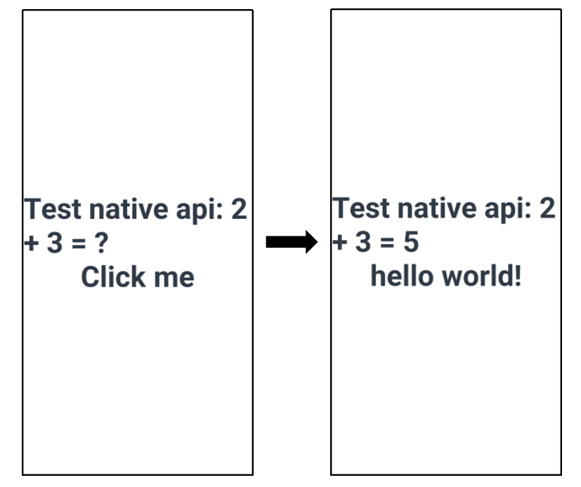

# How to Use N-APIs on Android

The N-APIs implement interaction between ArkTS/TS/JS and C/C++ (Native). For details about the N-APIs supported by ArkUI-X and their application scenarios, see [FFI (N-API)](../quick-start/ffi-napi-introduction.md). This tutorial uses the sample Native project in [ArkUI-X/Samples](https://gitee.com/arkui-x/samples) as an example to describe how to use N-APIs to implement cross-language invocation on Android.

## How to Develop

The development process is as follows:
1. Set up the environment, that is, obtain the Native project.
2. Implement Native APIs.<br>Use N-APIs to provide Native capabilities and enable Native APIs to call the methods passed by ArkTS/TS/JS.
3. Declare API definitions.<br>Add the declaration of the Native APIs exposed to ArkTS.
4. Call Native APIs.<br>Enable ArkTS/TS/JS to call Native APIs.
5. Build and run the application.<br>Build the application and run it on Android.

The following two examples are provided to describe the typical application scenarios of N-APIs by modifying the sample project:
1. Define a Native method named **Add**, which is called by ArkTS with two numbers passed in. The **Add** method adds the two numbers and returns the result to ArkTS. This example describes how to enable ArkTS to call Native methods.
2. Define a Native method named **NativeCallArkTS**, which is called by ArkTS with an ArkTS function passed in. The **NativeCallArkTS** method invokes this ArkTS function and returns the result to ArkTS. This example describes how to enable Native to call ArkTS methods.

### 1. Setting Up the Environment
Obtain the sample Native project from [ArkUI-X/Samples](https://gitee.com/arkui-x/samples) and use DevEco Studio (V4.0 Beta2 or later) to open the project. The opened project is automatically initialized.

### 2. Implementing Native APIs

Develop Native capabilities in N-APIs. In addition, **NativeCallArkTS** in this example demonstrates how Native invokes ArkTS.
```C++
// entry\src\main\cpp\hello.cpp contains the Native logic.
// Include the N-API header file.
#include "napi/native_api.h"

// Native method, which has only two input parameters. You do not need to modify them.
// napi_env is the current running context.
// napi_callback_info contains related information, including parameters passed from ArkTS.
static napi_value Add(napi_env env, napi_callback_info info)
{
    // Number of parameters to be obtained from ArkTS. napi_value can be regarded as the representation of the ArkTS value in the N-API method.
    size_t argc = 2;
    napi_value args[2] = {nullptr};
    
    // Obtain the parameters passed from ArkTS in info(). In this example, two ArkTS parameters, arg[0] and arg[1], are obtained.
    napi_get_cb_info(env, info, &argc, args , nullptr, nullptr);

    // Obtain the type of arg[0].
    napi_valuetype valuetype0 = napi_undefined;
    napi_typeof(env, args[0], &valuetype0);

    // Obtain the type of arg[1].
    napi_valuetype valuetype1 = napi_undefined;
    napi_typeof(env, args[1], &valuetype1);

    // Verify the input parameters. If the input parameters are not number, return undefined.
    if ((valuetype0 != napi_number) || (valuetype1 != napi_number)) {
        napi_value undefined = nullptr;
        napi_get_undefined(env, &undefined);
        return undefined;
    }

    // Convert the obtained ArkTS parameters to the type that can be processed by Native APIs. In this example, the two numbers passed from ArkTS are converted to the double type.
    double value0;
    napi_get_value_double(env, args[0], &value0);

    double value1;
    napi_get_value_double(env, args[1], &value1);
    
    // Native API service logic, which is adding two numbers in this example.
    double nativeSum = value0 + value1;
    
    // Convert the service logic processing result of the Native API to an ArkTS value and return the value to ArkTS.
    napi_value sum = nullptr;
    napi_create_double(env, nativeSum , &sum);
    return sum;
}

static napi_value NativeCallArkTS(napi_env env, napi_callback_info info)
{
    // Number of parameters to be obtained from ArkTS. napi_value can be regarded as the representation of the ArkTS value in the Native method.
    size_t argc = 1;
    napi_value args[1] = {nullptr};
    
    // From info(), obtain the parameters passed from ArkTS. In this example, one ArkTS parameter, arg[0], is obtained.
    napi_get_cb_info(env, info, &argc, args , nullptr, nullptr);

    // Obtain the type of arg[0].
    napi_valuetype valuetype = napi_undefined;
    napi_typeof(env, args[0], &valuetype);

    // Verify the input parameter type.
    if (valuetype != napi_function) {
        napi_value undefined = nullptr;
        napi_get_undefined(env, &undefined);
        return undefined;
    }
    
    // Create an ArkTS string as the input parameter of the ArkTS function.
    napi_value argv = nullptr;
    // Create a JS string.
    napi_create_string_utf8(env, "hello", NAPI_AUTO_LENGTH, &argv);
    
    napi_value result = nullptr;
    // Invoke the ArkTS function in the Native method, save the return value in result, and return result to ArkTS.
    napi_call_function(env, nullptr, args[0], 1, &argv, &result);
    
    return result;
}

EXTERN_C_START
// Init() hooks Native methods, such as Add and NativeCallArkTS, in exports. exports is an ArkTS object obtained after you import the Native APIs.
static napi_value Init(napi_env env, napi_value exports)
{
    // Function description struct. The third parameter "Add" is the Native method.
    // The first parameter "add" is the name of the ArkTS method.
    napi_property_descriptor desc[] = {
        { "add", nullptr, Add, nullptr, nullptr, nullptr, napi_default, nullptr },
        { "nativeCallArkTS", nullptr, NativeCallArkTS, nullptr, nullptr, nullptr, napi_default, nullptr },
    };
    // Hook the Native method to the ArkTS object exports.
    napi_define_properties(env, exports, sizeof(desc) / sizeof(desc[0]), desc);
    return exports;
}
EXTERN_C_END

// Information about the module. Record information such as the Init() function and module name.
static napi_module demoModule = {
    .nm_version =1,
    .nm_flags = 0,
    .nm_filename = nullptr,
    .nm_register_func = Init,
    .nm_modname = "entry",
    .nm_priv = ((void*)0),
    .reserved = { 0 },
};

// When the .so file is opened, the function is automatically called to register the demoModule module.
extern "C" __attribute__((constructor)) void RegisterHelloModule(void)
{
    napi_module_register(&demoModule);
}
```
### 3. Declaring API Definitions
Declare the Native APIs to be exposed to ArkTS in the d.ts file.
```js
// entry\src\main\cpp\types\libentry\index.d.ts contains the declaration of the Native APIs exposed to ArkTS.
// Declare the Native APIs to be exposed to ArkTS.
export const add: (a: number, b: number) => number;
export const nativeCallArkTS: (a: object) => string;
```

### 4. Calling Native APIs
Call Native APIs on ArkTS/TS/JS.
1. The **entry.add** API implements the ArkTS -> Native invocation.
2. The **entry.nativeCallArkTS** API implements ArkTS -> Native -> ArkTS invocation.
```js
// entry\src\main\ets\pages\Index.ets contains the ArkTS logic.
// Import the Native APIs.
import entry from 'libentry.so'

function TestFunction(str) {
  let ret = str + ' world!'
  return ret;
}

@Entry
@Component
struct Index {
  @State message: string = 'Test native api: 2 + 3 = ?'
  @State message2: string = 'Click me'

  build() {
    Row() {
      Column() {
        // The first button calls the add() method, which uses the Native Add() method to add the two numbers.
        Text(this.message)
          .fontSize(50)
          .fontWeight(FontWeight.Bold)
          .onClick(() => {
            this.message = "Test native api: 2 + 3 = " + entry.add(2, 3);
            console.log("Test NAPI 2 + 3 = " + entry.add(2, 3));
          })
        // The second button calls the nativeCallArkTS() method, which uses the Native NativeCallArkTS method to execute the ArkTS function.
        Text(this.message2)
          .fontSize(50)
          .fontWeight(FontWeight.Bold)
          .onClick(() => {
            this.message2 = entry.nativeCallArkTS(TestFunction);
          })
      }
      .width('100%')
    }
    .height('100%')
  }
}
```

### 5. Building and Running the Application
On DevEco Studio (V4.0 Beta2 or later), choose **Build** > **Build Hap(s)/APP(s)** > **Build APP(s)** to build the application. Use Android Studio to open the **.arkui-x\android** folder of the Native project and click **Run app** to run the application. After the application runs, click the texts on the page.


## Development Guidelines

### Registration

* To prevent conflicts with symbols in the .so file, add "static" to the function (such as the Init() function) corresponding to **nm_register_func**. 
* The entry of module registration, that is, the function name modified by **\_\_attribute\_\_((constructor))** (for example, the **RegisterHelloModule** function), must be unique.

### .so Naming Rules

The .so file names must comply with the following rules:

* Each module has a .so file.
* For example, if the module name is **entry**, the name of the .so file is **libentry.so**. The **nm_modname** field in **napi_module** must be **entry**. The case of the **nm_modname** field must be the same as that of the module name. When importing the module, use **import entry from 'libentry.so'**.

### Constraints on JS Object Threads

The ArkCompiler protects JS object threads. Improper use may cause an application crash. Observe the following rules:

* The N-APIs can be used only by JS threads.
* The Native API input parameter **env** is bound to the thread and cannot be used across threads. The JS object created by a Native API can be used only in the thread, in which the object is created, that is, the JS object is bound to the **env** of the thread.

### Header File Import

Import **napi/native_api.h**. Otherwise, an error indicating that the N-API cannot be found will be reported.
