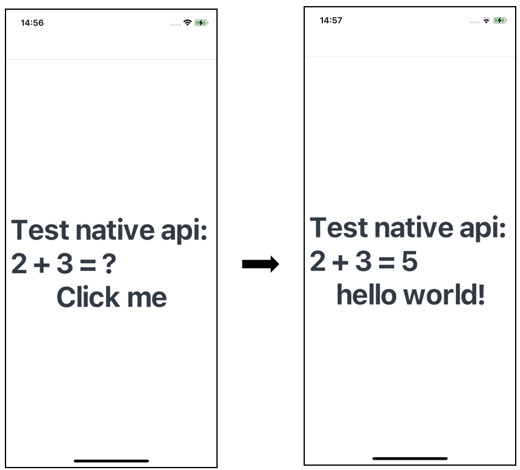

# How to Use N-APIs on iOS

The N-APIs implement interaction between ArkTS/TS/JS and C/C++ (Native). For details about the N-APIs supported by ArkUI-X and their application scenarios, see [FFI (N-API)](../quick-start/ffi-napi-introduction.md). The use of N-APIs on iOS is the same as that on Android except the build and running of applications. This tutorial elaborates how to build and run an application using N-APIs on iOS platform. For details about other steps, see [Using N-APIs on Android](./how-to-use-napi-on-android.md).

### Building and Running the Application
Different from the application build and running on Android, the Native projects built and run on iOS must be signed. The procedure is as follows:
1. On DevEco Studio (V4.0 Beta2 or later), choose **Build** > **Build Hap(s)/APP(s)** > **Build APP(s)** to build an application.
2. Use the Xcode tool to open the **.arkui-x\ios** file and sign the file using Xcode.
! [signing](./figures/napi-ios-signing.png)

3. Click the **Run** button in Xcode to run the application.

