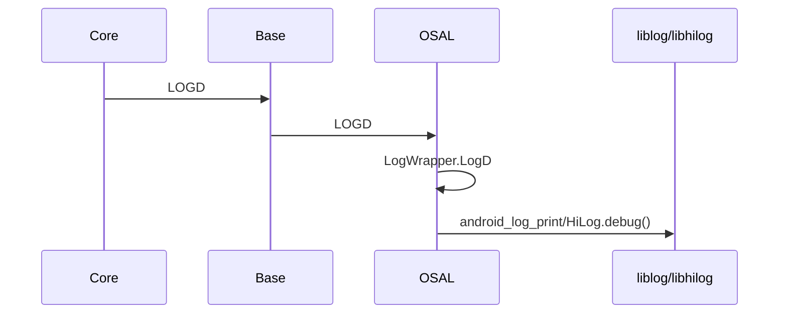
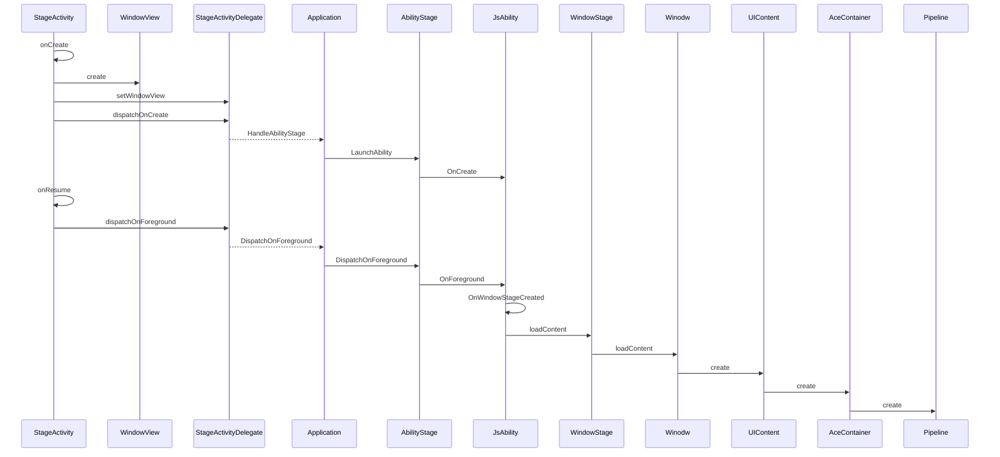
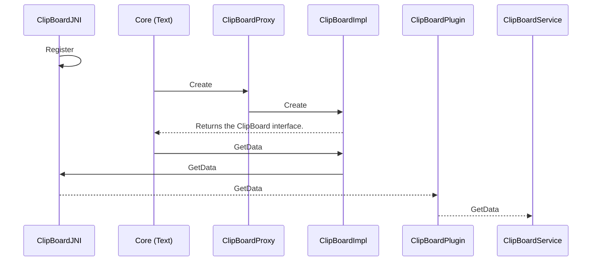

# ArkUI Cross-Platform Design

## Overview

This document describes the overall technical solution related to the cross-platform running capabilities of the ArkUI development framework.

### Scope

ArkUI is a UI development framework oriented to all devices and has been opened up through OpenHarmony. It consists of the following:
  - Development models
  - Application interface & interaction
  - Mechanisms that extend third-party component and platform APIs

ArkUI-X extends the ArkUI development framework to other OS platforms (such as Android, iOS, and Windows). This way, you can reuse most of the application code (UI and main application logic) based on ArkUI and deploy the code on different OS platforms.

### Assumptions and Constraints

The cross-platform capabilities mentioned in this document refer to UI capabilities (that is, reuse of the UI code). The platform capabilities on which applications depend must be adapted at the application layer or exposed to the JS layer through the Native API (NAPI), the JS API encapsulation mechanism.

For details about the JS APIs related to platform capabilities (such as network and storage APIs), see definitions in OpenHarmony. The JS APIs must be encapsulated on different platforms for reuse.

This document uses the Android OS as an example to describe the general solution design of ArkUI. The design ideas for other platforms are similar.

## Overall ArkUI Design

 

Cross-platform is one of the most basic design objectives of ArkUI from the beginning. Currently, the basic cross-platform architecture is available. The design ideas are as follows:

1. Write the backend engine code in C++ to ensure multi-platform portability, minimize platform dependence, and reduce porting costs.
2. Use custom rendering to reduce platform dependence and further improve drawing effect consistency.
3. Abstract the platform adaptation layer and platform bridging layer for adaptation to different platforms.

## Modules

ArkUI consists of the following modules:

1. Cross-platform development models: compatible with the stage model of OpenHarmony applications and support the declarative development paradigm based on ArkTS.
2. Platform-independent declarative UI backend engines: include engines for layout, rendering, C++ UI components, and event mechanism.
3. NAPI-based API extension mechanism: You need to implement the APIs for the target platform.
4. Toolchain/SDK: The toolchain is platform independent, but the SDK must be built based on the target platform.

In addition, the ArkTS engine and graphics engine on which ArkUI depends can be used across platforms.

The ArkUI declarative UI backend engines provide pipeline process control, view update, layout system, multi-page management, event distribution and callback, focus management, animation mechanism, theme mechanism, and resource management/cache/provider. The UI components are flexibly assembled to meet different frontend needs through fine-grained display components and combination of animation, event, and focus mechanisms.

The cross-platform capabilities are implemented by extending the ArkUI development framework to other OS platforms to reduce multi-platform application development costs.

You can use ACE Tools to create a cross-platform application project and develop applications that support multiple platforms based on a set of main code.


## Solution Design

### Cross-Platform Application Structure

The cross-platform application directory consists of a set of application project templates that help build OpenHarmony, Android, and iOS applications. The application project structure is designed as follows:

```
ArkUI-X application project
  ├── .arkui-x
  │   ├── android                 // Android-related code
  │   └── ios                     // iOS-related code
  ├── .hvigor
  ├── .idea
  ├── AppScope
  ├── entry
  ├── hvigor
  ├── oh_modules
  ├── build-profile.json5
  ├── hvigorfile.ts
  ├── local.properties
  └── oh-package.json5
```

The ArkUI-X application directory structure is based on the following design idea:<br>OpenHarmony application projects + Android/iOS application projects<br>The OpenHarmony application projects support cross-platform development by nature. The ArkTS code and resources are developed on OpenHarmony, and Native code is developed in the application project of each platform. For details about the application project structure design, see [ArkUI-X Application Project Structure] (../../application-dev/quick-start/package-structure-guide.md).

### Cross-Platform Building System
The ArkUI-X build is based on GN and Ninja. It consists of the basic building (implemented by the OpenHarmony build repository) and Android/iOS compilation toolchains (facilitating ArkUI cross-platform SDK compilation).

### Cross-Platform SDK Structure
The cross-platform SDK is used to build cross-platform applications using ACE Tools and integrate DevEco Studio, Android Studio, and Xcode for cross-platform application development. The cross-platform SDK provides:
1. Dynamic libraries of the ArkUI basic engines and API plug-in dynamic library.
2. A CLI tool (ACE Tools) for building cross-platform applications.
3. A system resource package for ArkUI component rendering consistency and an application resource compilation tool.

The ArkUI-X SDK structure is as follows:

```
arkui-x
  ├── engine                   // ArkUI-X engines
  │   ├── lib                  // Dynamic library of the Android platform and architecture
  │   ├── framework            // Framework library of the iOS platform and architecture
  │   ├── xcframework          // XCFramework library of the iOS platform and architecture
  │   ├── ets                  // ArkUI-X incremental APIs, for example, @arkui-x.bridge
  │   ├── apiConfig.json       // Engine library configuration file, which is parsed by DevEco Studio and ACE Tools to support on-demand packing during application build
  │   └── systemres            // Resources provided by ArkUI-X
  ├── plugins                  // Plug-ins provided by ArkUI-X
  │   ├── component            // ArkUI component plug-in library and engine library configuration file apiConfig.json
  │   └── api                  // @ohos API plug-in library and the apiConfig.json file
  ├── toolchains               // ArkUI-X application development tool, for example, ACE Tools
  ├── sdkConfig.json           // Incremental d.ts path and API prefix configuration
  ├── arkui-x.json             // SDK management configuration, which is automatically generated by the pipeline
  └── NOTICE.txt
```

For details about the ArkUI-X SDK structure, see [ArkUI-X SDK Directory Structure](../../application-dev/quick-start/sdk-structure-guide.md).

### OSAL

The OS abstract layer (OSAL) implemented based on C++ shields OS-related implementations of different platforms. It provides the following functions:

- Log and trace abstraction layer
- Network interface abstraction layer
- File/Resource read/write abstraction layer
- Basic thread abstraction layer
- Abstraction and implementation of system resource management
- System Prop configuration reading abstraction layer
- Logging capability abstraction layer

The figure below illustrates the log interaction process.



The Core module uses the APIs provided by the Base module. The Base module defines APIs. The OSAL of the related OS is selected during compilation for platform-dependent capabilities. During the OSAL implementation, the platform library is called to provide the related capabilities. 

 
### Cross-Platform Startup Entry

The development framework provides basic entry environments for different platforms based on the entrance implemented in the platform's programming language. The cross-platform startup entry provides the following functions:

- Provides loading entries for different platforms, for example, an ability for OpenHarmony and an activity for Android.

- Streamlines the lifecycle, event input, and Vsync of different platforms.

- Streamlines the window systems of different platforms and hardware rendering acceleration.

- Streamlines the application information of different platforms.

- Converts native languages of different platforms to C++ backend for reuse of the common code.

The figure below illustrates the interactions for the Android startup process.



In the stage model, the entry of the ability lifecycle is **StageAbility**. The JsAbility is notified of the lifecycle to execute the lifecycle callback of the user. When **loadContent()** of **Window** in the **onWindowStageCreated** lifecycle is called, the UI page is loaded. Then, an ArkUI instance is created and the rendering pipeline is initialized to render the page.


### Cross-Platform Capability Bridging

Cross-platform capability bridging streamlines capability modules of different platforms required by the framework, such as clipboard, input method, and video. It defines basic capability modules, and the functional modules are implemented based on the definitions on different platforms. Cross-platform capability bridging provides:

- Clipboard abstract interface and implementations for different platforms
- Input method abstract interface and implementations for different platforms
- Video media abstract interfaces, and implementations for different platforms
- Capability modules of different platforms required by other frameworks

The figure below illustrates the clipboard interaction process.




The TextField component at the framework core layer uses the clipboard capability. The proxy creates the clipboard implementation and returns the abstract clipboard interface. Then, platform-independent invoking can be implemented at the component implementation layer. Take the Android platform as an example. **GetData()** is called to the plug-in implemented by the platform through JNI. Then the plug-in accesses the clipboard service to implement related functions.


### API Extension Mechanism

The JS API extension mechanism is used to expose Native APIs to the JS layer. This mechanism reuses the unified encapsulation mechanism of OpenHarmony. It extends APIs (implemented by C++) and implements some built-in APIs. The figure below shows the overall structure of the NAPI.

The JS APIs must comply with OpenHarmony API definitions and be extended on different platforms using the API extension mechanism.


### ACE Tools

As an ArkUI-X cross-platform application building tool, ACE Tools can be used to create, build, install, run, and debug OpenHarmony, Android, and iOS applications.

```
ACE Tools code structure
 cli
  ├─node_modules
  ├─src
  │  ├─ace-build                 // Build a cross-platform application installation package.
  │  │  ├─ace-compiler
  │  │  └─ace-packager
  │  ├─ace-check                 // Check whether the libraries and toolchains on which the ArkUI cross-platform application development depends are complete.
  │  ├─ace-clean                 // Clear the cross-platform application build result.
  │  ├─ace-config                // Configure the ArkUI cross-platform application development environment.
  │  ├─ace-create                // Create an ArkUI cross-platform application project.
  │  │  ├─aar
  │  │  ├─ability
  │  │  ├─component
  │  │  ├─framework
  │  │  ├─module
  │  │  └─project
  │  ├─ace-devices               // List the platform devices connected to the current PC.
  │  ├─ace-install               // Install the cross-platform application to the connected device.
  │  ├─ace-launch                // Run the cross-platform application on the device.
  │  ├─ace-log                   // Display the log of the application in running in scrolling mode.
  │  ├─ace-run                   // Run the cross-platform application package.
  │  ├─ace-test                  // Run the test code.
  │  ├─ace-uninstall             // Uninstall the cross-platform application from the device.
  │  ├─bin                       // CLI entry script.
  │  └─util
  └─templates                    // Cross-platform application project templates.
```
