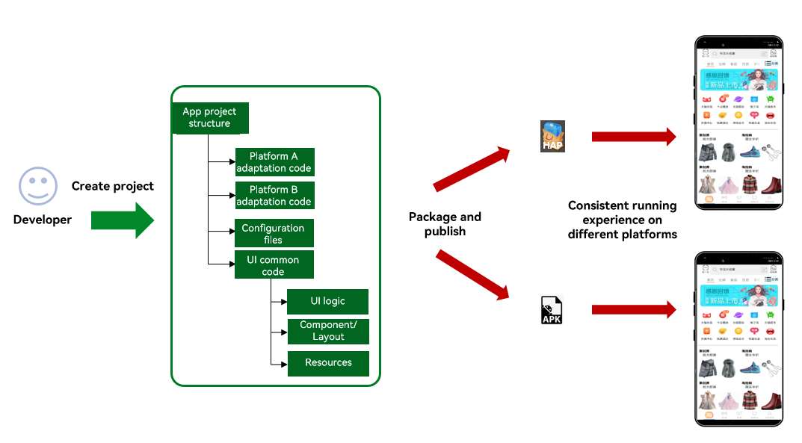
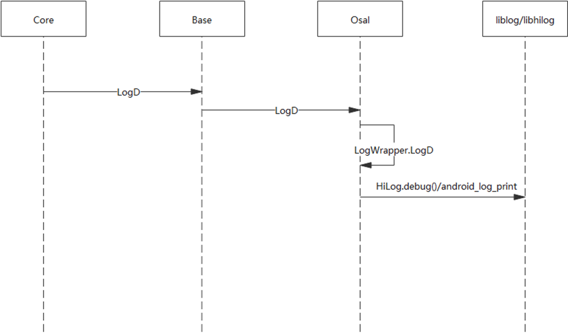
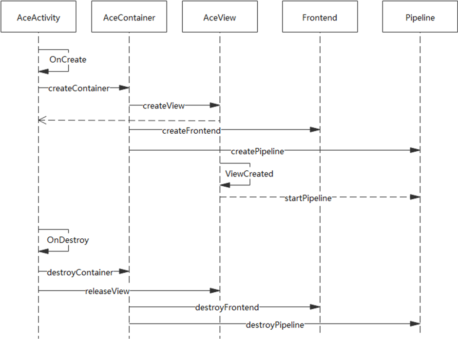
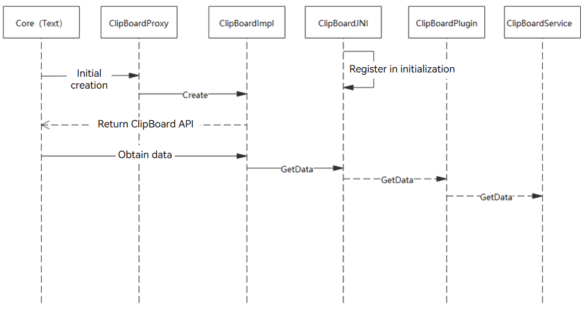
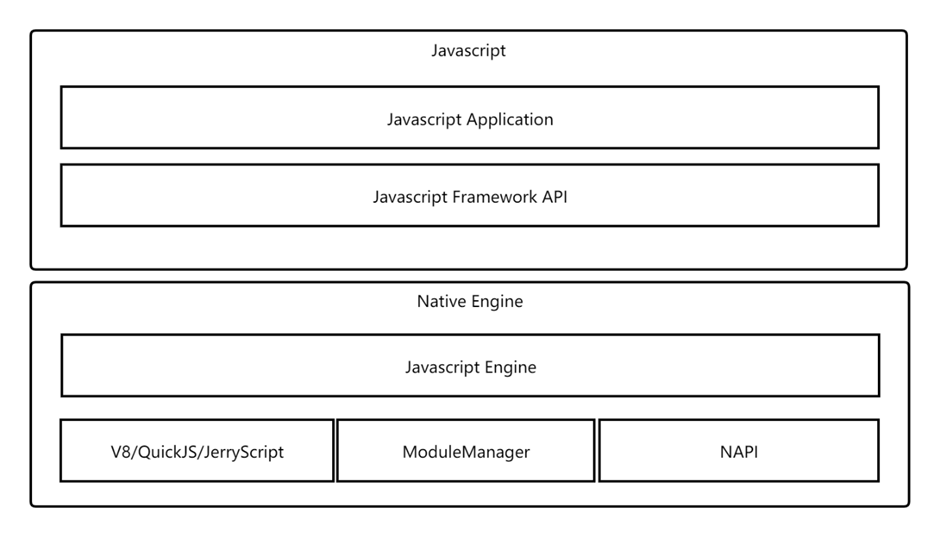

# ArkUI Cross-Platform Design

## Overview

### Scope

This document describes the overall technical solution related to the cross-platform running capabilities of the ArkUI development framework.

ArkUI is a UI development framework oriented to all devices and has been opened up through the OpenHarmony code repository. This framework includes development models, application interfaces & interactions, and the extension mechanism that enables extension of third-party component and platform APIs.

The ArkUI-X project aims to extend the ArkUI development framework to other OS platforms (such as Android, iOS, and Windows) so that developers can reuse most application code (UI and main application logic) on the target OS platforms.

### Assumptions and Constraints

The cross-platform capabilities mentioned in this document refer to the UI capabilities, which allow reuse of the UI code. The platform-specific capabilities on which applications depend must be adapted at the application layer or exposed to the JS layer through the Native API (NAPI), the JS API encapsulation mechanism.

For details about the JS APIs related to platform capabilities (such as network and storage APIs), see the definitions in OpenHarmony. The JS APIs must be encapsulated on different platforms for reuse.

This document uses the Android platform as an example to describe the general solution design. The design ideas for other platforms are similar.

## Overall ArkUI Design

 

Cross-platform is one of the objectives of ArkUI from the beginning of the design. Currently, the basic cross-platform architecture is available. The design ideas are as follows:

- C++ is used to write the backend engine code to ensure multi-platform portability, minimize platform dependency, and reduce porting costs.
- Custom rendering is used to reduce platform dependency and further improve drawing effect consistency.
- The platform adaptation layer and platform bridging layer are abstracted for adaptation to different platforms.

## Modules

ArkUI consists of the following modules:

- R&D model, supporting ArkTS-based declarative development paradigm. It is platform independent.
- Declarative UI backend engine, including layout, rendering, C++ UI components, and event mechanism. It is platform independent.
- NAPI-based API extension mechanism, which is platform independent. Developers must implement the extended APIs on the target platform.
- Toolchain/SDK. The toolchain is platform independent, but the SDK must be built based on the target platform.

The JS/TS engine and graphics engine on which ArkUI depends are also platform independent.

The ArkUI declarative UI backend engine provides pipeline process control, view update, layout system, multi-page management, event distribution and callback, focus management, animation mechanism, theme mechanism, and resource management/cache/provider. The UI components are flexibly assembled to meet different frontend needs through fine-grained display components and combination of animation, event, and focus mechanisms.

The cross-platform capabilities are implemented by extending the ArkUI development framework to other OS platforms. This helps reduce multi-platform application development costs.

The figure below illustrates how the CLI tool helps develop high-performance applications across different OS platforms based on a set of code.




## Solution Design

### Cross-Platform Application Package Structure

The cross-platform application directory provides a set of application project templates for ArkUI-X developers to build OpenHarmony, Android, and iOS applications. The directory structure of cross-platform application project layer 0 is as follows:

```
ArkUI-X AppProject
  ├── ohos              // OpenHarmony code 0-1
  │   └── entry
  ├── android           // Android code 0-2
  │   └── app
  ├── ios               // iOS code 0-3
  │   └── app
  └── source            // ArkUI source code 0-4
      └── entry
```

The project root directory contains the **ohos**, **android**, **ios**, and **source** directories for OpenHarmony applications, Android applications, iOS applications, and ArkUI source code, respectively. The **entry** and **app** directories in each directory are directories for created modules (**entry** and **app** are default module names). Each module corresponds to a build unit (hap, apk, or app). **source** is the default directory of OpenHarmony. It contains common code in the ArkTS-based declarative development paradigm. The command code and the OS platform code build applications for the target platform.

* OpenHarmony platform project structure (0-1)

```
OpenHarmony platform code
  ├── .hvigor
  ├── entry
  │   ├── src
  │   │   ├── main
  │   │   │   ├── ets
  │   │   │   ├── resources
  │   │   │   └── config.json
  │   │   └── ohosTest
  │   ├── build-profile.json5
  │   ├── hvigorfile.js
  │   └── package.json
  ├── node_modules
  ├── build-profile.json5
  ├── hvigorfile.js
  ├── local.properties
  └── package.json
```

* Android platform project structure (0-2)

```
Android platform code
  ├── app
  │   ├── libs
  │   │   ├── ace_android_adapter.jar               // ArkUI cross-platform adaptation layer, published in the SDK
  │   │   └── arm64-v8a
  │   │       ├── libace_android.so                 // ArkUI engine library, published in the SDK
  │   │       ├── libace_napi.so                    // API extension library, published in the SDK
  │   │       ├── libace_napi_ark.so                // Ark JS engine library, published in the SDK.
  │   │       └── libxxx.so                         // Other functional module library
  │   ├── src
  │   │   ├── androidTest
  │   │   ├── main
  │   │   │   ├── assets                            // Resource files, including JS bundle and resources generated after ArkUI compilation
  │   │   │   │   ├── js
  │   │   │   │   │   └── entry_MainAbility         // JS bundle, generated after the compilation of the code in the source directory
  │   │   │   │   └── res                           // Resources
   │   │   │   │       ├── appres                    // Application resources, generated after the compilation of the code in the source/resources directory
  │   │   │   │       └── systemres                 // System resources
  │   │   │   ├── java/com/example/myapp
  │   │   │   │   ├── MyApplication.java            // MyApplication extended from AceApplication
  │   │   │   │   └── MainActivity.java             // MainActivity extended from AceActivity
  │   │   │   ├── res
  │   │   │   └── AndroidManifest.xml
  │   │   └── test
  │   ├── build.gradle
  │   └── proguard-rules.pro
  ├── gradle/wrapper
  ├── build.gradle
  ├── gradle.properties
  ├── gradlew
  ├── gradlew.bat
  └── settings.gradle
```

* iOS platform project structure (0-3)

```
iOS platform code
  ├── myapp.xcodeproj
  │   ├── project.xcworkspace
  │   └── project.pbxproj
  ├── myapp
  │   ├── Assets.xcassets
  │   ├── base.Iproj
  │   ├── AppDelegate.h
  │   ├── AppDelegate.mm              // AceViewController instance, loaded with JS bundle and resources
  │   ├── Info.plist
  │   └── main.m
  ├── js                              // ArkUI JS bundle, generated after compilation of the ArkUI source code in the source directory
  │   └── entry_MainAbility
  ├── res                             // Resources
  │   ├── appres                      // Application resources, generated after the compilation of the code in the source/resources directory.
  │   └── systemres                   // System resources
  └── framework                       // ArkUI cross-platform framework dynamic library
      └── libace_ios.xcframework
```

* ArkUI source code directory (0-4)

```
source
  └── entry/src
      ├── main
      │   ├── ets
      │   │   └── MainAbility
      │   │       ├── app.ets
      │   │       ├── manifest.json
      │   │       └── pages
      │   └── resources
      └── ohosTest
```

### Cross-Platform SDK Structure
The ArkUI-X project provides a compilation and building framework based on GN and Ninja. The basic building process (a fork of OpenHarmony build repository) and Android and iOS compilation toolchains implement cross-platform compilation and build via the SDK. The cross-platform SDK is used to build cross-platform applications on the CLI and integrate DevEco Studio, Android Studio, and Xcode for cross-platform application development. The cross-platform SDK provides:
1. Basic engine dynamic library and JS runtime dynamic library of the ArkUI cross-platform development framework
2. A CLI tool for building cross-platform applications
3. A system resource package for ArkUI component rendering consistency and an application resource compilation tool

* ArkUI-X project cross-platform SDK directory structure

```
ArkUI-X project SDK 
  ├── libs                                                               // ArkUI cross-platform engine and platform adaptation layer
  │   ├── android-arm64
  │   │   ├── engine
  │   │   │   ├── ace_android.jar                                        // ArkUI-X Android platform adaptation layer
  │   │   │   ├── arm64-v8a
  │   │   │   └── libace_android.so                                      // Dynamic library of the ArkUI cross-platform engine
  │   │   └── plugins
  │   │       ├── ${module-name}
  │   │       │   ├── ace_ohos_${module-name}.jar
  │   │       │   └── libace_ohos_${module-name}.so
  │   │       └── ${module-name2}
  │   └── ios-arm64
  │       ├── engine
  │       │   ├── xcframework                                            // ArkUI cross-platform XCFramework dynamic library
  │       │   │   └── libace_ios.xcframework
  │       │   │       ├── Info.plist
  │       │   │       └── ios-arm64
  │       │   │           └── libace_ios.framework
  │       │   │               ├── Headers
  │       │   │               │   ├── Ace.h
  │       │   │               │   ├── AceViewController.h
  │       │   │               │   └── FlutterPlugin.h
  │       │   │               ├── Info.plist
  │       │   │               ├── libace_ios
  │       │   │               ├── libace_ios.podspec
  │       │   │               └── Modules
  │       │   │                   └── module.modulemap
  │       │   └── framework
  │       │       └── libace_ios.framework
  │       └── plugins
  │           ├── ${module-name}
  │           │   ├── xcframework
  │           │   │   └── libace_ohos_${module-name}.xcframework
  │           │   └── framework
  │           │       └── libace_ohos_${module-name}.framework
  │           └── ${module-name2}
  ├── toolchains                                                         // ArkUI-X cross-platform application build command line tools
  │   └── cli
  ├── systemres                                                          // System resource package for ArkUI component rendering consistency.
  ├── licenses
  └── readme.md
```

### OSAL

The OS abstract layer (OSAL), implemented based on C++, shields OS-related implementations of different platforms and provides the following:

- Log and trace abstraction layer
- Network interface abstraction layer
- File/Resource read/write abstraction layer
- Basic thread abstraction layer
- Abstraction and implementation of system resource management
- System Prop configuration reading abstraction layer
- Logging capability abstraction layer

The figure below illustrates the log interaction process.




The Core module uses the APIs provided by the Base module. The Base module defines APIs. The OSAL of the related OS is selected during compilation for platform-dependent capabilities. During the OSAL implementation, the platform library is called to provide the related capabilities. 


### Cross-Platform Startup Entry

The development framework provides basic entry environments for different platforms based on the entrance implemented in the platform's programming language. The cross-platform startup entry provides the following functions:

- Provides loading entries for different platforms, for example, an ability for OpenHarmony and an activity for Android.

- Streamlines the lifecycle, event input, and Vsync of different platforms.

- Streamlines the window systems of different platforms and hardware rendering acceleration.

- Streamlines the application information of different platforms.

- Converts native languages of different platforms to C++ backend for reuse of the common code.


The figure below illustrates the interactions for the Android startup process.




### Cross-Platform Capability Bridging

Cross-platform capability bridging streamlines capability modules of different platforms required by the framework, such as clipboard, input method, and video. It defines basic capability modules, and the functional modules are implemented based on the definitions on different platforms. Cross-platform capability bridging provides:

- Clipboard abstract interface and implementations for different platforms
- Input method abstract interface and implementations for different platforms
- Video media and camera abstract interfaces, and implementations for different platforms
- WebView abstract interface and implementations for different platforms
- RichText abstract interface and implementations for different platforms
- Implementation of XComponent for different platforms
- Capability modules of different platforms required by other frameworks

The figure below illustrates the clipboard interaction process.





The TextField component at the framework core layer uses the clipboard capability. The proxy creates the clipboard implementation and returns the abstract clipboard interface. Then, platform-independent invoking can be implemented at the component implementation layer. Take the Android platform as an example. **GetData()** is called to the plug-in implemented by the platform through JNI. Then the plug-in accesses the clipboard service to implement related functions.


### API Extension Mechanism

The JS API extension mechanism is used to expose native interface capabilities to the JS layer. This mechanism reuses the unified encapsulation mechanism of OpenHarmony. It extends APIs (implemented by C++) and implements some built-in APIs. The figure below shows the overall structure of the NAPI.

The JS APIs must comply with OpenHarmony API definitions and be extended on different platforms using the API extension mechanism.




### Cross-Platform CLI

As a cross-platform application building tool for the ArkUI-X project, the CLI can be used to create, compile, install, run, and debug OpenHarmony, Android, and iOS applications.

```
CLI code structure
  ├── cli
  │   ├── src                  // CLI code implementation
  │   │   ├── ace-check        // Check whether the dependent libraries and toolchains are complete
  │   │   ├── ace-config       // Configure the ArkUI cross-platform application development environment
  │   │   ├── ace-devices      // List all the devices connected to the current PC
  │   │   ├── ace-create       //  Create an ArkUI cross-platform application project
  │   │   ├── ace-build        // Build a cross-platform application installation package
  │   │   ├── ace-install      // Install a cross-platform application to the connected device
  │   │   ├── ace-launch       // Run a cross-platform application on a device
  │   │   ├── ace-run          // Run a cross-platform application package
  │   │   ├── ace-clean        // Clear the build result of a cross-platform application
  │   │   ├── ace-uninstall    // Uninstall a cross-platform application from a device
  │   │   └── ace-log          // Display the logs of the running cross-platform application in scrolling mode
  │   ├── templates            // Cross-platform templates, including templates of OpenHarmony, Android, iOS, and source
  │   ├── bin                  // CLI entry script
  │   ├── package.json
  │   ├── rollup.config.js
  │   └── README.md
  ├── README.md
  └── LICENSE
```
