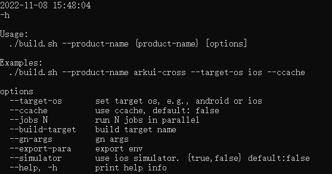

# Building an ArkUI-X Project

- The build command supports the following options:

  ```shell
  --product-name    # (Mandatory) Product name, for example, **arkui-cross**
  --target-os       # (Mandatory) Target platform, for example, Android or iOS
  --build-target    # (Optional) One or more targets to build
  --gn-args         # (Optional) One or more GN parameters
  --ccache          # (Optional) Compiler cache (ccache) used for the build. A local ccache must be installed.
  --help, -h        # (Optional) Help command
  ```
  - Obtain help information

  ```shell
  ./build.sh -h
  ```
   

- Examples

  - Build on the Android platform:

  ```shell
  ./build.sh --product-name arkui-cross --target-os android --ccache
  ```

  - Build on the iOS platform:

  ```shell
  ./build.sh --product-name arkui-cross --target-os ios --ccache
  ```
