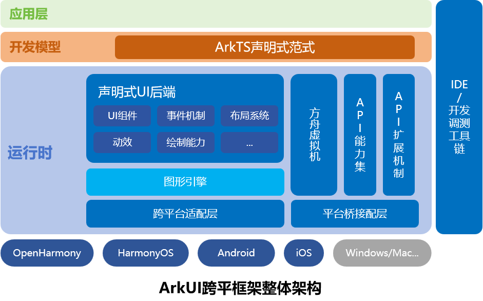

# ArkUI-X项目概览

## 项目介绍

ArkUI是一套构建分布式应用的声明式UI开发框架。它具备简洁自然的UI信息语法、丰富的UI组件、多维的状态管理，以及实时界面预览工具，帮助您提升应用开发效率，并能在多种设备上实现生动而流畅的用户体验。

ArkUI-X项目进一步将ArkUI扩展到了多个OS平台：目前支持OpenHarmony、HarmonyOS、Android、 iOS，后续会逐步增加更多平台支持。开发者基于一套主代码，就可以构建支持多平台的精美、高性能应用。

## 关键特征

ArKUI跨平台框架关键特征如下：

1. 简洁自然的声明式语法。
2. 高效的渲染管线以及平台一致性的渲染机制。
3. 高效的方舟编译器以及运行时。
4. 统一的跨平台API能力集以及扩展机制。
5. 多范式支持 – 声明式范式；类Web范式。

## 技术架构

ArkUI跨平台框架整体架构如下图所示，详细设计请参考[ArkUI跨平台设计总体说明](./framework-dev/design/design-overview.md)。

## 快速入门

* [应用开发快速入门](application-dev/quick-start/start-overview.md)

* [框架开发快速入门](framework-dev/quick-start/start-overview.md)

## 代码仓地址

ArkUI-X主库组织地址：https://gitee.com/arkui-x

## 演进路线

[ArkUI跨平台框架演进路线图](roadmap/ArkUI-X-roadmap.md)

## 源码下载

获取ArkUI-X源码：[下载说明](https://gitee.com/arkui-x/manifest/blob/master/README.md)

## 示例教程

Samples：[示例代码](https://gitee.com/arkui-x/samples)

## 如何参与

参与社区：[社区介绍](https://gitee.com/arkui-x/community)

参与贡献：[如何贡献](contribute/README.md)

## 许可协议

ArkUI-X主要遵循Apache License V2.0协议，详情请参考各代码仓LICENSE声明。

ArkUI-X引用三方开源软件及许可证说明，请参考[第三方开源软件说明](contribute/open-source-software-and-license-notice.md)。

## 联系方式

请参考：[社区沟通与交流](contribute/communication-in-community.md)

