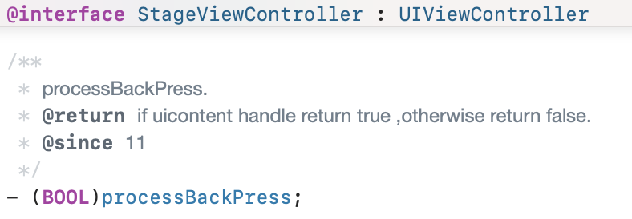

# IOS跨平台页面实现手势返回指南

## 简介

本文介绍将介绍如何实现跨平台页面层级之间的侧滑手势返回，以及当跨平台页面已经是根页面时如何侧滑返回上级原生页面。

## iOS原生页面之间实现侧滑手势返回

### UINavigationController实现侧滑手势返回

界面UI结构如果是包裹在UINavigationController中，则可以直接使用UINavigationController的侧滑返回实现

```objc
@interface GestureTestStageViewController ()<UIGestureRecognizerDelegate>
@end

@implementation GestureTestStageViewController
- (void)viewDidLoad {
    [super viewDidLoad];
    
    // 获取导航控制器的交互式弹出手势
    UIGestureRecognizer *gesture = self.navigationController.interactivePopGestureRecognizer;
    gesture.delegate = self;
}

// 手势识别方法
- (BOOL)gestureRecognizerShouldBegin:(UIGestureRecognizer *)gestureRecognizer {
    if (gestureRecognizer == self.navigationController.interactivePopGestureRecognizer) {
        // 在这里可以拦截侧滑返回事件
        // 返回YES允许手势继续，NO则阻止
        return YES;
    }
    return YES;
}
```

### 添加自定义手势识别侧滑返回

如果界面UI结构未包裹在UINavigationController中，则可以在StageViewController添加自定义手势识别侧滑返回，并做相关处理

```objc
@implementation GestureTestStageViewController
- (void)viewDidLoad {
    [super viewDidLoad];
    
    // 创建自定义滑动手势
    UIScreenEdgePanGestureRecognizer *edgePan = [[UIScreenEdgePanGestureRecognizer alloc] initWithTarget:self action:@selector(handleEdgePanGesture:)];
    edgePan.edges = UIRectEdgeLeft; // 从左边缘滑动
    [self.view addGestureRecognizer:edgePan];

}
- (void)handleEdgePanGesture:(UIScreenEdgePanGestureRecognizer *)gesture {
    if (gesture.state == UIGestureRecognizerStateEnded) {
        NSLog(@"侧滑返回手势结束");
        // 可以在这里实现页面返回操作
    }
}
```

## ArkUI-X提供的跨平台页面返回接口

ArkUI-X跨平台开发中，框架通过StageViewController提供了一个可以操作跨平台页面返回上级页面的方法processBackPress。

该方法可以操作跨平台页面返回上级页面

调用该方法时，返回值代表是否操作跨平台页面返回上级页面成功。返回true说明操作页面返回成功，返回false说明操作页面返回失败，一般是当前页面已经是根页面时则无法返回，此时调用该方法返回false。




## 调用processBackPress方法实现跨平台页面的侧滑手势返回

如果容器类StageViewController在iOS原生中是包含在UINavigationController中，则在StageViewController中增加UINavigationController的侧滑返回实现，并在手势的响应方法中调用processBackPress方法。

当processBackPress方法调用成功，返回为true，则表示已操作跨平台页面返回上级页面。则原生侧StageViewController不用返回，gestureRecognizerShouldBegin方法返回NO。

当processBackPress方法调用返回为false，则表示跨平台页面已是跟页面，无法返回。则原生侧从StageViewController返回上级ViewController页面，gestureRecognizerShouldBegin方法返回YES。

```objc
@interface GestureTestStageViewController ()<UIGestureRecognizerDelegate>
@end

@implementation GestureTestStageViewController
- (void)viewDidLoad {
    [super viewDidLoad];
    
    // 获取导航控制器的交互式弹出手势
    UIGestureRecognizer *gesture = self.navigationController.interactivePopGestureRecognizer;
    gesture.delegate = self;
}

// 手势识别方法
- (BOOL)gestureRecognizerShouldBegin:(UIGestureRecognizer *)gestureRecognizer {
    if (gestureRecognizer == self.navigationController.interactivePopGestureRecognizer) {
        // 在这里可以拦截侧滑返回事件
        // 返回YES允许手势继续，NO则阻止
        if ([self processBackPress]) {
            return NO;
        } else {
            return YES;
        }
    }
    return YES;
}
```

如果容器类StageViewController在界面UI结构中未包裹在UINavigationController中，则可以在StageViewController添加自定义手势识别侧滑返回，并在手势实现中调用processBackPress方法。

同样的如果processBackPress方法返回ture，则代表跨平台页面成功返回上级页面，手势实现中不用做其他操作。如果返回false，则代表跨平台页面已是根页面，无法返回，此种情况下需添加原生侧返回上级页面的处理逻辑。

```objc
@implementation GestureTestStageViewController
- (void)viewDidLoad {
    [super viewDidLoad];
    
    // 创建自定义滑动手势
    UIScreenEdgePanGestureRecognizer *edgePan = [[UIScreenEdgePanGestureRecognizer alloc] initWithTarget:self action:@selector(handleEdgePanGesture:)];
    edgePan.edges = UIRectEdgeLeft; // 从左边缘滑动
    [self.view addGestureRecognizer:edgePan];

}
- (void)handleEdgePanGesture:(UIScreenEdgePanGestureRecognizer *)gesture {
    if (gesture.state == UIGestureRecognizerStateEnded) {
        NSLog(@"侧滑返回手势结束");
        // 可以在这里实现页面返回操作
        if (![self processBackPress]) {
            // 返回true代表跨平台页面返回操作成功
            // 返回false代表跨平台页面已是根页面无法返回，则在此处添加返回上级原生页面的逻辑
        }
    }
}
```