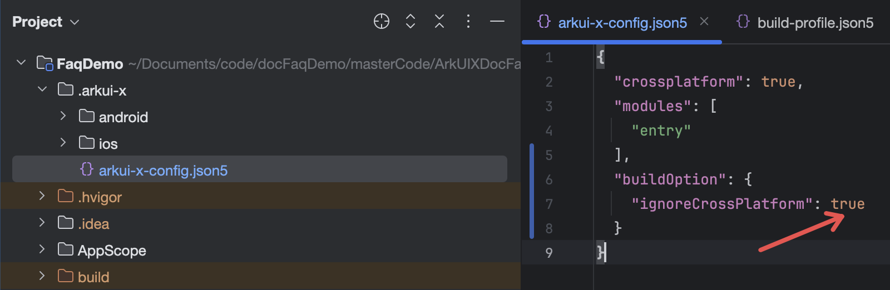

# 平台差异化

## 简介

跨平台使用场景是一套ArkTS代码运行在多个终端设备上，如Android、iOS、OpenHarmony（含基于OpenHarmony发行的商业版，如HarmonyOS Next）。当不同平台业务逻辑不同，或使用了不支持跨平台的API，就需要根据平台不同进行一定代码差异化适配。当前仅支持在代码运行态进行差异化，接下来详细介绍场景及如何差异化适配。

## 使用场景及能力

### 使用场景

平台差异化适用于以下两种典型场景：

1. 自身业务逻辑不同平台本来就有差异；
2. 在OpenHarmony上调用了不支持跨平台的API，这就需要在OpenHarmony上仍然调用对应API，其他平台通过Bridge桥接机制进行差异化处理；

### 判断平台类型

可以通过`let osName: string = deviceInfo.osFullName;`获取对应OS名字，该接口已支持跨平台，不同平台上其返回值如下:

| 平台 | osFullName 返回值示例 |
|------|----------------------|
| OpenHarmony | `OpenHarmony 4.1.0` |
| Android | `Android 14` |
| iOS (iPhone) | `iOS 17.0` |
| iPadOS | `iPadOS 17.0` |
| macOS | `macOS Version 17.0 (Build 21A359)` |
| ... | ... |

> **苹果设备底层实现说明**：
> - 使用苹果系统 TARGET_OS_MACCATALYST 宏判断区分mac类型的设备
> - 非mac场景：使用 `[[UIDevice currentDevice] systemName]` 方法获取系统名称，该接口在 iPhone/iPad/Apple TV/Apple Watch 上分别返回对应的系统名称。
> - mac场景：使用 `[[NSProcessInfo processInfo] operatingSystemVersionString]` 获取 macOS 版本信息

示例如下:

```ts
test() {
  let osName: string = deviceInfo.osFullName;
  console.log('osName = ' + osName);
  if (osName.startsWith('OpenHarmony')) {
    // OpenHarmony应用平台上业务逻辑
  } else if (osName.startsWith('Android')) {
    // Android应用平台上业务逻辑
  } else if (osName.startsWith('iOS')) {
    // iPhone应用平台上业务逻辑
  } else if (osName.startsWith('iPadOS')) {
    // iPad应用平台上业务逻辑
  } else if (osName.startsWith('macOS')) {
    // Mac应用平台上业务逻辑
  } else if(...) {
    ...
  }
}
```

### 非跨平台API处理

在跨平台工程中如果调用非跨平台API，编译时IDE会触发拦截并报错。接下来以调用`wifiManager.isWifiActive()`判断WiFi开关是否打开为例，这个API当前是不支持跨平台的。

示例代码：

```ts
  test2(){
   let isActive = wifiManager.isWifiActive();
  }
```

IDE报错：

```shell
> hvigor ERROR: Failed :feature:default@CompileArkTS... 
> hvigor ERROR: ArkTS Compiler Error
ERROR: ArkTS:ERROR File: D:/work/git/play-arkuix/Test_ACE/feature/src/main/ets/pages/Index.ets:64:31
 'isWifiActive' can't support crossplatform application.

COMPILE RESULT:FAIL {ERROR:2}
> hvigor ERROR: BUILD FAILED in 10 s 753 ms 
```


可以在工程中的.arkui-x/arkui-x-config.json5配置文件中增加ignoreCrossPlatform配置，并设置为true来屏蔽此告警，开发者需要保证只在OpenHarmony应用平台上才运行这一段逻辑，Android和iOS应用平台上可以借用Bridge桥接机制处理，示例代码如下：

1. arkui-x-config.json5文件中增加ignoreCrossPlatform配置，并设置为true来屏蔽不支持跨平台的告警：



2. 根据不同平台差异化逻辑，Android和iOS应用平台上通过[Bridge机制](platform-bridge-introduction.md)桥接到对应平台的业务逻辑实现上：

```ts
checkTestWiFi(): void {
  let osName: string = deviceInfo.osFullName;
  console.log('osName = ' + osName);
  if (osName.startsWith('OpenHarmony')) {
    // OpenHarmony应用平台
    let isActive = WiFiUtil.isActive();
    this.message = isActive ? '已连接' : '未连接';
  } else {
    // Android和iOS应用平台上,中转到原生
    let bridge = Bridge.createBridge('Bridge');
    bridge.callMethod('isWiFiActive').then((res) => {
      // 业务逻辑处理...
    }).catch(() => {

    })
  }
}
```

