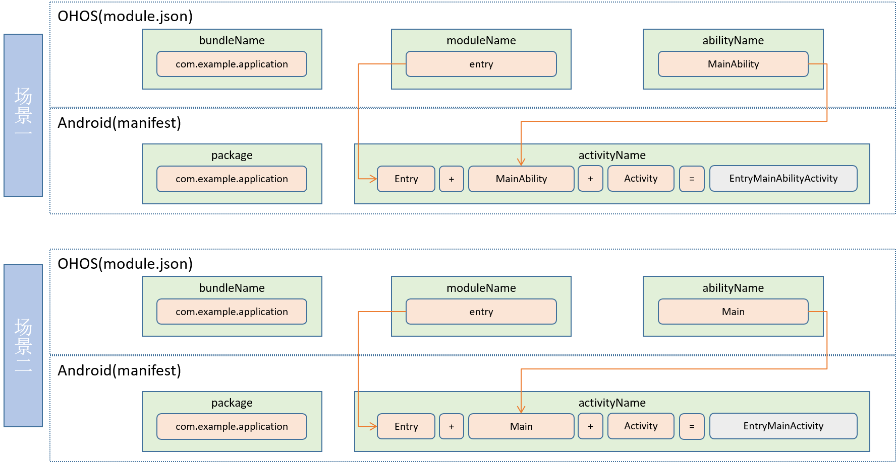

# Stage模型Android端开发文档

##### StageApplication使用:

应用需要继承arkui_android_adapter.jar包提供的StageApplication，例如：

```
package com.example.myapplication;
import ohos.stage.ability.adapter.StageApplication;

public class HiStageApplication extends StageApplication {

}
```

##### StageActivity使用：

Activity需要继承arkui_android_adapter.jar包提供的StageActivity，例如：

```
package com.example.myapplication;
import ohos.stage.ability.adapter.StageActivity;

public class EntryMainAbilityActivity extends StageActivity {
    @Override
    protected void onCreate(Bundle savedInstanceState) {
        super.setInstanceName("com.example.myapplication:entry:MainAbility:");
        super.onCreate(savedInstanceState);
    }
}
```

需要重写onCreate事件，在super.onCreate(savedInstanceState)之前设置instanceName，规则如下

“bundleName:moduleName:abilityName:”，其中bundleName、moduleName、abilityName来自ohos的module.json里的名字

##### Ability与Activity对应规则：
  


