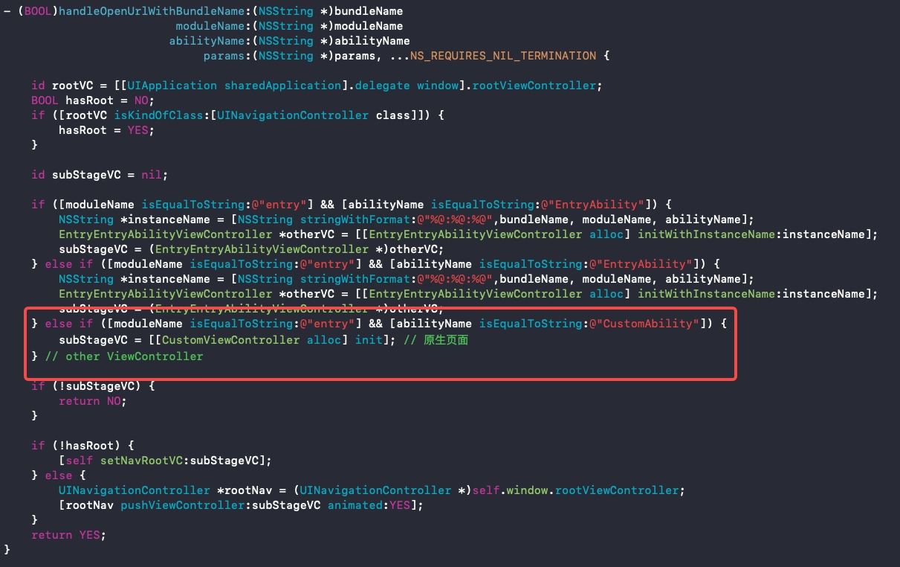

# 通过Stage模型开发iOS端应用指南

## 简介

本文介绍将ArkUI框架扩展到iOS平台所需要的必要类及其使用说明，开发者基于OpenHarmony，可复用大部分的应用代码（生命周期等）并可以部署到iOS平台，降低跨平台应用开发成本。

## ArkUI-X和iOS平台集成所用关键类

### StageViewController

StageViewController是Stage模型iOS端视图控制器基类，若要实现跨平台基础能力及触发对应ability生命周期，所有iOS端应用级别的视图控制器均要继承于StageViewController。

#### 公共属性

* instanceName：StageViewController唯一标识，拼接规则为**bundleName:moduleName:abilityName**，其中bundleName的值来自于OpenHarmony应用中app.json5配置文件，moduleName、abilityName的值来自于OpenHarmony应用中的module.json5配置文件。

```objc
@property (nonatomic, readonly) NSString *instanceName;
```

* params：StageViewController外部属性，用于startAbility时传递的want参数。

```objc
@property (nonatomic, strong) NSString *params;
```

#### 初始化方法

```objc
- (instancetype)initWithInstanceName:(NSString *_Nonnull)instanceName;
```

### StageApplication

StageApplication本质上是一个调度类，主要用于触发内部相关类实现路径解析与配置、注册应用相关的configuration信息、触发ability部分生命周期事件等。

#### 公共方法

* 配置本地hap包路径。

```objc
+ (void)configModuleWithBundleDirectory:(NSString *_Nonnull)bundleDirectory;
```

* iOS应用触发StartAbility、配置进程id、本地化信息、configuration等。

```objc
+ (void)launchApplication;
```

* 触发ability进入前台生命周期事件。

```objc
+ (void)callCurrentAbilityOnForeground;
```

* 触发ability进入后台生命周期事件。

```objc
+ (void)callCurrentAbilityOnBackground;
```

* 处理单/多实例ability。

```objc
+ (BOOL)handleSingleton:(NSString *)bundleName moduleName:(NSString *)moduleName abilityName:(NSString *)abilityName;
```

* 释放导航视图栈内的所有viewController，触发OnDestory事件。

```objc
+ (void)releaseViewControllers;
```

* 获取导航视图栈最顶层viewController。

```objc
+ (StageViewController *)getApplicationTopViewController;
```

## AppDelegate内关键实现参考

### ArkUI应用启动及初始化
```objc
- (BOOL)application:(UIApplication *)application didFinishLaunchingWithOptions:(NSDictionary *)launchOptions {

    // 配置hap包路径
    [StageApplication configModuleWithBundleDirectory:@"arkui-x"];
    // 启动ability
    [StageApplication launchApplication];
    
    // APP自启动,初始化StageViewController子类VC，并设置为APP根视图控制器
    if (!launchOptions.count) { 
        NSString *instanceName = [NSString stringWithFormat:@"%@:%@:%@",@"com.example.iosabilitystage", @"entry", @"MainAbility"];
        EntryMainViewController *mainView = [[EntryMainViewController alloc] initWithInstanceName:instanceName];
    UINavigationController *navi = [[UINavigationController alloc]initWithRootViewController:mainView];
        self.window = [[UIWindow alloc] initWithFrame:[UIScreen mainScreen].bounds];
        self.window.rootViewController = navi;
        [self.window makeKeyAndVisible];
    }
    return YES;
}
```

### ArkUI应用实现页面跳转
当在iOS平台上使用[startability](../reference/apis/js-apis-inner-application-uiAbilityContext.md#uiabilitycontextstartability)接口传递参数信息，并实现页面跳转时，需要参考下述示例进行开发。

- 通过路由模式（openURL:）实现的iOS应用页面跳转回调，获取传递参数

```objc
- (BOOL)application:(UIApplication *)app openURL:(NSURL *)url options:(NSDictionary<NSString *,id> *)options {

    // 根据规则截取URL相应参数
    NSString *bundleName = url.scheme;
    NSString *moduleName = url.host;
    NSString *abilityName, *params;

    NSURLComponents *urlComponents = [NSURLComponents componentsWithString:url.absoluteString];
    NSArray <NSURLQueryItem *> *array = urlComponents.queryItems;
    for (NSURLQueryItem * item in array) {
        if ([item.name isEqualToString:@"abilityName"]) {
            abilityName = item.value;
        } else if ([item.name isEqualToString:@"params"]) {
            params = item.value;
        }
    }
    // 单实例ability处理
    if ([StageApplication handleSingleton:bundleName moduleName:moduleName abilityName:abilityName] == YES) {
        return YES;
    }
    [self handleOpenUrlWithBundleName:bundleName
                           moduleName:moduleName
                          abilityName:abilityName
                               params:params, nil];
    return YES;
}
```
- 通过解析url得到的参数，映射ability对应的viewController

```objc
- (BOOL)handleOpenUrlWithBundleName:(NSString *)bundleName
                         moduleName:(NSString *)moduleName
                        abilityName:(NSString *)abilityName
                             params:(NSString *)params, ...NS_REQUIRES_NIL_TERMINATION {
                                               
    NSString *instanceName = [NSString stringWithFormat:@"%@:%@:%@",bundleName, moduleName, abilityName];
    
    // 根据moduleName和abilityName映射对应的viewController
    // 注意：传入的moduleName或者abilityName错误，则无法找到对应的viewController，此时无法打开页面。
    if ([moduleName isEqualToString:@"entry"] && [abilityName isEqualToString:@"MainAbility"]) {
        EntryMainAbilityViewController *entryMainVC = [[EntryMainAbilityViewController alloc] initWithInstanceName:instanceName];
        entryMainVC.params = params;
    } else if ([moduleName isEqualToString:@"entry"] && [abilityName isEqualToString:@"Other"]) {
        EntryOtherViewController *entryOtherVC = [[EntryOtherViewController alloc] initWithInstanceName:instanceName];
        entryOtherVC.params = params;
    }

    return YES;
}
```

#### 参数解析规则

key值为params  
value为json格式

```
{
    "params":[
        {
            "key":键,
            "type":参数类型值,
            "value":值
        },
        {
            ...
        }
    ]
}
```
支持的参数类型列表

| 参数类型   | 参数类型值 |
| -------   | --------- |
| BOOL      |     1     |
| NSInteger |     5     |
| double    |     9     |
| NSString  |    10     |

### ArkUI应用生命周期回调相应处理

* ArkUI应用进入后台，触发对应生命周期事件。

```objc
- (void)applicationDidEnterBackground:(UIApplication *)application {
    [StageApplication callCurrentAbilityOnBackground];
}
```

* ArkUI应用进入前台，触发对应生命周期事件。

```objc
- (void)applicationWillEnterForeground:(UIApplication *)application {
    [StageApplication callCurrentAbilityOnForeground];
}
```

* 终止ArkUI应用程序进程。

```objc
- (void)applicationWillTerminate:(UIApplication *)application {
    [StageApplication releaseViewControllers];
}
```

**注** 具体方法使用参考samples示例

## Ability与ViewController对应规则

iOS端应用info配置里的bundleName需要与Ability的bundleName一致。

iOS端应用内的viewController的viewControllerName组成规则：Ability的moduleName + Ability的abilityName + “viewController”。

  

## StageApplication初始化支持以下两种方式

### 在didFinishLaunchingWithOptions函数中进行初始化

```objc
- (BOOL)application:(UIApplication *)application didFinishLaunchingWithOptions:(NSDictionary *)launchOptions {

    // 配置hap包路径
    [StageApplication configModuleWithBundleDirectory:@"arkui-x"];
    // 启动ability
    [StageApplication launchApplication];

    // APP自启动,初始化StageViewController子类VC，并设置为APP根视图控制器
    if (!launchOptions.count) { 
        NSString *instanceName = [NSString stringWithFormat:@"%@:%@:%@",@"com.example.iosabilitystage", @"entry", @"MainAbility"];
        EntryMainViewController *mainView = [[EntryMainViewController alloc] initWithInstanceName:instanceName];
        UINavigationController *navi = [[UINavigationController alloc]initWithRootViewController:mainView];
        self.window = [[UIWindow alloc] initWithFrame:[UIScreen mainScreen].bounds];
        self.window.rootViewController = navi;
        [self.window makeKeyAndVisible];
    }
    return YES;
}
```

### 在openURL回调函数中进行初始化

```objc
- (BOOL)application:(UIApplication *)application didFinishLaunchingWithOptions:(NSDictionary *)launchOptions {
    // 不在此处进行初始化

    ExampleViewController *mainView = [[ExampleViewController alloc] init];
    UINavigationController *navi = [[UINavigationController alloc]initWithRootViewController:mainView];
    self.window = [[UIWindow alloc] initWithFrame:[UIScreen mainScreen].bounds];
    self.window.rootViewController = navi;
    [self.window makeKeyAndVisible];
    return YES;
}

- (BOOL)application:(UIApplication *)app openURL:(NSURL *)url options:(NSDictionary<NSString *,id> *)options {

    // 初始化StageApplication
    [StageApplication configModuleWithBundleDirectory:@"arkui-x"];
    [StageApplication launchApplication];
    
    /*
    other code
    */
    return YES;
}
```
## 通过iOS原生拉起Ability并传递参数
使用iOS原生拉起Ability时,需使用原生应用EntryMainAbilityViewController父类StageViewController中的params属性传递参数,目前有两种方式进行参数的传递,具体如下：

### 1. 使用手动方式
#### 参数格式
key值为params  
value为json格式

```
{
    "params":[
        {
            "key":键,
            "type":参数类型值,
            "value":值
        },
        {
            ...
        }
    ]
}
```
#### 支持的参数类型列表

| 参数类型 | 参数类型值 |
| ------- | --------- |
| boolean |     1     |
| int     |     5     |
| double  |     9     |
| string  |    10     |

#### 示例代码
* Object-C

```
NSString *strParams = @"{\"params\":[{\"key\":\"keyfirst\",\"type\":1,\"value\":\"true\"},{\"key\":\"keysecond\",\"type\":9,\"value\":\"2.3\"},{\"key\":\"keythird\",\"type\":5,\"value\":\"2\"},{\"key\":\"keyfourth\",\"type\":10,\"value\":\"test\"}]}";
NSString *instanceName = [NSString stringWithFormat:@"%@:%@:%@",@"com.example.iosabilitystage", @"entry", @"MainAbility"];
EntryMainViewController *mainView = [[EntryMainViewController alloc] initWithInstanceName:instanceName];
mainView.params = strParams;
```
* ArkTS

```
# xxx.ets
export default class EntryAbility extends UIAbility {
  onCreate(want: Want, launchParam: AbilityConstant.LaunchParam): void {
    console.log("value = " + want.parameters?.keyfirst)
    console.log("value = " + want.parameters?.keysecond)
    console.log("value = " + want.parameters?.keythird)
    console.log("value = " + want.parameters?.keyfourth)
  }

  onWindowStageCreate(windowStage: window.WindowStage): void {
    ...
  }
...
}
```

### 2. WantParams工具类
推荐使用。
#### 示例代码
* Object-C
此示例展示了在启动一个新的 Ability 时，如何通过 WantParams 实现参数传递。具体涉及使用 WantParams 中的 addValue、getValue 和 toWantParamsString 接口，完成数据的自定义、获取和修改。
```
    NSString *instanceName = [NSString stringWithFormat:@"%@:%@:%@",@"com.example.iosabilitystage", @"entry", @"EntryAbility"];
    EntryEntryAbilityViewController *mainView = [[EntryEntryAbilityViewController alloc] initWithInstanceName:instanceName];
    
    NSNumber *numberYes = [NSNumber numberWithBool:true];
    NSNumber *numberInt = [NSNumber numberWithInt:12];
    NSNumber *numberDouble = [NSNumber numberWithDouble:1.1415926];
    WantParams *wp = [[WantParams alloc]init];
    [wp addValue:@"strkey" value:@"strWantParams"];
    NSArray *arr = @[@(123) , @(1) , @(2)];
    
    WantParams *params = [[WantParams alloc]init];
    [params addValue:@"boolKey" value:numberYes];
    [params addValue:@"intKey" value:numberInt];
    [params addValue:@"doubleKey" value:numberDouble];
    [params addValue:@"stringKey" value:@"strArkui"];
    [params addValue:@"wantParamsKey" value:wp];
    [params addValue:@"arrayKey" value:arr];
    
    //注意  使用getValue函数 需要对返回值进行判空处理
    id paramsData1 = [params getValue:@"1"];
    if (paramsData1 == nil) {
        NSLog(@"it is nil");
    }
    id paramsData2 = [params getValue:@"boolKey"];
    if (paramsData2 != nil ) {
        NSLog(@"paramsData2 = %@",paramsData2);
    }
    id paramsData3 = [params getValue:@"intKey"];
    if (paramsData3 != nil ) {
        NSLog(@"paramsData3 = %@",paramsData3);
    }
    id paramsData4 = [params getValue:@"doubleKey"];
    if (paramsData4 != nil ) {
        NSLog(@"paramsData4 = %@",paramsData4);
    }
    id paramsData5 = [params getValue:@"stringKey"];
    if (paramsData5 != nil ) {
        NSLog(@"paramsData5 = %@",paramsData5);
    }
    id paramsData7 = [params getValue:@"arrayKey"];
    if (paramsData7 != nil ) {
        NSLog(@"paramsData7 = %@",paramsData7);
    }
    WantParams * paramsData6 = [params getValue:@"wantParamsKey"];
    id paramsData8 = [paramsData6 getValue:@"strkey"];
    if (paramsData8 != nil ) {
        NSLog(@"paramsData8 = %@",paramsData8);
    }
    id paramsData9 = [params getValue:nil];
    if (paramsData9 != nil ) {
        NSLog(@"paramsData9 = %@",paramsData9);
    }
    
    mainView.params = [params toWantParamsString];
```
* ArkTS
```
# xxx.ets
export default class EntryAbility extends UIAbility {
  public static message: string = "123";
  onCreate(want: Want, launchParam: AbilityConstant.LaunchParam): void {
    hilog.info(0x0000, 'testTag', '%{public}s', 'Ability onCreate' + JSON.stringify(want));
  }
}
```

#### 支持的参数类型
WantParams支持的类型有：
    boolean、int、float、double、String、WantParams、boolean[]、int[]、float[]、double[]、String[]。
WantParams提供的接口详细如下：
| 接口 | 返回值 | 参数 | 功能 |
| ------- | --------- | --------- | --------- |
| addValue | WantParams | String key, boolean value | 为WantParams添加"String"类型的key，"boolean"类型的值value。 |
| addValue | WantParams | String key, int  value | 为WantParams添加"String"类型的key，"int"类型的值value。 |
| addValue | WantParams | String key, double value | 为WantParams添加"String"类型的key，"double"类型的值value。 |
| addValue | WantParams | String key, String value | 为WantParams添加"String"类型的key，"String"类型的值value。 |
| addValue | WantParams | String key, boolean[] value | 为WantParams添加"String"类型的key，"boolean[]"类型的值value。 |
| addValue | WantParams | String key, int[] value | 为WantParams添加"String"类型的key，"int[]"类型的值value。 |
| addValue | WantParams | String key, double[] value | 为WantParams添加"String"类型的key，"double[]"类型的值value。 |
| addValue | WantParams | String key, String[] value | 为WantParams添加"String"类型的key，"String[]"类型的值value。 |
| addValue | WantParams | String key, WantParams value | 为WantParams添加"String"类型的key，"WantParams"类型的值value。 |
| getValue | Object | String key | 获取键值为key的属性值，如果键值不存在则返回null。 |
| toWantParamsString | String | - | 将WantParams对象转换为Json字符串。 |


### 注意事项
  * addValue和getValue中的key不能包含特殊字符；如\t、\r、\n等。
  * 在使用手动方式(非WantParams)自定义字符串时，key和value均不能包含特殊字符。
  * array和object不支持使用手动方式进行使用。
  * double的小数点后有效小数位为6位。

## 用启动Ability的方式拉起原生ViewController

通过 `openURL` 方法访问自定义的 **URL Scheme**，会触发 AppDelegate 的 `-application:openURL:options:` 方法。在该方法内，可根据传入的 URL 和配置信息，执行跳转到相应原生页面的逻辑。

  * 在 `Info.plist` 中添加 **URL Scheme** 声明：

    ```xml
    <key>CFBundleURLTypes</key>
    <array>
    	<dict>
    		<key>CFBundleURLSchemes</key>
    		<array>
    			<string>com.example.helloworld</string>
    		</array>
    	</dict>
    </array>
    ```

  * 在ets页面中添加 **`startAbility`** 方法：

    ```javascript
    // xxx.ets
     let want: Want = {
        bundleName: 'com.example.helloworld', //与iOS工程配置的URL Scheme相同
        moduleName: 'entry', //小写
        abilityName: 'CustomAbility', //首字母大写
        parameters:{id:1,name:'ArkUI-X'} //可选参数
        };
        let context = getContext(this) as common.UIAbilityContext;
        context.startAbility(want, (err, data) => {
        }); 
    ```

  * 通过解析url得到参数，在AppDelegate.m的`-handleOpenUrlWithBundleName:moduleName:abilityName:params:`方法中添加逻辑，跳转到原生viewController：

    