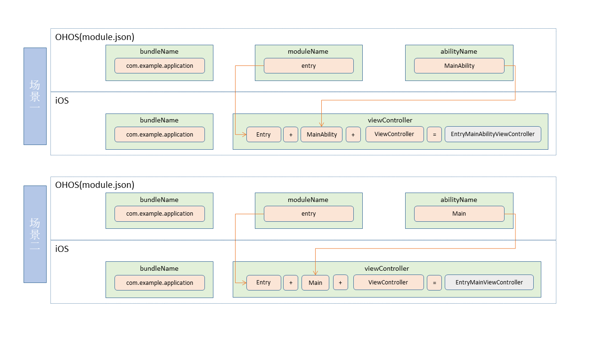

# 通过Stage模型开发iOS端应用指南

## 简介

本文介绍将ArkUI框架扩展到iOS平台所需要的必要类及其使用说明，开发者基于OpenHarmony，可复用大部分的应用代码（生命周期等）并可以部署到iOS平台，降低跨平台应用开发成本。

## ArkUI-X和iOS平台集成所用关键类

### StageViewController

StageViewController是Stage模型iOS端视图控制器基类，若要实现跨平台基础能力及触发对应ability生命周期，所有iOS端应用级别的视图控制器均要继承于StageViewController。

#### 公共属性

* instanceName：StageViewController唯一标识，拼接规则为**bundleName:moduleName:abilityName**，其中bundleName的值来自于OpenHarmony应用中app.json5配置文件，moduleName、abilityName的值来自于OpenHarmony应用中的module.json5配置文件。

```objc
@property (nonatomic, readonly) NSString *instanceName;
```

* params：StageViewController外部属性，用于startAbility时传递的want参数。

```objc
@property (nonatomic, strong) NSString *params;
```

#### 初始化方法

```objc
- (instancetype)initWithInstanceName:(NSString *_Nonnull)instanceName;
```

### StageApplication

StageApplication本质上是一个调度类，主要用于触发内部相关类实现路径解析与配置、注册应用相关的configuration信息、触发ability部分生命周期事件等。

#### 公共方法

* 配置本地hap包路径。

```objc
+ (void)configModuleWithBundleDirectory:(NSString *_Nonnull)bundleDirectory;
```

* iOS应用触发StartAbility、配置进程id、本地化信息、configuration等。

```objc
+ (void)launchApplication;
```

* 触发ability进入前台生命周期事件。

```objc
+ (void)callCurrentAbilityOnForeground;
```

* 触发ability进入后台生命周期事件。

```objc
+ (void)callCurrentAbilityOnBackground;
```

* 处理单/多实例ability。

```objc
+ (BOOL)handleSingleton:(NSString *)bundleName moduleName:(NSString *)moduleName abilityName:(NSString *)abilityName;
```

* 释放导航视图栈内的所有viewController，触发OnDestory事件。

```objc
+ (void)releaseViewControllers;
```

* 获取导航视图栈最顶层viewController。

```objc
+ (StageViewController *)getApplicationTopViewController;
```

## AppDelegate内关键实现参考

### iOS应用程序启动及初始化

```objc
- (BOOL)application:(UIApplication *)application didFinishLaunchingWithOptions:(NSDictionary *)launchOptions {

    // 配置hap包路径
    [StageApplication configModuleWithBundleDirectory:@"arkui-x"];
    // 启动ability
    [StageApplication launchApplication];
    
    // APP自启动,初始化StageViewController子类VC，并设置为APP根视图控制器
    if (!launchOptions.count) { 
        NSString *instanceName = [NSString stringWithFormat:@"%@:%@:%@",@"com.example.iosabilitystage", @"entry", @"MainAbility"];
        EntryMainViewController *mainView = [[EntryMainViewController alloc] initWithInstanceName:instanceName];
    UINavigationController *navi = [[UINavigationController alloc]initWithRootViewController:mainView];
        self.window = [[UIWindow alloc] initWithFrame:[UIScreen mainScreen].bounds];
        self.window.rootViewController = navi;
        [self.window makeKeyAndVisible];
    }
    return YES;
}
```

### 通过路由模式（openURL:）实现的iOS应用页面跳转回调，获取传递参数

```objc
- (BOOL)application:(UIApplication *)app openURL:(NSURL *)url options:(NSDictionary<NSString *,id> *)options {

    // 根据规则截取URL相应参数
    NSString *bundleName = url.scheme;
    NSString *moduleName = url.host;
    NSString *abilityName, *params;

    NSURLComponents *urlComponents = [NSURLComponents componentsWithString:url.absoluteString];
    NSArray <NSURLQueryItem *> *array = urlComponents.queryItems;
    for (NSURLQueryItem * item in array) {
        if ([item.name isEqualToString:@"abilityName"]) {
            abilityName = item.value;
        } else if ([item.name isEqualToString:@"params"]) {
            params = item.value;
        }
    }
    //单实例ability处理
    if ([StageApplication handleSingleton:bundleName moduleName:moduleName abilityName:abilityName] == YES) {
        return YES;
    }
    [self handleOpenUrlWithBundleName:bundleName
                           moduleName:moduleName
                          abilityName:abilityName
                               params:params, nil];
    return YES;
}
```

### 通过解析url得到的参数，映射ability对应的viewController

```objc
- (BOOL)handleOpenUrlWithBundleName:(NSString *)bundleName
                         moduleName:(NSString *)moduleName
                        abilityName:(NSString *)abilityName
                             params:(NSString *)params, ...NS_REQUIRES_NIL_TERMINATION {
                             
    NSString *instanceName = [NSString stringWithFormat:@"%@:%@:%@",bundleName, moduleName, abilityName];
    
    if ([bundleName isEqualToString:BUNDLE_NAME] &&
               [abilityName isEqualToString:@"MainAbility"]) {
        EntryMainAbilityViewController *entryMainVC = [[EntryMainAbilityViewController alloc] initWithInstanceName:instanceName];
        entryMainVC.params = params;
    }else if ([bundleName isEqualToString:BUNDLE_NAME] && [abilityName isEqualToString:@"Other"]) {
        EntryOtherViewController *entryOtherVC = [[EntryOtherViewController alloc] initWithInstanceName:instanceName];
        entryOtherVC.params = params;
    }
    return YES;
}
```

### 其它程序级生命周期回调相应处理

* iOS应用程序进入后台，触发对应生命周期事件。

```objc
- (void)applicationDidEnterBackground:(UIApplication *)application {
    [StageApplication callCurrentAbilityOnBackground];
}
```

* iOS应用程序进入前台，触发对应生命周期事件。

```objc
- (void)applicationWillEnterForeground:(UIApplication *)application {
    [StageApplication callCurrentAbilityOnForeground];
}
```

* 终止iOS应用程序进程。

```objc
- (void)applicationWillTerminate:(UIApplication *)application {
    [StageApplication releaseViewControllers];
}
```

**注** 具体方法使用参考samples示例

## Ability与ViewController对应规则

iOS端应用info配置里的Bundle name需要与Ability的bundleName一致。

iOS端应用内的viewController的viewControllerName组成规则：Ability的moduleName + Ability的abilityName + “viewController”。

  