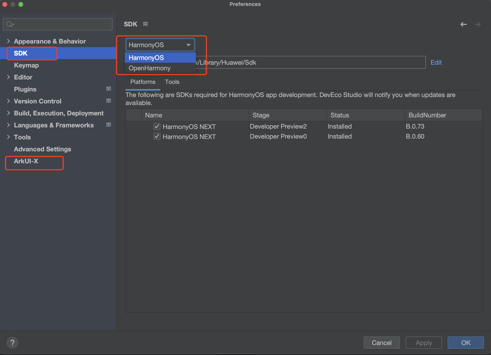
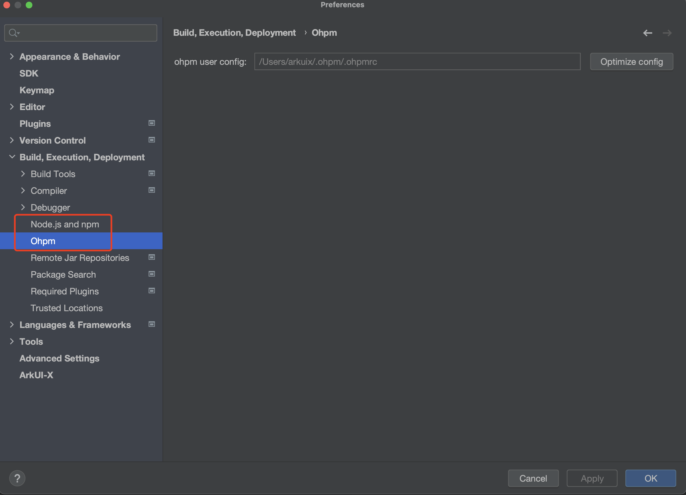

# ACE Tools快速指南

## 简介

ACE Tools是一套为ArkUI-X应用开发者提供的命令行工具，支持在Windows/Ubuntu/macOS平台运行，用于构建OpenHarmony、HarmonyOS、Android和iOS平台的应用程序， 其功能包括开发环境检查，新建项目，编译打包，安装调试等。

## 使用说明

针对Windows和macOS的平台环境，使用ACE Tools前：

1、建议优先下载DevEco Studio，请参考[社区版本软件和工具配套关系](../../release-notes/ArkUI-X-v1.1.6-release.md#配套关系)完成DevEco Studio的下载和安装，通过DevEco Studio，可以下载到HarmonyOS SDK、OpenHarmony SDK、ArkUI-X SDK、OHPM、Node。

​

​

2、如果您需要用ACE Tools进行安卓应用的跨平台开发，Android SDK、Java SDK，需要提前下载安装到本地环境，对于iOS应用的跨平台开发，Xcode也需要提前下载安装到本地环境。

Ubuntu环境用户请参考[Ubuntu环境配置说明](assets/how-to-configure-dev-environment-20240416103516-dml5y14.md)。

### 环境准备

**前置条件：**  Ubuntu需要18.04以上版本，macOS需要11.6.2及以上版本，Windows需要Windows 10版本，

**Node.js需要16.20.1以上的版本。**

**1. 下载ArkUI-X SDK**

ArkUI-X SDK下载路径，Windows用户可通过DevEco Studio > File > Settings > ArkUI-X配置ArkUI-X的安装路径并下载，macOS用户为DevEco Studio > Preferences > ArkUI-X并下载。如果您是ArkUI-X框架开发者，使用自己本地编译的ArkUI-X SDK也可以完成本步骤。

**2.配置ACE Tools环境变量**

将ACE Tools运行脚本配置成全局生效的环境变量，参考如下配置方法：

[macOS]

```shell
// 配置环境变量，实际示例如下：
export PATH=/Users/arkuix/ArkUI-X/11/arkui-x/toolchains/bin:$PATH
```

[Windows]

可在桌面工具栏**搜索框**键入"环境变量"，然后选择**编辑系统环境变量**，进行环境变量配置。另外，也可在控制台通过如下命令进行配置。

```shell
// 配置环境变量，实际示例如下：
set PATH=%PATH%;D:\\ArkUI-X\\11\\arkui-x\\toolchains\\bin
```

### 开发环境检查

```shell
ace check -v
```

执行 `ace check -v`​ 命令可以检查ArkUI-X应用开发环境是否完备。

> **说明**：开发环境检查只识别IDE和SDK默认的安装路径，如果提示结果与您的预期不符，请您通过[ace config命令](https://gitee.com/arkui-x/cli#ace-config)指定实际的IDE安装和SDK下载路径。

### 创建应用

以创建一个 Stage模型‘demo’项目为例：

```shell
ohos@user Desktop % ace create demo
? Enter the project name(demo): # 输入工程名称，不输入默认为文件夹名称
? Enter the bundleName (com.example.demo):  # 输入包名，不输入默认为com.example.工程名
? Enter the runtimeOS (1: OpenHarmony, 2: HarmonyOS): 1 # 输入RuntimeOS系统
? Please select the Complie SDk (1: 10, 2: 11): 2 # 输入编译SDK版本

Project created. Target directory:  ${当前目录}/demo.

In order to run your app, type:

   $ cd demo
   $ ace run

Your app code is in demo/entry.
```

### 应用运行

* 安装运行到Android/iOS/OpenHarmony设备（注：iOS设备执行ace run前请先打开Xcode完成应用签名）

```shell
cd demo
ace run
```

上述命令会完成应用构建打包，并安装到目标平台设备运行。

## 常用命令参考

- [ACE Tools使用说明](https://gitee.com/arkui-x/cli/blob/master/README.md)

‍
