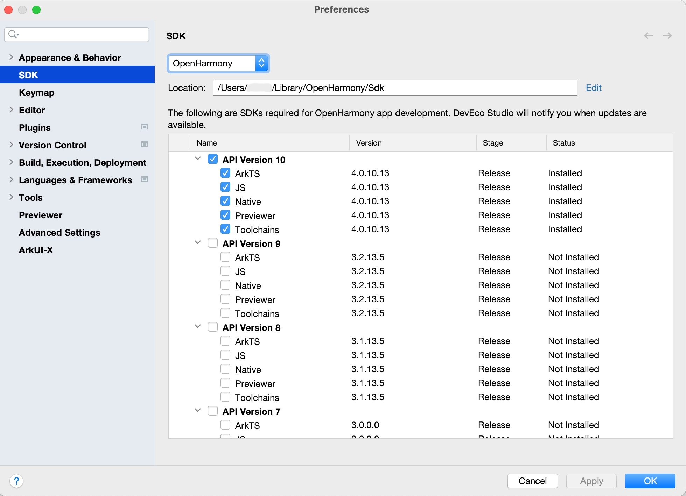
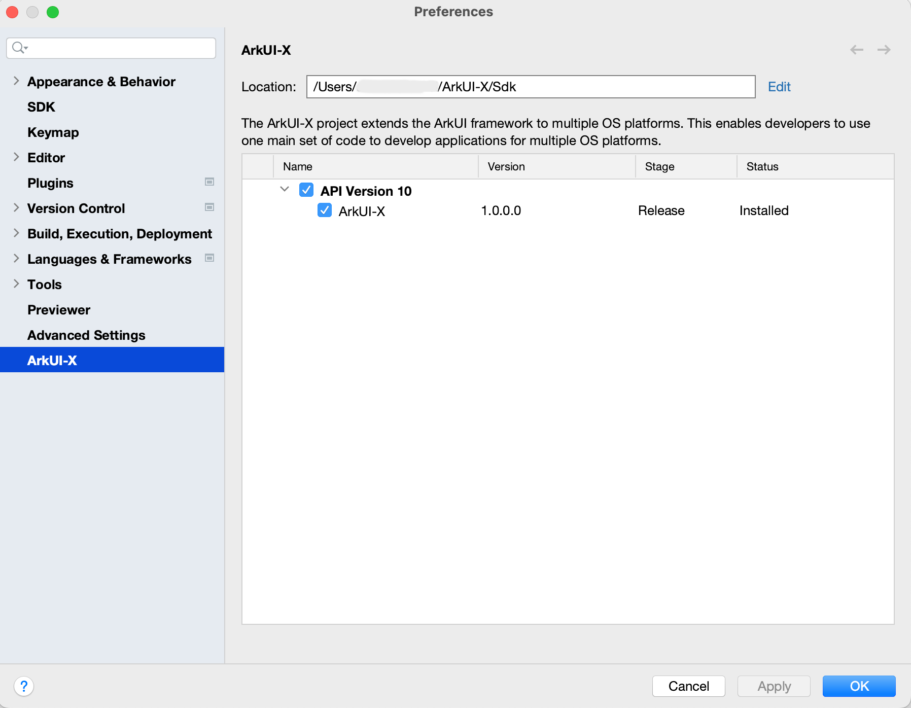
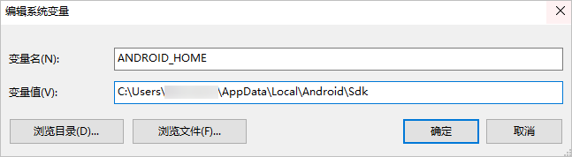

# 配置开发环境

## 使用DevEco Studio开发ArkUI-X约束说明

- DevEco Studio仅支持ArkUI-X源码开发和调试，各平台Native代码请使用对应平台的IDE编辑器进行开发和调试；

- ArkUI-X支持在Android/iOS平台真机和模拟器上运行调试；

- 平台版本及构建工具要求：
  - OpenHarmony平台：支持API 10+；
  - Android平台：Android 8+，Level-26，version code: O，Codename: Oreo；
  - iOS平台：iOS 10+

## 依赖环境准备

在开发应用前，请先完成依赖环境准备。

  **表1** Windows平台环境要求

| 组件包名 | 说明 | 
| -------- | -------- |
| OpenHarmony&nbsp;SDK | OpenHarmony的SDK包。 |
| ArkUI-X&nbsp;SDK | ArkUI-X的SDK包。 |
| Android&nbsp;SDK | Android的SDK包。 |

  **表2** macOS平台环境要求

| 组件包名 | 说明 | 
| -------- | -------- |
| OpenHarmony&nbsp;SDK | OpenHarmony的SDK包。 |
| ArkUI-X&nbsp;SDK | ArkUI-X的SDK包。 |
| Android&nbsp;SDK | Android的SDK包。 |
| Xcode | iOS应用开发环境，请参考官方环境搭建指导。 |


## OpenHarmony SDK

1. 在**File &gt; Settings &gt; SDK**（macOS为**DevEco Studio &gt; Preferences &gt; SDK**）下，点击Location右侧的**Edit**，为SDK选择存储路径。

2. 在弹出的SDK Setup页面选择存储路径，一直点击**Next**，直到完成SDK的安装后，点击**Finish**。


## 安装ArkUI-X SDK

1. 在**File &gt; Settings &gt; ArkUI-X**（macOS为**DevEco Studio &gt; Preferences &gt; ArkUI-X**）下，点击Location右侧的**Edit**，为SDK选择存储路径。

2. 在弹出的SDK Setup页面选择存储路径，一直点击**Next**，直到完成SDK的安装后，点击**Finish**。


## 配置Android SDK安装目录环境变量

配置环境变量ANDROID_HOME，设置Android SDK安装目录。

- Windows环境变量设置方法：
  在**此电脑 &gt; 属性 &gt; 高级系统设置 &gt; 高级 &gt; 环境变量**中，新建系统变量。变量名为ANDROID_HOME，变量值为Android SDK安装目录。

  

  环境变量配置完成后，关闭并重启DevEco Studio。

- macOS环境变量设置方法：
  1. 打开终端工具，执行以下命令，打开.bash_profile文件。
     
      ```
      vi ~/.bash_profile
      ```
  2. 单击字母“i”，进入**Insert**模式。
  3. 输入以下内容，配置Android SDK安装目录。
     
      ```
      export ANDROID_HOME=/Users/xxx/Library/Android/sdk
      ```
  4. 编辑完成后，单击**Esc**键，退出编辑模式，然后输入“:wq”，单击**Enter**键保存。
  5. 执行以下命令，使配置的环境变量生效。
     
      ```
      macOS Mojave（10.14）及以前：
      source ~/.bash_profile
      macOS Catalina（10.15）及以后：
      source ~/.zshrc
      ```
  6. 环境变量配置完成后，关闭并重启DevEco Studio。