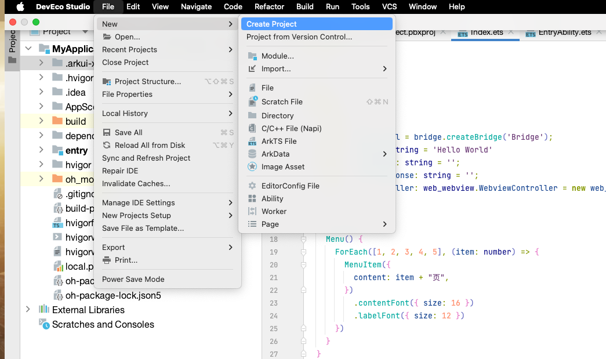
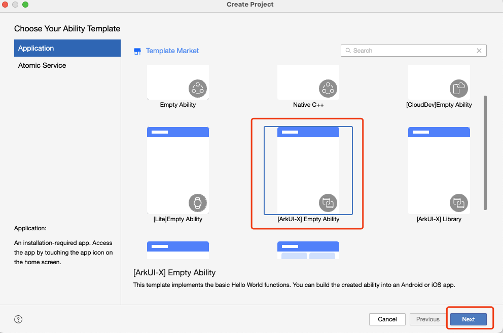
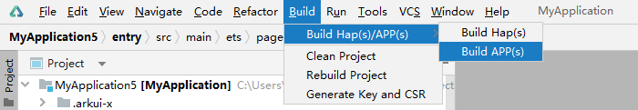

# ArkUI-X之初体验

## 开发跨平台应用

### 创建工程

在DevEco Studio中创建跨平台模版工程。

1. 点击**File > New > Create Project**。
   

2. 在打开的模板市场中，选择[ArkUI-X]Empty Ability，点击**Next**。
   

3. 在工程配置页面，填写Project name和Save location，点击**Finish**，等待模版工程创建完成。

### 编译构建生成跨平台应用

DevEco Studio可打包生成不同平台的应用包。

在主菜单栏，单击**Build &gt; Build Hap(s)/APP(s) &gt; Build APP(s)**。
   

编译后的ArkTS代码、资源和平台胶水代码已生成到Android和iOS应用工程中，后续安装、运行和调试请使用Android Studio和Xcode，也可使用[ACE Tools](start-with-ace-tools.md#应用运行)。