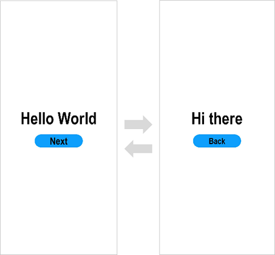

# 使用ArkTS语言开发（FA模型）


>  **说明：**
>
>  为确保运行效果，本文以使用**ArkUI-X 0.1.0 Beta**版本为例。


## 创建ArkTS跨平台应用工程

### 1. 检查开发环境

   ```shell
   ace check
   ```

执行 `ace check` 命令可以检查上述的本地开发环境。对于必选项，需要检查通过，否则无法继续接下来的操作。

*注：开发环境检查主要针对SDK和IDE的默认安装和下载路径；如果通过SDK Manager下载SDK，会检查默认环境变量：ANDROID_HOME和OpenHarmony_HOME是否配置。*

### 2. 检查设备连接

   ```shell
   ace devices
   ```

获得当前连接的设备devices 及 deviceID。后续命令的参数需要加 deviceID，可随时执行查看。

*注：该命令已经集成在 ` ace check` 中，可跳过。*

### 3. 开发环境路径配置

   ```shell
   ace config
   ```

如果开发者没有按照IDE和SDK默认路径进行安装和下载，可通过此命令进行自定义路径配置。

### 4. 创建project

   以创建一个 ‘demo’  项目为例：

   ```shell
   ace create project
   ? Please enter the project name: demo
   ? Please enter the packages (com.example.demo):com.example.demo
   ? Please enter the ACE version (1: 基于ArkTS的声明式开发范式, 2: 兼容JS的类Web开发范式): 1
   ```

执行 `ace create project` 命令（project 可省略），接着输入项目名 demo ，包名直接回车默认即可。输入“1”代表创建基于ArkTS的声明式开发范式跨平台应用项目。

一个名为 ‘demo’ 的项目就创建成功了。

项目关键结构如下：

```shell
demo/
├── android		//用于编译跨平台应用Android工程
│   ├── app
│   │   ├── libs
│   │   └── src
│   │       ├── androidTest
│   │       ├── main
│   │       │   ├── AndroidManifest.xml
│   │       │   ├── assets	//用于存放跨平台应用编译生成的资源文件
│   │       │   ├── java
│   │       │   │   └── com
│   │       │   │       └── example
│   │       │   │           └── demo
│   │       │   │               ├── MainActivity.java	//继承自ArkUI提供的AceActivity基类
│   │       │   │               └── MyApplication.java	//继承自ArkUI提供的AceApplication基类
│   │       │   └── res
│   │       └── test
│   └── settings.gradle
├── ios		//用于编译跨平台应用ios工程
│   ├── etsapp
│   │   ├── AppDelegate.h
│   │   ├── AppDelegate.mm	//实例化AceViewController，并加载ArkUI页面
│   │   ├── Info.plist
│   │   └── main.m
│   ├── etsapp.xcodeproj
│   ├── frameworks
│   └── js
│   └── res
├── ohos	//用于编译跨平台应用ohos工程
│   ├── build-profile.json5
│   ├── entry
│   │   └── src
│   │       └── main
│   │           ├── config.json
│   │           └── resources
└── source	//用于编写跨平台应用源码
    └── entry
        └── src
            ├── main
            │   ├── ets
            │   │   └── MainAbility
            │   │       ├── app.ets
            │   │       ├── manifest.json	//工程配置信息
            │   │       └── pages
            │   │           └── index
            │   │               └── index.ets
            │   └── resources
            └── ohosTest

```

## 编写代码

在上述工程创建完成后，开发者可在项目中的source目录下进行代码开发。

### 模板默认页面

1. 包含Text和Button组件。

   工程同步完成后，在“**source**”目录，点击“**entry &gt; src &gt; main &gt; ets &gt; MainAbility &gt; pages &gt; index**”，打开“**index.ets**”文件，可以看到页面由Text和Button组件组成。“**index.ets**”文件的示例如下：
   
    ```ts
    // index.ets
    @Entry
    @Component
    struct Index {
        @State message:string = 'World'
        build() {
          Row() {
            Column() {
              Text('Hello ' + this.message)
                .fontSize(50)
                .fontWeight(FontWeight.Bold)
              Button() {
                Text(' Click me ')
                    .fontSize(25)
              }
              .type(ButtonType.Capsule)
              .margin({
                top: 25
              })
              .backgroundColor(Color.Yellow)
              .width('35%')
              .height(50)
              .onClick(() => {
                this.message = 'ArkUI'
              })
            }
            .width('100%')
          }
          .height('100%')
        }
    }
    ```

### 构建第二个页面

1. 创建第二个页面。

   - 新建第二个页面文件。在“**source**”目录，打开“**entry &gt; src &gt; main &gt; ets &gt; MainAbility**”，右键点击“**pages**”文件夹，新增“**second**”目录和“**ArkTS**”文件，文件命名为“**second.ets**”。
   - 配置第二个页面的路由。在manifest.json文件中的“js - pages”下配置第二个页面的路由“pages/second/second.ets”。示例如下：
     
    ```json
    {
      "js": [
        {
          "pages": [
              "pages/index/index",
              "pages/second/second"
          ]
        }
      ]
    }
      ```

2. 添加文本及按钮。

   参照第一个页面，在第二个页面添加Text组件、Button组件等，并设置其样式。“**second.ets**”文件的示例如下：
   
    ```ts
    // second.ets
    @Entry
    @Component
    struct Index {
        @State message:string = 'there'
        build() {
          Row() {
            Column() {
              Text('Hi ' + this.message)
                .fontSize(50)
                .fontWeight(FontWeight.Bold)
              Button() {
                Text(' Click me ')
                    .fontSize(25)
              }
              .type(ButtonType.Capsule)
              .margin({
                top: 25
              })
              .backgroundColor(Color.Yellow)
              .width('35%')
              .height(50)
              .onClick(() => {
                this.message = 'ArkUI'
              })
            }
            .width('100%')
          }
          .height('100%')
        }
    }
    ```

## 实现页面间的跳转

页面间的导航可以通过页面路由@ohos.router接口来实现。页面路由router根据页面url找到目标页面，从而实现跳转。使用页面路由请导入router模块。

1. 第一个页面跳转到第二个页面。

   在第一个页面中，跳转按钮绑定onClick事件，点击按钮时跳转到第二页。“**index.ets**”文件的示例如下：
   
    ```ts
    // index.ets
    // 导入页面路由模块
    import router from '@ohos.router';

    @Entry
    @Component
    struct Index {
        @State message:string = 'World'
        build() {
          Row() {
            Column() {
              Text('Hello ' + this.message)
                .fontSize(50)
                .fontWeight(FontWeight.Bold)
              Button() {
                Text(' Click me ')
                    .fontSize(25)
                }
              .type(ButtonType.Capsule)
              .margin({
                top: 25
              })
              .backgroundColor(Color.Yellow)
              .width('35%')
              .height(50)
              // 跳转按钮绑定onClick事件，点击时跳转到第二页
              .onClick(() => {
                  router.push({ url: 'pages/second/second' })
              })
            }
            .width('100%')
          }
          .height('100%')
        }
    }
    ```

2. 第二个页面返回到第一个页面。

   在第二个页面中，返回按钮绑定onClick事件，点击按钮时返回到第一页。“**second.ets**”文件的示例如下：
   
    ```ts
    // second.ets
    // 导入页面路由模块
    import router from '@ohos.router';

    @Entry
    @Component
    struct Index {
        @State message:string = 'there'
        build() {
          Row() {
            Column() {
              Text('Hi ' + this.message)
                .fontSize(50)
                .fontWeight(FontWeight.Bold)
              Button() {
                Text(' Click me ')
                  .fontSize(25)
              }
              .type(ButtonType.Capsule)
              .margin({
                top: 25
              })
              .backgroundColor(Color.Yellow)
              .width('35%')
              .height(50)
              // 跳转按钮绑定onClick事件，点击按钮时返回到第一页
              .onClick(() => {
                router.back()
              })
            }
            .width('100%')
          }
          .height('100%')
        }
    }
    ```

## 项目编译

开始对 'demo' 项目进行编译。编译分为hap 、apk和app：

   ```shell
   cd demo
   ```

1. 编译hap，默认编译所有Module

   ```shell
   ace build hap
   ```

   生成hap应用文件，默认路径为 demo/ohos/entry/build/default/outputs/default/。

2. 编译apk，默认编译Module为app的模块

   ```shell
   ace build apk
   ```

   生成apk应用文件，默认路径为：demo/android/app/build/outputs/apk/debug/。

3. 编译app，默认编译Module为app的模块

   ```shell
   ace build app
   ```
   
   生成app应用文件，默认路径为：demo/ios/build/outputs/app/。


## 使用真机运行应用

效果如下图所示：

   

恭喜您已经使用ArkTS语言开发（FA模型）完成了第一个ArkUI跨平台应用，快来[探索更多的ArkUI-X功能](../application-dev-guide.md)吧。
