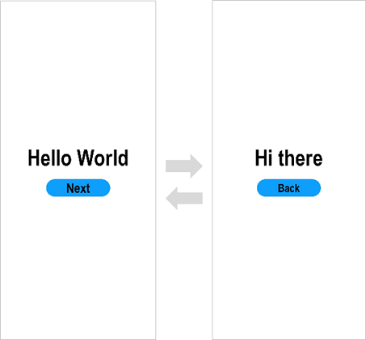

# 使用ArkTS语言开发（Stage模型）

>  **说明：**
>
>  本文以**ArkUI-X 4.0.8.2**版本为例，如果使用其它版本，可能存在文档与产品功能界面、操作不一致的情况，请以实际功能界面为准。

### 应用介绍：

通过构建一个多页面间跳转的示例，快速了解如何通过页面路由实现页面跳转，熟悉ArkTS跨平台开发流程。


## 创建ArkTS跨平台应用工程

### 1. 检查开发环境

   ```shell
   ace check
   ```

执行 `ace check` 命令可以检查上述的本地开发环境。对于必选项，需要检查通过，否则无法继续接下来的操作。

Windows系统中的开发环境：检查SDK和IDE的默认安装和下载路径；如果通过SDK Manager下载SDK，会检查默认环境变量：ANDROID_HOME和OpenHarmony_HOME是否配置。  

在MAC系统中需要配置npm与nodejs环境配置即可。

以下是需要检查的项：  

| 检查内容 | 说明  | Windows | Linux | Mac |
|------|-----|---------|-------|-----|
|Node.js|Node.js 路径| 是       | 是     |是|
|OpenHarmony SDK|OpenHarmony SDK路径| 是       | 是     |是|
|HarmonyOS SDK|HarmonyOS SDK路径| 是       | 是     |是|
|Android SDK|Android SDK路径| 是       | 是     |是|
|DevEco Studio|DevEco Studio安装路径| 是       | 否     |是|
|Android Studio|Android Studio安装路径| 是       | 是     |是|
|连接设备|当前连接的所有设备| 是       | 是     |是|
|Xcode|当前Xcode的版本号| 否       | 否     |是|
|libimobiledevice|当前libimobiledevice的版本号	| 否       | 否     |是|
|ios-deploy|当前ios-deploy的版本号	| 否       | 否     |是|
|ArkUI-X SDK|ArkUI-X SDK路径	| 是       | 是     |是|
|ohpm|ohpm路径	| 是       | 是     |是|

执行成功结果参考：
```shell
ohos@user ~ % ace check
[√] ArkUI-X toolchains - develop for ArkUI-X devices
  • ArkUI-X SDK at /Users/ohos/ARKUI-X
  • Node.js Runtime Environment at /usr/local/bin/node
  • Java Sdk at /Library/Java/JavaVirtualMachines/jdk-18.0.2.1.jdk/Contents/Home
  • Ohpm at /Users/ohos/Library/Huawei/ohpm/bin
[√] OpenHarmony toolchains - develop for OpenHarmony devices
  • OpenHarmony SDK at /Users/ohos/openharmony/sdk
  • Node.js Runtime Environment at /usr/local/bin/node
  • Java Sdk at /Library/Java/JavaVirtualMachines/jdk-18.0.2.1.jdk/Contents/Home
  • Ohpm at /Users/ohos/Library/Huawei/ohpm/bin
[√] HarmonyOS toolchains - develop for HarmonyOS devices
  • HarmonyOS SDK at /Users/ohos/harmonyos/sdk
  • Node.js Runtime Environment at /usr/local/bin/node
  • Java Sdk at /Library/Java/JavaVirtualMachines/jdk-18.0.2.1.jdk/Contents/Home
  • Ohpm at /Users/ohos/Library/Huawei/ohpm/bin
[√] Android toolchains - develop for Android devices
  • Android SDK at /Users/ohos/Library/Android/sdk
[√] DevEco Studio [Requires DevEco Studio 3.1 Release, API Version 9+]
  • DevEco Studio at /Applications/deveco-studio.app
[!] Android Studio
  ! Android Studio is not installed, you can install in https://developer.android.google.cn/studio
[√] iOS toolchains - develop for iOS devices
  • Xcode 13.3Build version 13E113
  • idevicesyslog 1.3.0
  • 1.11.4
Tools info :[√] OpenHarmony hdc installed [√] HarmonyOS hdc installed [√] adb installed [√] ios-deploy installed
[√] Connected device (1 available)
  • iOS Devices	[....] Found 00008020-001C0D92146A002E (N841AP, iPhone XR, iphoneos, arm64e, 15.0, 19A346) a.k.a. 'iPhone Xr 15.0' connected through USB.

  √ Ace-check found no issues.
```


### 2. 检查设备连接（可选）

   ```shell
   ace devices
   ```

获得当前连接的设备devices 及 deviceID。后续命令的参数需要加 deviceID，可随时执行查看。

*注：该命令已经集成在 ` ace check` 中，可跳过。*

### 3. 开发环境路径配置

   ```shell
   ace config
   ```

如果开发者没有按照IDE和SDK默认路径进行安装和下载，可通过此命令进行自定义路径配置。

### 4. 创建project

   以创建一个 ‘demo’  项目为例：

   ```shell
   ace create project
   ? Please enter the project name: demo
   ? Please enter the packages (com.example.demo):com.example.demo
   ? Please enter the system (1: OpenHarmony, 2: HarmonyOS): 1
   ? Please enter the template (1: Empty Ability, 2: Native C++): 1
   ? Please enter the Ability Model Type (1: Stage(基于Stage开发模型), 2: FA(基于FA开发模型)): 1
   ```

执行 `ace create project` 命令（project 可省略），接着输入项目名 demo ，包名直接回车默认即可。输入“1”代表创建基于OpenHarmony且是stage模型的声明式开发范式跨平台应用项目。

一个名为 ‘demo’ 的项目就创建成功了。

项目关键结构如下：

```shell
demo/
├── android		//用于编译跨平台应用Android工程
│   ├── app
│   │   ├── libs
│   │   └── src
│   │       ├── androidTest
│   │       ├── main
│   │       │   ├── AndroidManifest.xml
│   │       │   ├── assets	//用于存放跨平台应用编译生成的资源文件
│   │       │   ├── java
│   │       │   │   └── com
│   │       │   │       └── example
│   │       │   │           └── demo
│   │       │   │               ├── EntryMainAbilityActivity.java	   //继承自ArkUI提供的StageActivity基类
│   │       │   │               └── MyApplication.java	           //继承自ArkUI提供的StageApplication基类
│   │       │   └── res
│   │       └── test
│   ├── gradle
│   └── settings.gradle
├── ios		//用于编译跨平台应用ios工程
│   ├── app
│   │   ├── AppDelegate.h
│   │   ├── AppDelegate.m	//实例化EntryMainViewController，并加载ArkUI页面
│   │   ├── Info.plist
│   │   └── main.m
│   ├── app.xcodeproj
│   ├── frameworks
│   └── arkui-x
├── ohos	//用于编译跨平台应用ohos工程
│   ├── build-profile.json5
│   ├── oh-package.json5
│   ├── hvigorfile.ts
│   ├── entry
│   │   └── src
│   │       └── main
│   │           ├── config.json
│   │           └── resources
│   ├── AppScope
│   ├── hvigor
│   └── oh_modules
└── source	//用于编写跨平台应用源码
    └── entry
        ├── src
        │   ├── main
        │   │   ├── ets
        │   │   │   └── MainAbility
        │   │   │       └── MainAbility.ts
        │   │   │   └── Application
        │   │   │       └── AbilityStage.ts
        │   │   │   └── pages
        │   │   │       ├── index.ets             // 模板首页
        │   │   │       └── Second.ets            // 跳转的第二个页面        
        │   │   ├── resources
        │   │   └── module.json5                  // 工程配置信息
        │   └── ohosTest
        ├── build-profile.json5
        ├── hvigorfile.ts
        └── oh-package.json5
```

## 编写代码

在上述工程创建完成后，开发者可在项目中的source目录下进行代码开发。

### 构建第一个页面

创建第一个页面。 

   - 在第一个页面添加Text组件、Button组件等，并设置其样式。

   - 工程同步完成后，在“**source**”目录，点击“**entry &gt; src &gt; main &gt; ets &gt; pages &gt; index**”，打开“**index.ets**”文件，可以看到页面由Text和Button组件组成。“**index.ets**”文件的示例如下：
   
    ```ts
    // index.ets
    @Entry
    @Component
    struct Index {
        @State message:string = 'World'
        build() {
          Row() {
            Column() {
              Text('Hello ' + this.message)
                .fontSize(50)
                .fontWeight(FontWeight.Bold)
              Button() {
                Text(' Click me ')
                    .fontSize(25)
              }
              .type(ButtonType.Capsule)
              .margin({
                top: 25
              })
              .backgroundColor(Color.Yellow)
              .width('35%')
              .height(50)
              .onClick(() => {
                this.message = 'ArkUI'
              })
            }
            .width('100%')
          }
          .height('100%')
        }
    }
    ```

### 构建第二个页面

1. 创建第二个页面。

   - 新建第二个页面文件。在“**source**”目录，打开“**entry &gt; src &gt; main &gt; ets &gt; pages**”，右键点击“**pages**”文件夹，新增“**second**”目录和“**ArkTS**”文件，文件命名为“**second.ets**”。
   - 配置第二个页面的路由。在main_pages.json文件中的“src”下配置第二个页面的路由“pages/Second”。示例如下：
     
    ```json
    {
      "src": [
        "pages/Index",
        "pages/Second"
      ]
    }
      ```

2. 添加文本及按钮。

   参照第一个页面，在第二个页面添加Text组件、Button组件等，并设置其样式。“**second.ets**”文件的示例如下：
   
    ```ts
    // second.ets
    @Entry
    @Component
    struct Index {
        @State message:string = 'there'
        build() {
          Row() {
            Column() {
              Text('Hi ' + this.message)
                .fontSize(50)
                .fontWeight(FontWeight.Bold)
              Button() {
                Text(' Click me ')
                    .fontSize(25)
              }
              .type(ButtonType.Capsule)
              .margin({
                top: 25
              })
              .backgroundColor(Color.Yellow)
              .width('35%')
              .height(50)
              .onClick(() => {
                this.message = 'ArkUI'
              })
            }
            .width('100%')
          }
          .height('100%')
        }
    }
    ```

## 实现页面间的跳转

页面间的导航可以通过页面路由@ohos.router接口来实现。页面路由router根据页面url找到目标页面，从而实现跳转。使用页面路由请导入router模块。

1. 第一个页面跳转到第二个页面。

   在第一个页面中，跳转按钮绑定onClick事件，点击按钮时跳转到第二页。“**index.ets**”文件的示例如下：
   
    ```ts
    // index.ets
    // 导入页面路由模块
    import router from '@ohos.router';

    @Entry
    @Component
    struct Index {
        @State message:string = 'World'
        build() {
          Row() {
            Column() {
              Text('Hello ' + this.message)
                .fontSize(50)
                .fontWeight(FontWeight.Bold)
              Button() {
                Text(' Click me ')
                    .fontSize(25)
                }
              .type(ButtonType.Capsule)
              .margin({
                top: 25
              })
              .backgroundColor(Color.Yellow)
              .width('35%')
              .height(50)
              // 跳转按钮绑定onClick事件，点击时跳转到第二页
              .onClick(() => {
                  router.push({ url: 'pages/second/second' })
              })
            }
            .width('100%')
          }
          .height('100%')
        }
    }
    ```

2. 第二个页面返回到第一个页面。

   在第二个页面中，返回按钮绑定onClick事件，点击按钮时返回到第一页。“**second.ets**”文件的示例如下：
   
    ```ts
    // second.ets
    // 导入页面路由模块
    import router from '@ohos.router';

    @Entry
    @Component
    struct Index {
        @State message:string = 'there'
        build() {
          Row() {
            Column() {
              Text('Hi ' + this.message)
                .fontSize(50)
                .fontWeight(FontWeight.Bold)
              Button() {
                Text(' Click me ')
                  .fontSize(25)
              }
              .type(ButtonType.Capsule)
              .margin({
                top: 25
              })
              .backgroundColor(Color.Yellow)
              .width('35%')
              .height(50)
              // 跳转按钮绑定onClick事件，点击按钮时返回到第一页
              .onClick(() => {
                router.back()
              })
            }
            .width('100%')
          }
          .height('100%')
        }
    }
    ```

## 项目编译

开始对 'demo' 项目进行编译。编译目标产物为hap 、apk和app，分别对应OpenHarmony/HarmonyOS、Android和iOS应用工程，
下述命令以hap为例，并且可将hap参数替换为apk或app，其分别对应Android应用和iOS应用，功能一致：

   ```shell
   cd demo
   ```

   编译hap，默认编译所有Module

   ```shell
   ace build hap
   ```

   最终会生成hap应用文件，默认路径为 demo/ohos/entry/build/default/outputs/default/。

   **注**： apk文件的默认路径为demo/android/app/build/outputs/apk/debug/。app文件的默认路径为demo/ios/build/outputs/app/。
## 使用真机运行应用

效果如下图所示：

   

* Android平台展示效果

| 首页                                          | 点击跳转后页面                            |
|---------------------------------------------|------------------------------------------|
|  |  |

* iOS平台展示效果

| 首页                        | 点击跳转后页面                                 |
|---------------------------|-----------------------------------------|
|  |  |

* OpenHarmomy平台展示效果

| 首页                                     | 点击跳转后页面                            |
|----------------------------------------|------------------------------------------|
|  | |

恭喜您已经使用ArkTS语言开发（Stage模型）完成了第一个ArkUI跨平台应用，快来[探索更多的ArkUI-X功能](../application-dev-guide.md)吧。
