# 使用ArkTS语言开发（Stage模型）


>  **说明：**
>
>  请使用**DevEco Studio 4.0 Beta2**及更高版本。如果使用其它版本，可能存在文档与产品功能界面、操作不一致的情况，请以实际功能界面为准。


## 应用介绍

通过构建一个简单的ArkUI页面跳转示例，快速了解资源创建引用，路由代码编写和UI布局编写等应用开发流程。

## 导入应用模板
- 通过**Import Samples**导入helloworld工程。

### ArkTS工程目录结构（Stage模型）

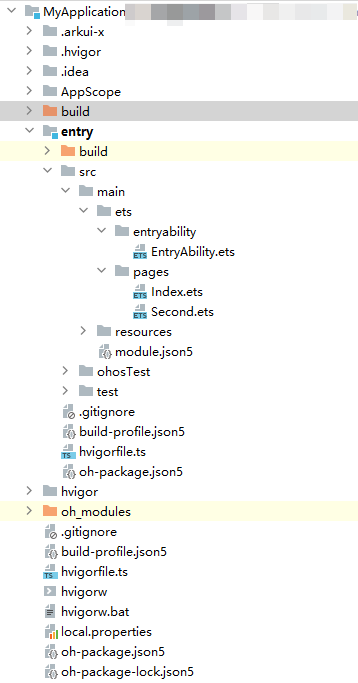

- **AppScope &gt; app.json5**：应用的全局配置信息。

- **entry**：OpenHarmony工程模块，编译构建生成一个HAP包。
   - **build**：用于存放OpenHarmony编译生成的hap包。
   - **src &gt; main &gt; ets**：用于存放ArkTS源码。

   - **src &gt; main &gt; ets &gt; entryability**：应用/服务的入口。

   - **src &gt; main &gt; ets &gt; pages**：应用/服务包含的页面。

   - **src &gt; main &gt; resources**：用于存放应用/服务所用到的资源文件，如图形、多媒体、字符串、布局文件等。关于资源文件，详见[资源文件的分类](resource-categories-and-access.md#资源分类)。

   - **src &gt; main &gt; module.json5**：模块配置文件。主要包含HAP包的配置信息、应用/服务在具体设备上的配置信息以及应用/服务的全局配置信息。

   - **build-profile.json5**：当前的模块信息 、编译信息配置项，包括buildOption、targets配置等。

   - **hvigorfile.ts**：模块级编译构建任务脚本，开发者可以自定义相关任务和代码实现。

- **oh_modules**：用于存放三方库依赖信息。
- **build-profile.json5**：应用级配置信息，包括签名signingConfigs、产品配置products等。
- **hvigorfile.ts**：应用级编译构建任务脚本。


## 编写代码

在上述工程创建完成后，开发者可在项目中的**entry**目录下进行代码开发。

### 构建第一个页面

创建第一个页面。

1.在第一个页面添加Text组件、Button组件等，并设置其样式。

- 工程同步完成后，在“**Project**”窗口，点击“**entry &gt; src &gt; main &gt; ets &gt; pages**”，打开“**Index.ets**”文件，可以看到页面由Image，Button组件组成。“**Index.ets**”文件的示例如下：


   ```ts
    // index.ets
    @Entry
    @Component
    struct Index {
      build() {
        Row() {
          Column() {
            Text()
              .fontSize(50)
              .fontWeight(FontWeight.Bold)
            // 添加按钮，以响应用户点击
            Button() {
              Text()
                .fontSize(30)
                .fontWeight(FontWeight.Bold)
            }
            .type(ButtonType.Capsule)
            .margin({
              top: 20
            })
            .backgroundColor()
            .width('40%')
            .height('5%')
          }
          .width('100%')
        }
        .height('100%')
      }
    }

   ```

### 构建第二个页面

1. 创建第二个页面。

   - 新建第二个页面文件。在“**Project**”窗口，打开“**entry &gt; src &gt; main &gt; ets**”，右键点击“**pages**”文件夹，

     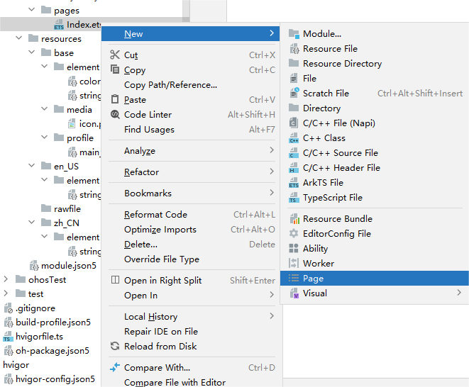

   - 新建的页面命名为“**Second**”，点击“**Finish**”。

     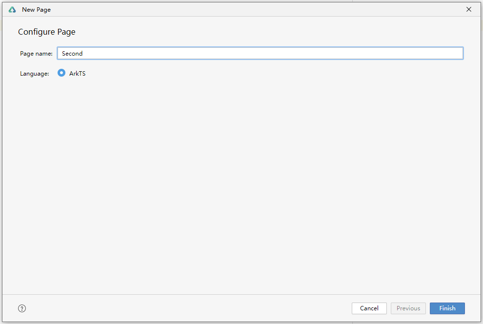

   - 可以看到文件目录结构如下：

     

2. 添加文本及按钮。

   参照第一个页面，在第二个页面添加Text组件、Button组件等，并设置其样式。“**Second.ets**”文件的示例如下：

   ```ts
     // second.ets
    @Entry
    @Component
    struct Second {
        build() {
          Row() {
            Column() {
              Text()
                .fontSize(50)
                .fontWeight(FontWeight.Bold)
              Button() {
                Text()
                  .fontSize(25)
                  .fontWeight(FontWeight.Bold)
              }
              .type(ButtonType.Capsule)
              .margin({
                top: 20
              })
              .backgroundColor()
              .width('40%')
              .height('5%')
            }
            .width('100%')
          }
          .height('100%')
        }
    }
   
      ```
## 引用资源

1.定义需要被引用的文字资源：在“**Project**”窗口，点击“**entry &gt; src &gt; main &gt; resources &gt; base &gt; element &gt; string.json**”，打开“**string.json**”文件，加入蓝框的文字资源，如下图展示：

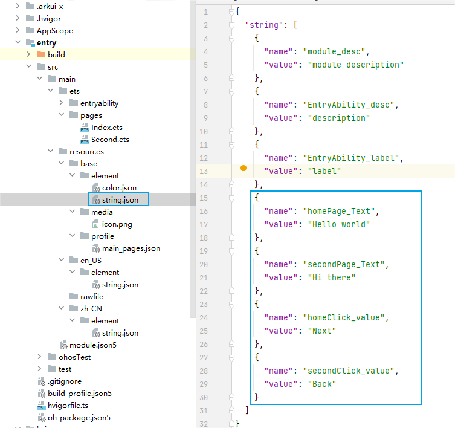

- 引用文字资源：在 **Text()** 中用 **$r('app.string.xx')** 的方式引用文字资源。

2.定义需要被引用的颜色资源：在“**Project**”窗口，点击“**entry &gt; src &gt; main &gt; resources &gt; base &gt; element &gt; color.json**”，打开“**color.json**”文件，加入蓝框的颜色资源，如下图展示：

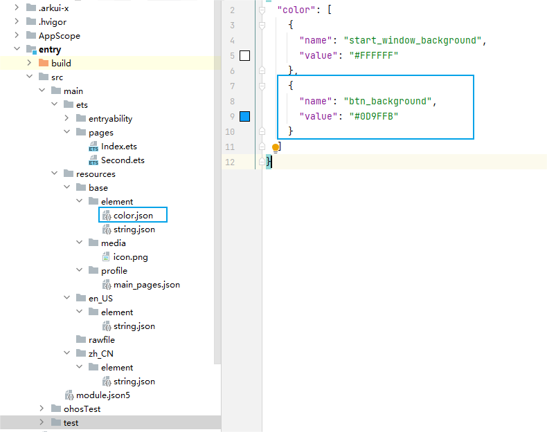

- 引用颜色资源：在 **Button(){}.backgroundColor()** 中用 **$r('app.color.xx')** 的方式引用颜色资源。

3.“**Index.ets**”文件的示例如下：

   ```ts
    // index.ets
    @Entry
    @Component
    struct Index {
        build() {
          Row() {
            Column() {
              //引用文字资源
              Text($r('app.string.homePage_Text'))
                .fontSize(50)
                .fontWeight(FontWeight.Bold)
              Button() {
                //引用文字资源
                Text($r('app.string.homeClick_value'))
                    .fontSize(30)
                    .fontWeight(FontWeight.Bold)
              }
              .type(ButtonType.Capsule)
              .margin({
                top: 20
              })
              //引用颜色资源
              .backgroundColor($r('app.color.btn_background'))
              .width('40%')
              .height('5%')
            }
            .width('100%')
          }
          .height('100%')
        }
    }
   ```


4.“**Second.ets**”文件的示例如下：

   ```ts
    // second.ets
    @Entry
    @Component
    struct Second {
        build() {
          Row() {
            Column() {
              //引用文字资源
              Text($r('app.string.secondPage_Text'))
                .fontSize(50)
                .fontWeight(FontWeight.Bold)
              Button() {
                //引用文字资源
                Text($r('app.string.secondClick_value'))
                  .fontSize(25)
                  .fontWeight(FontWeight.Bold)
              }
              .type(ButtonType.Capsule)
              .margin({
                top: 20
              })
              //引用颜色资源
              .backgroundColor($r('app.color.btn_background'))
              .width('40%')
              .height('5%')
            }
            .width('100%')
          }
          .height('100%')
        }
    }
   ```


## 实现页面间的跳转

页面间的导航可以通过[页面路由router](../reference/apis/js-apis-router.md)接口来实现。页面路由router根据页面url找到目标页面，从而实现跳转。使用页面路由请导入router模块。

1. 第一个页面跳转到第二个页面。

   在第一个页面中，跳转按钮绑定onClick事件，点击按钮时跳转到第二页。“**index.ets**”文件的示例如下：

    ```ts
    // index.ets
    import router from '@ohos.router';
    
    @Entry
    @Component
    struct Index {
      build() {
        Row() {
          Column() {
            Text($r('app.string.homePage_Text'))
              .fontSize(50)
              .fontWeight(FontWeight.Bold)
            // 添加按钮，以响应用户点击
            Button() {
              Text($r('app.string.homeClick_value'))
                .fontSize(30)
                .fontWeight(FontWeight.Bold)
            }
            .type(ButtonType.Capsule)
            .margin({
              top: 20
            })
            .backgroundColor($r('app.color.btn_background'))
            .width('40%')
            .height('5%')
            // 跳转按钮绑定onClick事件，点击时跳转到第二页
            .onClick(() => {
              router.pushUrl({ url: 'pages/Second' })
            })
          }
          .width('100%')
        }
        .height('100%')
      }
    }

    ```

2. 第二个页面返回到第一个页面。

   在第二个页面中，返回按钮绑定onClick事件，点击按钮时返回到第一页。“**second.ets**”文件的示例如下：

    ```ts
    // second.ets
    import router from '@ohos.router';

    @Entry
    @Component
    struct Second {
        build() {
          Row() {
            Column() {
              Text($r('app.string.secondPage_Text'))
                .fontSize(50)
                .fontWeight(FontWeight.Bold)
              Button() {
                Text($r('app.string.secondClick_value'))
                  .fontSize(25)
                  .fontWeight(FontWeight.Bold)
              }
              .type(ButtonType.Capsule)
              .margin({
                top: 20
              })
              .backgroundColor($r('app.color.btn_background'))
              .width('40%')
              .height('5%')
              // 跳转按钮绑定onClick事件，点击按钮时返回到第一页
              .onClick(() => {
                router.back()
              })
            }
            .width('100%')
          }
          .height('100%')
        }
    }
   
    ```
3.无需手动配置新增的第二个页面路由：由于我们选择了用**New &gt;Page**的方式新建页面，路由表里会自动配置新增的页面路由。  
在“**Project**”窗口，打开“**entry &gt; src &gt; main &gt; resources &gt; base &gt; profile**”，在**main_pages.json**文件中的“src”下自动配置的第二个页面的路由“pages/Second”，示例如下：

   ```json
      {
        "src": [
          "pages/Index",
          "pages/Second"
        ]
      }
   ```


## 使用真机运行应用

1. 将搭载OpenHarmony标准系统的开发板与电脑连接。

2. 点击**File** &gt; **Project Structure...** &gt; **Project** &gt; **SigningConfigs**界面勾选“**Automatically generate signature**”，等待自动签名完成即可，点击“**OK**”。如下图所示：

   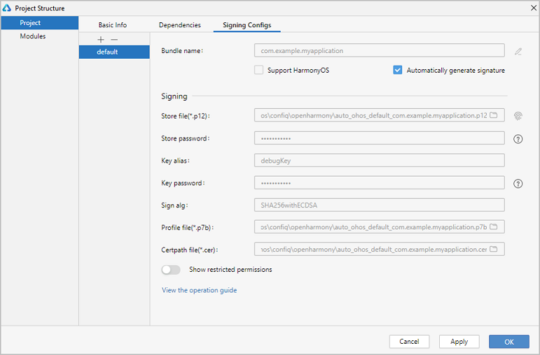
3. 编译的[详细步骤](start-with-deveco-studio.md)。
4. 效果如下图所示：

* Android平台展示效果

| 首页                                          | 点击跳转后页面                            |
|---------------------------------------------|------------------------------------------|
| 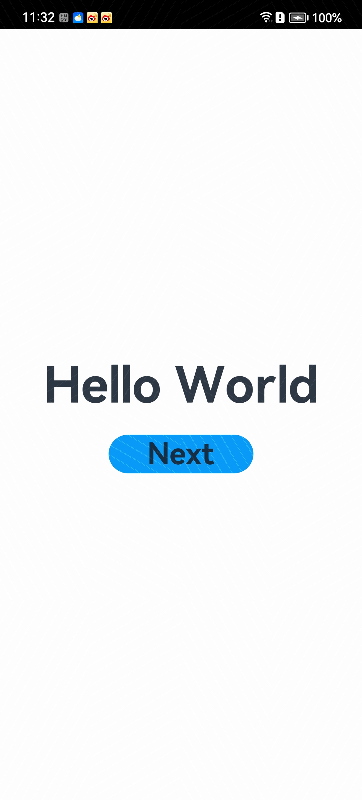 | 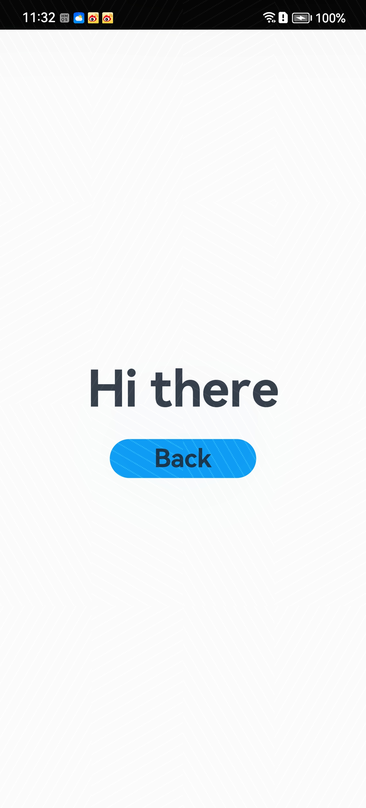 |

* iOS平台展示效果

| 首页                        | 点击跳转后页面                                 |
|---------------------------|-----------------------------------------|
| 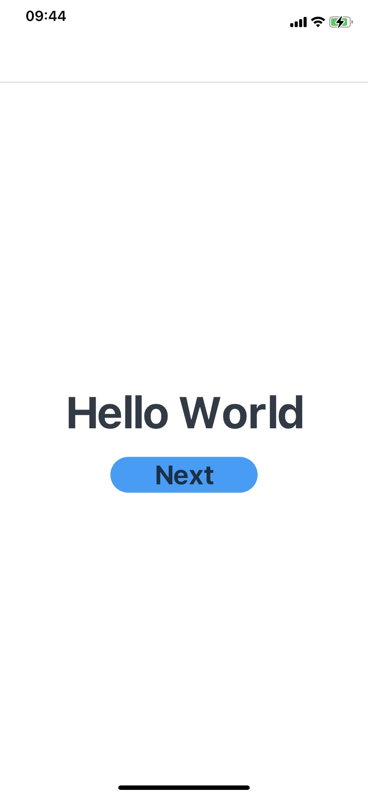 | 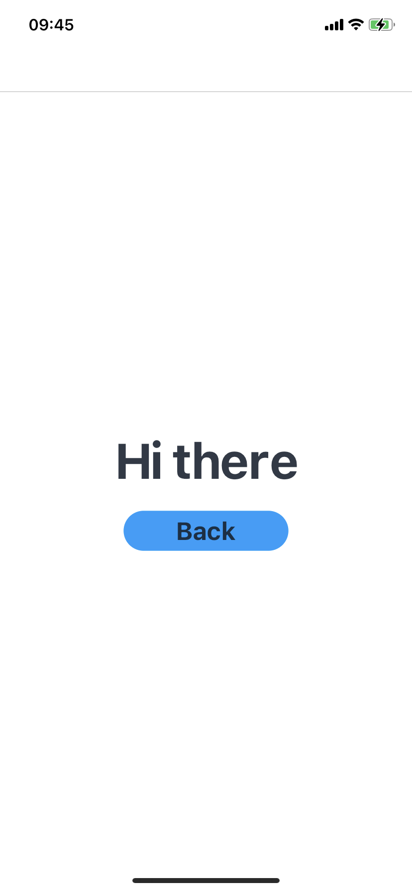 |

* OpenHarmomy平台展示效果

| 首页                                     | 点击跳转后页面                            |
|----------------------------------------|------------------------------------------|
| 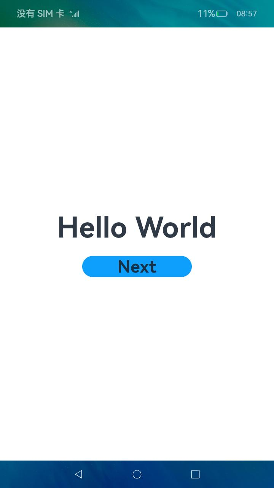 | 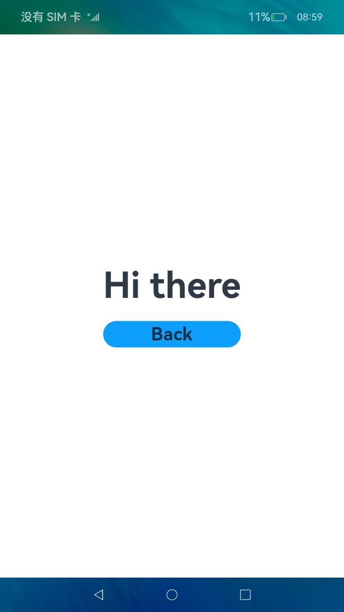|

恭喜您已经使用ArkTS语言开发（Stage模型）完成了第一个ArkUI跨平台应用，快来[探索更多的ArkUI-X功能](../application-dev-guide.md)吧。
