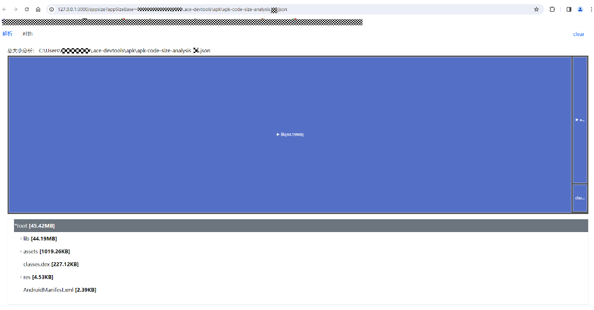
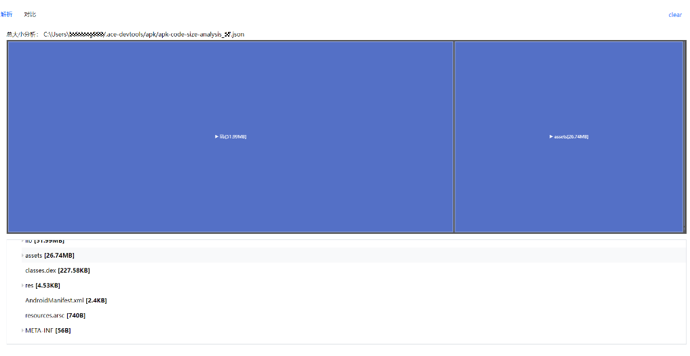

# rom size 使用指导

## 1、rom size 是什么？

rom size 是一个可以让我们分析应用安装包总体积的应用工具。可以使用解析tab标签来查看单个体积分析json文件的体积信息，或者可以使用对比tab标签来对比查看不同版本体积分析json文件的体积信息。

## 2、rom size 环境相关配置
- rom size 是一个内嵌在 ACE Tools 命令行工具里的应用工具，所以在使用之前，应现在电脑环境中配置ace可运行的环境。
- 搭建安装ACE Tools的运行环境请参考：[ACE Tools快速指南](https://gitee.com/arkui-x2/docs/blob/master/zh-cn/application-dev/quick-start/start-with-ace-tools.md)

## 3、rom size 的使用

rom size 的使用是通过给 ace build apk 或者 ace build hap 增加 --analyze 参数来解析对应的安装包应用体积。
使用示例1： 打开跨平台项目下的命令行窗口，输入 ace build apk --analyze 命令，命令运行成功会出现如下图所示内容，

并且会在c盘当前用户文件夹下的 .ace-devtools\apk文件夹中生成apk安装包对应的体积分析json文件，

并开启一个浏览器窗口，显示当前安装包的体积分析json文件的应用体积页面

使用示例2： 打开跨平台项目下的命令行窗口，输入 ace build hap --analyze 命令，命令运行成功会出现如下图所示内容，

并且会在c盘当前用户文件夹下的 .ace-devtools\hap文件夹中生成hap安装包对应的体积分析json文件，

并开启一个浏览器窗口，显示当前安装包的体积分析json文件的应用体积页面

使用示例3： 打开跨平台项目下的命令行窗口，输入 ace build ios --analyze 命令，命令运行成功会出现如下图所示内容，

并且会在c盘当前用户文件夹下的 .ace-devtools\ios文件夹中生成ios安装包对应的体积分析json文件；

并开启一个浏览器窗口，显示当前安装包的体积分析json文件的应用体积页面

## 4、rom size 解析tab标签页

在解析tab标签页中，我们可以通过树状图和目录结构图看到关于安装包的体积分析json文件信息。

以apk的json文件为例，文件中分析的体积模块大致包括：
     1、应用的lib模块：包含有应用运行时所使用的相关依赖so库；
     2、assets静态模块：包含应用所使用的图片，视频，音频等资源文件；
     3、res模块：包含编译后的资源文件；
     4、META-INT模块：应用存放签名证书的签名文件；
     5、AndroidManifest.xml文件：配置包名、应用名、权限、安卓四大组件、版本的清单信息文件。
在树状图中，每个文件空间大小被分解成矩形，矩形的位置由体积变量决定，每个小矩形中显示着当前文件\文件夹名字和体积大小。每个矩形的面积与节点在编译后的安装包中所占的大小成比例关系。每个矩形的内部，还有更多的代表子文件\文件夹矩形存在。
如果要查看某个文件夹下的文件体积详情图，则可以点击文件夹所在的矩形，便以选中的矩形作为树状图中新的根节点，重新展示树状图。

点击ets矩形，则以ets为根节点，展示ets文件夹下文件的体积图，同时目录树图也会对应展开ets下的目录结构。
当点击目录树图的文件夹节点时，也会以当前点击的文件节点作为根节点，在树状图中展示文件夹里的文件体积详情，

，点击目录树中的resources节点。树状图展示resources文件夹下的文件体积图。

在解析tab标签页的右上角点击clear，则可以清除当前的文件解析内容。并显示上传文件页面，

在上传页面中，可以通过拖拽或上传文件按钮来进行json文件的上传，上传成功后则会显示上传文件的文件名，

当想重新更换上传文件时，可以再次点击右上角的clear，就可以清楚当前上传的文件，以便重新上传需要解析的文件。
如果没有上传json文件，直接点击解析文件按钮，则会出现提示弹框，提醒请先上传文件，

当成功上传json后，点击解析文件按钮，会显示相关的应用体积图，

## 5、rom size 对比tab标签页

点击左上角的对比tab标签页，可以让我们上传比较同种包类型的两个不同版本的体积分析json文件，通过树状图和目录树图清晰的看到解析对比两个版本文件的差异。
点击左上角的对比tab标签页，会出现如下图所示的上传页面，

可以通过拖拽或点击上传按钮，上传需要解析对比的json文件。
在上传页面中，可以通过拖拽或上传文件按钮来进行json文件的上传，上传成功后则会显示上传文件的文件名，

当想重新更换上传文件时，可以再次点击右上角的clear，就可以清楚当前上传的文件，以便重新上传需要解析的文件。
如果没有同时上传需要解析对比的两个json文件，直接点击解析文件按钮，则会出现提示弹框，提醒请先上传文件，

如果上传的包类型体积分析json文件类别不同，则会出现提示弹框，提示包类型不一致，无法比较。

上传了一个apk的体积分析json文件和一个ios的体积分析json文件，就会出现此提示弹框。

上传两个不同版本的文件成功以后，点击解析文件按钮，可以解析两个不同的文件，会对文件进行体积大小的对比，将有差异的文件通过树状图和目录树图体现出来，

红色为有文件减少的目录模块，绿色为有文件增加的目录模块。
点击右上角全部的下拉选项按钮，还可以选择只看有体积增加的文件或只看有体积减少的文件，

如需更换另外的需要对比分析的json文件，则可点击右上角的clear，清除当前对比的页面内容。
