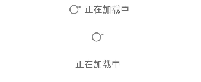

# SwipeRefresher

内容加载指获取内容并加载出来，常用于衔接展示下拉加载的内容。

## 导入模块

```
import { SwipeRefresher } from '@kit.ArkUI'
```

## 子组件

无

## 属性

不支持[通用属性](../../../application-dev/reference/arkui-ts/ts-universal-attributes-size.md)

## SwipeRefresher

SwipeRefresher ({content?: string, isLoading: boolean})

**装饰器类型：**\@Component

**支持平台**：Android、iOS

**系统能力：** SystemCapability.ArkUI.ArkUI.Full

**参数：**

| 名称      | 类型                                                                | 必填 | 装饰器类型 | 说明                                                                                                    |
| --------- | ------------------------------------------------------------------- | ---- | ---------- | ------------------------------------------------------------------------------------------------------- |
| content   | [ResourceStr](../../../application-dev/reference/arkui-ts/ts-types.md) | 否   | \@Prop     | 内容加载时显示的文本。                                                                                  |
| isLoading | boolean                                                             | 是   | \@Prop     | 当前是否正在加载。`<br>` isLoading为true时，表示正在加载。`<br>` isLoading为false时，表示未在加载。 |

## 事件

不支持[通用事件](../../../application-dev/reference/arkui-ts/ts-universal-events-click.md)

## 示例

展示设置属性content为空字串及不为空、isLoading为true和false的不同加载效果。

```ts
import { SwipeRefresher } from '@kit.ArkUI';

@Entry
@Component
struct Index {
  build() {
    Column() {
      SwipeRefresher({
        content: '正在加载中',
        isLoading: true
      })
      SwipeRefresher({
        content: '',
        isLoading: true
      })
      SwipeRefresher({
        content: '正在加载中',
        isLoading: false
      })
    }
  }
}
```


