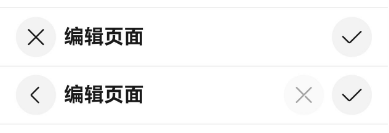
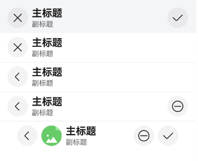
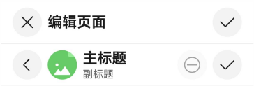
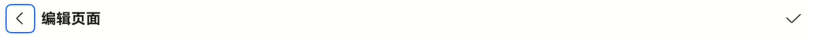
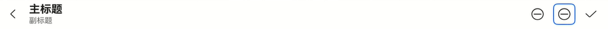
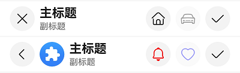

# EditableTitleBar

编辑型标题栏，适用于多选界面或者内容的编辑界面，一般采取左叉右勾的形式。

> **说明：**
>
> 该组件从API version 12开始支持跨平台。后续版本如有新增内容，则采用上角标单独标记该内容的起始版本。
>

## 导入模块

```javascript
import { EditableTitleBar } from '@ohos.arkui.advanced.EditableTitleBar';
```

## 子组件

无

## 属性

不支持[通用属性](../../../application-dev/reference/arkui-ts/README.md)。

## 事件

不支持[通用事件](../../../application-dev/reference/arkui-ts/README.md)。

## EditableTitleBar

EditableTitleBar({leftIconStyle: EditableLeftIconType, imageItem?: EditableTitleBarItem, title: ResourceStr, subtitle?: ResourceStr, menuItems?: Array&lt;EditableTitleBarMenuItem&gt; , isSaveIconRequired: boolean, onSave?: () => void, onCancel?: () =>void, options: EditableTitleBarOptions, contentMargin?: LocalizedMargin, leftIconDefaultFocus?: boolean, saveIconDefaultFocus?: boolean})

**装饰器类型：**@Component

**支持平台：** Android、iOS

**系统能力：** SystemCapability.ArkUI.ArkUI.Full

| 名称                        | 类型                                                         | 必填 | 装饰器类型 | 说明                                                         |
| :-------------------------- | :----------------------------------------------------------- | :--- | :--------- | :----------------------------------------------------------- |
| leftIconStyle<sup>22+</sup> | [EditableLeftIconType](#EditableLeftIconType)                | 是   | -          | 左侧按钮类型。默认值：EditableLeftIconType.Back，表示返回。  |
| imageItem                   | [EditableTitleBarItem](#EditableTitleBarItem)                | 否   | -          | 用于左侧头像的单个菜单项目。默认值：undefined。**说明：** 左侧头像不支持配置以下属性：symbolStyle、label、action、accessibilityLevel、accessibilityText、accessibilityDescription。 |
| title<sup>22+</sup>         | [ResourceStr](../arkui-ts/ts-types.md#resourcestr)           | 是   | -          | 标题。默认值：''，表示标题内容为空。                         |
| subtitle                    | [ResourceStr](../arkui-ts/ts-types.md#resourcestr)           | 否   | -          | 副标题。默认值：''，表示副标题内容为空。                     |
| menuItems<sup>22+</sup>     | Array<[EditableTitleBarMenuItem](#EditableTitleBarMenuItem)> | 否   | -          | 右侧菜单项目列表。默认值：undefined。                        |
| isSaveIconRequired          | boolean                                                      | 是   | -          | 是否需要右侧的保存按钮。默认值：true，表示需要右侧的保存按钮。**说明：** 未使用@Require装饰，构造时不强制校验参数。 |
| onSave<sup>22+</sup>        | () => void                                                   | 否   | -          | 保存时的动作闭包。默认值：() => void。                       |
| onCancel<sup>22+</sup>      | () => void                                                   | 否   | -          | 当左侧按钮类型为 Cancel，触发取消时的动作闭包。默认值：() => void。从API version 12开始，当左侧按钮类型为 Back，触发返回时的动作闭包。 |
| options                     | [EditableTitleBarOptions](#EditableTitleBarOptions)          | 是   | -          | 标题样式。默认值：{safeAreaTypes: [SafeAreaType.SYSTEM],safeAreaEdges: [SafeAreaEdge.TOP],backgroundColor: '#00000000'}。**说明：** 未使用@Require装饰，构造时不强制校验参数。 |
| contentMargin               | LocalizedMargin                                              | 否   | @Prop      | 标题栏外边距，不支持设置负数。默认值：{start: LengthMetrics.resource($r('sys.float.margin_left')), end: LengthMetrics.resource($r('sys.float.margin_right'))}。 |
| leftIconDefaultFocus        | boolean                                                      | 否   | -          | 左侧图标是否为默认焦点。默认值：false，表示不是默认焦点。    |
| saveIconDefaultFocus        | boolean                                                      | 否   | -          | 保存图标是否为默认焦点。默认值：false，表示不是默认焦点。    |

> **说明：**
>
> 入参对象不可为undefined，即EditableTitleBar(undefined)。
>
> 若同时有多个可操作区域设置值默认焦点，则设置过默认焦点的可操作区域中显示顺序的第一个为默认焦点。

## EditableLeftIconType

**支持平台：** Android、iOS

**系统能力：** SystemCapability.ArkUI.ArkUI.Full

| 名称                 | 值   | 说明       |
| :------------------- | :--- | :--------- |
| Back<sup>22+</sup>   | 0    | 返回按钮。 |
| Cancel<sup>22+</sup> | 1    | 取消按钮。 |

## EditableTitleBarMenuItem

**支持平台：** Android、iOS

**系统能力：** SystemCapability.ArkUI.ArkUI.Full

| 名称                                   | 类型                                               | 必填 | 说明                                                         |
| :------------------------------------- | :------------------------------------------------- | :--- | :----------------------------------------------------------- |
| value<sup>22+</sup>                    | [ResourceStr](../arkui-ts/ts-types.md#resourcestr) | 是   | 图标资源。                                                   |
| symbolStyle<sup>22+</sup>              | SymbolGlyphModifier                                | 否   | Symbol图标资源，优先级大于value。                            |
| label<sup>22+</sup>                    | [ResourceStr](../arkui-ts/ts-types.md#resourcestr) | 否   | 图标标签描述。                                               |
| isEnabled<sup>22+</sup>                | boolean                                            | 否   | 是否启用，默认启用。isEnabled为true时，表示为启用。isEnabled为false时，表示为禁用。 |
| action<sup>22+</sup>                   | () => void                                         | 否   | 触发时的动作闭包。                                           |
| accessibilityLevel<sup>22+</sup>       | string                                             | 否   | 标题栏右侧自定义按钮无障碍重要性。用于控制当前项是否可被无障碍辅助服务所识别。支持的值为："auto"：当前组件会转换'yes'。"yes"：当前组件可被无障碍辅助服务所识别。"no"：当前组件不可被无障碍辅助服务所识别。"no-hide-descendants"：当前组件及其所有子组件不可被无障碍辅助服务所识别。默认值："auto"。 |
| accessibilityText<sup>22+</sup>        | [ResourceStr](../arkui-ts/ts-types.md#resourcestr) | 否   | 标题栏右侧自定义按钮的无障碍文本属性。当组件不包含文本属性时，屏幕朗读选中此组件时不播报，使用者无法清楚地知道当前选中了什么组件。为了解决此场景，开发人员可为不包含文字信息的组件设置无障碍文本，当屏幕朗读选中此组件时播报无障碍文本的内容，帮助屏幕朗读的使用者清楚地知道自己选中了什么组件。默认值：有label默认值为当前项label属性内容，没有设置label时，默认值为“ ”。 |
| accessibilityDescription<sup>22+</sup> | [ResourceStr](../arkui-ts/ts-types.md#resourcestr) | 否   | 标题栏右侧自定义按钮的无障碍描述。此描述用于向用户详细解释当前组件，开发人员应为组件的这一属性提供较为详尽的文本说明，以协助用户理解即将执行的操作及其可能产生的后果。特别是当这些后果无法仅从组件的属性和无障碍文本中直接获知时。如果组件同时具备文本属性和无障碍说明属性，当组件被选中时，系统将首先播报组件的文本属性，随后播报无障碍说明属性的内容。默认值为“单指双击即可执行”。 |
| defaultFocus<sup>22+</sup>             | boolean                                            | 否   | 是否设置为默认获焦。true: 获焦false: 不获焦默认值：false。   |

## EditableTitleBarItem

type EditableTitleBarItem = EditableTitleBarMenuItem

**支持平台：** Android、iOS

**系统能力：** SystemCapability.ArkUI.ArkUI.Full

| 类型                                                  | 说明                     |
| :---------------------------------------------------- | :----------------------- |
| [EditableTitleBarMenuItem](#EditableTitleBarMenuItem) | 左侧头像的单个菜单类型。 |

## EditableTitleBarOptions

**支持平台：** Android、iOS

**系统能力：** SystemCapability.ArkUI.ArkUI.Full

| 名称                | 类型                                                         | 必填 | 说明                                                         | Android | iOS    |
| :------------------ | :----------------------------------------------------------- | :--- | :----------------------------------------------------------- | ------- | ------ |
| backgroundColor     | [ResourceColor](../arkui-ts/ts-types.md#ResourceColor)       | 否   | 标题栏背景色。默认值: '#00000000'                            | 支持    | 支持   |
| backgroundBlurStyle | [BlurStyle](../arkui-ts/ts-appendix-enums.md#BlurStyle9)     | 否   | 标题栏背景模糊样式。默认值: BlurStyle.NONE                   | 支持    | 支持   |
| safeAreaTypes       | Array <[SafeAreaType](../arkui-ts/ts-types.md#SafeAreaType10)> | 否   | 非必填，配置扩展安全区域的类型。默认值: [SafeAreaType.SYSTEM] | 不支持  | 不支持 |
| safeAreaEdges       | Array <[SafeAreaEdge](../arkui-ts/ts-types.md#SafeAreaEdge10)> | 否   | 非必填，配置扩展安全区域的方向。默认值: [SafeAreaEdge.TOP]   | 不支持  | 不支持 |

## 示例

### 示例1（右侧图标自定义标题栏）

该示例主要演示EditableTitleBar设置左侧图标、主标题及自定义右侧图标区的效果。

```typescript
import { EditableLeftIconType, EditableTitleBar } from '@ohos.arkui.advanced.EditableTitleBar';
import promptAction from '@ohos.promptAction';

@Entry
@Component
struct Index {
  build() {
    Row() {
      Column() {
        Divider().height(2).color(0xCCCCCC)
        // 左侧取消按钮，右侧保存按钮。
        EditableTitleBar({
          leftIconStyle: EditableLeftIconType.Cancel,
          title: '编辑页面',
          menuItems: [],
          onCancel: () => {
            promptAction.showToast({ message: 'on cancel' });
          },
          onSave: () => {
            promptAction.showToast({ message: 'on save' });
          }
        })
        Divider().height(2).color(0xCCCCCC)
        // 左侧返回按钮，右侧自定义取消按钮（disabled）、保存按钮。
        EditableTitleBar({
          leftIconStyle: EditableLeftIconType.Back,
          title: '编辑页面',
          menuItems: [
            {
              value: $r('sys.media.ohos_ic_public_cancel'),
              isEnabled: false,
              action: () => {
                promptAction.showToast({ message: 'show toast index 2' });
              }
            }
          ],
          onSave: () => {
            promptAction.showToast({ message: 'on save' })
          }
        })
        Divider().height(2).color(0xCCCCCC)
      }.width('100%')
    }.height('100%')
  }
}
```



### 示例2（头像与背景模糊标题栏）

该示例主要演示EditableTitleBar设置背景模糊、头像；取消右侧保存图标及自定义标题栏外边距的效果。

```typescript
import { EditableLeftIconType, EditableTitleBar, LengthMetrics } from '@kit.ArkUI';
import promptAction from '@ohos.promptAction';

@Entry
@Component
struct Index {
  @State titleBarMargin: LocalizedMargin = {
    start: LengthMetrics.vp(35),
    end: LengthMetrics.vp(35),
  };

  build() {
    Row() {
      Column() {
        EditableTitleBar({
          leftIconStyle: EditableLeftIconType.Cancel,
          title: '主标题',
          subtitle: '副标题',
          // 设置背景模糊效果
          options: {
            backgroundBlurStyle: BlurStyle.COMPONENT_THICK,
          },
          onSave: () => {
            promptAction.showToast({ message: "on save" });
          },
        })
        Divider().height(2).color(0xCCCCCC);
        EditableTitleBar({
          leftIconStyle: EditableLeftIconType.Cancel,
          title: '主标题',
          subtitle: '副标题',
          // 取消右侧保存按钮
          isSaveIconRequired: false,
        })
        Divider().height(2).color(0xCCCCCC);
        EditableTitleBar({
          leftIconStyle: EditableLeftIconType.Back,
          title: '主标题',
          subtitle: '副标题',
          isSaveIconRequired: false,
          onCancel: () => {
            this.getUIContext()?.getRouter()?.back();
          },
        })
        Divider().height(2).color(0xCCCCCC);
        EditableTitleBar({
          leftIconStyle: EditableLeftIconType.Back,
          title: '主标题',
          subtitle: '副标题',
          menuItems: [
            {
              value: $r('sys.media.ohos_ic_public_remove'),
              isEnabled: true,
              action: () => {
                promptAction.showToast({ message: "show toast index 1" });
              }
            }
          ],
          isSaveIconRequired: false,
          // 点击左侧Back图标，触发的动作。
          onCancel: () => {
            this.getUIContext()?.getRouter()?.back();
          },
        })
        Divider().height(2).color(0xCCCCCC);
        EditableTitleBar({
          leftIconStyle: EditableLeftIconType.Back,
          title: '主标题',
          subtitle: '副标题',
          // 设置可点击头像
          imageItem: {
            value: $r('sys.media.ohos_ic_normal_white_grid_image'),
            isEnabled: true,
            action: () => {
              promptAction.showToast({ message: "show toast index 2" });
            }
          },
          // 设置标题栏外边距
          contentMargin: this.titleBarMargin,
          // 右侧图标配置
          menuItems: [
            {
              value: $r('sys.media.ohos_ic_public_remove'),
              isEnabled: true,
              action: () => {
                promptAction.showToast({ message: "show toast index 3" });
              }
            }
          ],
          onCancel: () => {
            this.getUIContext()?.getRouter()?.back();
          },
        })
      }
    }
  }
}
```



### 示例3（右侧自定义按钮播报）

该示例通过设置标题栏的右侧自定义按钮属性accessibilityText、accessibilityDescription、accessibilityLevel自定义屏幕朗读播报文本。

```typescript
import { EditableLeftIconType, EditableTitleBar, promptAction } from '@kit.ArkUI';

@Entry
@Component
struct Index1 {
  build() {
    Row() {
      Column() {
        Divider().height(2).color(0xCCCCCC)
        EditableTitleBar({
          leftIconStyle: EditableLeftIconType.Cancel,
          title: '编辑页面',
          menuItems: [],
          onCancel: () => {
            promptAction.showToast({ message: 'on cancel' });
          },
          onSave: () => {
            promptAction.showToast({ message: 'on save' });
          }
        })
        Divider().height(2).color(0xCCCCCC)
        EditableTitleBar({
          // 头像、自定义按钮不可用
          leftIconStyle: EditableLeftIconType.Back,
          title: '主标题',
          subtitle: '副标题',
          imageItem: {
            value: $r('sys.media.ohos_ic_normal_white_grid_image'),
            isEnabled: true,
            action: () => {
              promptAction.showToast({ message: "show toast index 1" });
            }
          },
          menuItems: [
            {
              value: $r('sys.media.ohos_ic_public_remove'),
              isEnabled: true,
              accessibilityLevel: 'yes',
              accessibilityText: '删除',
              accessibilityDescription: '点击即可删除',
              action: () => {
                promptAction.showToast({ message: "show toast index 2" });
              }
            }
          ],
          onCancel: () => {
            this.getUIContext()?.getRouter()?.back();
          },
        })
        Divider().height(2).color(0xCCCCCC)
      }
    }
  }
}
```



### 示例4（左侧图标设置为默认焦点）

该示例通过设置标题栏属性leftIconDefaultFocus使左侧图标默认获焦。

```typescript
import { EditableLeftIconType, EditableTitleBar, promptAction } from '@kit.ArkUI';

@Entry
@Component
struct Index {
  build() {
    Column() {
      EditableTitleBar({
        leftIconStyle: EditableLeftIconType.Back,
        leftIconDefaultFocus: true, //设置左侧图标默认获焦。
        title: '编辑页面',
        isSaveIconRequired: true,
        menuItems: [],
        options: {
          safeAreaTypes: [SafeAreaType.SYSTEM],
          safeAreaEdges: [SafeAreaEdge.TOP],
          backgroundColor: '#00000000'
        },
        onSave: () => {
          promptAction.showToast({ message: 'on save' });
        }
      })
    }
    .height('100%')
    .width('100%')
  }
}
```



### 示例5（右侧自定义图标设置为默认焦点）

从API version 18开始，该示例通过设置标题栏右侧图标属性defaultFocus使右侧图标默认获焦。

```typescript
import { EditableLeftIconType, EditableTitleBar, EditableTitleBarMenuItem } from '@kit.ArkUI';
import promptAction from '@ohos.promptAction';

@Entry
@Component
struct Index {
  build() {
    Column() {
      EditableTitleBar({
        leftIconStyle: EditableLeftIconType.Back,
        title: '主标题',
        subtitle: '副标题',
        // 右侧图标配置
        menuItems: [
          {
            value: $r('sys.media.ohos_ic_public_remove'),
            isEnabled: true,
            action: () => {
              promptAction.showToast({ message: "show toast index 1" });
            }
          } as EditableTitleBarMenuItem,
          {
            value: $r('sys.media.ohos_ic_public_remove'),
            isEnabled: true,
            defaultFocus: true,
            action: () => {
              promptAction.showToast({ message: "show toast index 2" });
            }
          } as EditableTitleBarMenuItem
        ],
        onCancel: () => {
          this.getUIContext()?.getRouter()?.back();
        },
      })
    }
    .height('100%')
    .width('100%')
  }
}
```



### 示例6（设置Symbol类型图标）

该示例通过设置EditableTitleBarMenuItem的属性symbolStyle，展示了自定义Symbol类型图标。

```typescript
import { EditableLeftIconType, EditableTitleBar, promptAction, SymbolGlyphModifier, EditableTitleBarMenuItem } from '@kit.ArkUI';

@Entry
@Component
struct Index {
  build() {
    Row() {
      Column() {
        Divider().height(2).color(0xCCCCCC)
        EditableTitleBar({
          leftIconStyle: EditableLeftIconType.Cancel,
          title: '主标题',
          subtitle: '副标题',
          menuItems: [
            {
              value: $r('sys.symbol.house'),
              isEnabled: true,
              action: () => {
                promptAction.showToast({ message: 'show toast index 2' });
              }
            },
            {
              value: $r('sys.symbol.car'),
              isEnabled: false,
            }
          ],
        })
        Divider().height(2).color(0xCCCCCC)
        EditableTitleBar({
          leftIconStyle: EditableLeftIconType.Back,
          title: '主标题',
          subtitle: '副标题',
          imageItem: {
            value: $r('sys.media.ohos_app_icon'),
            isEnabled: true,
            action: () => {
              promptAction.showToast({ message: "show toast index 1" });
            }
          },
          menuItems: [
            {
              value: $r('sys.symbol.house'),
              symbolStyle: new SymbolGlyphModifier($r('sys.symbol.bell')).fontColor([Color.Red]),
              isEnabled: true,
              action: () => {
                promptAction.showToast({ message: 'show toast index 2' });
              }
            } as EditableTitleBarMenuItem,
            {
              value: $r('sys.symbol.car'),
              symbolStyle: new SymbolGlyphModifier($r('sys.symbol.heart')).fontColor([Color.Blue]),
              isEnabled: false,
            } as EditableTitleBarMenuItem,
          ],
        })
        Divider().height(2).color(0xCCCCCC)
      }.width('100%')
    }.height('100%')
  }
}
```


