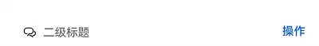
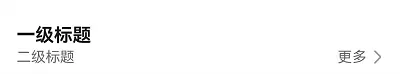
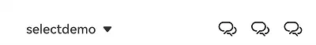
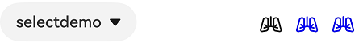
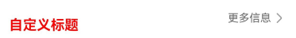

# SubHeader

子标题，用于列表项顶部，将该组列表划分为一个区块，子标题名称用来概括该区块内容。也可以用于内容项顶部，子标题名称用来概括该区块内容。

> **说明：**
>
> 该组件从API Version 18开始支持。后续版本如有新增内容，则采用上角标单独标记该内容的起始版本。

## 导入模块

```ts
import { SubHeader } from '@kit.ArkUI'
```

## 子组件

无

## 属性

支持[通用属性](../../../application-dev/reference/arkui-ts/ts-universal-attributes-size.md)。

> **说明：**
>
> 不支持设置文本相关。

## SubHeader

SubHeader({icon?: ResourceStr, iconSymbolOptions?: SymbolOptions, primaryTitle?: ResourceStr, secondaryTitle?: ResourceStr, select?: SelectOptions, operationType?: OperationType, operationItem?: Array&lt;OperationOption&gt;, operationSymbolOptions?: Array&lt;SymbolOptions&gt;})

**装饰器类型：**\@Component

**支持平台：** Android 、iOS

| 名称                   | 类型                                                                               | 必填 | 装饰器类型  | 说明                                                                                                                                                                                                      | Android平台 | iOS平台 |
| ---------------------- | ---------------------------------------------------------------------------------- | ---- | ----------- | --------------------------------------------------------------------------------------------------------------------------------------------------------------------------------------------------------- | ----------- | ------- |
| icon                   | [ResourceStr](../../../application-dev/reference/arkui-ts/ts-types.md#resourcestr) | 否   | \@Prop      | 图标设置项。                                                                                                                                                                                              | 支持        | 支持    |
| iconSymbolOptions      | [SymbolOptions](#symboloptions)                                                    | 否   | -           | icon为Symbol资源时的设置项。                                                                                                                                                                              | 支持        | 支持    |
| primaryTitle           | [ResourceStr](../../../application-dev/reference/arkui-ts/ts-types.md#resourcestr) | 否   | \@Prop      | 标题内容。                                                                                                                                                                                                | 支持        | 支持    |
| secondaryTitle         | [ResourceStr](../../../application-dev/reference/arkui-ts/ts-types.md#resourcestr) | 否   | \@Prop      | 副标题内容。                                                                                                                                                                                              | 支持        | 支持    |
| select                 | [SelectOptions](#selectoptions)                                                    | 否   | -           | select内容以及事件。                                                                                                                                                                                      | 支持        | 支持    |
| operationType          | [OperationType](#operationtype)                                                    | 否   | \@Prop      | 操作区(右侧)元素样式。<br/>默认值：OperationType.BUTTON                                                                                                                                                   | 支持        | 支持    |
| operationItem          | Array&lt;[OperationOption](#operationoption)&gt;                                   | 否   | -           | 操作区（右侧）的设置项。                                                                                                                                                                                  | 支持        | 支持    |
| operationSymbolOptions | Array&lt;[SymbolOptions](#symboloptions)&gt;                                       | 否   | -           | operationType为OperationType.ICON_GROUP，<br/>operationItem设置多个图标，图标为Symbol资源时的设置项。                                                                                                     | 支持        | 支持    |
| primaryTitleModifier   | TextModifier                                                                       | 否   | -           | 设置标题文本属性，如设置标题颜色、字体大小、字重等。                                                                                                                                                      | 支持        | 支持    |
| secondaryTitleModifier | TextModifier                                                                       | 否   | -           | 设置副标题文本属性，如设置标题颜色、字体大小、字重等。                                                                                                                                                    | 支持        | 支持    |
| titleBuilder           | () => void                                                                         | 否   | @BuildParam | 自定义标题区内容                                                                                                                                                                                          | 支持        | 支持    |
| contentMargin          | LocalizedMargin                                                                    | 否   | @Prop       | 子标题外边距，不支持设置负数。<br />默认值：<br /> `{start: LengthMetrics.resource(` <br /> `$r('sys.float.margin_left'))`, <br /> `end: LengthMetrics.resource(` <br /> `$r('sys.float.margin_right'))}` | 支持        | 支持    |
| contentPadding         | LocalizedPadding                                                                   | 否   | @Prop       | 子标题内边距。<br />默认值：<br />左侧为副标题或副标题加图标时：<br /> {start: LengthMetircs.vp(12), end: LengthMetrics.vp(12)}。                                                                         | 支持        | 支持    |

## OperationType

**支持平台：** Android 、iOS

| 名称       | 值  | 说明                               | Android平台 | iOS平台 |
| ---------- | --- | ---------------------------------- | ----------- | ------- |
| TEXT_ARROW | 0   | 文本按钮（带右箭头）。             | 支持        | 支持    |
| BUTTON     | 1   | 文本按钮（不带右箭头）。           | 支持        | 支持    |
| ICON_GROUP | 2   | 图标按钮（最多支持配置三张图标）。 | 支持        | 支持    |
| LOADING    | 3   | 加载动画。                         | 支持        | 支持    |

## SelectOptions

**支持平台：** Android 、iOS

| 名称     | 类型                                                                                                                        | 必填 | 说明                                                                                                               | Android平台 | iOS平台 |
| -------- | --------------------------------------------------------------------------------------------------------------------------- | ---- | ------------------------------------------------------------------------------------------------------------------ | ----------- | ------- |
| options  | Array&lt;[SelectOption](../../../application-dev/reference/arkui-ts/ts-basic-components-select.md#selectoption对象说明)&gt; | 是   | 下拉选项内容。                                                                                                     | 支持        | 支持    |
| selected | number                                                                                                                      | 否   | 设置下拉菜单初始选项的索引。<br/>第一项的索引为0。<br/>当不设置selected属性时，<br/>默认选择值为-1，菜单项不选中。 | 支持        | 支持    |
| value    | string                                                                                                                      | 否   | 设置下拉按钮本身的文本内容。                                                                                       | 支持        | 支持    |
| onSelect | (index:&nbsp;number,&nbsp;value?:&nbsp;string)&nbsp;=&gt;&nbsp;void                                                         | 否   | 下拉菜单选中某一项的回调。<br/>-&nbsp;index：选中项的索引。<br/>-&nbsp;value：选中项的值。                         | 支持        | 支持    |

## OperationOption

**支持平台：** Android 、iOS

| 名称   | 类型                                                                               | 必填 | 说明       | Android平台 | iOS平台 |
| ------ | ---------------------------------------------------------------------------------- | ---- | ---------- | ----------- | ------- |
| value  | [ResourceStr](../../../application-dev/reference/arkui-ts/ts-types.md#resourcestr) | 是   | 文本内容。 | 支持        | 支持    |
| action | ()=&gt;void                                                                        | 否   | 事件。     | 支持        | 支持    |

## SymbolOptions

**支持平台：** Android 、iOS

| 名称              | 类型                                                                                                                        | 必填 | 说明                                                                                                                                                                                                                                                                                | Android平台 | iOS平台 |
| ----------------- | --------------------------------------------------------------------------------------------------------------------------- | ---- | ----------------------------------------------------------------------------------------------------------------------------------------------------------------------------------------------------------------------------------------------------------------------------------- | ----------- | ------- |
| fontColor         | Array&lt;[ResourceColor](../../../application-dev/reference/arkui-ts/ts-types.md#resourcecolor)&gt;                         | 否   | 设置Symbol资源颜色。<br/>默认值：不同渲染策略下默认值不同。                                                                                                                                                                                                                         | 支持        | 支持    |
| fontSize          | number\|string \|[Resource](../../../application-dev/reference/arkui-ts/ts-types.md#resource)                               | 否   | 设置Symbol资源大小。<br/>默认值：系统默认值。                                                                                                                                                                                                                                       | 支持        | 支持    |
| fontWeight        | number\|&nbsp;[FontWeight](../../../application-dev/reference/arkui-ts/ts-appendix-enums.md#fontweight)&nbsp;\|&nbsp;string | 否   | 设置Symbol资源粗细。<br/>number类型取值[100,900]，取值间隔为100，默认为400，取值越大，字体越粗。<br/>string类型仅支持number类型取值的字符串形式，例如“400”，以及“bold”、“bolder”、“lighter”、“regular” 、“medium”分别对应FontWeight中相应的枚举值。<br/>默认值：FontWeight.Normal。 | 支持        | 支持    |
| renderingStrategy | symbolrenderingstrategy                                                                                                     | 否   | 设置Symbol资源渲染策略。<br/>默认值：SymbolRenderingStrategy.SINGLE。<br/>**说明：**<br/>$r('sys.symbol.ohos_*')中引用的资源仅ohos_trash_circle、ohos_folder_badge_plus、ohos_lungs支持分层与多色模式。                                                                             | 支持        | 支持    |
| effectStrategy    | SymbolEffectStrategy                                                                                                        | 否   | 设置Symbol资源动效策略。<br/>默认值：SymbolEffectStrategy.NONE。<br/>**说明：**<br/>$r('sys.symbol.ohos_*')中引用的资源仅ohos_wifi支持层级动效模式。                                                                                                                                | 支持        | 支持    |

## 事件

支持[通用事件](../../../application-dev/reference/arkui-ts/ts-universal-events-click.md)

## 示例

### 示例1（效率型子标题）

该示例主要演示子标题左侧为icon、secondaryTitle，右侧operationType为按钮类型。

```ts
import { promptAction, OperationType, SubHeader } from '@kit.ArkUI'

@Entry
@Component
struct SubHeaderExample {
  build() {
    Column() {
      SubHeader({
        icon: $r('app.media.ic_public_community_messages'),
        secondaryTitle: '二级标题',
        operationType: OperationType.BUTTON,
        operationItem: [{ value: '操作',
          action: () => {
            promptAction.showToast({ message: 'demo' })
          }
        }]
      })
    }
  }
}
```



### 示例2（双行文本内容型子标题）

该示例主要演示子标题左侧为primaryTitle、secondaryTitle，右侧operationType类型为TEXT_ARROW。

```ts
import { promptAction, OperationType, SubHeader } from '@kit.ArkUI'

@Entry
@Component
struct SubHeaderExample {
  build() {
    Column() {
      SubHeader({
        primaryTitle: '一级标题',
        secondaryTitle: '二级标题',
        operationType: OperationType.TEXT_ARROW,
        operationItem: [{ value: '更多',
          action: () => {
            promptAction.showToast({ message: 'demo' })
          }
        }]
      })
    }
  }
}
```



### 示例3（spinner型内容型子标题）

该示例主要演示子标题左侧为select，右侧operationType类型为ICON_GROUP。

```ts
import { promptAction, OperationType, SubHeader } from '@kit.ArkUI'

@Entry
@Component
struct SubHeaderExample {
  build() {
    Column() {
      SubHeader({
        select: {
          options: [{ value: 'aaa' }, { value: 'bbb' }, { value: 'ccc' }],
          value: 'selectdemo',
          selected: 2,
          onSelect: (index: number, value?: string) => {
            promptAction.showToast({ message: 'demo' })
          }
        },
        operationType: OperationType.ICON_GROUP,
        operationItem: [{
          value: $r('app.media.ic_public_community_messages'),
          action: () => {
            promptAction.showToast({ message: 'demo' })
          }
        }, {
          value: $r('app.media.ic_public_community_messages'),
          action: () => {
            promptAction.showToast({ message: 'demo' })
          }
        }, {
          value: $r('app.media.ic_public_community_messages'),
          action: () => {
            promptAction.showToast({ message: 'demo' })
          }
        }]
      })
    }
  }
}
```



### 示例4（设置左侧symbol图标）

该示例主要演示子标题左侧icon设置symbol图标。

```ts

import { promptAction, OperationType, SubHeader } from '@kit.ArkUI'

@Entry
@Component
struct SubHeaderExample {
  build() {
    Column() {
      SubHeader({
        icon: $r('sys.symbol.ohos_wifi'),
        iconSymbolOptions: {
          effectStrategy: SymbolEffectStrategy.HIERARCHICAL,
        },
        secondaryTitle: '标题',
        operationType: OperationType.BUTTON,
        operationItem: [{ value: '操作',
          action: () => {
            promptAction.showToast({ message: 'demo' })
          }
        }]
      })
    }
  }
}
```


### 示例5（设置右侧symbol图标）

该示例主要演示子标题operationType设置为OperationType.ICON_GROUP，operationItem的value设置为symbol图标。

```ts
import { promptAction, OperationType, SubHeader } from '@kit.ArkUI'

@Entry
@Component
struct SubHeaderExample {
  build() {
    Column() {
      SubHeader({
        select: {
          options: [{ value: 'aaa' }, { value: 'bbb' }, { value: 'ccc' }],
          value: 'selectdemo',
          selected: 2,
          onSelect: (index: number, value?: string) => {
            promptAction.showToast({ message: 'demo' })
          }
        },
        operationType: OperationType.ICON_GROUP,
        operationItem: [{
          value: $r('sys.symbol.ohos_lungs'),
          action: () => {
            promptAction.showToast({ message: 'icon1' })
          }
        }, {
          value: $r('sys.symbol.ohos_lungs'),
          action: () => {
            promptAction.showToast({ message: 'icon2' })
          }
        }, {
          value: $r('sys.symbol.ohos_lungs'),
          action: () => {
            promptAction.showToast({ message: 'icon3' })
          }
        }],
        operationSymbolOptions: [{
          fontWeight: FontWeight.Lighter,
        }, {
          renderingStrategy: SymbolRenderingStrategy.MULTIPLE_COLOR,
          fontColor: [Color.Blue, Color.Grey, Color.Green],
        }, {
          renderingStrategy: SymbolRenderingStrategy.MULTIPLE_OPACITY,
          fontColor: [Color.Blue, Color.Grey, Color.Green],
        }]
      })
    }
  }
}
```



### 示例6（自定义标题内容）

 该示例主要演示SubHeader设置titleBuilder自定义标题内容的效果。

```ts
import { promptAction, OperationType, SubHeader } from '@kit.ArkUI';

@Entry
@Component
struct SubHeaderExample {
  @Builder
  TitleBuilder(): void {
    Text('自定义标题')
      .fontSize(24)
      .fontColor(Color.Red)
      .fontWeight(FontWeight.Bold)
  }

  build() {
    Column() {
      SubHeader({
        titleBuilder: () => {
          this.TitleBuilder();
        },
        primaryTitle: '一级标题',
        secondaryTitle: '二级标题',
        icon: $r('sys.symbol.ohos_star'),
        operationType: OperationType.TEXT_ARROW,
        operationItem: [{
          value: '更多信息',
          action: () => {
            promptAction.showToast({ message: 'demo'})
          }
        }]
      })
    }
  }
}
```



### 示例7（自定义标题样式）

该示例主要演示SubHeader设置标题和副标题字体样式以及标题内外边距的效果。

```ts
import { promptAction, OperationType, SubHeader, LengthMetrics, TextModifier } from '@kit.ArkUI';

@Entry
@Component
struct SubHeaderExample {
  @State primaryModifier: TextModifier = new TextModifier().fontColor(Color.Red);
  @State secondaryModifier: TextModifier = new TextModifier().fontColor(Color.Red);

  build() {
    Column() {
      SubHeader({
        primaryTitle: 'primaryTitle',
        secondaryTitle: 'secondaryTitle',
        primaryTitleModifier: this.primaryModifier,
        secondaryTitleModifier: this.secondaryModifier,
        operationType: OperationType.TEXT_ARROW,
        operationItem: [{
          value: '更多信息',
          action: () => {
            promptAction.showToast({ message: 'demo'})
          }
        }],
        contentMargin: { start: LengthMetrics.vp(20), end: LengthMetrics.vp(20) },
        contentPadding: { start: LengthMetrics.vp(20), end: LengthMetrics.vp(20) }
      })
    }
  }
}
```


