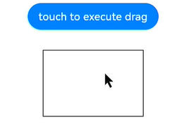
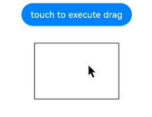
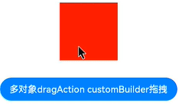
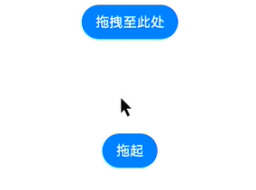

# @ohos.arkui.dragController (DragController)

本模块提供发起主动拖拽的能力，当应用接收到触摸或长按等事件时可以主动发起拖拽的动作，并在其中携带拖拽信息。

> **说明：**
>
> 本模块首批接口从 API version 16 开始支持。后续版本的新增接口，采用上角标单独标记接口的起始版本。
> 本模块功能依赖UI的执行上下文，不可在UI上下文不明确的地方使用，参见[UIContext](js-apis-arkui-UIContext.md#uicontext)说明。
> 从API version 16开始，可以通过使用UIContext中的getDragController方法获取当前UI上下文关联的DragController对象。
> 示例效果请以真机运行为准，当前 IDE 预览器不支持。

## 导入模块

```ts
import { dragController } from "@kit.ArkUI";
```

## dragController.executeDrag

executeDrag(custom: CustomBuilder | DragItemInfo, dragInfo: DragInfo,callback:AsyncCallback\<DragEventParam>): void

主动发起拖拽能力，传入拖拽发起后跟手效果所拖拽的对象以及携带拖拽信息。通过回调返回结果。

**支持平台：** Android、iOS

**参数：**

| 参数名   | 类型                                                                                                                                                                                                     | 必填 | 说明                                                                                                                                                                                                                                                                                                                                                                                                              | Android平台 | iOS平台 |
| -------- | -------------------------------------------------------------------------------------------------------------------------------------------------------------------------------------------------------- | ---- | ----------------------------------------------------------------------------------------------------------------------------------------------------------------------------------------------------------------------------------------------------------------------------------------------------------------------------------------------------------------------------------------------------------------- | ----------- | ------- |
| custom   | [CustomBuilder](../../../application-dev/reference/arkui-ts/ts-types.md#custombuilder8) \| [DragItemInfo](../../../application-dev/reference/arkui-ts/ts-universal-events-drag-drop.md#dragiteminfo说明) | 是   | 拖拽发起后跟手效果所拖拽的对象。<br/>**说明：** <br/>不支持全局builder。如果builder中使用了[Image](../../../application-dev/reference/arkui-ts/ts-basic-components-image.md)组件，应尽量开启同步加载，即配置Image的[syncLoad](../../../application-dev/reference/arkui-ts/ts-basic-components-image.md#属性)为true。该builder只用于生成当次拖拽中显示的图片，builder的修改不会同步到当前正在拖拽的图片，对builder的修改需要在下一次拖拽时生效。 | 支持        | 支持    |
| dragInfo | [DragInfo](#draginfo)                                                                                                                                                                                    | 是   | 拖拽信息。                                                                                                                                                                                                                                                                                                                                                                                                        | 支持        | 支持    |
| callback | AsyncCallback&lt;[DragEventParam](#drageventparam)&gt;                                                                                                                                                 | 是   | 拖拽结束返回结果的回调。                                                                                                                                                                                                                                                                                                                                                                                          | 支持        | 支持    |

**错误码：**

以下错误码的详细介绍请参见[通用错误码](../../../application-dev/reference/errorcodes/errorcode-universal.md)错误码。

| 错误码ID | 错误信息                                                                                                                                        |
| -------- | ----------------------------------------------------------------------------------------------------------------------------------------------- |
| 401      | Parameter error. Possible causes: 1. Mandatory parameters are left unspecified; 2.Incorrect parameters types; 3. Parameter verification failed. |
| 100001   | Internal handling failed.                                                                                                                       |

**示例：**

> **说明：**
>
> 推荐通过使用[UIContext](js-apis-arkui-UIContext.md#uicontext)中的getDragController方法获取当前UI上下文关联的DragController对象。

```ts
import { dragController } from "@kit.ArkUI";
import { unifiedDataChannel } from '@kit.ArkData';

@Entry
@Component
struct DragControllerPage {
  @State text: string = ''

  @Builder DraggingBuilder() {
    Column() {
      Text("DraggingBuilder")
        .fontColor(Color.White)
        .fontSize(12)
    }
    .width(100)
    .height(100)
    .backgroundColor(Color.Blue)
  }

  build() {
    Column() {
      Button('touch to execute drag')
        .margin(10)
        .onTouch((event?:TouchEvent) => {
          if(event){
            if (event.type == TouchType.Down) {
              let text = new unifiedDataChannel.PlainText()
              text.textContent = 'drag text'
              text.abstract = 'abstract'
              let unifiedData = new unifiedDataChannel.UnifiedData(text)

              let dragInfo: dragController.DragInfo = {
                pointerId: 0,
                data: unifiedData,
                extraParams: ''
              }
              class tmp{
                event:DragEvent|undefined = undefined
                extraParams:string = ''
              }
              let eve:tmp = new tmp()
              dragController.executeDrag(()=>{this.DraggingBuilder()}, dragInfo, (err, eve) => { // 建议使用 this.getUIContext().getDragController().executeDrag()接口
                if(eve.event){
                  if (eve.event.getResult() == DragResult.DRAG_SUCCESSFUL) {
                    // ...
                  } else if (eve.event.getResult() == DragResult.DRAG_FAILED) {
                    // ...
                  }
                }
              })
            }
          }
        })
      Text(this.text)
        .height(100)
        .width(150)
        .margin({top:20})
        .border({color:Color.Black,width:1})
        .onDrop((dragEvent?:DragEvent)=>{
          if(dragEvent){
            let records: Array<unifiedDataChannel.UnifiedRecord> = dragEvent.getData().getRecords();
            let plainText: unifiedDataChannel.PlainText = records[0] as unifiedDataChannel.PlainText;
            this.text = plainText.textContent;
          }
        })
    }
    .width('100%')
    .height('100%')
  }
}
```

  

## dragController.executeDrag

executeDrag(custom: CustomBuilder | DragItemInfo, dragInfo: DragInfo): Promise\<DragEventParam>

主动发起拖拽能力，传入拖拽发起后跟手效果所拖拽的对象以及携带拖拽信息。通过Promise返回结果。

**支持平台：** Android、iOS

**参数：**

| 参数名   | 类型                                                                                                                                                                                                     | 必填 | 说明                             | Android平台 | iOS平台 |
| -------- | -------------------------------------------------------------------------------------------------------------------------------------------------------------------------------------------------------- | ---- | -------------------------------- | ----------- | ------- |
| custom   | [CustomBuilder](../../../application-dev/reference/arkui-ts/ts-types.md#custombuilder8) \| [DragItemInfo](../../../application-dev/reference/arkui-ts/ts-universal-events-drag-drop.md#dragiteminfo说明) | 是   | 拖拽发起后跟手效果所拖拽的对象。 | 支持        | 支持    |
| dragInfo | [DragInfo](#draginfo)                                                                                                                                                                                    | 是   | 拖拽信息。                       | 支持        | 支持    |

**返回值：**

| 类型                                               | 说明                     |
| -------------------------------------------------- | ------------------------ |
| Promise&lt;[DragEventParam](#drageventparam)&gt; | 拖拽结束返回结果的回调。 |

**错误码：**
以下错误码的详细介绍请参见[通用错误码](../../../application-dev/reference/errorcodes/errorcode-universal.md)错误码

| 错误码ID | 错误信息                                                                                                                                        |
| -------- | ----------------------------------------------------------------------------------------------------------------------------------------------- |
| 401      | Parameter error. Possible causes: 1. Mandatory parameters are left unspecified; 2.Incorrect parameters types; 3. Parameter verification failed. |
| 100001   | Internal handling failed.                                                                                                                       |

**示例：**

> **说明：**
>
> 推荐通过使用[UIContext](js-apis-arkui-UIContext.md#uicontext)中的getDragController方法获取当前UI上下文关联的DragController对象。

```ts
import { dragController, componentSnapshot } from "@kit.ArkUI"
import { image } from '@kit.ImageKit';
import { unifiedDataChannel } from '@kit.ArkData';

@Entry
@Component
struct DragControllerPage {
  @State pixmap: image.PixelMap|undefined = undefined
  @State text: string = ''

  @Builder DraggingBuilder() {
    Column() {
      Text("DraggingBuilder")
        .fontColor(Color.White)
    }
    .width(100)
    .height(100)
    .backgroundColor(Color.Blue)
  }

  @Builder PixmapBuilder() {
    Column() {
      Text("PixmapBuilder")
        .fontColor(Color.White)
        .fontSize(15)
    }
    .width(100)
    .height(100)
    .backgroundColor(Color.Blue)
  }

  aboutToAppear() {
    let pb: CustomBuilder = (): void => {
      this.PixmapBuilder()
    }
    componentSnapshot.createFromBuilder(pb).then((pix: image.PixelMap) => {
      this.pixmap = pix;
    })
  }

  build() {
    Column() {
      Button('touch to execute drag')
        .margin(10)
        .onTouch((event?:TouchEvent) => {
          if(event){
            if (event.type == TouchType.Down) {
              let text = new unifiedDataChannel.PlainText()
              text.textContent = 'drag text'
              text.abstract = 'abstract'
              let unifiedData = new unifiedDataChannel.UnifiedData(text)

              let dragInfo: dragController.DragInfo = {
                pointerId: 0,
                data: unifiedData,
                extraParams: ''
              }
              let dragItemInfo: DragItemInfo = {
                pixelMap: this.pixmap,
                builder: ()=>{this.DraggingBuilder()},
                extraInfo: "DragItemInfoTest"
              }

              class tmp{
                event:DragResult|undefined = undefined
                extraParams:string = ''
              }
              let eve:tmp = new tmp()
              dragController.executeDrag(dragItemInfo, dragInfo) // 建议使用 this.getUIContext().getDragController().executeDrag()接口
                .then((eve) => {
                  if (eve.event.getResult() == DragResult.DRAG_SUCCESSFUL) {
                    // ...
                  } else if (eve.event.getResult() == DragResult.DRAG_FAILED) {
                    // ...
                  }
                })
                .catch((err:Error) => {
                })
            }
          }
        })
      Text(this.text)
        .height(100)
        .width(150)
        .margin({top:20})
        .border({color:Color.Black,width:1})
        .onDrop((dragEvent?:DragEvent)=>{
          if(dragEvent){
            let records: Array<unifiedDataChannel.UnifiedRecord> = dragEvent.getData().getRecords();
            let plainText: unifiedDataChannel.PlainText = records[0] as unifiedDataChannel.PlainText;
            this.text = plainText.textContent;
          }
        })
    }
    .width('100%')
    .height('100%')
  }
}
```

  

## DragInfo

**支持平台：** Android、iOS

发起拖拽所需要的属性和拖拽时携带的信息。

| 名称           | 类型                                                                                                                     | 必填 | 说明                                     | Android平台 | iOS平台 |
| -------------- | ------------------------------------------------------------------------------------------------------------------------ | ---- | ---------------------------------------- | ----------- | ------- |
| pointerId      | number                                                                                                                   | 是   | 设置启动拖拽时屏幕上触摸点的Id。         | 支持        | 支持    |
| data           | [unifiedDataChannel.UnifiedData](../../../application-dev/reference/apis/js-apis-data-unifiedDataChannel.md#unifieddata) | 否   | 设置拖拽过程中携带的数据。               | 支持        | 支持    |
| extraParams    | string                                                                                                                   | 否   | 设置拖拽事件额外信息，具体功能暂未实现。 | 支持        | 支持    |
| touchPoint     | TouchPoint                                                                                                               | 否   | 配置跟手点坐标，不配置时，默认居中。     | 支持        | 支持    |
| previewOptions | DragPreviewOptions                                                                                                       | 否   | 拖拽背板自定义配置。                     | 支持        | 支持    |

## dragController.createDragAction

createDragAction(customArray: Array&lt;CustomBuilder \| DragItemInfo&gt;, dragInfo: DragInfo): DragAction

创建拖拽的Action对象，需要显式指定拖拽背板图(可多个)，以及拖拽的数据，跟手点等信息；当通过一个已创建的 Action 对象发起的拖拽未结束时，无法再次创建新的 Action 对象，接口会抛出异常；当Action对象的生命周期结束后，注册在该对象上的回调函数会失效，因此需要在一个尽量长的作用域下持有该对象，并在每次发起拖拽前通过createDragAction返回新的对象覆盖旧值。

**说明：** 建议控制传递的拖拽背板数量，传递过多容易导致拖起的效率问题。

**支持平台：** Android、iOS

**参数：**

| 参数名      | 类型                                                                                                                                                                                                                  | 必填 | 说明                             | Android平台 | iOS平台 |
| ----------- | --------------------------------------------------------------------------------------------------------------------------------------------------------------------------------------------------------------------- | ---- | -------------------------------- | ----------- | ------- |
| customArray | Array&lt;[CustomBuilder](../../../application-dev/reference/arkui-ts/ts-types.md#custombuilder8) \| [DragItemInfo](../../../application-dev/reference/arkui-ts/ts-universal-events-drag-drop.md#dragiteminfo说明)&gt; | 是   | 拖拽发起后跟手效果所拖拽的对象。 | 支持        | 支持    |
| dragInfo    | [DragInfo](#draginfo)                                                                                                                                                                                                 | 是   | 拖拽信息。                       | 支持        | 支持    |

**返回值：**

| 类型                        | 说明                                                                         |
| --------------------------- | ---------------------------------------------------------------------------- |
| [DragAction](#dragaction) | 创建拖拽Action对象，主要用于后面实现注册监听拖拽状态改变事件和启动拖拽服务。 |

**错误码：**

以下错误码的详细介绍请参见[通用错误码](../../../application-dev/reference/errorcodes/errorcode-universal.md)错误码

| 错误码ID | 错误信息                                                                                                                                        |
| -------- | ----------------------------------------------------------------------------------------------------------------------------------------------- |
| 401      | Parameter error. Possible causes: 1. Mandatory parameters are left unspecified; 2.Incorrect parameters types; 3. Parameter verification failed. |
| 100001   | Internal handling failed.                                                                                                                       |

**示例：**

> **说明：**
>
> 推荐通过使用[UIContext](js-apis-arkui-UIContext.md#uicontext)中的getDragController方法获取当前UI上下文关联的DragController对象。

```ts
import { dragController, componentSnapshot } from "@kit.ArkUI";
import { image } from '@kit.ImageKit';
import { unifiedDataChannel } from '@kit.ArkData';

@Entry
@Component
struct DragControllerPage {
  @State pixmap: image.PixelMap | null = null
  @State text: string = ''
  private dragAction: dragController.DragAction | null = null;
  customBuilders:Array<CustomBuilder | DragItemInfo> = new Array<CustomBuilder | DragItemInfo>();
  @Builder DraggingBuilder() {
    Column() {
      Text("DraggingBuilder")
        .fontColor(Color.White)
        .fontSize(12)
    }
    .width(100)
    .height(100)
    .backgroundColor(Color.Blue)
  }

  build() {
    Column() {

      Column() {
        Text(this.text)
          .width('100%')
          .height('100%')
          .fontColor(Color.White)
          .fontSize(18)
          .onDrop((dragEvent?:DragEvent)=>{
            if(dragEvent){
              let records: Array<unifiedDataChannel.UnifiedRecord> = dragEvent.getData().getRecords();
              let plainText: unifiedDataChannel.PlainText = records[0] as unifiedDataChannel.PlainText;
              this.text = plainText.textContent;
            }
          })
      }
      .width(100)
      .height(100)
      .backgroundColor(Color.Red)
      .margin(10)

      Button('多对象dragAction customBuilder拖拽').onTouch((event?:TouchEvent) => {
        if(event){
          if (event.type == TouchType.Down) {
            console.info("muti drag Down by listener");
            this.customBuilders.splice(0, this.customBuilders.length);
            this.customBuilders.push(()=>{this.DraggingBuilder()});
            this.customBuilders.push(()=>{this.DraggingBuilder()});
            this.customBuilders.push(()=>{this.DraggingBuilder()});
            let text = new unifiedDataChannel.PlainText()
            text.textContent = 'drag text'
            let unifiedData = new unifiedDataChannel.UnifiedData(text)
            let dragInfo: dragController.DragInfo = {
              pointerId: 0,
              data: unifiedData,
              extraParams: ''
            }
            try{
              this.dragAction = dragController.createDragAction(this.customBuilders, dragInfo) // 建议使用 this.getUIContext().getDragController().createDragAction()接口
              if(!this.dragAction){
                console.info("listener dragAction is null");
                return
              }
              this.dragAction.on('statusChange', (dragAndDropInfo: dragController.DragAndDropInfo)=>{
                if (dragAndDropInfo.status == dragController.DragStatus.STARTED) {
                  console.info("drag has start");
                } else if (dragAndDropInfo.status == dragController.DragStatus.ENDED){
                  console.info("drag has end");
                  if (!this.dragAction) {
                    return
                  }
                  this.dragAction.off('statusChange')
                }
              })
              this.dragAction.startDrag().then(()=>{}).catch((err:Error)=>{
                console.info("start drag Error:" + err.message);
              })
            } catch(err) {
              console.info("create dragAction Error:" + err.message);
            }
          }
        }
      }).margin({top:20})
    }
  }
}
```

  

## DragAction

监听状态改变，启动拖拽服务的对象。

**支持平台：** Android、iOS

### startDrag

startDrag(): Promise&lt;void&gt;

启动拖拽服务，返回Promise对象，回调启动成功和失败的结果。

**支持平台：** Android、iOS

**错误码：**

| 错误码ID | 错误信息                  |
| -------- | ------------------------- |
| 100001   | Internal handling failed. |

**示例：**

> **说明：**
>
> 推荐通过使用[UIContext](js-apis-arkui-UIContext.md#uicontext)中的getDragController方法获取当前UI上下文关联的DragController对象。

```ts
import { dragController } from "@kit.ArkUI"
import { unifiedDataChannel } from '@kit.ArkData';

@Entry
@Component
struct DragControllerPage {
  build() {
    Column() {
      Button('touch to execute drag')
        .onTouch((event?:TouchEvent) => {
          let customBuilders:Array<CustomBuilder | DragItemInfo> = new Array<CustomBuilder | DragItemInfo>();
          let text = new unifiedDataChannel.Text()
          let unifiedData = new unifiedDataChannel.UnifiedData(text)
          let dragInfo: dragController.DragInfo = {
            pointerId: 0,
            data: unifiedData,
            extraParams: ''
          }
          try {
            let dragAction: dragController.DragAction | null = dragController.createDragAction(customBuilders, dragInfo); // 建议使用 this.getUIContext().getDragController().createDragAction()接口
            if(!dragAction){
              console.info("listener dragAction is null");
              return
            }
            dragAction.startDrag().then(()=>{}).catch((err:Error)=>{
              console.info("start drag Error:" + err.message);
            })
          } catch (err) {
            console.info("create dragAction Error:" + err.message);
          }
        })
    }
  }
}

```

### on('statusChange')

on(type: 'statusChange', callback: Callback&lt;[DragAndDropInfo](#draganddropinfo)&gt;): void

注册监听拖拽状态改变事件。

**支持平台：** Android、iOS

**参数：**

| 参数名   | 类型                                                  | 必填 | 说明                                                                | Android平台 | iOS平台 |
| -------- | ----------------------------------------------------- | ---- | ------------------------------------------------------------------- | ----------- | ------- |
| type     | string                                                | 是   | 监听事件，固定为'statusChange'，即注册监听拖拽状态改变事件。        | 支持        | 支持    |
| callback | Callback&lt;[DragAndDropInfo](#draganddropinfo)&gt; | 是   | 回调函数，返回当前的[DragAndDropInfo](#draganddropinfo)组件状态。 | 支持        | 支持    |

**示例：**

> **说明：**
>
> 推荐通过使用[UIContext](js-apis-arkui-UIContext.md#uicontext)中的getDragController方法获取当前UI上下文关联的DragController对象。

```ts
import { dragController } from "@kit.ArkUI";
import { unifiedDataChannel } from '@kit.ArkData';

@Entry
@Component
struct DragControllerPage {
  build() {
    Column() {
      Button('touch to execute drag')
        .onTouch((event?:TouchEvent) => {
          let customBuilders:Array<CustomBuilder | DragItemInfo> = new Array<CustomBuilder | DragItemInfo>();
          let text = new unifiedDataChannel.Text()
          let unifiedData = new unifiedDataChannel.UnifiedData(text)
          let dragInfo: dragController.DragInfo = {
            pointerId: 0,
            data: unifiedData,
            extraParams: ''
          }
          try{
            let dragAction: dragController.DragAction | null = dragController.createDragAction(customBuilders, dragInfo); // 建议使用 this.getUIContext().getDragController().createDragAction()接口
            if(!dragAction){
              console.info("listener dragAction is null");
              return
            }
            dragAction.on('statusChange', (dragAndDropInfo: dragController.DragAndDropInfo)=>{
              console.info("Register to listen on drag status", JSON.stringify(dragAndDropInfo));
            })
          }catch(err) {
            console.info("create dragAction Error:" + err.message);
          }
        })
    }
  }
}
```

### off('statusChange')

 off(type: 'statusChange', callback?: Callback&lt;[DragAndDropInfo](#draganddropinfo)&gt;): void

取消注册监听拖拽状态改变事件。

**支持平台：** Android、iOS

**参数：**

| 参数名   | 类型                                                  | 必填 | 说明                                                                                     | Android平台 | iOS平台 |
| -------- | ----------------------------------------------------- | ---- | ---------------------------------------------------------------------------------------- | ----------- | ------- |
| type     | string                                                | 是   | 监听事件，固定为'statusChange'，即取消监听拖拽状态改变事件。                             | 支持        | 支持    |
| callback | Callback&lt;[DragAndDropInfo](#draganddropinfo)&gt; | 否   | 回调函数，返回当前的[DragAndDropInfo](#draganddropinfo)组件状态， 不设置取消所有监听。 | 支持        | 支持    |

**示例：**

> **说明：**
>
> 推荐通过使用[UIContext](js-apis-arkui-UIContext.md#uicontext)中的getDragController方法获取当前UI上下文关联的DragController对象。

```ts
import { dragController } from "@kit.ArkUI"
import { unifiedDataChannel } from '@kit.ArkData';

@Entry
@Component
struct DragControllerPage {
  build() {
    Column() {
      Button('touch to execute drag')
        .onTouch((event?:TouchEvent) => {
          let customBuilders:Array<CustomBuilder | DragItemInfo> = new Array<CustomBuilder | DragItemInfo>();
          let text = new unifiedDataChannel.Text()
          let unifiedData = new unifiedDataChannel.UnifiedData(text)
          let dragInfo: dragController.DragInfo = {
            pointerId: 0,
            data: unifiedData,
            extraParams: ''
          }
          try{
            let dragAction: dragController.DragAction | null = dragController.createDragAction(customBuilders, dragInfo); // 建议使用 this.getUIContext().getDragController().createDragAction()接口
            if(!dragAction){
              console.info("listener dragAction is null");
              return
            }
            dragAction.off('statusChange', (dragAndDropInfo: dragController.DragAndDropInfo)=>{
              console.info("Cancel listening on drag status", JSON.stringify(dragAndDropInfo));
            })
          }catch(err) {
            console.info("create dragAction Error:" + err.message);
          }
        })
    }
  }
}
```

## DragAndDropInfo

**支持平台：** Android、iOS

拖拽过程中监听到status改变时上报的数据。

| 名称        | 类型                                                                                                | 必填 | 说明                                                                                                        | Android平台 | iOS平台 |
| ----------- | --------------------------------------------------------------------------------------------------- | ---- | ----------------------------------------------------------------------------------------------------------- | ----------- | ------- |
| status      | [DragStatus](#dragstatus)                                                                         | 是   | 当前拖拽状态（启动和结束）。                                                                                | 支持        | 支持    |
| event       | [DragEvent](../../../application-dev/reference/arkui-ts/ts-universal-events-drag-drop.md#dragevent) | 是   | 当前状态所对应的拖拽事件。通过dragController发起的dragEvent仅支持获取result和behavior，且用于拖拽结束状态。 | 支持        | 支持    |
| extraParams | string                                                                                              | 否   | 设置拖拽事件额外信息，具体功能暂未实现。                                                                    | 支持        | 支持    |

## DragStatus

**支持平台：** Android、iOS

拖拽开始和结束状态。

| 名称    | 值  | 说明             | Android平台 | iOS平台 |
| ------- | --- | ---------------- | ----------- | ------- |
| STARTED | 0   | 拖拽已成功发起。 | 支持        | 支持    |
| ENDED   | 1   | 拖拽结束。       | 支持        | 支持    |

## AnimationOptions

**支持平台：** Android、iOS

发起拖拽所需要的属性和拖拽时携带的信息。

| 名称     | 类型                                                                                                                                 | 必填 | 说明                                                                                                                                                                     | Android平台 | iOS平台 |
| -------- | ------------------------------------------------------------------------------------------------------------------------------------ | ---- | ------------------------------------------------------------------------------------------------------------------------------------------------------------------------ | ----------- | ------- |
| duration | number                                                                                                                               | 否   | 动画持续时间，单位为毫秒。<br/>默认值：1000<br/>**说明：**<br/>-&nbsp;设置小于0的值时按0处理。<br/>-&nbsp;设置浮点型类型的值时，向下取整。例如，设置值为1.2，按照1处理。 | 支持        | 支持    |
| curve    | &nbsp;[Curve](../../../application-dev/reference/arkui-ts/ts-appendix-enums.md#curve)&nbsp;\|&nbsp;[ICurve](js-apis-curve.md#icurve) | 否   | 设置动画曲线。<br/>默认值：Curve.EaseInOut                                                                                                                               | 支持        | 支持    |

## DragEventParam

**支持平台：** Android、iOS

拖拽结束返回结果的回调。

| 名称        | 类型                                                                                                | 必填 | 说明                           | Android平台 | iOS平台 |
| ----------- | --------------------------------------------------------------------------------------------------- | ---- | ------------------------------ | ----------- | ------- |
| event       | [DragEvent](../../../application-dev/reference/arkui-ts/ts-universal-events-drag-drop.md#dragevent) | 是   | 拖拽事件信息，仅包括拖拽结果。 | 支持        | 支持    |
| extraParams | string                                                                                              | 是   | 拖拽事件额外信息。             | 支持        | 支持    |

## dragController.getDragPreview

getDragPreview(): DragPreview

返回一个代表拖拽背板的对象。

**支持平台：** Android、iOS

**返回值：**

| 类型                        | 说明                                                                                  | Android平台 | iOS平台 |
| --------------------------- | ------------------------------------------------------------------------------------- | ----------- | ------- |
| [DragPreview](#dragpreview) | 一个代表拖拽背板的对象，提供背板样式设置的接口，在OnDrop和OnDragEnd回调中使用不生效。 | 支持        | 支持    |

**示例：**

请参考[animate](#animate)

## DragPreview

拖拽背板的对象，在OnDrop和OnDragEnd回调中使用不生效。

**支持平台：** Android、iOS

### setForegroundColor

setForegroundColor(color: ResourceColor): void

设置背板蒙版颜色，在OnDrop和OnDragEnd回调中使用不生效，仅支持通过 getDragPreview() 方法获取到的对象上使用。

**支持平台：** Android、iOS

**参数：**

| 参数名 | 类型                                                                                   | 必填 | 说明           | Android平台 | iOS平台 |
| ------ | -------------------------------------------------------------------------------------- | ---- | -------------- | ----------- | ------- |
| color  | [ResourceColor](../../../application-dev/reference/arkui-ts/ts-types.md#resourcecolor) | 是   | 背板蒙版颜色。 | 支持        | 支持    |

**示例：**

请参考[animate](#animate)

### animate

animate(options: AnimationOptions, handler: () => void): void

设置背板蒙版颜色变化动效，在OnDrop和OnDragEnd回调中使用不生效，仅支持通过 getDragPreview 方法获取到的对象上使用。

**支持平台：** Android、iOS

**参数：**

| 参数名  | 类型                                  | 必填 | 说明                                   | Android平台 | iOS平台 |
| ------- | ------------------------------------- | ---- | -------------------------------------- | ----------- | ------- |
| options | [AnimationOptions](#animationoptions) | 是   | 动效参数                               | 支持        | 支持    |
| handler | () => void                            | 是   | 用于修改背板蒙版颜色等属性的回调方法。 | 支持        | 支持    |

**示例：**

> **说明：**
>
> 推荐通过使用[UIContext](js-apis-arkui-UIContext.md#uicontext)中的getDragController方法获取当前UI上下文关联的DragController对象。

1.在EntryAbility.ets中获取UI上下文并保存至LocalStorage中。

```ts
import { AbilityConstant, UIAbility, Want } from '@kit.AbilityKit';
import { hilog } from '@kit.PerformanceAnalysisKit';
import { window, UIContext } from '@kit.ArkUI';

let uiContext: UIContext;
let localStorage: LocalStorage = new LocalStorage('uiContext');

export default class EntryAbility extends UIAbility {
  storage: LocalStorage = localStorage;

  onCreate(want: Want, launchParam: AbilityConstant.LaunchParam): void {
    hilog.info(0x0000, 'testTag', '%{public}s', 'Ability onCreate');
  }

  onDestroy(): void {
    hilog.info(0x0000, 'testTag', '%{public}s', 'Ability onDestroy');
  }

  onWindowStageCreate(windowStage: window.WindowStage): void {
    hilog.info(0x0000, 'testTag', '%{public}s', 'Ability onWindowStageCreate');

    windowStage.loadContent('pages/Index', (err, data) => {
      if (err.code) {
        hilog.error(0x0000, 'testTag', 'Failed to load the content. Cause: %{public}s', JSON.stringify(err) ?? '');
        return;
      }
      hilog.info(0x0000, 'testTag', 'Succeeded in loading the content. Data: %{public}s', JSON.stringify(data) ?? '');
      windowStage.getMainWindow((err, data) => {
        if (err.code) {
          hilog.error(0x0000, 'Failed to abtain the main window. Cause:' + err.message, '');
          return;
        }
        let windowClass: window.Window = data;
        uiContext = windowClass.getUIContext();
        this.storage.setOrCreate<UIContext>('uiContext', uiContext);
      })
    });
  }
}
```

2.在Index.ets中通过LocalStorage.getShared()获取UI上下文，进而获取DragController对象实施后续操作。

```ts

import { unifiedDataChannel } from '@kit.ArkData';
import { hilog } from '@kit.PerformanceAnalysisKit';
import { dragController, curves, promptAction, UIContext } from "@kit.ArkUI";
import { image } from '@kit.ImageKit';
import { BusinessError } from '@kit.BasicServicesKit';

let storages = LocalStorage.getShared();

@Entry(storages)
@Component
struct DragControllerPage {
  @State pixmap: image.PixelMap|null = null

  @Builder DraggingBuilder() {
    Column() {
      Text("DraggingBuilder")
        .fontColor(Color.White)
        .fontSize(12)
    }
    .width(100)
    .height(100)
    .backgroundColor(Color.Blue)
  }

  @Builder PixmapBuilder() {
    Column() {
      Text("PixmapBuilder")
    }
    .width(100)
    .height(100)
    .backgroundColor(Color.Blue)
  }

  build() {
    Column() {
      Button('拖拽至此处')
        .margin(10)
        .onDragEnter(() => {
        try {
          let uiContext: UIContext = storages.get<UIContext>('uiContext') as UIContext;
          let previewObj: dragController.DragPreview = uiContext.getDragController().getDragPreview();
          let foregroundColor: ResourceColor = Color.Green;

          let previewAnimation: dragController.AnimationOptions = {
            curve: curves.cubicBezierCurve(0.2,0,0,1),
          }
          previewObj.animate(previewAnimation, () => {
            previewObj.setForegroundColor(foregroundColor);
          });
        } catch (error) {
          let msg = (error as BusinessError).message;
          let code = (error as BusinessError).code;
          hilog.error(0x0000, `show error code is ${code}, message is ${msg}`, '');
        }
      })
        .onDrop(() => {
          promptAction.showToast({duration: 100, message: 'Drag Success', bottom: 400})
        })
      Button('拖起').onTouch((event?:TouchEvent) => {
        if(event){
          if (event.type == TouchType.Down) {
            let text = new unifiedDataChannel.Text()
            let unifiedData = new unifiedDataChannel.UnifiedData(text)
            let dragInfo: dragController.DragInfo = {
              pointerId: 0,
              data: unifiedData,
              extraParams: ''
            }
            class tmp{
              event:DragEvent|undefined = undefined
              extraParams:string = ''
            }
            let eve:tmp = new tmp()
            dragController.executeDrag(() => { // 建议使用 this.getUIContext().getDragController().executeDrag()接口
              this.DraggingBuilder()
            }, dragInfo, (err , eve) => {
              hilog.info(0x0000, `ljx ${JSON.stringify(err)}`, '')
              if (eve && eve.event) {
                if (eve.event.getResult() == DragResult.DRAG_SUCCESSFUL) {
                  hilog.info(0x0000, 'success', '');
                } else if (eve.event.getResult() == DragResult.DRAG_FAILED) {
                  hilog.info(0x0000, 'failed', '');
                }
              }
            })
          }
        }
      }).margin({top:100})
    }
    .width('100%')
    .height('100%')
  }
}
```

  
