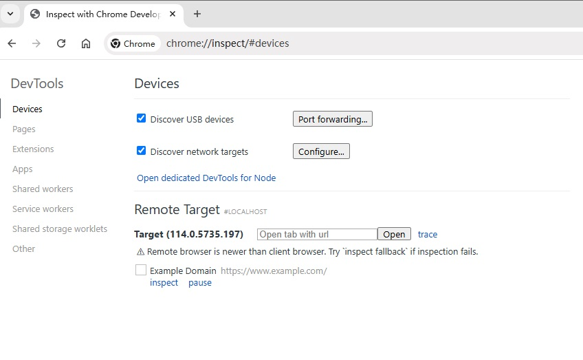
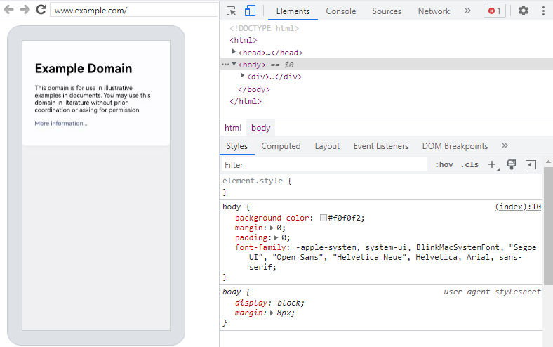

# 使用DevTools工具调试前端页面


Web组件支持使用DevTools工具调试前端页面。DevTools是一个 Web前端开发调试工具，提供了电脑上调试移动设备前端页面的能力。开发者通过[setWebDebuggingAccess()](./js-apis-webview.md#setwebdebuggingaccess16)接口开启Web组件前端页面调试能力，利用DevTools工具可以在电脑上调试移动设备上的前端网页，设备需为4.1.0及以上版本。


## 调试步骤

### 应用代码开启Web调试开关

调试网页前，需要应用侧代码调用[setWebDebuggingAccess()](./js-apis-webview.md#setwebdebuggingaccess16)接口开启Web调试开关。  
如果没有开启Web调试开关，则DevTools无法发现被调试的网页。

1. 在应用代码中开启Web调试开关，具体如下：

   ```ts
   // xxx.ets
   import { webview } from '@kit.ArkWeb';
   
   @Entry
   @Component
   struct WebComponent {
     controller: webview.WebviewController = new webview.WebviewController();
   
     aboutToAppear() {
       // 配置Web开启调试模式
       webview.WebviewController.setWebDebuggingAccess(true);
     }
   
     build() {
       Column() {
         Web({ src: 'www.example.com', controller: this.controller })
       }
     }
   }
   ```
2. 开启调试功能需要在DevEco Studio应用工程hap模块的module.json5文件中增加如下权限，添加方法请参考[在配置文件中声明权限](https://gitee.com/openharmony/docs/blob/master/zh-cn/application-dev/security/AccessToken/declare-permissions.md)。

   ```
   "requestPermissions":[
      {
        "name" : "ohos.permission.INTERNET"
      }
    ]
   ```

### 将设备连接至电脑

请将设备连接至电脑，随后开启开发者模式，为后续的端口转发操作做好准备。

1. 请开启设备上的开发者模式，并启用USB调试功能。  

   (1) 终端系统查看“设置 > 系统”中是否有“开发者选项”，如果不存在，可在“设置 > 关于本机”连续七次单击“版本号”，直到提示“开启开发者模式”，点击“确认开启”后输入PIN码（如果已设置），设备将自动重启。

   (2) USB数据线连接终端和电脑，在“设置 > 系统 > 开发者选项”中，打开“USB调试”开关，弹出的“允许USB调试”的弹框，点击“允许”。

### 在Chrome浏览器上打开调试工具页面
  1. 在电脑端Chrome浏览器地址栏中输入调试工具地址 chrome://inspect/\#devices 并打开该页面。  
  2. 修改Chrome调试工具的配置。  
     需要从本地的TCP 9222端口发现被调试网页，所以请确保已勾选 "Discover network targets"。然后再进行网络配置。  
     (1) 点击 "Configure" 按钮。  
     (2) 在 "Target discovery settings" 中添加要监听的本地端口localhost:9222。

     

  3. 为了同时调试多个应用，请在Chrome浏览器的调试工具网页内，于“Devices”选项中的“configure”部分添加多个端口号。

     

### 等待发现被调试页面

  如果前面的步骤执行成功，稍后，Chrome的调试页面将显示待调试的网页。  
  

### 开始网页调试

  
