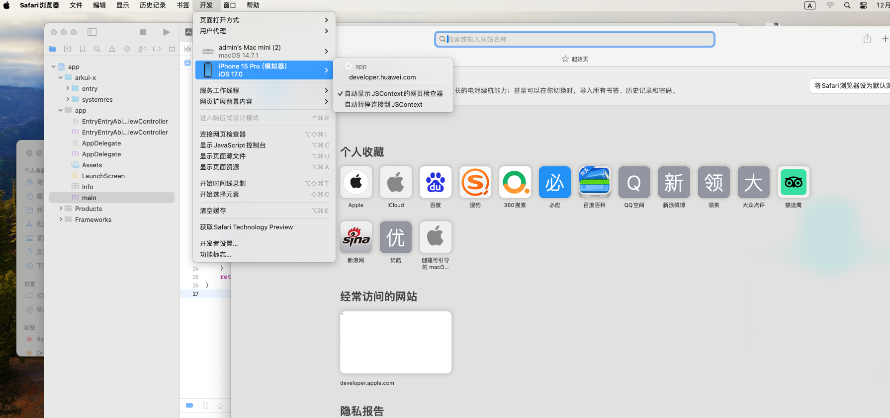
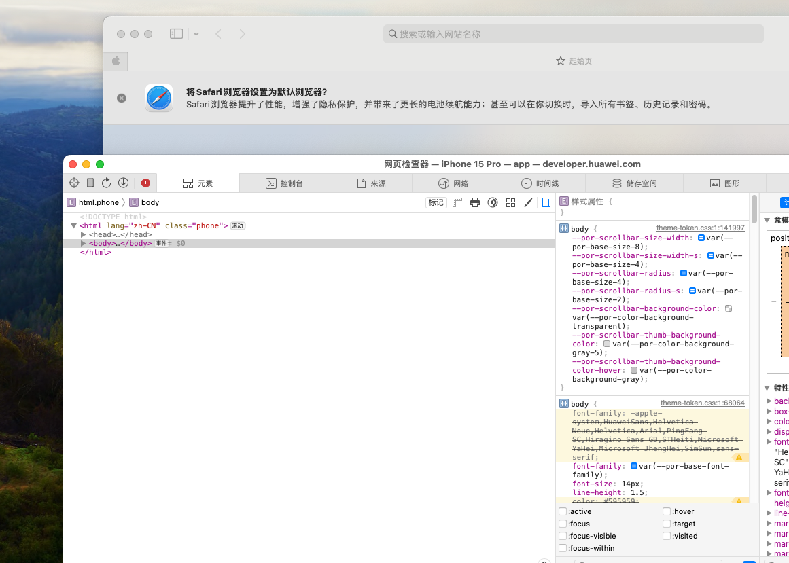

# 使用Safari浏览器调试前端页面


Web组件支持在Safari浏览器调试前端页面。DevTools是一个 Web前端开发调试工具，提供了电脑上调试移动设备前端页面的能力。开发者通过[setWebDebuggingAccess()](./js-apis-webview.md#setwebdebuggingaccess16)接口开启Web组件前端页面调试能力，利用Safari浏览器自带的开发功能可以在电脑上调试移动设备上的前端网页，设备需为ios16.4及以上版本。


## 调试步骤

### 应用代码开启Web调试开关

调试网页前，需要应用侧代码调用[setWebDebuggingAccess()](./js-apis-webview.md#setwebdebuggingaccess16)接口开启Web调试开关。  
如果没有开启Web调试开关，则Safari浏览器无法发现被调试的网页。

1. 在应用代码中开启Web调试开关，具体如下：

   ```ts
   // xxx.ets
   import { webview } from '@kit.ArkWeb';
   
   @Entry
   @Component
   struct WebComponent {
     controller: webview.WebviewController = new webview.WebviewController();
   
     aboutToAppear() {
       // 配置Web开启调试模式
       webview.WebviewController.setWebDebuggingAccess(true);
     }
   
     build() {
       Column() {
         Web({ src: 'www.example.com', controller: this.controller })
       }
     }
   }
   ```
2. 开启调试功能需要在DevEco Studio应用工程hap模块的module.json5文件中增加如下权限，添加方法请参考[在配置文件中声明权限](https://gitee.com/openharmony/docs/blob/master/zh-cn/application-dev/security/AccessToken/declare-permissions.md)。

   ```
   "requestPermissions":[
      {
        "name" : "ohos.permission.INTERNET"
      }
    ]
   ```

### 将设备连接至电脑

请将设备连接至电脑，随后开启开发者模式，为后续的端口转发操作做好准备。

1. 请开启设备上的开发者模式：手机系统打开 “设置”  > “safari浏览器” > “高级”，打开 “Javascript” 和 “网页检查器” 开关。  


### 在Safari浏览器上打开调试工具页面

  1. 在Mac上打开Safari浏览器，然后进入“Safari” -> “偏好设置” -> “高级”，勾选“在菜单栏中显示‘开发’菜单”。

  2. 在“开发”菜单中，选择你的设备名称，然后勾选“Safari - [你的设备名称]”。

### 等待发现被调试页面

  如果前面的步骤执行成功，稍后，Safari的调试页面将显示待调试的网页。  
  

### 开始网页调试

  
