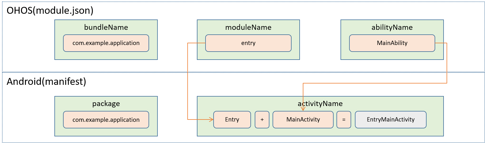

## StageActivity

```
java.lang.Object
    └── android.content.Context
        └── android.content.ContextWrapper
            └── android.view.ContextThemeWrapper
                └── android.app.Activity
                    └── ohos.ace.adapter.StageActivity
```

```
public class StageActivity
    extends Activity
```

StageActivity是Activity的子类，是Android Activity组件生命周期入口。ArkUI-X Android平台应用开发Stage模型的Ability时，必须继承StageActivity，并在子类中设置JsBundle实例名。

### 方法概要

| 类型 | 方法                         | 描述                     |
| ---- | ---------------------------- | ------------------------ |
| void | setInstanceName(String name) | 设置ArkUI JSBundle实例名 |

### 方法说明

- setInstanceName

```
/**
* set the instance name, should called before super.onCreate()
* 
* @param name the instance name to set
*/
public void setInstanceName(String name);
```

### StageActivity跟Ability映射命名规则
