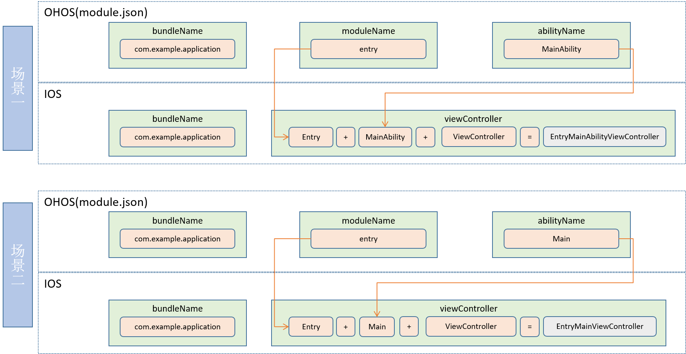

## StageViewController

```
UIResponder
    └── UIViewController
        └── StageViewController
```

```
@interface StageViewController : UIViewController
```

StageViewController是UIViewController的子类，是iOS应用的生命周期入口。ArkUI-X iOS平台应用开发时，必须实例化StageViewController，并完成JSBundle加载。

## 方法概要

| 类型         | 方法                 | 描述   |
| ------------ | -------------------- | ------ |
| instancetype | initWithInstanceName | 初始化 |

## 方法说明

- initWithInstanceName

```
/**
* Initializes this StageViewController with the specified instance name.
 *
 *  instanceName(bundleName:moduleName:abilityName)
 *  This is used for pure stage application. It will combine the instanceName as the
 *  abilityDirectory.
 *
 * @param instanceName instance name.
 */- (instancetype)initWithInstanceName:(NSString *_Nonnull)instanceName;
```

### StageViewController跟Ability映射命名规则
