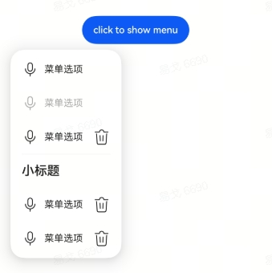

# MenuItem

用来展示菜单Menu中具体的item菜单项。

> **说明：**
>
> 该组件从API Version 9开始支持。后续版本如有新增内容，则采用上角标单独标记该内容的起始版本。

## 子组件

无

## 接口

MenuItem(value?: MenuItemOptions| CustomBuilder)

**参数：**

| 参数  | 类型                                                                                                                          | 必填 | 参数描述                     |
| ----- | ----------------------------------------------------------------------------------------------------------------------------- | ---- | ---------------------------- |
| value | [MenuItemOptions](ts-basic-components-menuitem.md#menuitemoptions类型说明)&nbsp;\|&nbsp;[CustomBuilder](ts-types.md#custombuilder8) | 否   | 包含设置MenuItem的各项信息。 |

## MenuItemOptions类型说明

**支持平台：** Android、iOS

| 名称      | 类型                                        | 必填 | 描述                                   |
| --------- | ------------------------------------------- | ---- | -------------------------------------- |
| startIcon | [ResourceStr](ts-types.md#resourcestr)      | 否   | item中显示在左侧的图标信息路径。       |
| content   | [ResourceStr](ts-types.md#resourcestr)      | 否   | item的内容信息。                       |
| endIcon   | [ResourceStr](ts-types.md#resourcestr)      | 否   | item中显示在右侧的图标信息路径。       |
| labelInfo | [ResourceStr](ts-types.md#resourcestr)      | 否   | 定义结束标签信息，如快捷方式Ctrl+C等。 |
| builder   | [CustomBuilder](ts-types.md#custombuilder8) | 否   | 用于构建二级菜单。                     |
| symbolStartIcon<sup>20+</sup>   | SymbolGlyphModifier | 否   | item中显示在左侧的HMSymbol图标信息路径。配置该项时，原先startIcon图标不显示。                     |
| symbolEndIcon<sup>20+</sup>  | SymbolGlyphModifier | 否   | item中显示在右侧的HMSymbol图标信息路径。配置该项时，原先endIcon图标不显示。                     |
## 属性

除支持[通用属性](ts-universal-attributes-size.md)外，还支持以下属性:

| 名称                           | 参数类型                                                     | 描述                                                         |
| ------------------------------ | ------------------------------------------------------------ | ------------------------------------------------------------ |
| selected                       | boolean                                                      | 设置菜单项是否选中。<br />默认值：false<br />从API version 10开始，该参数支持[$$](../../quick-start/arkts-two-way-sync.md)双向绑定变量。 |
| selectIcon                     | boolean \| [ResourceStr](ts-types.md#resourcestr)<sup>10+</sup> | 当菜单项被选中时，是否显示被选中的图标。<br/>默认值：false<br/>true: 菜单项被选中时，显示默认的对勾图标<br/>false: 即使菜单项被选中也不显示图标<br/>ResourceStr: 菜单项被选中时，显示指定的图标 |
| contentFont<sup>10+</sup>      | [Font](ts-types.md#font)                                     | 设置菜单项中内容信息的字体样式。                             |
| contentFontColor<sup>10+</sup> | [ResourceColor](ts-types.md#resourcecolor)                   | 设置菜单项中内容信息的字体颜色。                             |
| labelFont<sup>10+</sup>        | [Font](ts-types.md#font)                                     | 设置菜单项中标签信息的字体样式。                             |
| labelFontColor<sup>10+</sup>   | [ResourceColor](ts-types.md#resourcecolor)                   | 设置菜单项中标签信息的字体颜色。                             |

## 事件

| 名称     | 参数类型                    | 描述                                                                                                                                                            |
| -------- | --------------------------- | --------------------------------------------------------------------------------------------------------------------------------------------------------------- |
| onChange | (selected: boolean) => void | 当选中状态发生变化时，触发该回调。只有手动触发且MenuItem状态改变时才会触发onChange回调。<br />- value为true时，表示已选中。<br />- value为false时，表示未选中。 |

## 示例

详见[Menu组件示例](ts-basic-components-menu.md#示例)。

### 示例1

```ts
import { SymbolGlyphModifier } from '@kit.ArkUI';

@Entry
@Component
struct Index {

    @State startIconModifier: SymbolGlyphModifier = new SymbolGlyphModifier($r('sys.symbol.ohos_mic')).fontSize('24vp');
    @State endIconModifier: SymbolGlyphModifier = new SymbolGlyphModifier($r('sys.symbol.ohos_trash')).fontSize('24vp');

    @Builder
    SubMenu() {
        Menu() {
        MenuItem({ content: "复制", labelInfo: "Ctrl+C" })
        MenuItem({ content: "粘贴", labelInfo: "Ctrl+V" })
        }
    }

    @Builder
    MyMenu() {
        Menu() {
        MenuItem({ symbolStartIcon: this.startIconModifier, content: "菜单选项" })
        MenuItem({ symbolStartIcon: this.startIconModifier, content: "菜单选项" })
            .enabled(false)
        MenuItem({
            symbolStartIcon: this.startIconModifier,
            content: "菜单选项",
            symbolEndIcon: this.endIconModifier,
            builder: (): void => this.SubMenu()
        })
        MenuItemGroup({ header: '小标题' }) {
            MenuItem({
            symbolStartIcon: this.startIconModifier,
            content: "菜单选项",
            symbolEndIcon: this.endIconModifier,
            builder: (): void => this.SubMenu()
            })
            MenuItem({
            symbolStartIcon: this.startIconModifier,
            content: "菜单选项",
            symbolEndIcon: this.endIconModifier,
            builder: (): void => this.SubMenu()
            })
        }
        }
    }

    build() {
        Column() {
            Column() {
                Button('click to show menu')
                .fontWeight(FontWeight.Bold)
            }
            .bindMenu(this.MyMenu)
            .width('100%')
        }
        .width('100%')
        .height('100%')
    }
}
```
