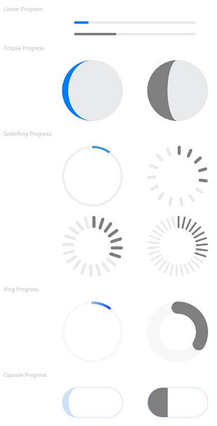
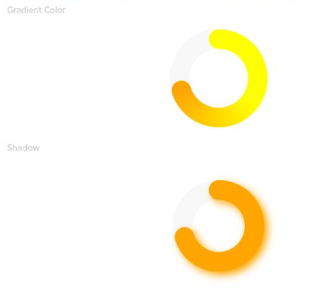
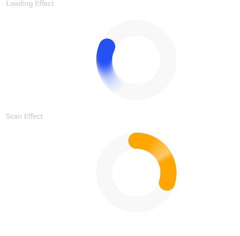
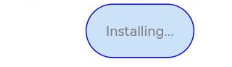
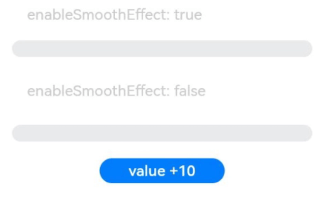

# Progress

进度条组件，用于显示内容加载或操作处理等进度。

>  **说明：**
>
>  该组件从API version 7开始支持。后续版本如有新增内容，则采用上角标单独标记该内容的起始版本。


## 子组件

无


## 接口

Progress(options: {value: number, total?: number, type?: ProgressType})

创建进度组件，用于显示内容加载或操作处理进度。

从API version 9开始，该接口支持在ArkTS卡片中使用。

**参数:**

| 参数名            | 参数类型                              | 必填 | 参数描述                                                     |
| ----------------- | ------------------------------------- | ---- | ------------------------------------------------------------ |
| value             | number                                | 是   | 指定当前进度值。设置小于0的数值时置为0，设置大于total的数值时置为total。<br/>从API version 9开始，该接口支持在ArkTS卡片中使用。 |
| total             | number                                | 否   | 指定进度总长。<br/>默认值：100<br/>从API version 9开始，该接口支持在ArkTS卡片中使用。 |
| type<sup>8+</sup> | [ProgressType](#progresstype枚举说明) | 否   | 指定进度条类型。<br/>默认值：ProgressType.Linear<br/>从API version 9开始，该接口支持在ArkTS卡片中使用。 |

## ProgressType枚举说明

从API version 9开始，该接口支持在ArkTS卡片中使用。

| 名称                     | 描述                                       |
| ---------------------- | ---------------------------------------- |
| Linear                 | 线性样式。从API version9开始，高度大于宽度的时候自适应垂直显示。   |
| Ring<sup>8+</sup>      | 环形无刻度样式，环形圆环逐渐显示至完全填充效果。                 |
| Eclipse<sup>8+</sup>   | 圆形样式，显示类似月圆月缺的进度展示效果，从月牙逐渐变化至满月。         |
| ScaleRing<sup>8+</sup> | 环形有刻度样式，显示类似时钟刻度形式的进度展示效果。从API version9开始，刻度外圈出现重叠的时候自动转换为环形无刻度进度条。 |
| Capsule<sup>8+</sup>   | 胶囊样式，头尾两端圆弧处的进度展示效果与Eclipse相同；中段处的进度展示效果与Linear相同。高度大于宽度的时候自适应垂直显示。 |

## 属性

除支持[通用属性](ts-universal-attributes-size.md)外，还支持以下属性：

| 名称            | 参数类型                                   | 描述                                                         |
| --------------- | ------------------------------------------ | ------------------------------------------------------------ |
| value           | number                                     | 设置当前进度值。设置小于0的数值时置为0，设置大于total的数值时置为total。非法数值不生效。<br/>从API version 9开始，该接口支持在ArkTS卡片中使用。 |
| color           | [ResourceColor](ts-types.md#resourcecolor) \| [LinearGradient<sup>10+</sup>](ts-basic-components-datapanel.md#lineargradient10对象说明) | 设置进度条前景色。<br/>从API version 10开始支持利用LinearGradient设置Ring样式的渐变色。<br/>默认值（API version 9）：'\#ff007dff'<br/>默认值（API version 10）：<br/>- Capsule：'\#33006cde'<br/>- Ring：起始端：'\#ff3b61f7'，结束端：'\#ff6591bf'<br/>- 其他样式：'\#ff007dff'<br/>从API version 9开始，该接口支持在ArkTS卡片中使用，暂不支持LinearGradient。 |
| backgroundColor | [ResourceColor](ts-types.md#resourcecolor) | 设置进度条底色。<br/>默认值（API version 9）：'\#19182431'<br/>默认值（API version 10）：<br/>- Capsule：'\#33ffffff'<br/>- Ring：'\#08182431'<br/>- 其他样式：'\#19182431'<br/>从API version 9开始，该接口支持在ArkTS卡片中使用。<br/>**说明：** <br/>当设置[通用属性backgroundColor](./ts-universal-attributes-background.md)时，生效的是进度条的底色，而不是整个Progress组件的背景色。 |
| style<sup>8+</sup> | [ProgressStyleOptions](#progressstyleoptions)| 定义组件的样式。<br/>从API version 9开始，该接口支持在ArkTS卡片中设置ProgressStyleOptions，暂不支持其它的参数类型。 |
## ProgressStyleOptions
| 名称          | 参数类型                      | 必填 | 描述                                                                                        |
| ------------ | ---------------------------- | ---- | ------------------------------------------------------------------------------------------ |
| strokeWidth  | [Length](ts-types.md#length) | 否   | 设置进度条宽度（不支持百分比设置）。<br/>默认值：4.0vp                                            |
| scaleCount   | number                       | 否   | 设置环形进度条总刻度数。<br/>默认值：120                                                        |
| scaleWidth   | [Length](ts-types.md#length) | 否   | 设置环形进度条刻度粗细（不支持百分比设置），刻度粗细大于进度条宽度时，为系统默认粗细。<br/>默认值：2.0vp |

## 事件

支持[通用事件](ts-universal-events-click.md)。

## 示例
### 示例1
各进度条基础属性效果
```ts
// xxx.ets
@Entry
@Component
struct ProgressExample {
  build() {
    Column({ space: 15 }) {
      Text('Linear Progress').fontSize(9).fontColor(0xCCCCCC).width('90%')
      Progress({ value: 10, type: ProgressType.Linear }).width(200)
      Progress({ value: 20, total: 150, type: ProgressType.Linear }).color(Color.Grey).value(50).width(200)


      Text('Eclipse Progress').fontSize(9).fontColor(0xCCCCCC).width('90%')
      Row({ space: 40 }) {
        Progress({ value: 10, type: ProgressType.Eclipse }).width(100)
        Progress({ value: 20, total: 150, type: ProgressType.Eclipse }).color(Color.Grey).value(50).width(100)
      }

      Text('ScaleRing Progress').fontSize(9).fontColor(0xCCCCCC).width('90%')
      Row({ space: 40 }) {
        Progress({ value: 10, type: ProgressType.ScaleRing }).width(100)
        Progress({ value: 20, total: 150, type: ProgressType.ScaleRing })
          .color(Color.Grey).value(50).width(100)
          .style({ strokeWidth: 15, scaleCount: 15, scaleWidth: 5 })
      }

      // scaleCount和scaleWidth效果对比
      Row({ space: 40 }) {
        Progress({ value: 20, total: 150, type: ProgressType.ScaleRing })
          .color(Color.Grey).value(50).width(100)
          .style({ strokeWidth: 20, scaleCount: 20, scaleWidth: 5 })
        Progress({ value: 20, total: 150, type: ProgressType.ScaleRing })
          .color(Color.Grey).value(50).width(100)
          .style({ strokeWidth: 20, scaleCount: 30, scaleWidth: 3 })
      }

      Text('Ring Progress').fontSize(9).fontColor(0xCCCCCC).width('90%')
      Row({ space: 40 }) {
        Progress({ value: 10, type: ProgressType.Ring }).width(100)
        Progress({ value: 20, total: 150, type: ProgressType.Ring })
          .color(Color.Grey).value(50).width(100)
          .style({ strokeWidth: 20 })
      }

      Text('Capsule Progress').fontSize(9).fontColor(0xCCCCCC).width('90%')
      Row({ space: 40 }) {
        Progress({ value: 10, type: ProgressType.Capsule }).width(100).height(50)
        Progress({ value: 20, total: 150, type: ProgressType.Capsule })
          .color(Color.Grey)
          .value(50)
          .width(100)
          .height(50)
      }
    }.width('100%').margin({ top: 30 })
  }
}
```



### 示例2
环形进度条视觉属性
```ts
@Entry
@Component
struct ProgressExample {
  private gradientColor: LinearGradient = new LinearGradient([{ color: Color.Yellow, offset: 0.5 },
                                                              { color: Color.Orange, offset: 1.0 }])
  build() {
    Column({ space: 15 }) {
      Text('Gradient Color').fontSize(9).fontColor(0xCCCCCC).width('90%')
      Progress({ value: 70, total: 100, type: ProgressType.Ring })
        .width(100).style({ strokeWidth: 20 })
        .color(this.gradientColor)

      Text('Shadow').fontSize(9).fontColor(0xCCCCCC).width('90%')
      Progress({ value: 70, total: 100, type: ProgressType.Ring })
        .width(120).color(Color.Orange)
        .style({ strokeWidth: 20, shadow: true })
    }.width('100%').padding({ top: 5 })
  }
}
```


### 示例3
环形进度条动效
```ts
@Entry
@Component
struct ProgressExample {
  private gradientColor: LinearGradient = new LinearGradient([{ color: Color.Yellow, offset: 0.5 },
                                                              { color: Color.Orange, offset: 1.0 }])
  build() {
    Column({ space: 15 }) {
      Text('Loading Effect').fontSize(9).fontColor(0xCCCCCC).width('90%')
      Progress({ value: 0, total: 100, type: ProgressType.Ring })
        .width(100).color(Color.Blue)
        .style({ strokeWidth: 20, status: ProgressStatus.LOADING })

      Text('Scan Effect').fontSize(9).fontColor(0xCCCCCC).width('90%')
      Progress({ value: 30, total: 100, type: ProgressType.Ring })
        .width(100).color(Color.Orange)
        .style({ strokeWidth: 20, enableScanEffect: true })
    }.width('100%').padding({ top: 5 })
  }
}
```


### 示例4
胶囊形进度条视觉属性
```ts
@Entry
@Component
struct ProgressExample {

  build() {
    Column({ space: 15 }) {
      Row({ space: 40 }) {
        Progress({ value: 100, total: 100,type: ProgressType.Capsule }).width(100).height(50)
          .style({borderColor: Color.Blue, borderWidth: 1, content: 'Installing...',
                  font: {size: 13, style: FontStyle.Normal}, fontColor: Color.Gray,
                  enableScanEffect: false, showDefaultPercentage: false})
      }
    }.width('100%').padding({ top: 5 })
  }
}
```


### 示例5
进度平滑动效
```ts
@Entry
@Component
struct Index {
  @State value: number = 0

  build() {
    Column({space: 10}) {
      Text('enableSmoothEffect: true').fontSize(9).fontColor(0xCCCCCC).width('90%').margin(5)
        .margin({top: 20})
      Progress({value: this.value, total: 100, type:ProgressType.Linear})
        .style({strokeWidth: 10, enableSmoothEffect: true})

      Text('enableSmoothEffect: false').fontSize(9).fontColor(0xCCCCCC).width('90%').margin(5)
      Progress({value: this.value, total: 100, type:ProgressType.Linear})
        .style({strokeWidth: 10, enableSmoothEffect: false})

      Button('value +10').onClick(() => {
        this.value += 10
      })
        .width(75)
        .height(15)
        .fontSize(9)
    }
    .width('50%')
    .height('100%')
    .margin({left:20})
  }
}

```

