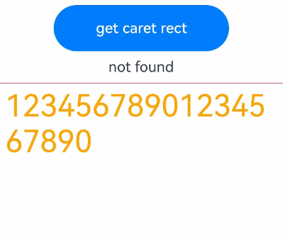

# RichEditor

支持图文混排和文本交互式编辑的组件。

>  **说明：**
>
>  该组件从API version 11开始支持跨平台。后续版本新增内容，采用上角标单独标记该内容的起始版本。


## 子组件

不包含子组件。


## 接口

RichEditor(value: RichEditorOptions)

**支持平台：** Android、iOS

**参数：**

| 参数名   | 类型                                    | 必填   | 说明        |
| ----- | --------------------------------------- | ---- | ----------- |
| value | [RichEditorOptions](#richeditoroptions) | 是    | 富文本组件初始化选项。 |

RichEditor(options: RichEditorStyledStringOptions)<sup>12+</sup>


**参数：**

| 参数名   | 类型                                    | 必填   | 说明        |
| ----- | --------------------------------------- | ---- | ----------- |
| options | [RichEditorStyledStringOptions](#richeditorstyledstringoptions12) | 是    | 富文本组件初始化选项。 |

## 属性

除支持通用属性外，还支持以下属性：

>  **说明：**
>
>  align属性只支持上方、中间和下方位置的对齐方式。
> 
>  不支持borderImage属性。

### customKeyboard

customKeyboard(value: CustomBuilder, options?: KeyboardOptions)

设置自定义键盘。

当设置自定义键盘时，输入框激活后不会打开系统输入法，而是加载指定的自定义组件。

自定义键盘的高度可以通过自定义组件根节点的height属性设置，宽度不可设置，使用系统默认值。

自定义键盘无法获取焦点，但是会拦截手势事件。

默认在输入控件失去焦点时，关闭自定义键盘。

如果设备支持拍摄输入，设置自定义键盘后，该输入框会不支持拍摄输入。

**支持平台：** Android、iOS

**参数：** 

| 参数名                | 类型                                        | 必填 | 说明                             |
| --------------------- | ------------------------------------------- | ---- | -------------------------------- |
| value                 | [CustomBuilder](ts-types.md#custombuilder8) | 是   | 自定义键盘。                     |
| options<sup>12+</sup> | [KeyboardOptions](#keyboardoptions12)       | 否   | 设置自定义键盘是否支持避让功能。 |

### bindSelectionMenu

bindSelectionMenu(spanType: RichEditorSpanType, content: CustomBuilder, responseType: ResponseType | RichEditorResponseType,
    options?: SelectionMenuOptions)

设置自定义选择菜单。自定义菜单超长时，建议内部嵌套[Scroll](./ts-container-scroll.md)组件使用，避免键盘被遮挡。

**支持平台：** Android、iOS

**参数：** 

| 参数名       | 类型                                                         | 必填 | 说明                                                      |
| ------------ | ------------------------------------------------------------ | ---- | --------------------------------------------------------- |
| spanType     | [RichEditorSpanType](#richeditorspantype)                    | 是   | 菜单的类型。<br/>默认值：<br/>RichEditorSpanType.TEXT    |
| content      | [CustomBuilder](ts-types.md#custombuilder8)                  | 是   | 菜单的内容。                                              |
| responseType | &nbsp;[ResponseType](ts-appendix-enums.md#responsetype8)&nbsp;\|&nbsp;[RichEditorResponseType](#richeditorresponsetype) | 是   | 菜单的响应类型。<br/> 默认值：<br/>ResponseType.LongPress |
| options      | [SelectionMenuOptions](#selectionmenuoptions)              | 否   | 菜单的选项。                                              |

### copyOptions

copyOptions(value: CopyOptions)

设置组件是否支持文本内容可复制粘贴。

copyOptions不为CopyOptions.None时，长按组件内容，会弹出文本选择弹框。如果通过bindSelectionMenu等方式自定义文本选择菜单，则会弹出自定义的菜单。

设置copyOptions为CopyOptions.None时，禁用复制、剪切、翻译、搜索、帮写功能。

**支持平台：** Android、iOS

**参数：** 

| 参数名 | 类型                                             | 必填 | 说明                                                         |
| ------ | ------------------------------------------------ | ---- | ------------------------------------------------------------ |
| value  | [CopyOptions](ts-appendix-enums.md#copyoptions9) | 是   | 组件支持文本内容是否可复制粘贴。<br/>默认值：CopyOptions.LocalDevice |

### placeholder<sup>12+</sup>

placeholder(value: ResourceStr, style?: PlaceholderStyle)

设置无输入时的提示文本。

**支持平台：** Android、iOS

**参数：** 

| 参数名 | 类型                                    | 必填 | 说明                                                    |
| ------ | --------------------------------------- | ---- | ------------------------------------------------------- |
| value  | [ResourceStr](ts-types.md#resourcestr)  | 是   | 无输入时的提示文本。                                    |
| style  | [PlaceholderStyle](#placeholderstyle12) | 否   | 提示文本的字体样式。<br/>缺省时默认跟随主题。 |

### caretColor<sup>12+</sup>

caretColor(value: ResourceColor)

设置输入框光标、手柄颜色。

**支持平台：** Android、iOS

**参数：** 

| 参数名 | 类型                                       | 必填 | 说明                                   |
| ------ | ------------------------------------------ | ---- | -------------------------------------- |
| value  | [ResourceColor](ts-types.md#resourcecolor) | 是   | 输入框光标、手柄颜色。<br/>默认值：'#007DFF' |

### selectedBackgroundColor<sup>12+</sup>

selectedBackgroundColor(value: ResourceColor)

设置文本选中的底板颜色。如果未设置不透明度，默认为20%不透明度。

**支持平台：** Android、iOS

**参数：** 

| 参数名 | 类型                                       | 必填 | 说明                                       |
| ------ | ------------------------------------------ | ---- | ------------------------------------------ |
| value  | [ResourceColor](ts-types.md#resourcecolor) | 是   | 文本选中的底板颜色。<br/>默认为20%不透明度。 |

### editMenuOptions<sup>12+</sup>

editMenuOptions(editMenu: EditMenuOptions)

设置自定义菜单扩展项，允许用户设置扩展项的文本内容、图标、回调方法。

**支持平台：** Android、iOS

**参数：** 

| 参数名 | 类型                                          | 必填 | 说明                                          |
| ------ | --------------------------------------------- | ---- | --------------------------------------------- |
| editMenu  | EditMenuOptions | 是   | 扩展菜单选项。 |

### enterKeyType<sup>12+</sup>

enterKeyType(value: EnterKeyType)

设置软键盘输入法回车键类型。

**支持平台：** Android、iOS

**参数：** 

| 参数名 | 类型   | 必填 | 说明                                |
| ------ | ------ | ---- | ----------------------------------- |
| value  | [EnterKeyType](ts-basic-components-textinput.md#enterkeytype枚举说明) | 是   | 键盘输入法回车键类型。<br/>默认为EnterKeyType.NEW_LINE。 |

### barState<sup>13+</sup>

barState(state: BarState)

设置RichEditor滚动条的显示模式。

**支持平台：** Android、iOS

**参数：** 

| 参数名 | 类型 | 必填 | 说明 |
| ------ | ----------------------------------------- | ---- | ------------------------------------------------------ |
| state | [BarState](ts-appendix-enums.md#barstate) | 是   | 输入框滚动条的显示模式。<br/>默认值：BarState.Auto |

### maxLength<sup>18+</sup>

maxLength(maxLength: Optional\<number\>)

设置文本的最大输入字符数。

**支持平台：** Android、iOS

**参数：** 

| 参数名 | 类型   | 必填 | 说明                                                         |
| ------ | ------ | ---- | ------------------------------------------------------------ |
| maxLength  | Optional\<number> | 是   | 文本的最大输入字符数。<br/>默认值：Infinity，可以无限输入，支持undefined类型。<br/>**说明：** <br/>当不设置该属性或设置异常值时，取默认值，设置小数时，取整数部分。 |

### maxLines<sup>18+</sup>

maxLines(maxLines: Optional\<number\>)

设置富文本可显示的最大行数。maxLines为可显示行数，当设置maxLines时，超出内容可滚动显示。同时设置组件高度和最大行数，组件高度优先生效。

**支持平台：** Android、iOS

**参数：** 

| 参数名 | 类型                                      | 必填 | 说明                                                         |
| ------ | ----------------------------------------- | ---- | ------------------------------------------------------------ |
| maxLines  | Optional\<number> | 是   | 设置富文本可显示的最大行数。maxLines为可显示行数，当设置maxLines时，超出内容可滚动显示。同时设置组件高度和最大行数，组件高度优先生效。<br/>默认值：Infinity，可以无限输入，支持undefined类型。 <br/>取值范围：(0, +∞) |

## 事件

除支持通用事件外，还支持OnDidChangeCallback、StyledStringChangedListener、StyledStringChangeValue和以下事件：

### onReady

onReady(callback:Callback\<void\>)

富文本组件初始化完成后触发回调。

**支持平台：** Android、iOS

**参数：** 

| 参数名   | 类型                                    | 必填   | 说明        |
| ----- | --------------------------------------- | ---- | ----------- |
| callback |Callback\<void\> | 是    | 订阅富文本组件初始化完成的回调。 |

### onSelect

onSelect(callback:Callback\<[RichEditorSelection](#richeditorselection)\>)

鼠标左键双击选中内容触发回调；松开鼠标左键再次触发回调。

手指长按选中内容触发回调；松开手指再次触发回调。

使用[RichEditorStyledStringOptions](#richeditorstyledstringoptions12)构建的RichEditor组件不支持该回调。

**支持平台：** Android、iOS

**参数：** 

| 参数名 | 类型                                        | 必填 | 说明                 |
| ------ | ------------------------------------------- | ---- | -------------------- |
| callback | Callback\<[RichEditorSelection](#richeditorselection)\> | 是   | [RichEditorSelection](#richeditorselection)为选中的所有span信息。<br/>选择时触发的回调。 |

### aboutToIMEInput

aboutToIMEInput(callback:Callback\<[RichEditorInsertValue](#richeditorinsertvalue), boolean\>)

输入法输入内容前触发回调。

使用[RichEditorStyledStringOptions](#richeditorstyledstringoptions12)构建的RichEditor组件不支持该回调。

**支持平台：** Android、iOS

**参数：** 

| 参数名 | 类型                                        | 必填 | 说明                 |
| ------ | ------------------------------------------- | ---- | -------------------- |
| callback | Callback\<[RichEditorInsertValue](#richeditorinsertvalue), boolean\> | 是   | [RichEditorInsertValue](#richeditorinsertvalue)为输入法将要输入内容信息。<br/>true:组件执行添加内容操作。<br/>false:组件不执行添加内容操作。<br/>输入法输入内容前的回调。|

### onDidIMEInput<sup>12+</sup>

onDidIMEInput(callback:Callback\<TextRange>)

输入法完成输入内容后，触发回调。

使用[RichEditorStyledStringOptions](#richeditorstyledstringoptions12)构建的RichEditor组件不支持该回调。

**支持平台：** Android、iOS

**参数：** 

| 参数名 | 类型                                        | 必填 | 说明                 |
| ------ | ------------------------------------------- | ---- | -------------------- |
| callback | Callback\<TextRange\> | 是 | TextRange为输入法本次输入内容的范围。<br/>输入法完成输入时的回调。|


### onIMEInputComplete

onIMEInputComplete(callback:Callback\<[RichEditorTextSpanResult](#richeditortextspanresult)\>)

输入法完成输入内容后，触发回调。

该接口仅支持返回一个文本span的信息，当编辑操作涉及返回多个文本span信息时，建议使用[onDidIMEInput](#ondidimeinput12)接口。

使用[RichEditorStyledStringOptions](#richeditorstyledstringoptions12)构建的RichEditor组件不支持该回调。

**支持平台：** Android、iOS

**参数：** 

| 参数名 | 类型                                        | 必填 | 说明                 |
| ------ | ------------------------------------------- | ---- | -------------------- |
| callback | Callback\<[RichEditorTextSpanResult](#richeditortextspanresult)\> | 是 | [RichEditorTextSpanResult](#richeditortextspanresult)为输入法完成输入后的文本Span信息。<br/>输入法完成输入后的回调。|

### aboutToDelete

aboutToDelete(callback:Callback\<[RichEditorDeleteValue](#richeditordeletevalue), boolean\>)

输入法删除内容前，触发回调。

使用[RichEditorStyledStringOptions](#richeditorstyledstringoptions12)构建的RichEditor组件不支持该回调。

**支持平台：** Android、iOS

**参数：** 

| 参数名 | 类型                                        | 必填 | 说明                 |
| ------ | ------------------------------------------- | ---- | -------------------- |
| callback | Callback\<[RichEditorDeleteValue](#richeditordeletevalue), boolean\> | 是 | [RichEditorDeleteValue](#richeditordeletevalue)为准备删除的内容所在的文本或者图片Span信息。<br/>true:组件执行删除操作。<br/>false:组件不执行删除操作。<br/>输入法删除内容前的回调，英文预上屏点击候选词时会执行该回调。|

### onDeleteComplete

onDeleteComplete(callback:Callback\<void\>)

输入法删除内容后，触发回调。

使用[RichEditorStyledStringOptions](#richeditorstyledstringoptions12)构建的RichEditor组件不支持该回调。

**支持平台：** Android、iOS

**参数：** 

| 参数名   | 类型                                    | 必填   | 说明        |
| ----- | --------------------------------------- | ---- | ----------- |
| callback |Callback\<void\> | 是    | 订阅输入法完成删除内容的回调。 |

### onPaste

onPaste(callback: [PasteEventCallback](#pasteeventcallback12) )

粘贴时，触发回调。开发者可以通过该方法，覆盖系统默认行为，实现图文的粘贴。

**支持平台：** Android、iOS

**参数：** 

| 参数名 | 类型    | 必填 | 说明                          |
| ------ | ------- | ---- | ----------------------------- |
| callback | [PasteEventCallback](#pasteeventcallback12) | 是   | 订阅粘贴时的回调。 |

### onSelectionChange<sup>12+</sup>

onSelectionChange(callback:Callback\<[RichEditorRange](#richeditorrange)\>)

内容选择区域或编辑状态下的光标位置发生变化时，将触发该回调。光标位置变化时，回调中选择区域的起始和终止位置相等。

**支持平台：** Android、iOS

**参数：** 

| 参数名   | 类型                                    | 必填   | 说明        |
| ----- | --------------------------------------- | ---- | ----------- |
| callback |Callback\<[RichEditorRange](#richeditorrange)\> | 是    | [RichEditorRange](#richeditorrange)为所有内容的选择区域起始和终止位置。<br/>订阅文本选择区域发生变化或编辑状态下光标位置发生变化时触发的回调。|

### onEditingChange<sup>12+</sup>

onEditingChange(callback: Callback\<boolean\>)

组件内容的编辑状态发生变化时触发该回调函数。

**支持平台：** Android、iOS

**参数：** 

| 参数名   | 类型                                    | 必填   | 说明        |
| ----- | --------------------------------------- | ---- | ----------- |
| callback | Callback\<boolean\> | 是    | true表示编辑态，false表示非编辑态。 |

### onSubmit<sup>12+</sup>

onSubmit(callback: SubmitCallback)

按下软键盘输入法回车键时触发该回调。

**支持平台：** Android、iOS

**参数：** 

| 参数名 | 类型    | 必填 | 说明                          |
| ------ | ------- | ---- | ----------------------------- |
| callback | [SubmitCallback](#submitcallback12) | 是   | 订阅事件的回调。 |

### onWillChange<sup>12+</sup>

onWillChange(callback: Callback\<[RichEditorChangeValue](#richeditorchangevalue12) , boolean\>)

在组件执行增删操作前，触发回调。

使用[RichEditorStyledStringOptions](#richeditorstyledstringoptions12)构建的RichEditor组件不支持该回调。

**支持平台：** Android、iOS

**参数：** 

| 参数名 | 类型 | 必填 | 说明 |
| -- | -- | -- | -- |
| callback | Callback\<[RichEditorChangeValue](#richeditorchangevalue12) , boolean\> | 是    | [RichEditorChangeValue](#richeditorchangevalue12)为图文变化信息；boolean表示当前图文是否允许被更改，true：允许图文被更改；false：不允许图文被更改。 |

### onDidChange<sup>12+</sup>

onDidChange(callback: OnDidChangeCallback)

在组件执行增删操作后，触发回调。如果文本实际未发生增删，则不触发该回调。

使用[RichEditorStyledStringOptions](#richeditorstyledstringoptions12)构建的RichEditor组件不支持该回调。

**支持平台：** Android、iOS

**参数：** 

| 参数名 | 类型 | 必填 | 说明 |
| -- | -- | -- | -- |
| callback | [OnDidChangeCallback](ts-text-common.md#ondidchangecallback12) | 是 | 图文变化前后的内容范围。 |

### onCut<sup>12+</sup>

onCut(callback: Callback\<CutEvent\>)

剪切时触发回调。开发者可以通过该方法，覆盖系统默认行为，实现图文的剪切。

使用[RichEditorStyledStringOptions](#richeditorstyledstringoptions12)构建的RichEditor组件，默认支持图文的剪切。

**支持平台：** Android、iOS

**参数：** 

| 参数名   | 类型                                    | 必填   | 说明        |
| ----- | --------------------------------------- | ---- | ----------- |
| callback |Callback\<[CutEvent](#cutevent12)\> | 是    | 定义用户剪切事件。 |

### onCopy<sup>12+</sup>

onCopy(callback: Callback\<CopyEvent\>)

复制时触发回调。开发者可以通过该方法，覆盖系统默认行为，实现图文的复制。

使用[RichEditorStyledStringOptions](#richeditorstyledstringoptions12)构建的RichEditor组件，默认支持图文的复制。

**支持平台：** Android、iOS

**参数：** 

| 参数名   | 类型                                    | 必填   | 说明        |
| ----- | --------------------------------------- | ---- | ----------- |
| callback |Callback\<[CopyEvent](#copyevent12)\> | 是    | 定义用户复制事件。 |

## RichEditorInsertValue

插入文本的信息。

**支持平台：** Android、iOS

| 名称           | 类型     | 必填   | 说明         |
| ------------ | ------ | ---- | ---------- |
| insertOffset | number | 是    | 插入的文本偏移位置。|
| insertValue  | string | 是    | 插入的文本内容。  |

## RichEditorDeleteValue

删除操作的信息和被删除内容的信息。

**支持平台：** Android、iOS

| 名称                    | 类型                                       | 必填   | 说明                  |
| --------------------- | ---------------------------------------- | ---- | ------------------- |
| offset                | number                                   | 是    | 删除内容的偏移位置。          |
| direction             | [RichEditorDeleteDirection](#richeditordeletedirection) | 是    | 删除操作的方向。            |
| length                | number                                   | 是    | 删除内容长度。             |
| richEditorDeleteSpans | Array<[RichEditorTextSpanResult](#richeditortextspanresult) \| [RichEditorImageSpanResult](#richeditorimagespanresult)> | 是    | 删除的文本或图片Span的信息。 |


## RichEditorDeleteDirection

删除方向。

**支持平台：** Android、iOS

| 名称     | 说明       |
| -------- | ---------- |
| BACKWARD | 向后删除。 |
| FORWARD  | 向前删除。 |


## RichEditorTextSpanResult

文本Span信息。

**支持平台：** Android、iOS

| 名称                            | 类型                                       | 必填   | 说明                     |
| ----------------------------- | ---------------------------------------- | ---- | ---------------------- |
| spanPosition                  | [RichEditorSpanPosition](#richeditorspanposition) | 是    | Span位置。               |
| value                         | string                                   | 是    | 文本Span内容或Symbol的id。         |
| textStyle                     | [RichEditorTextStyleResult](#richeditortextstyleresult) | 是    | 文本Span样式信息。      |
| offsetInSpan                  | [number, number]                         | 是    | 文本Span内容里有效内容的起始和结束位置。 |
| valueResource                 | [Resource](ts-types.md#resource)         | 否    | 组件SymbolSpan内容。      |
| symbolSpanStyle               | [RichEditorSymbolSpanStyle](#richeditorsymbolspanstyle) | 否    | 组件SymbolSpan样式信息。     |
| paragraphStyle<sup>12+</sup>  | [RichEditorParagraphStyle](#richeditorparagraphstyle)  | 否   | 段落样式。|
| urlStyle<sup>19+</sup>  | [RichEditorUrlStyle](#richeditorurlstyle19)   | 否   | url信息。<br/>默认值：undefined |


## RichEditorSpanPosition

Span位置信息。

**支持平台：** Android、iOS

| 名称        | 类型               | 必填   | 说明                          |
| --------- | ---------------- | ---- | --------------------------- |
| spanIndex | number           | 是    | Span索引值。                    |
| spanRange | [number, number] | 是    | Span内容在RichEditor内的起始和结束位置。 |

## RichEditorSpanType

Span类型信息。

**支持平台：** Android、iOS

| 名称    | 值     | 说明         |
| ----- | ---- | ------------ |
| TEXT  | 0 | Span类型为文字。  |
| IMAGE | 1 | Span类型为图像。    |
| MIXED | 2 | Span类型为图文混合。  |
| BUILDER<sup>12+</sup> | 3 | Span类型为BuilderSpan。  |
| DEFAULT<sup>15+</sup> | 4 | 默认类型，不指定Span类型时生效。|

## RichEditorResponseType

菜单的响应类型。

**支持平台：** Android、iOS

| 名称    | 值     | 说明         |
| ----- | ---- | ------------ |
| RIGHT_CLICK  | 0 | 通过鼠标右键触发菜单弹出。  |
| LONG_PRESS | 1 | 通过长按触发菜单弹出。  |
| SELECT | 2 | 通过鼠标选中触发菜单弹出。  |
| DEFAULT<sup>15+</sup> | 3 | 默认类型，不指定响应类型时生效。  |

## RichEditorTextStyleResult

后端返回的文本样式信息。

**支持平台：** Android、iOS

| 名称         | 类型                                       | 必填   | 说明           |
| ---------- | ---------------------------------------- | ---- | ------------ |
| fontColor  | [ResourceColor](ts-types.md#resourcecolor) | 是    | 文本颜色。      |
| fontSize   | number                                   | 是    | 字体大小，默认单位为fp。     |
| fontStyle  | [FontStyle](ts-appendix-enums.md#fontstyle) | 是    | 字体样式。       |
| fontWeight | number                                   | 是    | 字体粗细。      |
| fontFamily | string                                   | 是    | 字体列表。       |
| decoration | DecorationStyleResult | 是    | 文本装饰线样式信息。|
| textShadow<sup>12+</sup> | &nbsp;Array&lt;[ShadowOptions](ts-universal-attributes-image-effect.md#shadowoptions对象说明)> | 否    | 文字阴影效果。<br/>**说明：**<br/>仅支持查询阴影模糊半径、颜色和偏移量。 |
| lineHeight<sup>12+</sup> | number       | 否    | 文本行高，默认单位为fp。|
| letterSpacing<sup>12+</sup>| number       | 否    | 文本字符间距，默认单位为fp。|
| fontFeature<sup>12+</sup> | string | 否 | 文字特性效果。|
| halfLeading<sup>18+</sup> | boolean | 否 | 文本是否将行间距平分至行的顶部与底部。<br/>true表示将行间距平分至行的顶部与底部，false则不平分。<br/>默认值：false。|
| textBackgroundStyle<sup>18+</sup> | TextBackgroundStyle | 否    | 文本背景样式。|

>  **说明：**
>
>  在RichEditorTextStyle中，fontWeight是设置字体粗细的输入参数。
>  而在RichEditorTextStyleResult中，会将之前设置的字体粗细转换为数字后返回。
>  转换关系如下：
>
>  | RichEditorTextStyle中的fontWeight | RichEditorTextStyleResult中的fontWeight |
>  | ---- | ----------------------------------- |
>  | 100   | 0 |
>  | 200   | 1 |
>  | 300   | 2 |
>  | 400   | 3 |
>  | 500   | 4 |
>  | 600   | 5 |
>  | 700   | 6 |
>  | 800   | 7 |
>  | 900   | 8 |
>  | Lighter   | 12 |
>  | Normal   | 10 |
>  | Regular   | 14 |
>  | Medium   | 13 |
>  | Bold   | 9 |
>  | Bolder   | 11 |
>
>  RichEditorSymbolSpanStyle和RichEditorSymbolSpanStyleResult中fontWeight的转换关系，
>  与RichEditorTextStyle和RichEditorTextStyleResult中fontWeight的转换关系一致。

## RichEditorSymbolSpanStyleResult

后端返回的SymbolSpan样式信息。

**支持平台：** Android、iOS

| 名称 | 类型 | 必填 | 说明                               |
| ------ | -------- | ---- | -------------------------------------- |
| fontColor | Array\<[ResourceColor](ts-types.md#resourcecolor)\> | 是 | SymbolSpan组件颜色。<br/> 默认值：不同渲染策略下默认值不同。 |
| fontSize | number \| string \| [Resource](ts-types.md#resource) | 是 | SymbolSpan组件大小，默认单位为fp。<br/>默认值：跟随主题。|
| fontWeight | number \| [FontWeight](ts-appendix-enums.md#fontweight) \| string  | 是 | SymbolSpan组件粗细。<br/>number类型取值[100,900]，取值间隔为100，默认为400，取值越大，字体越粗。<br/>string类型仅支持number类型取值的字符串形式，例如“400”，以及“bold”、“bolder”、“lighter”、“regular” 、“medium”分别对应FontWeight中相应的枚举值。<br/>默认值：FontWeight.Normal。|
| renderingStrategy | [SymbolRenderingStrategy](ts-basic-components-symbolglyph.md#symbolrenderingstrategy枚举说明)	| 是 | SymbolSpan组件渲染策略。<br/>默认值：SymbolRenderingStrategy.SINGLE。<br/>
| effectStrategy | [SymbolEffectStrategy](ts-basic-components-symbolglyph.md#symboleffectstrategy枚举说明)	| 是 | SymbolSpan组件动效策略。<br/>默认值：SymbolEffectStrategy.NONE。<br/>

## RichEditorImageSpanResult

后端返回的图片信息。

**支持平台：** Android、iOS

| 名称               | 类型                                                                | 必填  | 说明               |
|------------------|-------------------------------------------------------------------|-----|------------------|
| spanPosition     | [RichEditorSpanPosition](#richeditorspanposition)                 | 是   | Span位置。|
| valuePixelMap    | [PixelMap](../apis/js-apis-image.md#pixelmap7)                    | 否   | 图片内容。|
| valueResourceStr | [ResourceStr](ts-types.md#resourcestr)                            | 否   | 图片资源id。|
| imageStyle       | [RichEditorImageSpanStyleResult](#richeditorimagespanstyleresult) | 是 | 图片样式。|
| offsetInSpan     | [number, number] | 是 | Span里图片的起始和结束位置。|

## RichEditorImageSpanStyleResult

后端返回的图片样式信息。

**支持平台：** Android、iOS

| 名称            | 类型                                       | 必填   | 说明        |
| ------------- | ---------------------------------------- | ---- | --------- |
| size          | [number, number]                         | 是    | 图片的宽度和高度，单位为px。默认值：size的默认值与objectFit的值有关，不同的objectFit值对应的size默认值也不同。objectFit的值为Cover时，图片高度为组件高度减去组件上下内边距，图片宽度为组件宽度减去组件左右内边距。|
| verticalAlign | ImageSpanAlignment | 是    | 图片垂直对齐方式。 |
| objectFit     | [ImageFit](ts-appendix-enums.md#imagefit) | 是    | 图片缩放类型。   |
| layoutStyle<sup>12+</sup> | [RichEditorLayoutStyle](#richeditorlayoutstyle)     | 否   | 图片布局风格。 |

## RichEditorLayoutStyle 

**支持平台：** Android、iOS

|名称	|类型	|必填|	说明|
| -------------  | -----------------------            | ---- | ------------------------------------------------------------ |
|margin	         |  [Dimension](ts-types.md#dimension10) \| [Margin](ts-types.md#margin)	                       |  否  |	外边距类型，用于描述组件不同方向的外边距。<br/>参数为Dimension类型时，四个方向外边距同时生效。|
|borderRadius	   |  [Dimension](ts-types.md#dimension10) \| [BorderRadiuses](ts-types.md#borderradiuses9)  |  否  |	圆角类型，用于描述组件边框圆角半径。<br/>参数为Dimension类型时，不支持以Percentage形式设置。|

## RichEditorOptions

RichEditor初始化参数。

**支持平台：** Android、iOS

| 名称         | 类型                                       | 必填   | 说明      |
| ---------- | ---------------------------------------- | ---- | ------- |
| controller | [RichEditorController](#richeditorcontroller) | 是    | 富文本控制器。 |

## RichEditorStyledStringOptions<sup>12+</sup>

RichEditor初始化参数。

**支持平台：** Android、iOS

| 名称         | 类型                                       | 必填   | 说明      |
| ---------- | ---------------------------------------- | ---- | ------- |
| controller | [RichEditorStyledStringController](#richeditorstyledstringcontroller12) | 是    | 富文本控制器。 |

## RichEditorChangeValue<sup>12+</sup>

**支持平台：** Android、iOS

| 名称                    | 类型                                       | 必填   | 说明                  |
| --------------------- | ---------------------------------------- | ---- | ------------------- |
| rangeBefore<sup>12+</sup> | TextRange | 是    | 即将被替换内容的开始和结束索引。 |
| replacedSpans<sup>12+</sup> | Array<[RichEditorTextSpanResult](#richeditortextspanresult)> | 是    | 替换后文本Span的具体信息。 |
| replacedImageSpans<sup>12+</sup> | Array<[RichEditorImageSpanResult](#richeditorimagespanresult)> | 是    | 替换后ImageSpan的具体信息。 |
| replacedSymbolSpans<sup>12+</sup> | Array<[RichEditorTextSpanResult](#richeditortextspanresult)> | 是    | 替换后SymbolSpan的具体信息。 |

## RichEditorBaseController<sup>12+</sup>

RichEditor组件控制器基类。

**支持平台：** Android、iOS

### getCaretOffset

getCaretOffset(): number

返回当前光标所在位置。

**支持平台：** Android、iOS

**返回值：**

| 类型     | 说明        |
| ------ | --------- |
| number | 当前光标所在位置。 |

### setCaretOffset

setCaretOffset(offset: number): boolean

设置光标位置。

**支持平台：** Android、iOS

**参数：**

| 参数名    | 类型   | 必填   | 说明                |
| ------ | ------ | ---- | -------------------- |
| offset | number | 是    | 光标偏移位置。超出所有内容范围时，设置失败。 |

**返回值：**

| 类型      | 说明        |
| ------- | --------- |
| boolean | 光标是否设置成功。<br/>true表示光标位置设置成功，false表示未成功。 |

### closeSelectionMenu

closeSelectionMenu(): void

关闭自定义选择菜单或系统默认选择菜单。

**支持平台：** Android、iOS

### getTypingStyle

getTypingStyle(): RichEditorTextStyle

获取用户预设的样式。

**支持平台：** Android、iOS

**返回值：**

| 类型                                       | 说明      |
| ---------------------------------------- | ------- |
| [RichEditorTextStyle](#richeditortextstyle) | 用户预设样式。 |

### setTypingStyle

setTypingStyle(value: RichEditorTextStyle): void

设置用户预设的样式。

**支持平台：** Android、iOS

**参数：**

| 参数名   | 类型                                     | 必填   | 说明  |
| ----- | ---------------------------------------- | ---- | ----- |
| value | [RichEditorTextStyle](#richeditortextstyle) | 是    | 预设样式。 |

### setSelection

setSelection(selectionStart:&nbsp;number, selectionEnd:&nbsp;number, options?:&nbsp;SelectionOptions): void

支持设置组件内的内容选中，选中部分背板高亮。

selectionStart和selectionEnd均为-1时表示全选。

未获焦时调用该接口不产生选中效果。

从API version 12开始，在2in1设备中，无论options取何值，调用setSelection接口都不会弹出菜单，此外，如果组件中已经存在菜单，调用setSelection接口会关闭菜单。

在非2in1设备中，options取值为MenuPolicy.DEFAULT时，遵循以下规则：

1. 组件内有手柄菜单时，接口调用后不关闭菜单，并且调整菜单位置。

2. 组件内有不带手柄的菜单时，接口调用后不关闭菜单，并且菜单位置不变。

3. 组件内无菜单时，接口调用后也无菜单显示。

**支持平台：** Android、iOS

**参数：**

| 参数名            | 类型   | 必填   | 说明    |
| -------------- | ------ | ---- | ------- |
| selectionStart | number | 是    | 选中开始位置。 |
| selectionEnd   | number | 是    | 选中结束位置。 |
| options<sup>12+</sup>   | SelectionOptions | 否    | 选择项配置。 |

### isEditing<sup>12+</sup>

isEditing(): boolean

获取当前富文本的编辑状态。

**支持平台：** Android、iOS

**返回值：**

| 类型    | 说明                          |
| ------- | ----------------------------- |
| boolean | true为编辑态，false为非编辑态。 |

### stopEditing<sup>12+</sup>

stopEditing(): void

退出编辑态。

**支持平台：** Android、iOS

### getLayoutManager<sup>12+</sup>

getLayoutManager(): LayoutManager

获取布局管理器对象。

**支持平台：** Android、iOS

**返回值：**

| 类型                                       | 说明      |
| ---------------------------------------- | ------- |
| LayoutManager                            | 布局管理器对象。 |

### getCaretRect<sup>18+</sup>

getCaretRect(): RectResult | undefined

返回当前光标与RichEditor组件的相对位置。如果光标不闪烁，返回undefined。

**支持平台：** Android、iOS

**返回值：**

| 类型     | 说明        |
| ------ | --------- |
| [RectResult](ts-types.md#rectresult10) \| undefined | 当前光标与RichEditor的相对位置。 |

## RichEditorController

RichEditor组件的控制器，继承自[RichEditorBaseController](#richeditorbasecontroller12)。

**支持平台：** Android、iOS

### 导入对象

```
controller: RichEditorController = new RichEditorController()；
```

### addTextSpan

addTextSpan(content: ResourceStr, options?: RichEditorTextSpanOptions): number

添加文本内容，如果组件光标闪烁，插入后光标位置更新为新插入文本的后面。

**支持平台：** Android、iOS

**参数：**

| 参数名     | 类型                                     | 必填   | 说明  |
| ------- | ---------------------------------------- | ---- | ----- |
| content   | [ResourceStr](ts-types.md#resourcestr)   | 是    | 文本内容。 <br>从API version 20开始，支持Resource类型。|
| options | [RichEditorTextSpanOptions](#richeditortextspanoptions) | 否    | 文本选项。 |

**返回值：**

| 类型     | 说明                   |
| ------ | -------------------- |
| number | 添加完成的TextSpan所在的位置。 |

### addImageSpan

addImageSpan(value: PixelMap | ResourceStr, options?: RichEditorImageSpanOptions): number

添加图片内容，如果组件光标闪烁，插入后光标位置更新为新插入图片的后面。

不建议直接添加网络图片。

**支持平台：** Android、iOS

**参数：**

| 参数名     | 类型                                     | 必填   | 说明  |
| ------- | ---------------------------------------- | ---- | ----- |
| value   | [PixelMap](../apis/js-apis-image.md#pixelmap7)\|[ResourceStr](ts-types.md#resourcestr) | 是    | 图片内容。 |
| options | [RichEditorImageSpanOptions](#richeditorimagespanoptions) | 否    | 图片选项。 |

**返回值：**

| 类型     | 说明                   |
| ------ | -------------------- |
| number | 添加完成的ImageSpan所在的位置。 |

### addBuilderSpan

addBuilderSpan(value: CustomBuilder, options?: RichEditorBuilderSpanOptions): number

添加用户自定义布局Span。

> **说明：**
>
> - RichEditor组件添加占位Span，占位Span调用系统的measure方法计算真实的长宽和位置。
> - 可通过[RichEditorBuilderSpanOptions](#richeditorbuilderspanoptions)设置此builder在RichEditor中的index（一个文字为一个单位）。
> - 此占位Span不可获焦，支持拖拽，支持部分通用属性，占位、删除等能力等同于ImageSpan，长度视为一个文字。
> - 支持通过[bindSelectionMenu](#bindselectionmenu)设置自定义菜单。
> - 不支持通过[getSpans](#getspans)，[getSelection](#getselection)，[onSelect](#onselect)，[aboutToDelete](#abouttodelete)获取builderSpan信息。
> - 不支持通过[updateSpanStyle](#updatespanstyle)，[updateParagraphStyle](#updateparagraphstyle)等方式更新builder。
> - 对此builder节点进行复制或粘贴不生效。
> - builder的布局约束由RichEditor传入，如果builder里最外层组件不设置大小，则会用RichEditor的大小作为maxSize。
> - builder的手势相关事件机制与通用手势事件相同，如果builder中未设置透传，则仅有builder中的子组件响应。
> - 如果组件光标闪烁，插入后光标位置更新为新插入builder的后面。

通用属性仅支持[size](ts-universal-attributes-size.md#size)、[padding](ts-universal-attributes-size.md#padding)、[margin](ts-universal-attributes-size.md#margin)、[aspectRatio](ts-universal-attributes-layout-constraints.md#aspectratio)、[borderStyle](ts-universal-attributes-border.md#borderstyle)、[borderWidth](ts-universal-attributes-border.md#borderwidth)、[borderColor](ts-universal-attributes-border.md#bordercolor)、[borderRadius](ts-universal-attributes-border.md#borderradius)、[backgroundColor](ts-universal-attributes-background.md#backgroundcolor)、[backgroundBlurStyle](ts-universal-attributes-background.md#backgroundblurstyle9)、[opacity](ts-universal-attributes-opacity.md)、[blur](ts-universal-attributes-image-effect.md#blur)、backdropBlur、[shadow](ts-universal-attributes-image-effect.md#shadow)、[grayscale](ts-universal-attributes-image-effect.md#grayscale)、[brightness](ts-universal-attributes-image-effect.md#brightness)、[saturate](ts-universal-attributes-image-effect.md#saturate)、
[contrast](ts-universal-attributes-image-effect.md#contrast)、[invert](ts-universal-attributes-image-effect.md#invert)、[sepia](ts-universal-attributes-image-effect.md#sepia)、[hueRotate](ts-universal-attributes-image-effect.md#huerotate)、[colorBlend](ts-universal-attributes-image-effect.md#colorblend7)、[linearGradientBlur](ts-universal-attributes-image-effect.md#lineargradientblur12)、[clip](ts-universal-attributes-sharp-clipping.md#clip)、[mask](ts-universal-attributes-sharp-clipping.md#mask)、[foregroundBlurStyle](ts-universal-attributes-foreground-blur-style.md#foregroundblurstyle)、[accessibilityGroup](ts-universal-attributes-accessibility.md#accessibilitygroup)、[accessibilityText](ts-universal-attributes-accessibility.md#accessibilitytext)、[accessibilityDescription](ts-universal-attributes-accessibility.md#accessibilitydescription)、[accessibilityLevel](ts-universal-attributes-accessibility.md#accessibilitylevel)、[sphericalEffect](ts-universal-attributes-image-effect.md#sphericaleffect12)、[lightUpEffect](ts-universal-attributes-image-effect.md#lightupeffect12)、[pixelStretchEffect](ts-universal-attributes-image-effect.md#pixelstretcheffect12)。

**支持平台：** Android、iOS

**参数：**

| 参数名     | 类型                                     | 必填   | 说明       |
| ------- | ---------------------------------------- | ---- | ---------- |
| value   | [CustomBuilder](ts-types.md#custombuilder8) | 是    | 自定义组件。     |
| options | [RichEditorBuilderSpanOptions](#richeditorbuilderspanoptions) | 否    | builder选项。 |

**返回值：**

| 类型     | 说明                     |
| ------ | ---------------------- |
| number | 添加完成的builderSpan所在的位置。 |

### addSymbolSpan

addSymbolSpan(value: Resource, options?: RichEditorSymbolSpanOptions ): number

在Richeditor中添加SymbolSpan，如果组件光标闪烁，插入后光标位置更新为新插入Symbol的后面。

暂不支持手势、复制、拖拽处理。

**支持平台：** Android、iOS

**参数：**

| 参数名     | 类型                                     | 必填   | 说明  |
| ------- | ---------------------------------------- | ---- | ----- |
| value   | [Resource](ts-types.md#resource)         | 是    | 组件内容。 |
| options | [RichEditorSymbolSpanOptions](#richeditorsymbolspanoptions) | 否    | 组件选项。 |

**返回值：**

| 类型     | 说明                    |
| ------ | --------------------- |
| number | 添加完成的SymbolSpan所在的位置。 |

### updateSpanStyle

updateSpanStyle(value: RichEditorUpdateTextSpanStyleOptions | RichEditorUpdateImageSpanStyleOptions | RichEditorUpdateSymbolSpanStyleOptions): void

更新文本、图片或SymbolSpan样式。<br/>若只更新了一个Span的部分内容，则会根据更新部分、未更新部分将该Span拆分为多个Span。

使用该接口更新文本、图片或SymbolSpan样式时默认不会关闭自定义文本选择菜单。

**支持平台：** Android、iOS

**参数：**

| 参数名 | 类型 | 必填 | 说明                               |
| ------ | -------- | ---- | -------------------------------------- |
| value | [RichEditorUpdateTextSpanStyleOptions](#richeditorupdatetextspanstyleoptions) \| [RichEditorUpdateImageSpanStyleOptions](#richeditorupdateimagespanstyleoptions) \| [RichEditorUpdateSymbolSpanStyleOptions](#richeditorupdatesymbolspanstyleoptions) | 是 | 文本、图片或SymbolSpan的样式选项信息。 |

>  **说明：**
>
>  当start大于end时为异常情况，此时start为0，end为无穷大。

### updateParagraphStyle

updateParagraphStyle(value: RichEditorParagraphStyleOptions): void

更新段落的样式。

**支持平台：** Android、iOS

**参数：**

| 参数名    | 类型                                       | 必填   | 说明         |
| ----- | ---------------------------------------- | ---- | ---------- |
| value | [RichEditorParagraphStyleOptions](#richeditorparagraphstyleoptions) | 是    | 段落的样式选项信息。 |

### getSpans

getSpans(value?: RichEditorRange): Array<RichEditorImageSpanResult| RichEditorTextSpanResult>

获取span信息。

**支持平台：** Android、iOS

**参数：**

| 参数名   | 类型                                | 必填   | 说明        |
| ----- | ----------------------------------- | ---- | ----------- |
| value | [RichEditorRange](#richeditorrange) | 否    | 需要获取span范围。 |

**返回值：**

| 类型                                       | 说明           |
| ---------------------------------------- | ------------ |
| Array<[RichEditorTextSpanResult](#richeditortextspanresult) \| [RichEditorImageSpanResult](#richeditorimagespanresult)> | 文本和图片Span信息。 |

### deleteSpans

deleteSpans(value?: RichEditorRange): void

删除指定范围内的文本和图片。

**支持平台：** Android、iOS

**参数：**

| 参数名   | 类型                                | 必填   | 说明                |
| ----- | ----------------------------------- | ---- | ------------------- |
| value | [RichEditorRange](#richeditorrange) | 否    | 删除范围。省略时，删除所有文本和图片。 |

### getParagraphs

getParagraphs(value?: RichEditorRange): Array\<RichEditorParagraphResult>

获取指定范围的段落。

**支持平台：** Android、iOS

**参数：**

| 参数名   | 类型                                | 必填   | 说明       |
| ----- | ----------------------------------- | ---- | ---------- |
| value | [RichEditorRange](#richeditorrange) | 否    | 需要获取段落的范围。 |

**返回值：**

| 类型                                       | 说明       |
| ---------------------------------------- | -------- |
| Array\<[RichEditorParagraphResult](#richeditorparagraphresult)> | 选中段落的信息。 |

### getSelection

getSelection(): RichEditorSelection

获取选中内容。未选中时，返回光标所在span信息。

**支持平台：** Android、iOS

**返回值：**

| 类型                                       | 说明      |
| ---------------------------------------- | ------- |
| [RichEditorSelection](#richeditorselection) | 选中内容信息。 |

### fromStyledString<sup>12+</sup>

fromStyledString(value: StyledString): Array\<RichEditorSpan>

将属性字符串转换为span信息。

**支持平台：** Android、iOS

**参数：**

| 参数名   | 类型                                | 必填   | 说明       |
| ----- | ----------------------------------- | ---- | ---------- |
| value | StyledString | 是    | 转换前的属性字符串。 |

**返回值：**

| 类型                                       | 说明      |
| ---------------------------------------- | ------- |
| Array<[RichEditorSpan](#richeditorspan12)>  | 文本和图片Span信息。 |

**错误码：**

以下错误码的详细介绍请参考[通用错误码](../errorcodes/errorcode-universal.md)。

| 错误码ID | 错误信息                        |
| -------- | ------------------------------ |
| 401      | The parameter check failed.  |

### toStyledString<sup>12+</sup>

toStyledString(value: RichEditorRange): StyledString

将给定范围的组件内容转换成属性字符串。

**支持平台：** Android、iOS

**参数：**

| 参数名   | 类型                                | 必填   | 说明       |
| ----- | ----------------------------------- | ---- | ---------- |
| value | [RichEditorRange](#richeditorrange) | 是   | 需要获取的范围。 |

**返回值：**

| 类型                                       | 说明       |
| ---------------------------------------- | -------- |
| StyledString                           | 转换后的属性字符串 |

**错误码：**

以下错误码详细介绍请参考[通用错误码](../errorcodes/errorcode-universal.md)。

| 错误码ID | 错误信息                        |
| -------- | ------------------------------ |
| 401      | The parameter check failed.  |


## RichEditorStyledStringController<sup>12+</sup>

使用属性字符串构建的RichEditor组件的控制器，继承自[RichEditorBaseController](#richeditorbasecontroller12)。

**支持平台：** Android、iOS

### 导入对象

```
controller: RichEditorStyledStringController = new RichEditorStyledStringController()；
```

### getSelection<sup>12+</sup>

getSelection(): RichEditorRange

获取当前富文本当前的选中区域范围。

**支持平台：** Android、iOS

**返回值：**

| 类型                                       | 说明      |
| ---------------------------------------- | ------- |
| [RichEditorRange](#richeditorrange) | 选中区域范围。 |

### setStyledString<sup>12+</sup>

setStyledString(styledString: StyledString): void

设置富文本组件显示的属性字符串。

**支持平台：** Android、iOS

**参数：**

| 参数名   | 类型   | 必填   | 说明                |
| ----- | ------ | ---- | ------------------- |
| styledString | StyledString | 是    | 属性字符串。<br/>**说明：** <br/>StyledString的子类MutableStyledString也可以作为入参值。 |

### getStyledString<sup>20+</sup>

getStyledString(): MutableStyledString

获取富文本组件显示的属性字符串。

**支持平台：** Android、iOS

**返回值：**

| 类型    | 说明                          |
| ------- | ----------------------------- |
| MutableStyledString  | 富文本组件显示的属性字符串 |

### onContentChanged<sup>12+</sup>

onContentChanged(listener: StyledStringChangedListener): void

注册文本内容变化回调，该回调会在后端程序导致文本内容变更时触发。

**支持平台：** Android、iOS

**参数：**

| 参数名   | 类型   | 必填   | 说明                |
| ----- | ------ | ---- | ------------------- |
| listener | StyledStringChangedListener  | 是    | 文本内容变化回调监听器。 |

## RichEditorSelection

选中内容信息。

**支持平台：** Android、iOS

| 名称        | 类型                                       | 必填   | 说明      |
| --------- | ---------------------------------------- | ---- | ------- |
| selection | [number, number]                         | 是    | 选中范围。   |
| spans     | Array<[RichEditorTextSpanResult](#richeditortextspanresult)\| [RichEditorImageSpanResult](#richeditorimagespanresult)> | 是    | span信息。 |

## RichEditorRange

定义RichEditor的范围。

**支持平台：** Android、iOS

| 名称  | 类型   | 必填 | 说明                                                         |
| ----- | ------ | ---- | ------------------------------------------------------------ |
| start | number | 否   | 需要更新样式的文本起始位置，省略或者设置负值时表示从0开始。  |
| end   | number | 否   | 需要更新样式的文本结束位置，省略或者超出文本范围时表示无穷大。 |


## RichEditorSpanStyleOptions

文本样式选项。

继承自[RichEditorRange](#richeditorrange)。

**支持平台：** Android、iOS

## RichEditorUpdateTextSpanStyleOptions

文本样式选项。

继承自[RichEditorSpanStyleOptions](#richeditorspanstyleoptions)。

**支持平台：** Android、iOS

| 名称      | 类型                                        | 必填 | 说明       |
| --------- | ------------------------------------------- | ---- | ---------- |
| textStyle | [RichEditorTextStyle](#richeditortextstyle) | 是   | 文本样式。 |
| urlStyle<sup>19+</sup>  | [RichEditorUrlStyle](#richeditorurlstyle19)   | 否   | url信息。<br/>默认值：undefined |

## RichEditorUpdateImageSpanStyleOptions

图片的样式选项。

继承自[RichEditorSpanStyleOptions](#richeditorspanstyleoptions)。

**支持平台：** Android、iOS

| 名称         | 类型                                       | 必填   | 说明                              |
| ---------- | ---------------------------------------- | ---- | ------------------------------- |
| imageStyle | [RichEditorImageSpanStyle](#richeditorimagespanstyle) | 是    | 图片样式。                           |

## RichEditorUpdateSymbolSpanStyleOptions

SymbolSpan样式选项。

继承自[RichEditorSpanStyleOptions](#richeditorspanstyleoptions)。

**支持平台：** Android、iOS

| 名称        | 类型                                                      | 必填 | 说明       |
| ----------- | --------------------------------------------------------- | ---- | ---------- |
| symbolStyle | [RichEditorSymbolSpanStyle](#richeditorsymbolspanstyle) | 是   | 组件样式。 |

## RichEditorParagraphStyleOptions

段落样式选项。

继承自[RichEditorSpanStyleOptions](#richeditorspanstyleoptions)。

**支持平台：** Android、iOS

| 名称    | 类型                                       | 必填   | 说明                                 |
| ----- | ---------------------------------------- | ---- | ---------------------------------- |
| style | [RichEditorParagraphStyle](#richeditorparagraphstyle) | 是    | 段落样式。                              |

>  **说明：**
>
>  接口作用的范围：设定的区间所涉及的段落。


## RichEditorParagraphStyle

段落样式。

**支持平台：** Android、iOS

| 名称            | 类型                                       | 必填   | 说明                 |
| ------------- | ---------------------------------------- | ---- | ------------------ |
| textAlign     | [TextAlign](ts-appendix-enums.md#textalign) | 否    | 设置文本段落在水平方向的对齐方式。默认值：TextAlign.START |
| leadingMargin | [Dimension](ts-types.md#dimension10) \| [LeadingMarginPlaceholder](#leadingmarginplaceholder) | 否    | 设置文本段落缩进，当段落仅存在ImageSpan或BuilderSpan时，此属性值不生效。参数为Dimension类型时，不支持以Percentage形式设置。默认值：{"size":["0.00px","0.00px"]} |
| wordBreak<sup>12+</sup> |  [WordBreak](ts-appendix-enums.md#wordbreak11) | 否    | 设置断行规则。 <br />默认值：WordBreak.BREAK_WORD |
| lineBreakStrategy<sup>12+</sup> | [LineBreakStrategy](ts-appendix-enums.md#linebreakstrategy12) | 否 | 设置折行规则。 <br />默认值：LineBreakStrategy.GREEDY<br />在wordBreak不等于breakAll的时候生效，不支持连字符。|
| paragraphSpacing<sup>19+</sup> | number | 否    | 设置段落间距大小。<br/>单位：fp<br/>段落间距默认大小为0。|

## LeadingMarginPlaceholder

前导边距占位符，用于表示文本段落左侧与组件边缘之间的距离。

**支持平台：** Android、iOS

| 名称       | 类型                                       | 必填   | 说明             |
| -------- | ---------------------------------------- | ---- | -------------- |
| pixelMap | [PixelMap](../apis/js-apis-image.md#pixelmap7) | 是    | 图片内容。|
| size     | \[[Dimension](ts-types.md#dimension10), [Dimension](ts-types.md#dimension10)\] | 是    | 图片大小，不支持设置百分比。 |

## RichEditorParagraphResult

后端返回的段落信息。

**支持平台：** Android、iOS

| 名称    | 类型                                       | 必填   | 说明      |
| ----- | ---------------------------------------- | ---- | ------- |
| style | [RichEditorParagraphStyle](#richeditorparagraphstyle) | 是    | 段落样式。   |
| range | \[number, number\]                       | 是    | 段落起始和结束位置。 |

## RichEditorTextSpanOptions

添加文本的偏移位置和文本样式信息。

**支持平台：** Android、iOS

| 名称                           | 类型                                       | 必填   | 说明                         |
| ---------------------------- | ---------------------------------------- | ---- | -------------------------- |
| offset                       | number                                   | 否    | 添加文本的位置。省略时，添加到所有内容的最后。<br/>当值小于0时，放在所有内容最前面；当值大于所有内容长度时，放在所有内容最后面。|
| style                        | [RichEditorTextStyle](#richeditortextstyle) | 否    | 文本样式信息。省略时，使用系统默认文本信息。    |
| paragraphStyle | [RichEditorParagraphStyle](#richeditorparagraphstyle) | 否    | 段落样式。                      |
| gesture        | [RichEditorGesture](#richeditorgesture) | 否    | 行为触发回调。省略时，仅使用系统默认行为。      |
| urlStyle<sup>19+</sup>  | [RichEditorUrlStyle](#richeditorurlstyle19)   | 否   | url信息。<br/>默认值：undefined |

## RichEditorTextStyle

文本样式信息。

**支持平台：** Android、iOS

| 名称                       | 类型                                       | 必填   | 说明                                       |
| ------------------------ | ---------------------------------------- | ---- | ---------------------------------------- |
| fontColor                | [ResourceColor](ts-types.md#resourcecolor) | 否    | 文本颜色。<br/> 默认值：$r('sys.color.font_primary')。|
| fontSize                 | [Length](ts-types.md#length) \| number            | 否    | 设置字体大小，Length为number类型时，使用fp单位。字体默认大小16。不支持设置百分比字符串。字体大小设置为0时，显示默认字体大小。|
| fontStyle                | [FontStyle](ts-appendix-enums.md#fontstyle) | 否    | 字体样式。<br/>默认值：FontStyle.Normal。          |
| fontWeight               | number \|  [FontWeight](ts-appendix-enums.md#fontweight) \| string | 否    | 字体粗细。<br/>number类型取值[100,900]，取值间隔为100，默认为400，取值越大，字体越粗。<br/>string类型仅支持number类型取值的字符串形式，例如“400”，以及“bold”、“bolder”、“lighter”、“regular” 、“medium”分别对应FontWeight中相应的枚举值。<br/>默认值：FontWeight.Normal。 |
| fontFamily               | [ResourceStr](ts-types.md#resourcestr) | 否    | 设置字体列表。默认字体'HarmonyOS Sans'，当前支持'HarmonyOS Sans'字体和[注册自定义字体](../apis/js-apis-font.md)。 <br/>默认字体:'HarmonyOS Sans'。|
| decoration               | DecorationStyleInterface | 否    | 设置文本装饰线的样式、颜色和粗细。<br/>type默认值：TextDecorationType.None <br/>color默认值：跟随字体颜色。<br/>style默认值：TextDecorationStyle.SOLID <br/>thicknessScale默认值：1.0 |
| textShadow               | [ShadowOptions](ts-universal-attributes-image-effect.md#shadowoptions对象说明)&nbsp;\|&nbsp;Array&lt;[ShadowOptions](ts-universal-attributes-image-effect.md#shadowoptions对象说明)> | 否    | 设置文字阴影效果。该接口支持以数组形式入参，实现多重文字阴影。<br/>**说明：**<br/>仅支持设置阴影模糊半径、颜色和偏移量，不支持智能取色。 |
| lineHeight<sup>12+</sup>    | number \| string \| [Resource](ts-types.md#resource) | 否     |设置文本的文本行高，设置值不大于0时，不限制文本行高，自适应字体大小。number类型时单位为fp，不支持设置百分比字符串。 |
| letterSpacing<sup>12+</sup> | number \| string             | 否     | 设置文本字符间距，当取值为负值时，文字会发生压缩，负值过小时会将组件内容区大小压缩为0，导致无内容显示，number类型时单位为fp，不支持设置百分比字符串。|
| fontFeature<sup>12+</sup> | string | 否 | 设置文字特性效果，比如数字等宽的特性。如果未设置，默认为变宽数字。设置无效字符保持默认。<br/>格式为：normal \| \<feature-tag-value\><br/>\<feature-tag-value\>的格式为：\<string\> \[ \<integer\> \| on \| off ]<br/>\<feature-tag-value\>的个数可以有多个，中间用','隔开。<br/>例如，使用等宽时钟数字的输入格式为："ss01" on。<br/>Font Feature当前支持的属性见 fontFeature属性列表。<br/>设置 Font Feature 属性，Font Feature 是 OpenType 字体的高级排版能力，如支持连字、数字等宽等特性，一般用在自定义字体中，其能力需要字体本身支持。<br/>更多 Font Feature 能力介绍可参考 https://www.w3.org/TR/css-fonts-3/#font-feature-settings-prop 和 https://sparanoid.com/lab/opentype-features/|
| halfLeading<sup>18+</sup> | boolean | 否    | 文本是否将行间距平分至行的顶部与底部。<br/>true表示将行间距平分至行的顶部与底部，false则不平分。<br/>默认值：false。|
| textBackgroundStyle<sup>18+</sup> | TextBackgroundStyle | 否    | 文本背景样式。<br />默认值：<br />{<br />  color: Color.Transparent,<br />  radius: 0<br />} |

## PlaceholderStyle<sup>12+</sup>

设置提示文本的字体样式。

**支持平台：** Android、iOS

| 名称                           | 类型                                       | 必填   | 说明                         |
| ---------------------------- | ---------------------------------------- | ---- | -------------------------- |
| font<sup>12+</sup>                   | [Font](ts-types.md#font)                    | 否    | 设置placeholder文本样式。<br/>默认值遵循主题设置。|
| fontColor<sup>12+</sup>              | [ResourceColor](ts-types.md#resourcecolor)  | 否    | 设置placeholder文本颜色。<br/>默认值遵循主题设置。|

## RichEditorImageSpanOptions

设置图片的偏移位置和图片样式信息。

**支持平台：** Android、iOS

| 名称                    | 类型                                       | 必填   | 说明                         |
| --------------------- | ---------------------------------------- | ---- | -------------------------- |
| offset                | number                                   | 否    | 添加图片的位置。省略时，添加到所有内容的末尾。<br/>当值小于0时，设置在所有内容最前面；当值大于所有内容长度时，设置在所有内容最后面。 |
| imageStyle            | [RichEditorImageSpanStyle](#richeditorimagespanstyle) | 否    | 图片样式信息。省略时，使用系统默认图片信息。     |
| gesture               | [RichEditorGesture](#richeditorgesture) | 否    | 行为触发回调。省略时，仅使用系统默认行为。      |

## RichEditorImageSpanStyle

图片样式。

**支持平台：** Android、iOS

| 名称                        | 类型                                       | 必填   | 说明                                       |
| ------------------------- | ---------------------------------------- | ---- | ---------------------------------------- |
| size                      | [[Dimension](ts-types.md#dimension10), [Dimension](ts-types.md#dimension10)] | 否    | 图片宽度和高度。默认值：与objectFit的值相关，不同的objectFit值有不同的默认尺寸。objectFit的值为Cover时，图片高度为组件高度减去组件上下内边距，宽度为组件宽度减去组件左右内边距。不支持以Percentage形式设置。                          |
| verticalAlign             | ImageSpanAlignment  | 否    | 图片垂直对齐方式。<br/>默认值:ImageSpanAlignment.BOTTOM |
| objectFit                 | [ImageFit](ts-appendix-enums.md#imagefit) | 否    | 图片缩放类型。<br/> 默认值:ImageFit.Cover。       |
| layoutStyle               | [RichEditorLayoutStyle](#richeditorlayoutstyle) | 否    | 图片布局风格。默认值：{"borderRadius":"","margin":""}<br/>                     |

## RichEditorSymbolSpanOptions

设置SymbolSpan组件的偏移位置和样式。

**支持平台：** Android、iOS

| 名称     | 类型                                       | 必填   | 说明                         |
| ------ | ---------------------------------------- | ---- | -------------------------- |
| offset | number                                   | 否    | 添加组件的位置。省略时，添加到所有内容的最后。<br/>如果值小于0，添加到所有内容的最前面；如果值大于所有内容的长度，添加到所有内容的最后面。 |
| style  | [RichEditorSymbolSpanStyle](#richeditorsymbolspanstyle) | 否    | 组件样式信息。省略时，使用系统默认样式信息。     |

## RichEditorSymbolSpanStyle

组件SymbolSpan样式信息。

**支持平台：** Android、iOS

| 名称 | 类型 | 必填 | 说明                               |
| ------ | -------- | ---- | -------------------------------------- |
| fontColor | Array\<[ResourceColor](ts-types.md#resourcecolor)\> | 否 | 设置SymbolSpan组件颜色。<br/> 默认值：不同渲染策略下默认值不同。 |
| fontSize | number \| string \| [Resource](ts-types.md#resource) | 否 | 设置SymbolSpan组件大小，默认单位为fp。<br/>默认值：跟随主题。 |
| fontWeight | number \| [FontWeight](ts-appendix-enums.md#fontweight) \| string | 否 | 设置SymbolSpan组件粗细。<br/>number类型取值[100,900]，取值间隔为100，默认为400，取值越大，字体越粗。<br/>string类型仅支持number类型取值的字符串形式，例如“400”，以及“bold”、“bolder”、“lighter”、“regular” 、“medium”分别对应FontWeight中相应的枚举值。<br/>默认值：FontWeight.Normal。 |
| renderingStrategy | [SymbolRenderingStrategy](ts-basic-components-symbolglyph.md#symbolrenderingstrategy枚举说明)	| 否 | 设置SymbolSpan组件渲染策略。<br/>默认值：SymbolRenderingStrategy.SINGLE。 |
| effectStrategy | [SymbolEffectStrategy](ts-basic-components-symbolglyph.md#symboleffectstrategy枚举说明)	| 否 | 设置SymbolSpan组件动效策略。<br/>默认值：SymbolEffectStrategy.NONE。 |

## RichEditorBuilderSpanOptions

设置builder的偏移位置和样式。

**支持平台：** Android、iOS

| 名称     | 类型     | 必填   | 说明                                    |
| ------ | ------ | ---- | ------------------------------------- |
| offset | number | 否    | 添加builder的位置。省略或者为异常值时，添加到所有内容的最后。 |

## RichEditorSpan<sup>12+</sup>

type RichEditorSpan = RichEditorImageSpanResult | RichEditorTextSpanResult

RichEditor span信息。

**支持平台：** Android、iOS

| 类型   | 说明       |
| ------ | ---------- |
| [RichEditorImageSpanResult](#richeditorimagespanresult) | 后端返回的图片信息。 |
| [RichEditorTextSpanResult](#richeditortextspanresult) | 后端返回的文本样式信息。 |

## SelectionMenuOptions

菜单的选项。

**支持平台：** Android、iOS

| 名称          | 类型         | 必填   | 说明            |
| ----------- | ---------- | ---- | ------------- |
| onAppear    | [MenuOnAppearCallback](#menuonappearcallback12) | 否    | 自定义选择菜单弹出时回调。 |
| onDisappear | Callback\<void\>  | 否    | 自定义选择菜单关闭时回调。 |
| menuType<sup>13+</sup> | MenuType    | 否 | 自定义选择菜单类型。<br/>默认值：MenuType.SELECTION_MENU。 |
| onMenuShow<sup>15+</sup> | [MenuCallback](#menucallback15) | 否 |  自定义选择菜单显示时回调。|
| onMenuHide<sup>15+</sup> | [MenuCallback](#menucallback15) | 否 |  自定义选择菜单隐藏时回调。 |

## PasteEvent

定义用户粘贴事件。

**支持平台：** Android、iOS

| 名称             | 类型          | 必填   | 说明                            |
| -------------- | ----------- | ---- | ----------------------------- |
| preventDefault | Callback\<void\> | 否    | 阻止系统默认粘贴事件。 |

## CutEvent<sup>12+</sup>

定义用户剪切事件。

**支持平台：** Android、iOS

| 名称             | 类型          | 必填   | 说明                            |
| -------------- | ----------- | ---- | ----------------------------- |
| preventDefault<sup>12+</sup> | Callback\<void\>  | 否    | 阻止系统默认剪切事件。 |

## CopyEvent<sup>12+</sup>

定义用户复制事件。

**支持平台：** Android、iOS

| 名称             | 类型          | 必填   | 说明                            |
| -------------- | ----------- | ---- | ----------------------------- |
| preventDefault<sup>12+</sup> | Callback\<void\>  | 否    | 阻止组件的默认复制操作。 |

## RichEditorGesture

定义用户行为回调。

**支持平台：** Android、iOS

| 名称          | 类型         | 必填   | 说明            |
| ----------- | ---------- | ---- | ------------- |
| onClick    | Callback\<[ClickEvent](ts-universal-events-click.md#clickevent对象说明)\> | 否    | [ClickEvent](ts-universal-events-click.md#clickevent对象说明)为用户点击事件。<br/>点击完成时回调事件。<br/>双击时，第一次点击触发回调事件。|
| onLongPress | Callback\<[GestureEvent](ts-gesture-settings.md#gestureevent对象说明)\>  | 否    | [GestureEvent](ts-gesture-settings.md#gestureevent对象说明)为用户长按事件。<br/>长按完成时回调事件。 |

## KeyboardOptions<sup>12+</sup>

设置自定义键盘是否支持避让功能。

**支持平台：** Android、iOS

| 名称            | 类型              | 必填   | 说明                               |
| --------------- | ---------------  |---- | ------------------------------------  |
| supportAvoidance<sup>12+</sup> | boolean | 否 | 设置自定义键盘是否支持避让功能。默认值为 `false`，表示不支持避让；`true` 表示支持避让。 |

## SubmitCallback<sup>12+</sup>

type SubmitCallback = (enterKey: EnterKeyType, event: SubmitEvent) => void

软键盘按下回车键时的回调事件。

**支持平台：** Android、iOS

**参数：** 

| 参数名   | 类型                                                         | 必填 | 说明                                                     |
| -------- | ------------------------------------------------------------ | ---- | -------------------------------------------------------- |
| enterKey | [EnterKeyType](ts-basic-components-textinput.md#enterkeytype枚举说明)             | 是   | 软键盘输入法回车键类型。具体类型见EnterKeyType枚举说明。 |
| event    | SubmitEvent | 是   | 当提交的时候，提供保持RichEditor编辑状态的方法。EnterKeyType指定为NEW_LINE时，默认保持编辑态。         |

## MenuOnAppearCallback<sup>12+</sup>

type MenuOnAppearCallback = (start: number, end: number) => void

自定义选择菜单弹出时触发的回调事件。

**支持平台：** Android、iOS

**参数：** 

| 参数名  | 类型                                             | 必填 | 说明                                                     |
| -------- | ------------------------------------------------ | ---- | -------------------------------------------------------- |
| start | number | 是   | 选中内容的起始位置。 |
| end    | number         | 是   | 选中内容的终止位置。         |

## MenuCallback<sup>15+</sup>

type MenuCallback = (start: number, end: number) => void

自定义选择菜单显示或隐藏时触发的回调事件。

**支持平台：** Android、iOS

**参数：** 

| 参数名  | 类型                                             | 必填 | 说明                                                     |
| -------- | ------------------------------------------------ | ---- | -------------------------------------------------------- |
| start | number | 是   | 选中内容的起始位置。 |
| end    | number         | 是   | 选中内容的终止位置。         |

## PasteEventCallback<sup>12+</sup>

type PasteEventCallback = (event?: PasteEvent) => void

粘贴完成前，触发回调。

**支持平台：** Android、iOS

**参数：** 

| 参数名     | 类型                                             | 必填 | 说明                                                     |
| -------- | ------------------------------------------------ | ---- | -------------------------------------------------------- |
| event  | [PasteEvent](#pasteevent) | 否   | 定义用户粘贴事件。 |

## RichEditorTextSpan

文本Span信息。

**支持平台：** Android、iOS

| 名称                            | 类型                                       | 必填   | 说明                     |
| ----------------------------- | ---------------------------------------- | ---- | ---------------------- |
| spanPosition                  | [RichEditorSpanPosition](#richeditorspanposition) | 是    | Span位置。|
| value                         | string                                   | 是    | 文本Span内容。|
| textStyle                     | [RichEditorTextStyle](#richeditortextstyle) | 否    | 文本Span样式信息。|

## RichEditorImageSpan

图片Span信息。

**支持平台：** Android、iOS

| 名称               | 类型                                                                | 必填  | 说明               |
|------------------|-------------------------------------------------------------------|-----|------------------|
| spanPosition     | [RichEditorSpanPosition](#richeditorspanposition)                 | 是   | Span位置。|
| value            | [PixelMap](../apis/js-apis-image.md#pixelmap7)\|[ResourceStr](ts-types.md#resourcestr)  | 是   | 图片内容。|
| imageStyle       | [RichEditorImageSpanStyle](#richeditorimagespanstyle) | 否 | 图片样式。|

## RichEditorUrlStyle<sup>19+</sup>

Url信息。

**支持平台：** Android、iOS

| 名称    | 类型                                         | 必填 | 说明    |
|---------|---------------------------------------------|------|---------|
| url<sup>19+</sup>    | [ResourceStr](ts-types.md#resourcestr)      | 否   | url地址。<br/>默认值：undefined|

## 示例

### 示例1（更新文本样式）
通过[updateSpanStyle](#updatespanstyle)接口更新已有文本样式，更改样式后，使用[getSpans](#getspans)获取文本新的样式信息。

```ts
// xxx.ets
@Entry
@Component
struct Index {
  controller: RichEditorController = new RichEditorController();
  options: RichEditorOptions = { controller: this.controller };
  private start: number = -1;
  private end: number = -1;
  @State message: string = "[-1, -1]";
  @State content: string = "";

  build() {
    Column() {
      Column() {
        Text("selection range:").width("100%")
        Text() {
          Span(this.message)
        }.width("100%")
        Text("selection content:").width("100%")
        Text() {
          Span(this.content)
        }.width("100%")
      }
      .borderWidth(1)
      .borderColor(Color.Red)
      .width("100%")
      .height("20%")

      Row() {
        Button("更新样式:加粗").onClick(() => {
          this.controller.updateSpanStyle({
            start: this.start,
            end: this.end,
            textStyle:
            {
              fontWeight: FontWeight.Bolder
            }
          })
        })
        Button("获取选择内容").onClick(() => {
          this.content = "";
          this.controller.getSpans({
            start: this.start,
            end: this.end
          }).forEach(item => {
            if(typeof(item as RichEditorImageSpanResult)['imageStyle'] != 'undefined'){
              this.content += (item as RichEditorImageSpanResult).valueResourceStr;
              this.content += "\n";
            } else {
              if(typeof(item as RichEditorTextSpanResult)['symbolSpanStyle'] != 'undefined') {
                this.content += (item as RichEditorTextSpanResult).symbolSpanStyle?.fontSize;
                this.content += "\n";
              }else {
                this.content += (item as RichEditorTextSpanResult).value;
                this.content += "\n";
              }
            }
          })
        })
        Button("删除选择内容").onClick(() => {
          this.controller.deleteSpans({
            start: this.start,
            end: this.end
          })
          this.start = -1;
          this.end = -1;
          this.message = "[" + this.start + ", " + this.end + "]";
        })
      }
      .borderWidth(1)
      .borderColor(Color.Red)
      .width("100%")
      .height("10%")

      Column() {
        RichEditor(this.options)
          .onReady(() => {
            this.controller.addTextSpan("012345",
              {
                style:
                {
                  fontColor: Color.Orange,
                  fontSize: 30
                }
              })
            this.controller.addSymbolSpan($r("sys.symbol.ohos_trash"),
              {
                style:
                {
                  fontSize: 30
                }
              })
            this.controller.addImageSpan($r("app.media.icon"),
              {
                imageStyle:
                {
                  size: ["57px", "57px"]
                }
              })
            this.controller.addTextSpan("56789",
              {
                style:
                {
                  fontColor: Color.Black,
                  fontSize: 30
                }
              })
          })
          .onSelect((value: RichEditorSelection) => {
            this.start = value.selection[0];
            this.end = value.selection[1];
            this.message = "[" + this.start + ", " + this.end + "]";
          })
          .aboutToIMEInput((value: RichEditorInsertValue) => {
            console.log("---------------------- aboutToIMEInput ----------------------");
            console.log("insertOffset:" + value.insertOffset);
            console.log("insertValue:" + value.insertValue);
            return true;
          })
          .onIMEInputComplete((value: RichEditorTextSpanResult) => {
            console.log("---------------------- onIMEInputComplete ---------------------");
            console.log("spanIndex:" + value.spanPosition.spanIndex);
            console.log("spanRange:[" + value.spanPosition.spanRange[0] + "," + value.spanPosition.spanRange[1] + "]");
            console.log("offsetInSpan:[" + value.offsetInSpan[0] + "," + value.offsetInSpan[1] + "]");
            console.log("value:" + value.value);
          })
          .aboutToDelete((value: RichEditorDeleteValue) => {
            console.log("---------------------- aboutToDelete --------------------------");
            console.log("offset:" + value.offset);
            console.log("direction:" + value.direction);
            console.log("length:" + value.length);
            value.richEditorDeleteSpans.forEach(item => {
              console.log("---------------------- item --------------------------");
              console.log("spanIndex:" + item.spanPosition.spanIndex);
              console.log("spanRange:[" + item.spanPosition.spanRange[0] + "," + item.spanPosition.spanRange[1] + "]");
              console.log("offsetInSpan:[" + item.offsetInSpan[0] + "," + item.offsetInSpan[1] + "]");
              if (typeof(item as RichEditorImageSpanResult)['imageStyle'] != 'undefined') {
                console.log("image:" + (item as RichEditorImageSpanResult).valueResourceStr);
              } else {
                console.log("text:" + (item as RichEditorTextSpanResult).value);
              }
            })
            return true;
          })
          .onDeleteComplete(() => {
            console.log("---------------------- onDeleteComplete ------------------------");
          })
          .placeholder("input...", {
            fontColor: Color.Gray,
            font: {
              size: 16,
              weight: FontWeight.Normal,
              family: "HarmonyOS Sans",
              style: FontStyle.Normal
            }
          })
          .borderWidth(1)
          .borderColor(Color.Green)
          .width("100%")
          .height("30%")
      }
      .borderWidth(1)
      .borderColor(Color.Red)
      .width("100%")
      .height("70%")
    }
  }
}
```


### 示例2（绑定自定义键盘）
通过[customKeyboard](#customkeyboard)给组件绑定自定义键盘。

```ts
// xxx.ets
@Entry
@Component
struct RichEditorExample {
  controller: RichEditorController = new RichEditorController();

  // 自定义键盘组件
  @Builder CustomKeyboardBuilder() {
    Column() {
      Grid() {
        ForEach([1, 2, 3, 4, 5, 6, 7, 8, 9, '*', 0, '#'], (item: number | string) => {
          GridItem() {
            Button(item + "")
              .width(110).onClick(() => {
              this.controller.addTextSpan(item + '', {
                offset: this.controller.getCaretOffset(),
                style:
                {
                  fontColor: Color.Orange,
                  fontSize: 30
                }
              })
              this.controller.setCaretOffset(this.controller.getCaretOffset() + item.toString().length)
            })
          }
        })
      }.maxCount(3).columnsGap(10).rowsGap(10).padding(5)
    }.backgroundColor(Color.Gray)
  }

  build() {
    Column() {
      RichEditor({ controller: this.controller })
        // 绑定自定义键盘
        .customKeyboard(this.CustomKeyboardBuilder()).margin(10).border({ width: 1 })
        .height(200)
        .borderWidth(1)
        .borderColor(Color.Red)
        .width("100%")
    }
  }
}
```


### 示例3（更新图片样式）
通过[updateSpanStyle](#updatespanstyle)接口更新图片样式。

```ts
@Entry
@Component
struct Sample03 {
  controller: RichEditorController = new RichEditorController();
  options: RichEditorOptions = { controller: this.controller };
  private start: number = -1;
  private end: number = -1;
  @State message: string = "[-1, -1]";
  @State content: string = "";
  @State paddingVal: number = 5;
  @State borderRad: number = 4;

  build() {
    Column() {
      Column() {
        Text("selection range:").width("100%")
        Text() {
          Span(this.message)
        }.width("100%")
        Text("selection content:").width("100%")
        Text() {
          Span(this.content)
        }.width("100%")
      }
      .borderWidth(1)
      .borderColor(Color.Red)
      .width("100%")
      .height("20%")

      Row() {
        Button("updateSpanStyle1")
          .fontSize(12)
          .onClick(() => {
            this.controller.updateSpanStyle({
              start: this.start,
              textStyle:
              {
                fontWeight: FontWeight.Bolder
              },
              imageStyle: {
                size: ["150px", "150px"],
                layoutStyle: {
                  borderRadius: undefined,
                  margin: undefined
                }
              }
            })
          })

        Button("updateSpanStyle2")
          .fontSize(12)
          .onClick(() => {
            this.controller.updateSpanStyle({
              start: this.start,
              textStyle:
              {
                fontWeight: FontWeight.Bolder
              },
              imageStyle: {
                size: ["135px", "135px"],
                layoutStyle: {
                  borderRadius: { topLeft: '100px', topRight: '20px', bottomLeft: '100px', bottomRight: '20px' },
                  margin: { left: '30px', top: '20px', right: '20px', bottom: '20px' }
                }
              }
            })
          })

        Button("updateSpanStyle3")
          .fontSize(12)
          .onClick(() => {
            this.controller.updateSpanStyle({
              start: this.start,
              textStyle:
              {
                fontWeight: FontWeight.Bolder
              },
              imageStyle: {
                size: ["120px", "120px"],
                layoutStyle: {
                  borderRadius: '-10px',
                  margin: '-10px'
                }
              }
            })
          })
      }
      .borderWidth(1)
      .borderColor(Color.Red)
      .width("100%")
      .height("10%")

      Row() {
        Button('addImageSpan1')
          .fontSize(12)
          .onClick(() => {
            this.controller.addImageSpan($r('app.media.app_icon'), {
              imageStyle: {
                size: ["150px", "150px"],
                layoutStyle: {
                  borderRadius: '50px',
                  margin: '40px'
                }
              }
            })
          })

        Button('addImageSpan2')
          .fontSize(12)
          .onClick(() => {
            this.controller.addImageSpan($r('app.media.app_icon'), {
              imageStyle: {
                size: ["180px", "180px"],
                verticalAlign: ImageSpanAlignment.BOTTOM,
                layoutStyle: {
                  borderRadius: undefined,
                  margin: undefined
                }
              }
            })
          })

        Button('addImageSpan3')
          .fontSize(12)
          .onClick(() => {
            this.controller.addImageSpan($r('app.media.app_icon'), {
              imageStyle: {
                size: ["120px", "120px"],
                verticalAlign: ImageSpanAlignment.BOTTOM,
                layoutStyle: {
                  borderRadius: { topLeft: '10px', topRight: '20px', bottomLeft: '30px', bottomRight: '40px' },
                  margin: { left: '10px', top: '20px', right: '30px', bottom: '40px' }
                }
              }
            })
          })
      }
      .borderWidth(1)
      .borderColor(Color.Red)
      .width("100%")
      .height("10%")

      Column() {
        RichEditor(this.options)
          .onReady(() => {
            this.controller.addTextSpan("0123456789",
              {
                style:
                {
                  fontColor: Color.Orange,
                  fontSize: 30
                }
              })

            this.controller.addImageSpan($r("app.media.app_icon"),
              {
                imageStyle:
                {
                  size: ["60px", "60px"],
                  verticalAlign: ImageSpanAlignment.BOTTOM,
                  layoutStyle: {
                    borderRadius: { topLeft: '10px', topRight: '20px', bottomLeft: '30px', bottomRight: '40px' },
                    margin: { left: '10px', top: '20px', right: '30px', bottom: '40px' }
                  }
                }
              })

            this.controller.addTextSpan("0123456789",
              {
                style:
                {
                  fontColor: Color.Black,
                  fontSize: 30
                }
              })
          })
          .onSelect((value: RichEditorSelection) => {
            this.start = value.selection[0];
            this.end = value.selection[1];
            this.message = "[" + this.start + ", " + this.end + "]";
          })
          .aboutToIMEInput((value: RichEditorInsertValue) => {
            console.log("---------------------- aboutToIMEInput ----------------------");
            console.log("insertOffset:" + value.insertOffset);
            console.log("insertValue:" + value.insertValue);
            return true;
          })
          .onIMEInputComplete((value: RichEditorTextSpanResult) => {
            console.log("---------------------- onIMEInputComplete ---------------------");
            console.log("spanIndex:" + value.spanPosition.spanIndex);
            console.log("spanRange:[" + value.spanPosition.spanRange[0] + "," + value.spanPosition.spanRange[1] + "]");
            console.log("offsetInSpan:[" + value.offsetInSpan[0] + "," + value.offsetInSpan[1] + "]");
            console.log("value:" + value.value);
          })
          .aboutToDelete((value: RichEditorDeleteValue) => {
            console.log("---------------------- aboutToDelete --------------------------");
            console.log("offset:" + value.offset);
            console.log("direction:" + value.direction);
            console.log("length:" + value.length);
            value.richEditorDeleteSpans.forEach(item => {
              console.log("---------------------- item --------------------------");
              console.log("spanIndex:" + item.spanPosition.spanIndex);
              console.log("spanRange:[" + item.spanPosition.spanRange[0] + "," + item.spanPosition.spanRange[1] + "]");
              console.log("offsetInSpan:[" + item.offsetInSpan[0] + "," + item.offsetInSpan[1] + "]");
              if (typeof (item as RichEditorImageSpanResult)['imageStyle'] != 'undefined') {
                console.log("image:" + (item as RichEditorImageSpanResult).valueResourceStr);
              } else {
                console.log("text:" + (item as RichEditorTextSpanResult).value);
              }
            })
            return true;
          })
          .onDeleteComplete(() => {
            console.log("---------------------- onDeleteComplete ------------------------");
          })
          .borderWidth(1)
          .borderColor(Color.Green)
          .width("100%")
          .height('80.00%')
      }
      .borderWidth(1)
      .borderColor(Color.Red)
      .width("100%")
      .height("70%")
    }
  }
}
```


### 示例4（更新和获取段落样式）
通过[updateParagraphStyle](#updateparagraphstyle)接口更新段落样式，通过[getParagraphs](#getparagraphs)接口获取指定范围段落的信息。

```ts
// xxx.ets
@Entry
@Component
struct Index {
  controller: RichEditorController = new RichEditorController();
  private spanParagraphs: RichEditorParagraphResult[] = [];

  build() {
    Column() {
      RichEditor({ controller: this.controller })
        .onReady(() => {
          this.controller.addTextSpan("0123456789\n", {
            style: {
              fontColor: Color.Pink,
              fontSize: "32
            },
            paragraphStyle: {
              textAlign: TextAlign.Start,
              leadingMargin: 16
            }
          })
          this.controller.addTextSpan("0123456789")
        })
        .width("80%")
        .height("30%")
        .border({ width: 1, radius: 5 })
        .draggable(false)

      Column({ space: 5 }) {
        Button("段落左对齐").onClick(() => {
          this.controller.updateParagraphStyle({ start: -1, end: -1,
            style: {
              textAlign: TextAlign.Start
            }
          })
        })

        Button("段落右对齐").onClick(() => {
          this.controller.updateParagraphStyle({ start: -1, end: -1,
            style: {
              textAlign: TextAlign.End
            }
          })
        })

        Button("段落居中").onClick(() => {
          this.controller.updateParagraphStyle({ start: -1, end: -1,
            style: {
              textAlign: TextAlign.Center
            }
          })
        })

        Button("段落间距设置50").onClick(() => {
          this.controller.updateParagraphStyle({ start: -1, end: -1,
            style: {
              paragraphSpacing: 50
            }
          })
        })
        Divider()
        Button("getParagraphs").onClick(() => {
          this.spanParagraphs = this.controller.getParagraphs({ start: -1, end: -1 });
          console.log("RichEditor getParagraphs:" + JSON.stringify(this.spanParagraphs));
        })

        Button("UpdateSpanStyle1").onClick(() => {
          this.controller.updateSpanStyle({ start: -1, end: -1,
            textStyle: {
              fontColor: Color.Brown,
              fontSize: 20
            }
          })
        })

        Button("UpdateSpanStyle2").onClick(() => {
          this.controller.updateSpanStyle({ start: -1, end: -1,
            textStyle: {
              fontColor: Color.Green,
              fontSize: 30
            }
          })
        })
      }
    }
  }
}
```


### 示例5（更新预设样式与缩进）
通过[setTypingStyle](#settypingstyle)接口更新文本预设样式，通过[updateParagraphStyle](#updateparagraphstyle)接口设置段落缩进。

```ts
// xxx.ets

const canvasWidth = 1000;
const canvasHeight = 100;
const Indentation = 40;
class LeadingMarginCreator {
  private settings: RenderingContextSettings = new RenderingContextSettings(true);
  private offscreenCanvas: OffscreenCanvas = new OffscreenCanvas(canvasWidth, canvasHeight);
  private offContext: OffscreenCanvasRenderingContext2D = this.offscreenCanvas.getContext("2d", this.settings);
  public static instance: LeadingMarginCreator = new LeadingMarginCreator();

  // 获得字体字号级别，分别是从0到4级
  public getFontSizeLevel(fontSize: number) {
    const fontScaled: number = Number(fontSize) / 16;

    enum FontSizeScaleThreshold {
      SMALL = 0.9,
      NORMAL = 1.1,
      LEVEL_1_LARGE = 1.2,
      LEVEL_2_LARGE = 1.4,
      LEVEL_3_LARGE = 1.5
    }

    let fontSizeLevel: number = 1;

    if (fontScaled < FontSizeScaleThreshold.SMALL) {
      fontSizeLevel = 0;
    } else if (fontScaled < FontSizeScaleThreshold.NORMAL) {
      fontSizeLevel = 1;
    } else if (fontScaled < FontSizeScaleThreshold.LEVEL_1_LARGE) {
      fontSizeLevel = 2;
    } else if (fontScaled < FontSizeScaleThreshold.LEVEL_2_LARGE) {
      fontSizeLevel = 3;
    } else if (fontScaled < FontSizeScaleThreshold.LEVEL_3_LARGE) {
      fontSizeLevel = 4;
    } else {
      fontSizeLevel = 1;
    }

    return fontSizeLevel;
  }
  // 获得字体字号级别，分别是从0到4级
  public getmarginLevel(Width: number) {
    let marginlevel: number = 1;
    if (Width == 40) {
      marginlevel = 2.0;
    } else if (Width == 80) {
      marginlevel = 1.0;
    } else if (Width == 120) {
      marginlevel = 2/3;
    } else if (Width == 160) {
      marginlevel = 0.5;
    } else if (Width == 200) {
      marginlevel = 0.4;
    }
    return marginlevel;
  }

  public genStrMark(fontSize: number, str: string): PixelMap {
    this.offContext = this.offscreenCanvas.getContext("2d", this.settings);
    this.clearCanvas()
    this.offContext.font = fontSize + 'vp sans-serif';
    this.offContext.fillText(str + '.', 0, fontSize * 0.9)
    return this.offContext.getPixelMap(0, 0, fontSize * (str.length + 1) / 1.75, fontSize)
  }

  public genSquareMark(fontSize: number): PixelMap {
    this.offContext = this.offscreenCanvas.getContext("2d", this.settings);
    this.clearCanvas()
    const coordinate = fontSize * (1 - 1 / 1.5) / 2;
    const sideLength = fontSize / 1.5;
    this.offContext.fillRect(coordinate, coordinate, sideLength, sideLength)
    return this.offContext.getPixelMap(0, 0, fontSize, fontSize)
  }

  // 生成圆圈符号
  public genCircleMark(fontSize: number, width: number, level?: number ): PixelMap {
    const indentLevel = level ?? 1;
    const offsetLevel = [22, 28, 32, 34, 38];
    const fontSizeLevel = this.getFontSizeLevel(fontSize);
    const marginlevel = this.getmarginLevel(width);
    const newCanvas = new OffscreenCanvas(canvasWidth, canvasHeight);
    const newOffContext: OffscreenCanvasRenderingContext2D = newCanvas.getContext("2d", this.settings);
    const centerCoordinate = 50;
    const radius = 10;
    this.clearCanvas()
    newOffContext.ellipse(100 * (indentLevel + 1) - centerCoordinate * marginlevel, offsetLevel[fontSizeLevel], radius * marginlevel, radius, 0, 0, 2 * Math.PI)
    newOffContext.fillStyle = '66FF0000';
    newOffContext.fill()
    return newOffContext.getPixelMap(0, 0, 100 + 100 * indentLevel, 100)
  }

  private clearCanvas() {
    this.offContext.clearRect(0, 0, canvasWidth, canvasHeight)
  }
}

@Entry
@Component
struct Index {
  controller: RichEditorController = new RichEditorController();
  options: RichEditorOptions = { controller: this.controller };
  private leadingMarkCreatorInstance = LeadingMarginCreator.instance;
  private fontNameRawFile: string = 'MiSans-Bold';
  @State fs: number = 30;
  @State cl: number = Color.Black;
  private leftMargin: Dimension = 0;
  private richEditorTextStyle: RichEditorTextStyle = {};

  aboutToAppear() {
    this.getUIContext().getFont().registerFont({
      familyName: 'MiSans-Bold',
      familySrc: '/font/MiSans-Bold.ttf'
    })
  }

  build() {
    Scroll() {
      Column() {
        RichEditor(this.options)
          .onReady(() => {
            this.controller.addTextSpan("0123456789\n",
              {
                style:
                {
                  fontWeight: 'medium',
                  fontFamily: this.fontNameRawFile,
                  fontColor: Color.Red,
                  fontSize: 50,
                  fontStyle: FontStyle.Italic,
                  decoration: { type: TextDecorationType.Underline, color: Color.Green }
                }
              })

            this.controller.addTextSpan("abcdefg",
              {
                style:
                {
                  fontWeight: FontWeight.Lighter,
                  fontFamily: 'HarmonyOS Sans',
                  fontColor: 'rgba(0,128,0,0.5)',
                  fontSize: 30,
                  fontStyle: FontStyle.Normal,
                  decoration: { type: TextDecorationType.Overline, color: 'rgba(169, 26, 246, 0.50)' }
                }
              })
          })
          .borderWidth(1)
          .borderColor(Color.Green)
          .width("100%")
          .height("50%")

        Row({ space: 5 }) {
          Button('setTypingStyle1')
            .fontSize(10)
            .onClick(() => {
              this.controller.setTypingStyle(
                {
                  fontWeight: 'medium',
                  fontFamily: this.fontNameRawFile,
                  fontColor: Color.Blue,
                  fontSize: 50,
                  fontStyle: FontStyle.Italic,
                  decoration: { type: TextDecorationType.Underline, color: Color.Green }
                })
            })

          Button('setTypingStyle2')
            .fontSize(10)
            .onClick(() => {
              this.controller.setTypingStyle(
                {
                  fontWeight: FontWeight.Lighter,
                  fontFamily: 'HarmonyOS Sans',
                  fontColor: Color.Green,
                  fontSize: '30',
                  fontStyle: FontStyle.Normal,
                  decoration: { type: TextDecorationType.Overline, color: 'rgba(169, 26, 246, 0.50)' }
                })
            })
        }
        Divider()
        Button("getTypingStyle").onClick(() => {
          this.richEditorTextStyle = this.controller.getTypingStyle();
          console.log("RichEditor getTypingStyle:" + JSON.stringify(this.richEditorTextStyle));
        })
        Divider()
        Row({ space: 5 }) {
          Button("向右列表缩进").onClick(() => {
            let margin = Number(this.leftMargin);
            if (margin < 200) {
              margin += Indentation;
              this.leftMargin = margin;
            }
            this.controller.updateParagraphStyle({
              start: -10,
              end: -10,
              style: {
                leadingMargin : {
                  pixelMap : this.leadingMarkCreatorInstance.genCircleMark(100, margin, 1),
                  size: [margin, 40]
                }
              }
            })
          })

          Button("向左列表缩进").onClick(() => {
            let margin = Number(this.leftMargin);
            if (margin > 0) {
              margin -= Indentation;
              this.leftMargin = margin;
            }
            this.controller.updateParagraphStyle({
              start: -10,
              end: -10,
              style: {
                leadingMargin : {
                  pixelMap : this.leadingMarkCreatorInstance.genCircleMark(100, margin, 1),
                  size: [margin, 40]
                }
              }
            })
          })
        }
        Divider()
        Row({ space: 5 }) {
          Button("向右空白缩进").onClick(() => {
            let margin = Number(this.leftMargin);
            if (margin < 200) {
              margin += Indentation;
              this.leftMargin = margin;
            }
            this.controller.updateParagraphStyle({
              start: -10,
              end: -10,
              style: {
                leadingMargin: margin
              }
            })
          })

          Button("向左空白缩进").onClick(() => {
            let margin = Number(this.leftMargin)
            if (margin > 0) {
              margin -= Indentation;
              this.leftMargin = margin;
            }
            this.controller.updateParagraphStyle({
              start: -10,
              end: -10,
              style: {
                leadingMargin: margin
              }
            })
          })
        }
      }.borderWidth(1).borderColor(Color.Red)
    }
  }
}
```


### 示例6（设置文本字重与阴影）
通过[updateParagraphStyle](#updateparagraphstyle)接口设置文本字重与阴影。

``` ts
@Entry
@Component
struct Index {
  controller: RichEditorController = new RichEditorController();
  options: RichEditorOptions = { controller: this.controller };
  private start: number = -1;
  private end: number = -1;
  @State message: string = "[-1, -1]"
  @State content: string = ""
  @State visable :number = 0;
  @State index:number = 0;
  @State offsetx: number = 0;
  @State textShadows : (ShadowOptions | Array<ShadowOptions> ) =
    [{ radius: 10, color: Color.Red, offsetX: 10, offsetY: 0 },{ radius: 10, color: Color.Black, offsetX: 20, offsetY: 0 },
      { radius: 10, color: Color.Brown, offsetX: 30, offsetY: 0 },{ radius: 10, color: Color.Green, offsetX: 40, offsetY: 0 },
      { radius: 10, color: Color.Yellow, offsetX: 100, offsetY: 0 }];
  @State textshadowOf : ShadowOptions[] = [];
  build() {
    Column() {
      Column() {
        Text("selection range:").width("100%")
        Text() {
          Span(this.message)
        }.width("100%")
        Text("selection content:").width("100%")
        Text() {
          Span(this.content)
        }.width("100%")
      }
      .borderWidth(1)
      .borderColor(Color.Red)
      .width("100%")
      .height("20%")
      Row() {
        Button("更新样式: 加粗 & 文本阴影").onClick(() => {
          this.controller.updateSpanStyle({
            start: this.start,
            end: this.end,
            textStyle:
            {
              fontWeight: FontWeight.Bolder,
              textShadow: this.textShadows
            }
          })
        })
      }
      .borderWidth(1)
      .borderColor(Color.Red)
      .width("100%")
      .height("10%")
      Column() {
        RichEditor(this.options)
          .onReady(() => {
            this.controller.addTextSpan("0123456789",
              {
                style:
                {
                  fontColor: Color.Orange,
                  fontSize: 30,
                  textShadow: { radius: 10, color: Color.Blue, offsetX: 10, offsetY: 0 }
                }
              })
          })
          .borderWidth(1)
          .borderColor(Color.Green)
          .width("100%")
          .height("30%")
      }
      .borderWidth(1)
      .borderColor(Color.Red)
      .width("100%")
      .height("70%")
    }
  }
}
```


### 示例7（添加用户自定义布局Span）
通过[addBuilderSpan](#addbuilderspan)接口添加用户自定义布局Span。

``` ts
@Builder
function placeholderBuilder2() {
  Row({ space: 2 }) {
    Image($r("app.media.icon")).width(24).height(24).margin({ left: -5 })
    Text('okokokok').fontSize(10)
  }.width('20%').height(50).padding(10).backgroundColor(Color.Red)
}

// xxx.ets
@Entry
@Component
struct Index {
  controller: RichEditorController = new RichEditorController();
  option: RichEditorOptions = { controller: this.controller };
  private start: number = 2;
  private end: number = 4;
  @State message: string = "[-1, -1]";
  @State content: string = "";
  private my_offset: number | undefined = undefined;
  private my_builder: CustomBuilder = undefined;
  @BuilderParam my_builder2:() => void = placeholderBuilder2;

  @Builder
  placeholderBuilder() {
    Row({ space: 2 }) {
      Image($r("app.media.icon")).width(24).height(24).margin({ left: -5 })
      Text('Custom Popup').fontSize(10)
    }.width(100).height(50).padding(5)
  }

  @Builder
  placeholderBuilder3() {
    Text("hello").padding('20').borderWidth(1).width('100%')
  }

  @Builder
  placeholderBuilder4() {
    Column() {
      Column({ space: 5 }) {
        Text('direction:Row').fontSize(9).fontColor(0xCCCCCC).width('90%')
        Flex({ direction: FlexDirection.Row }) { // 子组件在容器主抽上行布局
          Text('1').width('20%').height(50).backgroundColor(0xF5DEB3)
          Text('1').width('20%').height(50).backgroundColor(0xD2B48C)
          Text('1').width('20%').height(50).backgroundColor(0xF5DEB3)
          Text('1').width('20%').height(50).backgroundColor(0xD2B48C)
        }
        .height(70)
        .width('90%')
        .padding(10)
        .backgroundColor(0xAFEEEE)

        Text('direction:RowReverse').fontSize(9).fontColor(0xCCCCCC).width('90%')
        Flex({ direction: FlexDirection.RowReverse }) { // 子组件在容器主抽上反向行布局
          Text('1').width('20%').height(50).backgroundColor(0xF5DEB3)
          Text('1').width('20%').height(50).backgroundColor(0xD2B48C)
          Text('1').width('20%').height(50).backgroundColor(0xF5DEB3)
          Text('1').width('20%').height(50).backgroundColor(0xD2B48C)
        }
        .height(70)
        .width('90%')
        .padding(10)
        .backgroundColor(0xAFEEEE)

        Text('direction:Column').fontSize(9).fontColor(0xCCCCCC).width('90%')
        Flex({ direction: FlexDirection.Column }) { // 子组件在容器主抽上列布局
          Text('1').width('20%').height(40).backgroundColor(0xF5DEB3)
          Text('1').width('20%').height(40).backgroundColor(0xD2B48C)
          Text('1').width('20%').height(40).backgroundColor(0xF5DEB3)
          Text('1').width('20%').height(40).backgroundColor(0xD2B48C)
        }
        .height(160)
        .width('90%')
        .padding(10)
        .backgroundColor(0xAFEEEE)

        Text('direction:ColumnReverse').fontSize(9).fontColor(0xCCCCCC).width('90%')
        Flex({ direction: FlexDirection.ColumnReverse }) { // 子组件在容器主抽上反向列布局
          Text('1').width('20%').height(40).backgroundColor(0xF5DEB3)
          Text('1').width('20%').height(40).backgroundColor(0xD2B48C)
          Text('1').width('20%').height(40).backgroundColor(0xF5DEB3)
          Text('1').width('20%').height(40).backgroundColor(0xD2B48C)
        }
        .height(160)
        .width('90%')
        .padding(10)
        .backgroundColor(0xAFEEEE)
      }.width('100%').margin({ top: 5 })
    }.width('100%')
  }

  @Builder
  MyMenu() {
    Menu() {
      MenuItem({ startIcon: $r("app.media.icon"), content: "菜单选项1" })
      MenuItem({ startIcon: $r("app.media.icon"), content: "菜单选项2" })
        .enabled(false)
    }
  }

  build() {
    Column() {
      Column() {
        Text("selection range:").width("100%")
        Text() {
          Span(this.message)
        }.width("100%")

        Text("selection content:").width("100%")
        Text() {
          Span(this.content)
        }.width("100%")
      }
      .borderWidth(1)
      .borderColor(Color.Red)
      .width("100%")
      .height("20%")

      Row() {
        Button("获取选择内容 getSpans").onClick(() => {
          console.info('getSpans='+JSON.stringify(this.controller.getSpans({ start:1, end:5 })));
          console.info('getParagraphs='+JSON.stringify(this.controller.getParagraphs({ start:1, end:5 })));
          this.content = "";
          this.controller.getSpans({
            start: this.start,
            end: this.end
          }).forEach(item => {
            if (typeof (item as RichEditorImageSpanResult)['imageStyle'] != 'undefined') {
              if ((item as RichEditorImageSpanResult).valueResourceStr == "") {
                console.info("builder span index " + (item as RichEditorImageSpanResult).spanPosition.spanIndex + ", range : " + (item as RichEditorImageSpanResult).offsetInSpan[0] + ", " +
                  (item as RichEditorImageSpanResult).offsetInSpan[1] + ", size : " + (item as RichEditorImageSpanResult).imageStyle[0] + ", " + (item as RichEditorImageSpanResult).imageStyle[1])
              } else {
                console.info("image span " + (item as RichEditorImageSpanResult).valueResourceStr + ", index : " + (item as RichEditorImageSpanResult).spanPosition.spanIndex + ", range: " +
                  (item as RichEditorImageSpanResult).offsetInSpan[0] + ", " + (item as RichEditorImageSpanResult).offsetInSpan[1] + ", size : " +
                  (item as RichEditorImageSpanResult).imageStyle.size[0] + ", " + (item as RichEditorImageSpanResult).imageStyle.size[1])
              }
            } else {
              this.content += (item as RichEditorTextSpanResult).value;
              this.content += "\n";
              console.info("text span: " + (item as RichEditorTextSpanResult).value);
            }
          })
        })
        Button("获取选择内容 getSelection").onClick(() => {
          this.content = "";
          let select = this.controller.getSelection();
          console.info("selection start " + select.selection[0] + " end " + select.selection[1]);
          select.spans.forEach(item => {
            if (typeof (item as RichEditorImageSpanResult)['imageStyle'] != 'undefined') {
              if ((item as RichEditorImageSpanResult).valueResourceStr == "") {
                console.info("builder span index " + (item as RichEditorImageSpanResult).spanPosition.spanIndex + ", range : " + (item as RichEditorImageSpanResult).offsetInSpan[0] + ", " +
                  (item as RichEditorImageSpanResult).offsetInSpan[1] + ", size : " + (item as RichEditorImageSpanResult).imageStyle[0] + ", " + (item as RichEditorImageSpanResult).imageStyle[1])
              } else {
                console.info("image span " + (item as RichEditorImageSpanResult).valueResourceStr + ", index : " + (item as RichEditorImageSpanResult).spanPosition.spanIndex + ", range: " +
                  (item as RichEditorImageSpanResult).offsetInSpan[0] + ", " + (item as RichEditorImageSpanResult).offsetInSpan[1] + ", size : " +
                  (item as RichEditorImageSpanResult).imageStyle.size[0] + ", " + (item as RichEditorImageSpanResult).imageStyle.size[1])
              }
            } else {
              this.content += (item as RichEditorTextSpanResult).value;
              this.content += "\n";
              console.info("text span: " + (item as RichEditorTextSpanResult).value);
            }
          })
        })
        Button("删除选择内容").onClick(() => {
          this.controller.deleteSpans({
            start: this.start,
            end: this.end
          })
        })
      }
      .borderWidth(1)
      .borderColor(Color.Red)
      .width("100%")
      .height("10%")

      Column() {
        RichEditor(this.option)
          .onReady(() => {
            this.controller.addTextSpan("0123456789",
              {
                style:
                {
                  fontColor: Color.Orange,
                  fontSize: 30
                }
              })
            this.controller.addImageSpan($r("app.media.icon"),
              {
                imageStyle:
                {
                  size: ["57px", "57px"]
                }
              })
          })
          .onSelect((value: RichEditorSelection) => {
            this.start = value.selection[0];
            this.end = value.selection[1];
            this.message = "[" + this.start + ", " + this.end + "]";
            console.info("onSelect="+JSON.stringify(value));
          })
          .aboutToIMEInput((value: RichEditorInsertValue) => {
            console.log("---------------------- aboutToIMEInput --------------------");
            console.info("aboutToIMEInput="+JSON.stringify(value));
            console.log("insertOffset:" + value.insertOffset);
            console.log("insertValue:" + value.insertValue);
            return true;
          })
          .onIMEInputComplete((value: RichEditorTextSpanResult) => {
            console.log("---------------------- onIMEInputComplete --------------------");
            console.info("onIMEInputComplete="+JSON.stringify(value));
            console.log("spanIndex:" + value.spanPosition.spanIndex);
            console.log("spanRange:[" + value.spanPosition.spanRange[0] + "," + value.spanPosition.spanRange[1] + "]");
            console.log("offsetInSpan:[" + value.offsetInSpan[0] + "," + value.offsetInSpan[1] + "]");
            console.log("value:" + value.value);
          })
          .aboutToDelete((value: RichEditorDeleteValue) => {
            value.richEditorDeleteSpans.forEach(item => {
              console.log("---------------------- item --------------------");
              console.info("spanIndex=" + item.spanPosition.spanIndex);
              console.log("spanRange:[" + item.spanPosition.spanRange[0] + "," + item.spanPosition.spanRange[1] + "]");
              console.log("offsetInSpan:[" + item.offsetInSpan[0] + "," + item.offsetInSpan[1] + "]");
              if (typeof (item as RichEditorImageSpanResult)['imageStyle'] != 'undefined') {
                if ((item as RichEditorImageSpanResult).valueResourceStr == "") {
                  console.info("builder span index " + (item as RichEditorImageSpanResult).spanPosition.spanIndex + ", range : " + (item as RichEditorImageSpanResult).offsetInSpan[0] + ", " +
                  (item as RichEditorImageSpanResult).offsetInSpan[1] + ", size : " + (item as RichEditorImageSpanResult).imageStyle[0] + ", " + (item as RichEditorImageSpanResult).imageStyle[1])
                } else {
                  console.info("image span " + (item as RichEditorImageSpanResult).valueResourceStr + ", index : " + (item as RichEditorImageSpanResult).spanPosition.spanIndex + ", range: " +
                  (item as RichEditorImageSpanResult).offsetInSpan[0] + ", " + (item as RichEditorImageSpanResult).offsetInSpan[1] + ", size : " +
                  (item as RichEditorImageSpanResult).imageStyle.size[0] + ", " + (item as RichEditorImageSpanResult).imageStyle.size[1])
                }
              } else {
                console.info("delete text: " + (item as RichEditorTextSpanResult).value);
              }
            })
            return true;
          })
          .borderWidth(1)
          .borderColor(Color.Green)
          .width("100%")
          .height("30%")

        Button("add span")
          .onClick(() => {
            let num = this.controller.addBuilderSpan(this.my_builder, { offset: this.my_offset });
            console.info('addBuilderSpan return ' + num);
          })
        Button("add image")
          .onClick(() => {
            let num = this.controller.addImageSpan($r("app.media.icon"), {
              imageStyle: {
                size: ["50px", "50px"],
                verticalAlign: ImageSpanAlignment.BOTTOM,
                layoutStyle: {
                  borderRadius: undefined,
                  margin: undefined
                }
              }
            })
            console.info('addImageSpan return' + num);
          })
        Row() {
          Button('builder1').onClick(() => {
            this.my_builder = () => {
              this.placeholderBuilder()
            };
          })
          Button('builder2').onClick(() => {
            this.my_builder = () => {
              this.my_builder2()
            };
          })
          Button('builder3').onClick(() => {
            this.my_builder = () => {
              this.placeholderBuilder3()
            };
          })
          Button('builder4').onClick(() => {
            this.my_builder = () => {
              this.placeholderBuilder4()
            };
          })
        }
      }
      .borderWidth(1)
      .borderColor(Color.Red)
      .width("100%")
      .height("70%")
    }
  }
}
```


### 示例8（设置光标、手柄和底板颜色）
通过[caretColor](#caretcolor12)属性设置输入框光标、手柄颜色，通过[selectedBackgroundColor](#selectedbackgroundcolor12)属性设置文本选中底板颜色。

``` ts
@Entry
@Component
struct RichEditorDemo {
  @State color: Color|string = "";
  controller: RichEditorController = new RichEditorController();
  build() {
    Column() {
      Row(){
        Button("改为红色").onClick(() => {
          this.color = Color.Red;
        })
      }.margin({top:50})
      RichEditor({ controller: this.controller })
        .onReady(()=>{
          this.controller.addTextSpan('测试文字测试文字测试文字测试文字测试文字测试文字');
        })
        .width("100%")
        .border({ width: 1, radius: 5 })
        .caretColor(this.color)  //光标颜色
        .selectedBackgroundColor(this.color)  //选中背景色
        .margin({top:50})
    }
    .width('100%')
  }
}
```


### 示例9（设置行高和字符间距）
通过[updateSpanStyle](#updatespanstyle)接口配置文本行高（[lineHeight](#richeditortextstyle)）和字符间距（[letterSpacing](#richeditortextstyle)）。

```ts
@Entry
@Component
struct Sample9 {
  controller: RichEditorController = new RichEditorController();
  options: RichEditorOptions = { controller: this.controller };
  @State start: number = -1;
  @State end: number = -1;
  @State LH:number = 50;
  @State LS:number = 20;

  build() {
    Column() {
      Scroll(){
        Column(){
          Row() {
            Button("行高++").onClick(()=>{
              this.LH = this.LH + 5;
              this.controller.updateSpanStyle({
                start: this.start,
                end: this.end,
                textStyle:
                {
                  lineHeight: this.LH
                }
              })
            })
            Button("行高--").onClick(()=>{
              this.LH = this.LH - 5;
              this.controller.updateSpanStyle({
                start: this.start,
                end: this.end,
                textStyle:
                {
                  lineHeight: this.LH
                }
              })
            })
          }
          Row() {
            Button("字符间距++").onClick(()=>{
              this.LS = this.LS + 5
              this.controller.updateSpanStyle({
                start: this.start,
                end: this.end,
                textStyle:
                {
                  letterSpacing: this.LS
                }
              })
            })
            Button("字符间距--").onClick(()=>{
              this.LS = this.LS - 5
              this.controller.updateSpanStyle({
                start: this.start,
                end: this.end,
                textStyle:
                {
                  letterSpacing: this.LS
                }
              })
            })
          }
        }
      }.borderWidth(1)
      .borderColor(Color.Red)
      .width("100%")
      .height("20%")
      .margin({top: 20})

      Scroll(){
        Column() {
          Text("LineHeight:" + this.LH).width("100%")
          Text("LetterSpacing:" + this.LS).width("100%")
        }
      }
      .borderWidth(1)
      .borderColor(Color.Red)
      .width("100%")
      .height("20%")
      .margin({bottom: 20})

      Column() {
        RichEditor(this.options).clip(true).padding(10)
          .onReady(() => {
            this.controller.addTextSpan("012345",
              {
                style:
                {
                  fontColor: Color.Orange,
                  fontSize: 30,
                  lineHeight: this.LH,
                  letterSpacing: this.LS
                }
              })
            this.controller.addTextSpan("6789",
              {
                style:
                {
                  fontColor: Color.Black,
                  fontSize: 30,
                  lineHeight: this.LH,
                  letterSpacing: this.LS
                }
              })
          })
          .borderWidth(1)
          .borderColor(Color.Green)
          .width("95%")
          .height(400)
      }
      .borderWidth(1)
      .borderColor(Color.Red)
      .width("99%")
      .height("60%")
    }
  }
}
```


### 示例10（自定义粘贴事件）
为组件添加[onPaste](#onpaste)事件，通过[PasteEvent](#pasteevent)自定义用户粘贴事件。

```ts
@Entry
@Component
struct RichEditorDemo {
  controller: RichEditorController = new RichEditorController();
  options: RichEditorOptions = { controller: this.controller };

  build() {
    Column({ space: 2 }) {
      RichEditor(this.options)
        .onReady(() => {
          this.controller.addTextSpan('RichEditor preventDefault')
        })
        .onPaste((event?: PasteEvent) => {
          if (event != undefined && event.preventDefault) {
            event.preventDefault();
          }
        })
        .borderWidth(1)
        .borderColor(Color.Green)
        .width('100%')
        .height('40%')
    }
  }
}
```


### 示例11（配置文字特性效果）
通过[addTextSpan](#addtextspan)接口设置文字特性效果（[fontFeature](#richeditortextstyle)）。当添加“ss01”特性的FontFeature属性时，数字“0”由原来的椭圆形改变为带有倒圆角形。

```ts
@Entry
@Component
struct RichEditorExample {
  controller: RichEditorController = new RichEditorController();
  options: RichEditorOptions = { controller: this.controller };
  @State types: TextDataDetectorType[] = [];
  build() {
    Row() {
      Column() {
        RichEditor(this.options)
          .onReady(() => {
            this.controller.addTextSpan('This is ss01 off :' + '0000' + '\n',
              {
                style:
                {
                  fontSize: 30
                }
              })
            this.controller.addTextSpan('This is ss01 on :' + '0000' + '\n',
              {
                style:
                {
                  fontSize: 30,
                  fontFeature: "\"ss01\" 1"
                }
              })
          })
          .borderWidth(1)
          .padding(10)
          .width('100%')
      }
      .width('100%')
      .margin({top:150})
    }
  }
}
```


### 示例12（自定义键盘避让）
通过[customKeyboard](#customkeyboard)属性绑定自定义键盘，通过参数[KeyboardOptions](#keyboardoptions12)设置自定义键盘是否支持避让功能。

```ts
@Entry
@Component
struct RichEditorExample {
  controller: RichEditorController = new RichEditorController();
  @State height1:string|number = '80%';
  @State height2:number = 100;
  @State supportAvoidance:boolean = true;

  // 自定义键盘组件
  @Builder CustomKeyboardBuilder() {
    Column() {
      Row(){
        Button('增加特表情包').onClick(() => {
          this.controller.addTextSpan("\uD83D\uDE0A",
            {
              style:
              {
                fontColor: Color.Orange
              }
            })
        })
      }
      Grid() {
        ForEach([1, 2, 3, 4, 5, 6, 7, 8, 9, '*', 0, '#'], (item: number | string) => {
          GridItem() {
            Button(item + "")
              .width(110).onClick(() => {
              this.controller.addTextSpan(item + '', {
                offset: this.controller.getCaretOffset(),
                style:
                {
                  fontColor: Color.Orange,
                  fontSize: 30
                }
              })
              this.controller.setCaretOffset(this.controller.getCaretOffset() + item.toString().length)
            })
          }
        })
      }.maxCount(3).columnsGap(10).rowsGap(10).padding(5)
    }.backgroundColor(Color.Gray)
  }

  build() {
    Column() {
      Row(){
        Button("20%")
          .fontSize(24)
          .onClick(()=>{
            this.height1 = "20%";
          })
        Button("80%")
          .fontSize(24)
          .margin({left:20})
          .onClick(()=>{
            this.height1 = "80%";
          })
      }
      .justifyContent(FlexAlign.Center)
      .alignItems(VerticalAlign.Bottom)
      .height(this.height1)
      .width("100%")
      .padding({bottom:50})
      RichEditor({ controller: this.controller })
        // 绑定自定义键盘
        .customKeyboard(this.CustomKeyboardBuilder(),{ supportAvoidance: this.supportAvoidance }).margin(10).border({ width: 1 })
        .borderWidth(1)
        .borderColor(Color.Red)
        .width("100%")
    }
  }
}
```


### 示例13（查看编辑状态）
通过[isEditing](#isediting12)接口获取当前富文本的编辑状态。为组件添加[onEditingChange](#oneditingchange12)事件，可通过打印日志，获取当前组件是否在编辑态。

```ts
@Entry
@Component
struct RichEditor_onEditingChange {
  controller: RichEditorController = new RichEditorController();
  @State controllerIsEditing: boolean = false;
  @Builder

  build() {
    Column() {
      Row() {
        Button("点击查看编辑状态isEditing()：").onClick(() => {
          this.controllerIsEditing = this.controller.isEditing();
        })
          .padding(5)
        Text('' + this.controllerIsEditing)
          .width('100%')
          .padding(5)
          .fontColor(Color.Orange)
          .fontSize(20)
      }
      RichEditor({ controller: this.controller })
        .onEditingChange((isEditing: boolean) => {
          console.log("Current Editing Status:" + isEditing);
        })
        .height(400)
        .borderWidth(1)
        .borderColor(Color.Red)
        .width("100%")
    }
  }
}
```


### 示例14（配置文本变化回调）
为组件添加[onWillChange](#onwillchange12)事件，能够在组件执行增删操作前，触发回调。

```ts
@Entry
@Component
struct RichEditorExample {
  controller: RichEditorController = new RichEditorController();
  build() {
    Column() {
      RichEditor({ controller: this.controller })
        .height(200)
        .borderWidth(1)
        .borderColor(Color.Red)
        .width("100%")
        .onReady(() => {
          this.controller.addTextSpan('测试文字TestWord', { style: { fontColor: Color.Orange, fontSize: 30 } })
          this.controller.updateSpanStyle({
            start: -1,
            end: -1,
            textStyle:
            {
              fontWeight: FontWeight.Bolder
            }
          })
        })
        .onWillChange((value: RichEditorChangeValue) => {
          console.log('测试log: onWillChange');
          console.log('rangeBefore: ' + JSON.stringify(value.rangeBefore));
          console.log('print replacedSpans');
          value.replacedSpans.forEach((item: RichEditorTextSpanResult) => {
            console.log('spanPosition:' + JSON.stringify(item.spanPosition));
            console.log('value:' + item.value);
            console.log('textStyle:' + JSON.stringify(item.textStyle));
            console.log('offsetInSpan:' + item.offsetInSpan);
            console.log('valueResource:' + item.valueResource);
            console.log('paragraphStyle:' + JSON.stringify(item.paragraphStyle));
          })
          console.log('print replacedImageSpans');
          value.replacedImageSpans.forEach((item: RichEditorImageSpanResult) => {
            console.log('spanPosition:' + JSON.stringify(item.spanPosition));
            console.log('valuePixelMap:' + JSON.stringify(item.valuePixelMap));
            console.log('valueResourceStr:' + item.valueResourceStr);
            console.log('imageStyle:' + JSON.stringify(item.imageStyle));
            console.log('offsetInSpan:' + item.offsetInSpan);
          })
          console.log('print replacedSymbolSpans');
          value.replacedSymbolSpans.forEach((item: RichEditorTextSpanResult) => {
            console.log('spanPosition:' + JSON.stringify(item.spanPosition));
            console.log('value:' + item.value);
            console.log('offsetInSpan:' + item.offsetInSpan);
            console.log('symbolSpanStyle:' + JSON.stringify(item.symbolSpanStyle));
            console.log('valueResource:' + item.valueResource);
            console.log('paragraphStyle:' + JSON.stringify(item.paragraphStyle));
          })
          return true;
        })
        .onDidChange((rangeBefore: TextRange, rangeAfter: TextRange) => {
          console.log('测试log: onDidChange');
          console.log('rangeBefore:' + JSON.stringify(rangeBefore));
          console.log('rangeAfter:' + JSON.stringify(rangeAfter));
        })
        .onCut((event:CutEvent) => {
          event.preventDefault!()
          console.log('测试log：onCut');
        })
        .onCopy((event:CopyEvent) => {
          event.preventDefault!()
          console.log('测试log：onCopy');
        })
        .onPaste(()=>{
          console.log('测试log：onPaste');
        })
      Text('测试文字去Hellow')
        .lineHeight(50)
        .fontSize(24)
        .draggable(true)
        .onDragStart(()=>{})
      TextInput({text:'测试文字NiHao'})
        .draggable(true)
        .margin(20)
    }
  }
}
```
### 示例15（配置输入法enter键功能）
通过[enterKeyType](#enterkeytype12)属性设置软键盘输入法回车键类型。

```ts
@Entry
@Component
struct SoftKeyboardEnterTypeExample {
  controller: RichEditorController = new RichEditorController();

    build() {
    Column() {
      Button("停止编辑").onClick(()=>{
        this.controller.stopEditing()
      })
      RichEditor({ controller: this.controller })
        .margin(10)
        .border({ width: 1 })
        .height(200)
        .borderWidth(1)
        .borderColor(Color.Red)
        .width("100%")
        .enterKeyType(EnterKeyType.Search)
        .onSubmit((enterKey: EnterKeyType, event: SubmitEvent) => {
          console.log("trigger richeditor onsubmit" + enterKey);
          this.controller.addTextSpan(" type["+ enterKey +"] triggerred")
          event.keepEditableState()
        })
    }.height("100%").justifyContent(FlexAlign.Center)
  }
}
```


### 示例16（设置段落折行规则）
通过[updateParagraphStyle](#updateparagraphstyle)接口设置折行类型（[lineBreakStrategy](#richeditorparagraphstyle)），通过[getParagraphs](#getparagraphs)接口获取当前段落的折行类型。

```ts
@Entry
@Component
struct LineBreakStrategyExample {
  controller: RichEditorController = new RichEditorController();
  private spanParagraphs: RichEditorParagraphResult[] = [];
  @State lineBreakOptionStr: string[] = ['GREEDY', 'HIGH_QUALITY', 'BALANCED'];
  @State attributeValue: string = "";
  @State testStr: string = "0123456789,0123456789,0123456789,0123456789,0123456789.";
  build() {
    Column() {
      RichEditor({ controller: this.controller })
        .onReady(() => {
          this.controller.addTextSpan(this.testStr, {
            style: {
              fontColor: Color.Black,
              fontSize: "32"
            },
            paragraphStyle: {
              textAlign: TextAlign.Start,
              lineBreakStrategy: LineBreakStrategy.GREEDY
            }
          })
        })
        .width(400)
        .height(300)
        .margin({bottom:20})
        .draggable(false)
      Column(){
        Text('linebreak属性值为：' + this.attributeValue).fontSize(20).fontColor(Color.Black)
      }.margin({bottom: 10})
      Column({ space: 10 }) {
        Button("设置折行类型GREEDY").onClick(() => {
          this.controller.updateParagraphStyle({ start: -1, end: -1,
            style: {
              lineBreakStrategy: LineBreakStrategy.GREEDY
            }
          })
        })
        Button("设置折行类型HIGH_QUALITY").onClick(() => {
          this.controller.updateParagraphStyle({ start: -1, end: -1,
            style: {
              lineBreakStrategy: LineBreakStrategy.HIGH_QUALITY
            }
          })
        })
        Button("设置折行类型BALANCED").onClick(() => {
          this.controller.updateParagraphStyle({ start: -1, end: -1,
            style: {
              lineBreakStrategy: LineBreakStrategy.BALANCED
            }
          })
        })
        Divider()
        Row(){
          Button("获取linebreak属性值").onClick(() => {
            this.spanParagraphs = this.controller.getParagraphs({ start: -1, end: -1 });
            console.log("RichEditor getParagraphs:" + JSON.stringify(this.spanParagraphs));
            this.spanParagraphs.forEach(item => {
              if(typeof(item as RichEditorParagraphResult)['style'] != 'undefined'){
                this.attributeValue = "";
                console.info('lineBreakStrategy:'+ JSON.stringify((item as RichEditorParagraphResult)['style']));
                this.attributeValue += this.lineBreakOptionStr[Number((item as RichEditorParagraphResult)['style'].lineBreakStrategy)];
              }
            })
          })
        }
      }
    }
  }
}
```


### 示例17（属性字符串基本功能）
[属性字符串](./ts-universal-styled-string.md)通过[RichEditorStyledStringController](#richeditorstyledstringcontroller12)中的[setStyledString](#setstyledstring12)方法与RichEditor组件绑定。通过[getStyledString](#getstyledstring20)接口获取富文本组件显示的属性字符串。

```ts
// xxx.ets
import { LengthMetrics } from '@kit.ArkUI'
import { image } from '@kit.ImageKit'

@Entry
@Component
struct Index {
  stringLength: number = 0;
  imagePixelMap: image.PixelMap | undefined = undefined;
  @State selection: string = "";
  @State content: string = "";
  @State range: string = "";
  @State replaceString: string = "";
  @State rangeBefore: string = "";
  @State rangeAfter: string = "";
  richEditorStyledString: MutableStyledString = new MutableStyledString("");
  textStyle: TextStyle = new TextStyle({
    fontWeight: FontWeight.Lighter,
    fontFamily: 'HarmonyOS Sans',
    fontColor: Color.Green,
    fontSize: LengthMetrics.vp(30),
    fontStyle: FontStyle.Normal
  })
  fontStyle1: TextStyle = new TextStyle({ fontColor: Color.Blue });
  fontStyle2: TextStyle = new TextStyle({
    fontWeight: FontWeight.Bolder,
    fontFamily: 'Arial',
    fontColor: Color.Orange,
    fontSize: LengthMetrics.vp(30),
    fontStyle: FontStyle.Italic
  })

  controller1: RichEditorController = new RichEditorController();
  options1: RichEditorOptions = { controller: this.controller1 };
  // 创建属性字符串对象
  mutableStyledString: MutableStyledString = new MutableStyledString("初始属性字符串",
    [{ start: 0, length: 5, styledKey: StyledStringKey.FONT, styledValue: this.fontStyle1 }]);
  styledString: StyledString = new StyledString("插入属性字符串",
    [{ start: 2, length: 4, styledKey: StyledStringKey.FONT, styledValue: this.fontStyle2 }]);
  controller: RichEditorStyledStringController = new RichEditorStyledStringController();
  options: RichEditorStyledStringOptions = {controller: this.controller};
  // 文本内容变化回调
  contentChangedListener: StyledStringChangedListener = {
    onWillChange: (value: StyledStringChangeValue) => {
      this.range = '[ ' + value.range.start + ' , ' + value.range.end + ' ]';
      this.replaceString = value.replacementString.getString();
      return true;
    },
    onDidChange: (rangeBefore, rangeAfter) => {
      this.rangeBefore = '[ ' + rangeBefore.start + ' , ' + rangeBefore.end + ' ]';
      this.rangeAfter = '[ ' + rangeAfter.start + ' , ' + rangeAfter.end + ' ]';
    }
  }

  async aboutToAppear() {
    console.info("aboutToAppear initial imagePixelMap");
    this.imagePixelMap = await this.getPixmapFromMedia($r('app.media.app_icon'));
  }

  private async getPixmapFromMedia(resource: Resource) {
    let unit8Array = await this.getUIContext().getHostContext()?.resourceManager?.getMediaContent({
      bundleName: resource.bundleName,
      moduleName: resource.moduleName,
      id: resource.id
    });
    let imageSource = image.createImageSource(unit8Array?.buffer.slice(0, unit8Array.buffer.byteLength));
    let createPixelMap: image.PixelMap = await imageSource.createPixelMap({
      desiredPixelFormat: image.PixelMapFormat.RGBA_8888
    });
    await imageSource.release()
    return createPixelMap;
  }


  build() {
    Column({space:6}) {
      Column() {
        Text("选中区信息")
          .fontSize(20)
          .width("100%")
        Text("selection range: " + this.selection).width("100%")
        Text("selection content: " + this.content).width("100%")
      }
      .width("100%")
      .height("10%")

      Column() {
        Text("onWillChange回调信息")
          .fontSize(20)
          .width("100%")
        Text("range: " + this.range).width("100%")
        Text("replacementString: " + this.replaceString).width("100%")
        Text("onWillChange回调信息")
          .fontSize(20)
          .width("100%")
        Text("rangeBefore: " + this.rangeBefore).width("100%")
        Text("rangeAfter: " + this.rangeAfter).width("100%")
      }
      .borderWidth(1)
      .borderColor(Color.Black)
      .width("100%")
      .height("20%")

      RichEditor(this.options)
        .onReady(() => {
          // 注册文本变化回调
          this.controller.onContentChanged(this.contentChangedListener);
          // 设定组件展示的属性字符串
          this.controller.setStyledString(this.mutableStyledString);
        })
        .height("20%")
        .width("100%")

      RichEditor(this.options1)
        .onReady(() => {
        this.controller1.addTextSpan("把这些文字转换成属性字符串");
      })
        .height("10%")
        .width("100%")
        .borderWidth(1)
        .borderColor(Color.Black)

        Row({space:2}) {
          Button("插入图片")
            .stateEffect(true)
            .onClick(() => {
            if (this.imagePixelMap !== undefined) {
              let imageStyledString = new MutableStyledString(new ImageAttachment({
                value: this.imagePixelMap,
                size: { width: 50, height: 50 },
                layoutStyle: { borderRadius: LengthMetrics.vp(10) },
                verticalAlign: ImageSpanAlignment.BASELINE,
                objectFit: ImageFit.Contain
              }));
              // 获取组件展示的属性字符串
              this.richEditorStyledString = this.controller.getStyledString();
              this.richEditorStyledString.appendStyledString(imageStyledString)
              // 使插入图片后的属性字符串展示在组件上
              this.controller.setStyledString(this.richEditorStyledString)
              this.controller.setCaretOffset(this.richEditorStyledString.length)
            }
          })
          Button("插入文本").onClick(() => {
            // 获取组件展示的属性字符串
            this.richEditorStyledString = this.controller.getStyledString();
            this.richEditorStyledString.appendStyledString(this.styledString)
            // 使插入文本后的属性字符串展示在组件上
            this.controller.setStyledString(this.richEditorStyledString)
            this.controller.setCaretOffset(this.richEditorStyledString.length)
          })
          Button("删除选中内容").onClick(() => {
            // 获取选中范围
            let richEditorSelection = this.controller.getSelection();
            let start = richEditorSelection.start ? richEditorSelection.start : 0;
            let end = richEditorSelection.end ? richEditorSelection.end : 0;
            if (start < 0 || end <= start) {
              return;
            }
            // 获取组件展示的属性字符串
            this.richEditorStyledString = this.controller.getStyledString();
            this.richEditorStyledString.removeString(start, end - start)
            // 使删除内容后的属性字符串展示在组件上
            this.controller.setStyledString(this.richEditorStyledString)
          })
        }
        Row({space:2}) {
          Button("获取选中内容").onClick(() => {
            // 获取选中范围
            let richEditorSelection = this.controller.getSelection();
            let start = richEditorSelection.start ? richEditorSelection.start : 0;
            let end = richEditorSelection.end ? richEditorSelection.end : 0;
            // 获取组件展示的属性字符串
            this.richEditorStyledString = this.controller.getStyledString();
            this.selection = '[ ' + start + ' , ' + end + ' ]';
            if (start == end) {
              this.content = "";
            } else {
              this.content = this.richEditorStyledString.subStyledString(start, end - start).getString();
            }
          })
          Button("更新选中样式").onClick(() => {
            // 获取选中范围
            let richEditorSelection = this.controller.getSelection();
            let start = richEditorSelection.start ? richEditorSelection.start : 0;
            let end = richEditorSelection.end ? richEditorSelection.end : 0;
            if (start < 0 || end <= start) {
              return;
            }
            // 获取组件展示的属性字符串
            this.richEditorStyledString = this.controller.getStyledString();
            this.richEditorStyledString.setStyle({
              start: start,
              length: end - start,
              styledKey: StyledStringKey.FONT,
              styledValue: this.textStyle
            })
            // 使变更样式后的属性字符串展示在组件上
            this.controller.setStyledString(this.richEditorStyledString)
          })
        }
        Row({space:2}){
          //将属性字符串转换成span信息
          Button("调用fromStyledString").onClick(() => {
            this.controller1.addTextSpan("调用fromStyledString：" +JSON.stringify(this.controller1.fromStyledString(this.mutableStyledString)))
          })
          //将给定范围的组件内容转换成属性字符串
          Button("调用toStyledString").onClick(() => {
            this.controller.setStyledString(this.controller1.toStyledString({start:0,end:13}))
          })
        }
    }
  }
}
```


### 示例18（设置自定义菜单扩展项）
通过[editMenuOptions](#editmenuoptions12)属性设置自定义菜单扩展项，允许用户设置扩展项的文本内容、图标、回调方法。

```ts
// xxx.ets
@Entry
@Component
struct RichEditorExample {
  controller: RichEditorController = new RichEditorController();
  options: RichEditorOptions = { controller: this.controller };

  onCreateMenu(menuItems: Array<TextMenuItem>) {
    console.log('menuItems size=' + menuItems.length);
    menuItems.forEach((value, index) => {
      console.log('menuItem' + index + ', id=' + JSON.stringify(value));
    })
    let extensionMenuItems: Array<TextMenuItem> = [
      {
        content: 'RichEditor扩展1', icon: $r('app.media.startIcon'), id: TextMenuItemId.of('extension1')
      },
      {
        content: 'RichEditor扩展2', icon: $r('app.media.startIcon'), id: TextMenuItemId.of('extension2')
      },
      {
        content: 'RichEditor扩展3', icon: $r('app.media.startIcon'), id: TextMenuItemId.of('extension3')
      },
      {
        content: 'RichEditor扩展4', icon: $r('app.media.startIcon'), id: TextMenuItemId.of('extension4')
      }
    ]
    return menuItems.concat(extensionMenuItems);
  }
  onMenuItemClicked(menuItem: TextMenuItem, textRange: TextRange) {
    if (menuItem.id.equals(TextMenuItemId.of('extension1'))) {
      console.log('click' + menuItem.content + ', textRange=' + JSON.stringify(textRange));
      return true;
    }
    return false;
  }

  build() {
    Row() {
      RichEditor(this.options)
        .onReady(() => {
          this.controller.addTextSpan("RichEditor扩展")
        })
        .editMenuOptions({
          onCreateMenu: (menuItems: Array<TextMenuItem>) => {
            return this.onCreateMenu(menuItems);
          },
          onMenuItemClick: (menuItem: TextMenuItem, textRange: TextRange) => {
            return this.onMenuItemClicked(menuItem, textRange);
          }
        })
        .height(200)
        .borderWidth(1)
        .borderColor(Color.Red)
    }
  }
}
```


### 示例19（获取光标相对组件位置的矩形）
通过RichEditorBaseController的[getCaretRect](#getcaretrect18)方法来获取当前光标相对于组件位置的Rect。

```ts
// xxx.ets
@Entry
@Component
struct Index {
  controller: RichEditorController = new RichEditorController();
  options: RichEditorOptions = { controller: this.controller };
  @State caretRect: string = "not found";

  build() {
    Column() {
      Button('get caret rect')
        .onClick(() => {
          let rectCaret = this.controller.getCaretRect();
          if(rectCaret == undefined) {
            this.caretRect = 'undefined';
          } else {
            this.caretRect = 'X: ' + rectCaret.x + '\nY: ' + rectCaret.y
              + '\nWidth: ' + rectCaret.width + '\nHeight: ' + rectCaret.height;
          }
        })
        .fontSize(24)
        .width("60%")
        .height("10%")

      Text(this.caretRect)
        .margin(12)
        .fontSize(24)

      RichEditor(this.options)
        .onReady(() => {
          this.controller.addTextSpan('12345678901234567890', {
            style:
            {
              fontColor: Color.Orange,
              fontSize: 50
            }
          })
        })
        .borderWidth(1)
        .borderColor(Color.Red)
        .width("100%")
        .height("60%")
    }
  }
}

```



### 示例20（设置最大行数和最大字符数）
通过maxLength设置可输入的最大字符数，通过maxLines设置可输入的最大行数。

```ts
@Entry
@Component
struct RichEditorExample {
  @State text: string = "As the sun begins to set, casting a warm golden hue across the sky," +
    "the world seems to slow down and breathe a sigh of relief. The sky is painted with hues of orange, " +
    " pink, and lavender, creating a breathtaking tapestry that stretches as far as the eye can see." +
    "The air is filled with the sweet scent of blooming flowers, mingling with the earthy aroma of freshly turned soil." +
    "it casts a warm," +
    "golden hue that spreads like liquid amber across the vast expanse of the sky." +
    "The once-blue heavens gradually transform, " +
    "now painted in a breathtaking palette of soft oranges, pinks, " +
    "and purples, each color blending seamlessly into the next. Wisps of clouds, tinged with fiery edges, " +
    "float lazily amidst this celestial canvas," +
    "creating a scene so serene and beautiful that it almost seems to pause time itself." +
    "As the sun begins to set, casting a warm golden hue across the sky," +
    "the world seems to slow down and breathe a sigh of relief. The sky is painted with hues of orange, " +
    " pink, and lavender, creating a breathtaking tapestry that stretches as far as the eye can see." +
    "The air is filled with the sweet scent of blooming flowers, mingling with the earthy aroma of freshly turned soil." +
    "it casts a warm," +
    "golden hue that spreads like liquid amber across the vast expanse of the sky." +
    "The once-blue heavens gradually transform, ";
  @State maxLineList: (number | undefined)[] = [2, 6, undefined];
  @State maxLineIndex: number = 0;
  @State maxLineStringList: (string)[] = ["2", "6", "undefined"];
  richEditorStyledString: MutableStyledString = new MutableStyledString("");
  controller1: RichEditorController = new RichEditorController();
  controller2: TextInputController = new TextInputController();
  controller3: RichEditorController = new RichEditorController();
  controller4: RichEditorStyledStringController = new RichEditorStyledStringController();
  controller: RichEditorController = new RichEditorController();
  option: RichEditorOptions = { controller: this.controller };

  build() {
    Column() {
      Text("当前的maxLength为7 ")
        .margin(10)
        .fontSize(25)
      Row() {
        Button("插入占1字符数的图片")
          .onClick(() => {
            this.controller1.addImageSpan($r("app.media.app_icon"),
              {
                imageStyle:
                {
                  size: ["57px", "57px"]
                }
              })
          })
        Button("插入占2字符数图片")
          .onClick(() => {
            this.controller1.addSymbolSpan($r("sys.symbol.ohos_trash"),
              {
                style:
                {
                  fontSize: 30
                }
              })
          })
          .margin({ left: 20 })
      }

      RichEditor({ controller: this.controller1 })
        .width('95%')
        .margin(10)
        .height(60)
        .maxLength(7)
        .backgroundColor('rgb(240,250,255)')
      Text("当前的maxLine为 " + this.maxLineStringList[this.maxLineIndex]).margin(10)
        .fontSize(25)
      Button("更改maxLines").onClick(() => {
        this.maxLineIndex++;
        if (this.maxLineIndex > this.maxLineList.length - 1) {
          this.maxLineIndex = 0;
        }
      })
      RichEditor({ controller: this.controller3 })
        .onReady(() => {
          this.controller3.addTextSpan(this.text,
            {
              style:
              {
                fontColor: 'rgb(0,74,175)'
              }
            })
        })
        .margin(10)
        .width('95%')
        .maxLines(this.maxLineList[this.maxLineIndex])
        .backgroundColor('rgb(240,250,255)')
    }
  }
}
```

